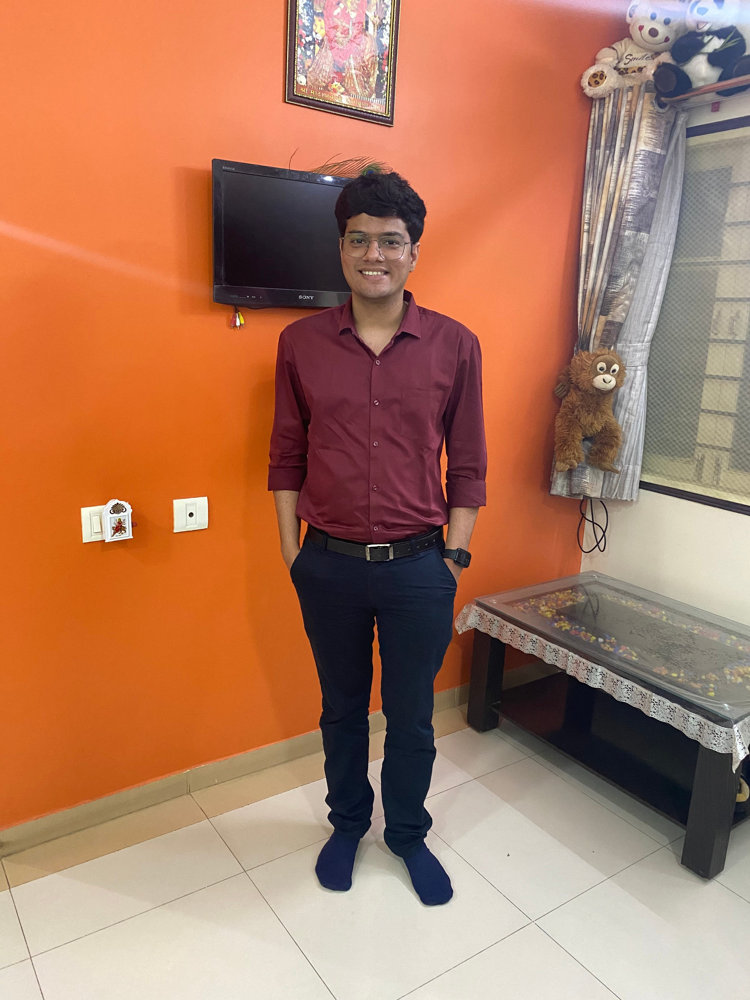

# Gamer, software engineer, amateur video-editor, Swiggster

**In conversation with Yash Vanzara one of Swiggy’s new entrants**

Yash Vanzara might be one of the latest and youngest software engineers at Swiggy, but he has an interesting story. From working towards being a technical reviewer and dabbing in video-editing to being an avid gamer, he has done it all. Yash, who loves to create seamless workflows, talks about his journey that led him to Swiggy and why this is an interesting place to work at.

**1) Tell us a little about your journey up until the time you reached Swiggy, how did you get into this role and what do you like about it?**

I did my schooling in Commerce and I wanted to become a tech reviewer on Youtube. I have been fascinated by folks who reviewed products on Youtube. I had also considered tech journalism but I thought that would be too much for me. So, I started a blog where I would share my views on new tech products.

I wanted to understand tech better to present it well to my audience, which led me to pursue my undergrad in Computer Applications where I learned about Android and Cloud. It was through this learning that I was intrigued by coding, and my career as a reviewer took a backseat. Later, I met a few seniors at a hackathon and they asked me to pursue MS in IT since I liked coding. That’s how I ended up majoring in cloud computing.

Working in devops happened by chance. I had the opportunity to choose between devops and software development in the company I worked at. Considering that the kind of things I did previously was across the spectrum and wasn’t limited to development, I decided to give devops a try and that was the best decision I made. Post that I moved on to another company and then joined Swiggy.

*Yash in his different avatars*

**2) How has your experience of working with Swiggy been so far? Tell us about your onboarding process here.**

I was keen on joining Swiggy because I wanted to work on products and systems that targeted end-users at scale

My interview process at Swiggy was smooth. The interviewers helped me understand what I needed to work towards, they explained what was expected of me and it was nice to know what I was going to deal with. I had spoken to a senior member at Swiggy and he told me that in the beginning, people can feel a little un-involved in teams, but with time, that goes away.

I did experience that, also probably due to the fact that I was probably the least experienced person on the team and the rest were already established and had a good working relationship. But by the second month I began feeling comfortable with my role and the team members and now we have a great rapport going.

**3) Tell us about the work you do. What are the projects you’re currently working on and what excites you about it?**

Whenever the engineers require infrastructure on Amazon Web Services, they raise a ticket and that is assigned to one of us. We then create whatever is required and pass it on to the team. I’m currently building pipelines where engineers simply create a pull request and we review and approve it. Post that, the requirements will be automatically created through the pipelines. Apart from this, I’m also building an ephemeral access framework that can provide time bound access to AWS to engineers in a secure manner.

**4) Apart from automation, are there any other problem statements that you’re working on?**

Swiggy has been launching several services and it becomes difficult to receive operational insights on each one of them. On that front, I’m working on building work flows where services will log whatever they are doing and my analyser service will extract insights from that and provide information in the form of a dashboard and reports. This data will tell you what is happening to a particular service.

I always like to remove dependencies and create a smooth work environment for the engineers. For instance, engineers here are constantly working on some or the other interesting projects. I don’t want them to constantly reach out to someone for critical elements. So I work towards removing those dependencies as they slow teams down.

**5) How would you differentiate between the role of a developer and the devops team?**

I have a different take here. An engineer/developer is someone who works on the product side of things. So if you want to build a feature that directly brings in revenue or creates an impact on the end users that’s what you’d do here. But if someone is passionate about making the developers’ lives better by improving the systems and processes, then they should consider devops.

**6) You’ve been part of several hackathons, tell us a little about that.**

Yes, I’ve been part of many hackathons but one of my favourites was the one held by Swiggy, also because it had an informative session held along with it. I was new to the system and had participated individually in [this security hackathon](./who-captured-the-flag-7f44065d78f0.md). Towards the end of it, I was tied against a team which comprised three experienced engineers. It was a close call when the organisers gave us one final clue, but I beat the team and won.

**7) What do you do outside of work? Any hobbies that you pursue?**

I am a gamer. I used to play DOTA a lot, but given the priorities now, I can’t play it everyday. So I play Mobile Legends, I sometimes stream it in private groups and other times I record and edit the videos, since I’m interested in learning video-editing. I have also developed an interest in application security since the hackathon and have been exploring the same by participating in Vulnerability Disclosure Programs.

**8) What do you think sets Swiggy apart from the rest?**

I think the problem-statements we get to solve here are quite unique and so the way we work around it is interesting. That’s primarily how intriguing work can get here and I feel that sets Swiggy apart from the rest.

---
**Tags:** Swiggy Life · Employee Experience · Software Engineer · DevOps · Careers
