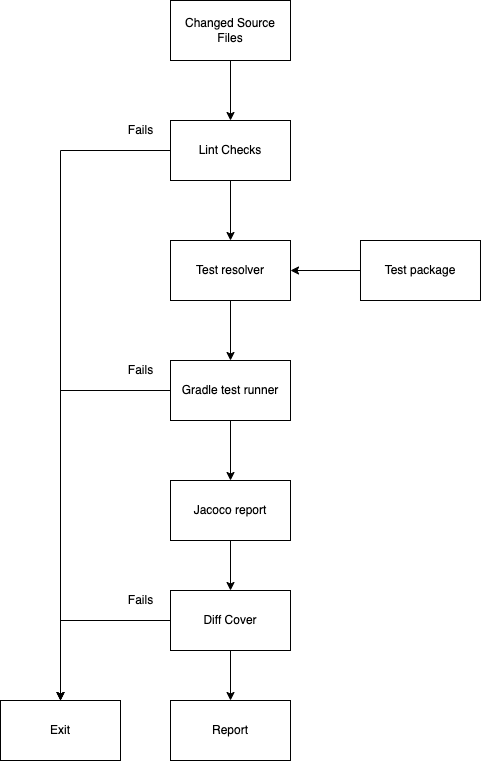
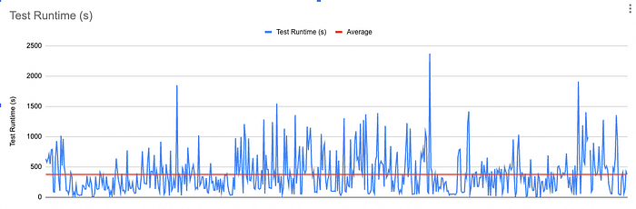

# Gradle Incremental Test Runner

> Improve developer productivity and save money by running relevant tests for your PR and not the entire suite.


*Photo by Jukan Tateisi on Unsplash*

As Swiggy grows with the vision of providing unparalleled convenience to our customers, powered by multi-category services, so does the complexity and size of our codebase. With more code being checked in, our test suite has increased many folds, and running these thousands of tests takes a lot of time.

We have certain safeguards on our CI, like code coverage, and UT checks, to ensure code quality. These checks need to be complete before we can merge the code and developers used to depend on these them for the coverage report. As you can imagine, this slows down developer productivity by a lot.

A few months back, while trying to merge in a PR, I ran into a frustrating cycle of rebasing and running checks, spending a good part of the evening. Even though my PR had very few changes, the entire test suite ran every time, and this made me rethink why this is the case at all. I only needed to test and check coverage for the piece of code I modified and not the entire app and during the weekend, I was able to build the first prototype for this.

## Introducing Gradle Incremental Test Runner



The runner has 4 major stages

1. Generate a list of changed source files
2. Generate a list of related test files
3. Run tests using Gradle
4. Generate coverage report

_Note: The prototype was hastily built using bash scripts and tools available on mac. You can take these as inspiration and build out a better solution._

### 1. Generate a list of changed source files

Using `git diff`, we can easily find out the changed files between the current branch and the base branch. With the `[--name-only](https://git-scm.com/docs/git-diff#Documentation/git-diff.txt---name-only)` flag, we can get a list of file names instead of the entire diff. We can also filter the files we are interested in easily using wildcard extension filters. You can filter out your source sets from test sets from this.

```
git diff --name-only <base branch here> -- '*.java' '*.kt'
```

### 2. Generate a list of related test files

From the output of the previous step, search your test sets for references to the source file name.

Note: This is a very rudimentary string search and it is nowhere near the optimised solution and this might miss some test cases. A proper solution would walk through code references to identify all test cases accurately.

Ignoring the build folder and restricting the search to the test set greatly improved the search time.

```
find "<module name>/src/test/java" -type d -name build -prune -o \( -name '*.kt' -o -name '*.java' \) -path "*/src/test/*" -print | xargs -P 8 -n 20 grep <source file name> -l
```

### 3. Run tests using Gradle

Now that we have our subset of tests, we can run them using Gradle CLI. Gradle has this [neat test filter option](https://docs.gradle.org/current/userguide/java_testing.html#test_filtering) to run a test using the `--test` flag.

```
gradle test --tests SomeTestClass
```

### 4. Generate coverage report

Once the test has run, you can use your own coverage tool to generate the coverage report. [Diff cover](https://github.com/Bachmann1234/diff_cover) tool helps generate code coverage reports for the changes in your PR. You can now send this report back as a GitHub PR comment or as the result of the CI action.

## Results

We went from running thousands of tests to just a handful. Our last 6 months' data gave us an average of** 6 mins** per run on local machines.


*Total test run time ; Last 6 months ; Average is around 6 minutes*

If only 1 file is changed in the PR, then only the related tests to that file would be run, **saving an immense amount of time**. This is so fast that it **can be run on the local machine**. Developers can now quickly run this check locally and get their reports in a few minutes, improving their productivity.

Running this on CI **reduces the compute costs by many folds** as well.

## Conclusion

This has been a game changer for our team and almost everyone is now using it. We are currently rewriting this tool to make it more stable, accurate and maintainable going forward, with plans to support several other optimisations in the future.

> **Acknowledgements**This couldn’t have been possible without the help and support of [Raj Gohil](https://medium.com/u/1bf9bdb89775?source=post_page---user_mention--125cee1e68a7---------------------------------------), [Farhan Rasheed](https://medium.com/u/4ed6acc9cd6e?source=post_page---user_mention--125cee1e68a7---------------------------------------), [Sambuddha Dhar](https://medium.com/u/723d70adf627?source=post_page---user_mention--125cee1e68a7---------------------------------------), and [Tushar Tayal](https://medium.com/u/400467f4ffab?source=post_page---user_mention--125cee1e68a7---------------------------------------).  
> Huge thanks to the incredible folks at the Consumer Android team at Swiggy, who beta-tested this tool and provided valuable feedback.

---
**Tags:** Gradle · Android · Testing · Cicd · Swiggy Mobile
