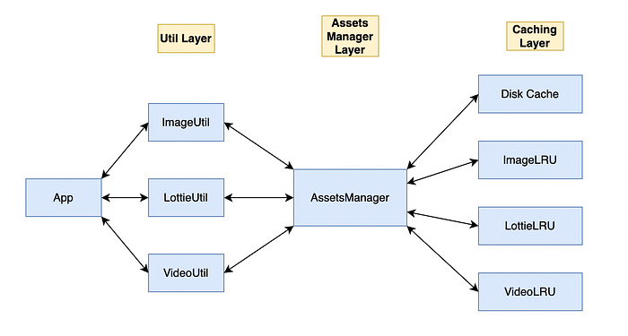
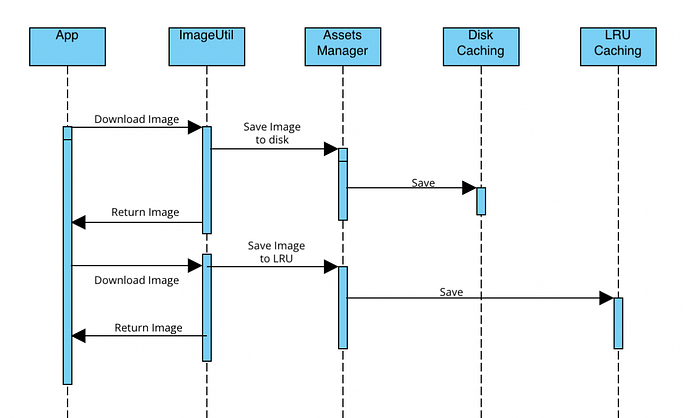

# Handling multiple caches in App

Every app requires some sort of caching mechanism for the assets to provide seamless user experience. Downloading each asset every time can be expensive and users will see some delays in the loading of those assets. Developers use different types of caching mechanisms like disk caching, LRU caching, database, etc.

Based on different requirements we take a call on which mechanism to use. But what if we want to use multiple mechanisms to cache different types of data? How are we going to handle all those?

Well, don’t worry, in this article we are going to handle those cases. How we can effectively handle different types of caching mechanisms and make space for others as well 😉.

## Implementation

*High Level Diagram of the system*

So let’s introduce the way we handle it. The whole system will include 3 layers that will serve different purposes. This approach can be implemented on a platform where we want to do any type of caching.

### 1. Utils

Each type of asset will have its util to handle specific functionalities related to that type. The functionalities include downloading, parsing, etc.

These utils will be used to fetch the respective assets from the assets manager. The app will not directly interact with the assets manager.

Let’s take an example for image util. This util will download the image if not present by calling the get data of assets manager. Post downloading the image it will pass the raw data to the assets manager for storing it.

### 2. Assets Manager

This will be the middle layer which will interact with the utils and the different types of storage i.e caching mechanisms. The whole purpose of this manager will be to check which type of caching we need to use based on the storage type.

Storage type will tell what type of caching mechanisms are present.

The assets manager will have common methods to store and retrieve data.

When the utils call these methods the assets manager will call the respective methods of caching layers based on storage type.

### 3. Caching Layer

This layer will include all the caching mechanisms that we will be using. It can be disk or LRU or database. This layer will only store data in raw form and will be agnostic of the data types.

We used different caching mechanisms based on different requirements. When we want the assets to be permanently available we use disk caching. But if we want to cache data that is not permanent we use the LRU caching mechanism.   
For LRU caching also, we have different caches for different asset types like image, lottie, etc.

**Disk Caching**

It’s a type of caching mechanism where we store the data directly into the disk. We read/write the data from the disk.

**LRU Caching**

Least Recently Used(LRU) caching is a caching mechanism where we store the data in memory with the defined size of the elements it can hold. Once the space is full it removes the element which is least recently used to make space for the new element.

In our case

- **For Image:** We are using both the caching mechanisms i.e disk and LRU.
- **For Rendering Animations:** We are using LRU caching.
- **For Rendering Videos:** We are using our own Disk cache. ([Blog](./video-stories-and-caching-mechanism-ios-61fc63cc04f8.md))

This article covers on handling the different types of cache mechanism. It does not cover the cache implementation.   
For more details on implementation you can refer below articles.

- [Video Stories and Caching](./video-stories-and-caching-mechanism-ios-61fc63cc04f8.md)
- [Insight into Swiggy’s new Multimedia Card](./insight-into-swiggys-new-multimedia-card-3229d7b4ae75.md)

In this way, each layer has its responsibilities and is mutually exclusive. In the future, if we want to introduce another caching mechanism we can do it without changing the existing flow. We just need to add the type and the flow remains the same.

All the APIs exposed between the layers will be generic and driven by the protocols so that there is no change in the contract between them.

**Sequence diagram:**

*Sequence of steps involved*

## Conclusion

As every layer is independent of other layers we can easily plug in or plug out any caching mechanism we want with minimum code changes.

---
**Tags:** IOS · Swift · Mobile App Development · Caching · Swiggy Mobile
