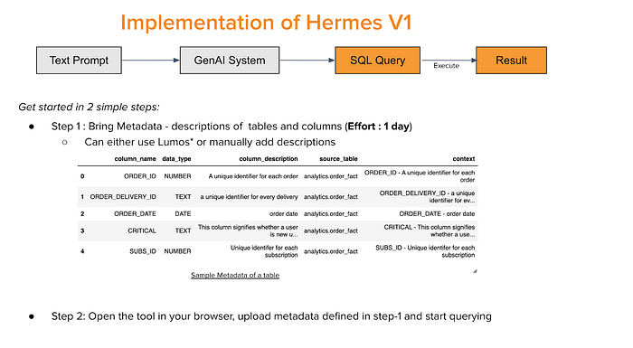
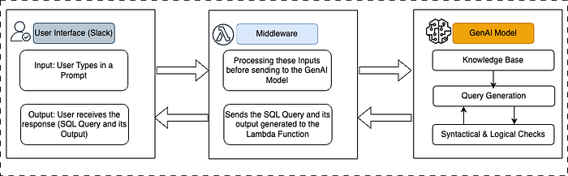
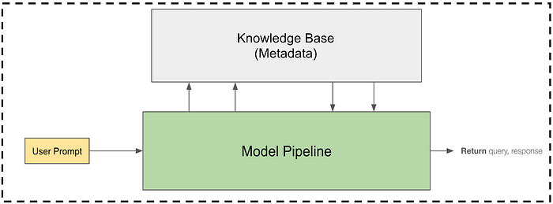
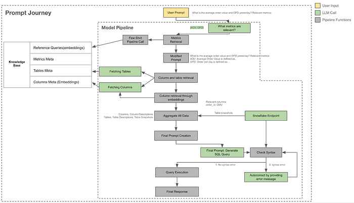

# Hermes: A Text-to-SQL solution at Swiggy

Co-authored with [Rutvik Reddy](https://medium.com/u/c2a93860b934?source=post_page---user_mention--81573fb4fb6e---------------------------------------)

As a data-driven company, at Swiggy, we recognize the importance of enabling our teams to access and interpret data quickly and efficiently. While a lot of generative AI use-cases revolve around summarizing and extracting nuggets from textual data, a majority of business and product decisions need specific numbers and quantities. For example, how many customers were impacted by a telco outage and missed receiving order-specific updates last month or what is the P95 of customer claims in a certain cohort of restaurants in a particular region of the country, and so on.

We built Hermes to help with this. Hermes is our in-house developed generative AI based workflow that allows a user to ask a question in natural language and a) get a SQL query generated, and b) receive results by automatically executing the generated query, all within Slack. Imagine asking, ‘What was the average rating last week in Bangalore for orders delivered 5 mins earlier than promised?’ and instantly receiving both the SQL query and the results directly in Slack. Without Hermes, this would have required the asker to either hope to find a dashboard/ report that has this answer or write the query (this assumes they know the tables/ databases, have the right accesses, have SQL knowledge, etc.) or put in a request with an analyst to pull this for them. All of these can take anywhere from a few minutes to days. Due to this, it’s possible that many important questions are not even being asked or being self-regulated or made do with proxy (or worse, incorrect) information. With Hermes, we aim to transform the way our teams interact with data, making it more accessible and actionable and compressing time-to-value.

## Motivation

Hermes, was developed to address the following key needs:

- **Improved data accessibility**: Enable users to access and analyze Swiggy’s data more effectively, reducing dependency on technical resources (like analysts).
- **Enhanced decision-making speed**: Empower users from different roles to make data-driven decisions by easily extracting insights from Swiggy’s data.
- **Efficiency and productivity**: Streamline the process of querying data, saving time and effort for users

## Hermes V1

The initial version of Hermes was a straightforward implementation using an LLM (in our case, GPT 3.5 variants). Users could bring their own metadata (descriptions of tables and columns) and type in a prompt. The overall implementation is described below.

*Figure1: Implementation of Hermes V1*

_*Lumos is our in-house Data Catalog based on Alation_

## Evaluation and learnings from the V1

Our initial performance assessments focused on comparing our implementation with existing solutions from multiple vendors and research papers. We used out-of-the-box solutions with minimal Swiggy-specific modifications. While our results were generally in line with what we saw in the industry/ online benchmarks, we soon realized that the complexity of our users’ queries required a more tailored solution. Another significant factor was the sheer volume of data, tables, and columns, along with the necessity to incorporate Swiggy-specific context. For example, tables and metrics related to the Food Marketplace are different but still somewhat similar to those related to Instamart. From our V1 experience, this kitchen-sink approach of treating all business needs and data (metrics, tables, and columns) as the same did not work well for us.

Based on these learnings, we made the design choice to compartmentalize Hermes for each business (or logical) unit, which we call charters. Charters are identified by their distinct business needs and data sources, e.g., Swiggy Food, Swiggy Instamart, etc. These charters have their own metadata and address specific use cases of teams within that charter. We will discuss more about building this metadata, onboarding them, and the results later in the post.

Despite all the initial challenges, we gained confidence in the potential of Hermes to non-trivially boost productivity and democratize data access across the organization.

## Hermes V2

Based on the learning form V1 we have improved the overall data flow in Hermes V2. Here’s how the revamped implementation looks like now:

*Figure 2: Implementation of Hermes V2*

1. **User interface**: We use Slack as the entry point, where the users can type in their prompts and receive the final SQL query and its output as response.
2. **Middleware (using AWS Lambda): **This acts as the intermediary that facilitates communication between the UI and the Gen AI model. This also incorporates a bit of processing / formatting of the inputs before sending them to the Gen AI Model
3. **Gen AI model: **Once a request is received from the middleware, a new Databricks job is created which fetches the respective charter’s GenAI model (GPT-4o), generates the SQL query, executes it and returns the SQL Query and its output.

## The Gen AI model pipeline

We have implemented a Knowledge Base + RAG based approach which helps us incorporate Swiggy-specific context thereby helping the model pick and choose the right tables and columns.

*Figure 3: The Gen AI model pipeline*

**The Knowledge Base: **The knowledge base consists of key metadata of every specific charter (Eg: Swiggy Food, Swiggy Genie, etc.) that is onboarded. The metadata required includes metrics, tables, columns and any reference SQL queries. The importance of metadata collection in a Text-to-SQL model implementation cannot be overstated. Here are the key reasons why metadata is crucial:

1. **Contextual understanding:** Metadata provides the model with essential context about the data, such as table names, column names, and their descriptions. This context helps the model understand how to map natural language queries to the appropriate database structures accurately.
2. **Disambiguation:** Human language is often ambiguous and context-dependent. Metadata helps disambiguate terms and ensures that the model generates SQL queries that precisely reflect the user’s intent. For example, metadata can clarify whether ‘sales’ refers to a specific table or a column within a table.
3. **Accuracy**: Comprehensive metadata improves the accuracy of the generated SQL queries. With detailed information about the data schema, the model can generate more precise queries that are less likely to result in errors or require manual corrections.
4. **Scalability: **A robust metadata collection allows the Text-to-SQL model to scale across different databases and data sources. By having a standardized set of metadata, the model can be adapted to work with various datasets without extensive reconfiguration.

**Model pipeline: **The improved model pipeline now involves breaking down the user prompt into identifying the relevant metrics first, then finding all the columns required to compute the metrics, identifying the tables, and finally generating the SQL query.

The LLD below explains the overall process.

*Figure 4: Low-Level Design of the Prompt journey*

Some key design choices that we took in the model pipeline: The primary objective of the pipeline is to pass clean information with minimal noise for the final query generation. To achieve this, we break down the problem into pre-defined stages to control the flow and ensure relevant information is fetched.

1. **Metrics retrieval:** This first stage retrieves relevant metrics to understand the user’s question. **This includes leveraging the knowledge base to fetch associated queries and historical SQL examples via embedding-based vector lookup.**
2. **Table and column retrieval:** The next stage identifies necessary tables and columns using metadata descriptions, combining LLM querying, filtering, and vector-based lookup. For tables with a large number of columns, multiple LLM calls are made to avoid token limits. Further retrieval involves matching column descriptions with user questions and metrics using vector search, ensuring all relevant columns are identified.
3. **Few-shot SQL retrieval:** As part of a different initiative, we maintain ground-truth / verified/ reference queries for several key metrics. We use a vector-based few-shot retrieval to fetch relevant reference queries to aid the generation process.
4. **Structured prompt creation:** All of the gathered information is compiled into a structured prompt. This includes querying the database and collecting data snapshots, which are then sent to the LLM for SQL generation.
5. **Query validation:** The generated SQL query is validated by running it on our database. Errors are relayed back to the LLM for correction with a set number of retries. Once an executable SQL is obtained, it is run and the results are relayed back to the user. If retries fail, the query is shared with users along with modification notes.

## Adoption and usage

Hundreds of users across the company have been using Hermes over the last few months to answer several thousand queries with an average turnaround time of <2 minutes. Here is how different teams in Swiggy are leveraging Hermes so far.

1. **Product Managers and Business teams: **They use Hermes to obtain sizing numbers for their initiatives, conduct post-release validations, and perform quick check-ins of metrics across key dimensions like cities, time slots, customer segments, etc.
2. **Data scientists**: Hermes is enabling them to independently conduct deep dives into multiple issues, such as:

- Identifying discrepancies (e.g., differences between predicted and actual delivery times)
- Gathering examples for RCAs (e.g., orders with egregious delays)
- Conducting detailed investigations (e.g., examining specific geographical locations based on examples)

**3. Analysts: **They are leveraging Hermes to answer specific questions during an analysis, streamlining their validation process. Examples including

- Tracking current trends
- Diving deeper into trends (e.g., analyzing the distribution of metrics)

## Evaluations and learnings from V2

We found that the V2 iteration of Hermes performed significantly better for charters with well-defined metadata and a relatively smaller number of tables. This approach validated our hypothesis that the table metadata generated through our data governance efforts was crucial to overall performance. Another key insight was confirming the necessity of handling each charter separately, as overall performance heavily depended on the complexity of the use cases and the quality of the metadata added to the knowledge base. This approach also streamlined/ modularized the product-lifecycle management, enabling us to onboard new charters, test outputs, and make continuous adjustments to the knowledge base as needed.

Once we launched Hermes V2 across the company, we were able to observe how users interacted with the system. Clear, straightforward prompts from users provided better instructions for the model, resulting in better performance versus ambiguous prompts that ended up with the model giving incorrect or partly-correct answers. As our implementation improved and as users became more familiar with the feature, our first-shot acceptance rate for the generated SQL increased dramatically.

## Enablers

1. **Feedback mechanism from users:** We collect feedback on the accuracy of the returned query from stakeholders directly within the Slack bot. This helps us evaluate model misses and come up with RCAs and fixes.
2. **Automated onboarding of metadata:** As soon as a new charter is onboarded and all metrics have been populated, a cron ensures that queries for all metrics are accurately generated and sent for a quick QA where the relevant analyst validates the responses.
3. **Data security**: We achieved this by introducing seamless authentication with Snowflake thereby only executing queries on tables the users have access to.

## A sample of upcoming improvements:

1. **Adding a knowledge base of historical queries**: Like most companies, we have a huge corpus of historical queries as well as thousands of queries being run every day. The idea is to leverage this past knowledge to augment our existing model pipeline as few-shot examples.
2. **Query explanation layer**: This layer will provide the logic behind how the query was constructed. We believe this will help drive more confidence in users while also helping the LLM generate better queries.
3. **A ReAct agent**: This agent will enhance column retrieval and summarization to reduce noise in the final prompt, improving accuracy.

Keep watching this space for more updates on Hermes!

Special thanks to [Madhusudhan Rao](https://www.linkedin.com/in/madhusudhanrao/?originalSubdomain=in), [Jairaj Sathyanarayana](https://linkedin.com/in/jairajs), [Meghana Negi](https://www.linkedin.com/in/meghana-negi/), [Srinivas Nagamalla](https://www.linkedin.com/in/srinivas-n-54a6b98/), [Niranjan Kumar](https://www.linkedin.com/in/niranjankumar3/?original_referer=https%3A%2F%2Fwww.google.com%2F&originalSubdomain=in), [Shyam Sunder](https://www.linkedin.com/in/shyam-sunder-007/) for making this happen!

---
**Tags:** Platform Products · Generative Ai Tools · Swiggy Data Science · Gpt · Sql
