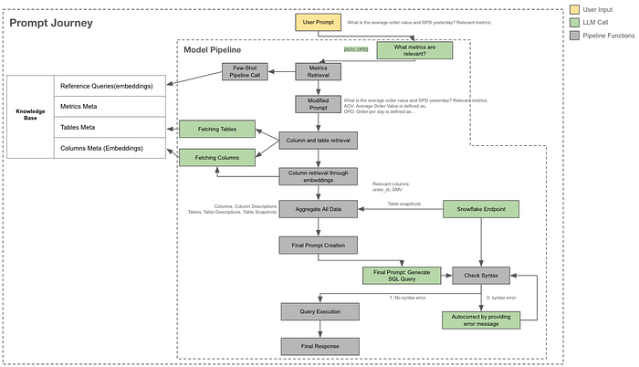
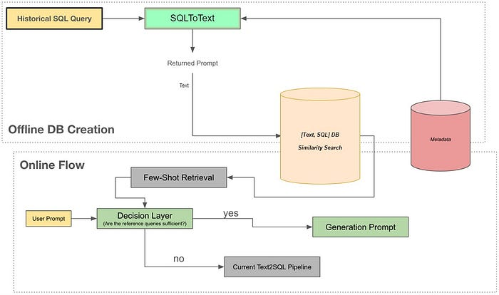
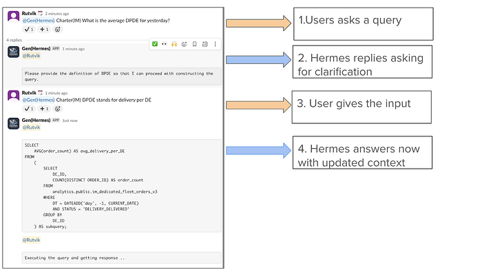
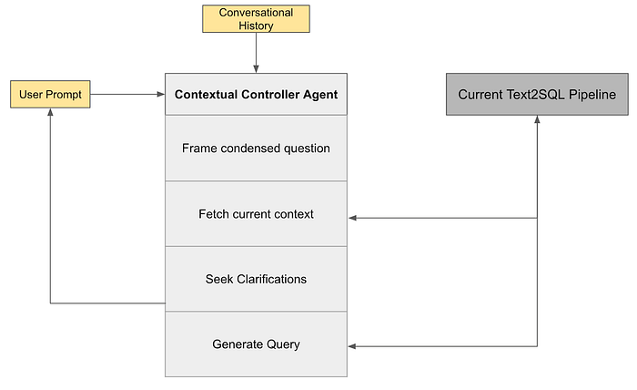
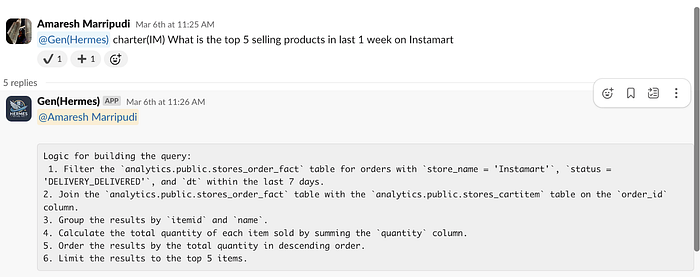

# Hermes V3: Building Swiggy’s Conversational AI Analyst

co-authored with [Meghana Negi](https://medium.com/u/10c3c71bd5f1?source=post_page---user_mention--a41057a2279d---------------------------------------) and [Rutvik Reddy](https://medium.com/u/c2a93860b934?source=post_page---user_mention--a41057a2279d---------------------------------------)

Last year we launched [**Hermes**](./hermes-a-text-to-sql-solution-at-swiggy-81573fb4fb6e.md), a GenAI-powered text-to-SQL assistant that enabled Swiggy employees to query data in plain English. Designed as a lightweight interface embedded in Slack, it eliminated the need for analysts to write repetitive queries and empowered non-technical teams to pull data themselves.

But what started as a simple text-to-SQL translator has now evolved into a much more powerful system — a contextual, agentic, and explainable AI analyst that understands your data ecosystem and grows smarter with every interaction.

Over the last year, we’ve rebuilt the Hermes stack to be more accurate, reliable, transparent, and human-like in its interactions. This blog unpacks how we got there, what changed under the hood, and what this means for Swiggy going forward.

## From Tool to Teammate: A Quick Recap

Hermes began with a simple promise: **convert natural language to SQL instantly and reliably**. At launch, it could handle basic metrics and filters, answer well-known business questions, and operate across a few well-defined charters like Food and Instamart.

But we quickly hit limitations:

- It struggled with niche metrics and derived logic.
- Users had to repeat context in every prompt.
- There was no way to debug or trust the generated SQL.
- Output varied significantly across prompts for the same metric.

We took every piece of feedback seriously, and over the past few months, worked closely with analysts, PMs, and the DS team to address these gaps — rearchitecting Hermes piece by piece.

A quick recap of our existing overall architecture:

## What’s New in Hermes V3

## 1. Few-Shot Learning Through Historical Query Embeddings

One of the biggest leaps came from **building a vector-based prompt retrieval system**. We want to use the corpus of the SQL queries run on Snowflake to augment Hermes to the next level. The problem is, most (all) of these queries have little to no metadata associated with them (meaning, really nobody adds a comment or docstring about what a query is for). For example, even if someone wrote & ran a query for ‘what was the trend of customer driven cancellations over the last week in Bangalore?’, nobody would add this text as the question they want answered. Without [query, question(s)] tuples, it is not easy/ possible to use this corpus to enhance the current Text2SQL.

**An interesting insight here is that LLMs are a lot better at understanding SQL queries than writing them.** Tasking a model to generate a SQL query with a lot of text and noise as supplemental information does not do a great job but taking a model to explain a SQL query with a lot of noise around it does a fairly decent job. We leveraged large context Claude models to run SQL2Text, this pipeline takes into input the SQL query and the context of the business line to create a prompt.

Hermes now taps into a curated database of previously executed Snowflake queries and their corresponding prompts. When you ask a question, it:

- Searches for similar prompts using vector similarity.
- Injects the top results as **few-shot examples**.
- Uses these to guide the LLM to generate more accurate SQL.

This drastically improved accuracy from 54% to 93% on a benchmark of ~100 manually tagged queries

- **Old pipeline:** 54% correct, 20% fully incorrect.
- **New pipeline:** 93% correct, 7% fully incorrect.

Here’s a [video](https://www.youtube.com/watch?v=djNfG5z2ZaA) on how we worked with AWS to set this pipeline to improve the accuracy.

## 2. Contextual Memory: Chat-Like Querying

Hermes is no longer a stateless command tool. It now **remembers your last few prompts** and can carry context forward across the session.

Imagine this flow:

“What is the AOV for yesterday?”

“Now add a filter for Bangalore.”

“Also show GMV.”

Hermes constructs a coherent query that incorporates all edits and context — without needing you to repeat details. This makes data querying more natural and iterative. Behind the scenes, we introduced an Agent layer that looks at conversation history and decides what actions to take — whether to clarify, rewrite, fetch metadata, or execute.

**Why is this important?**

Adding conversational capability to Hermes makes interactions intuitive, dynamic, and efficient by enabling natural language queries, context-aware edits, and seamless handling of ambiguous requests. This enhances user engagement, simplifies workflows, and bridges gaps in query resolution.

As with any other GenAI application, human inputs and clarifications enable Hermes to resolve ambiguities, refine queries in real-time, and deliver precise, context-aware insights, boosting efficiency and user satisfaction. Here’s an example of what it looks like:

## 3. Agentic Flow: Structured Intelligence for Query Generation

As Hermes evolved into a more conversational assistant, we needed a more structured way to reason through complex queries, resolve ambiguities, and make decisions at each step. That’s where the **Agentic Flow** comes in

This architecture introduces an orchestrator agent that manages the flow of decisions, breaking down the task into smaller steps. The agent can:

- Parse user intent and check for completeness
- Maintain conversational context and prompt memory
- Retrieve metadata such as tables, columns, and definitions
- Query the vector DB for few-shot examples
- Generate intermediate logic before producing final SQL
- Seek clarification from the user when necessary

Each of these tools is accessible to the orchestrator, which decides what to call and when, using a ReAct-style reasoning loop. This structured approach led to a significant improvement in query correctness, especially in ambiguous or edge-case scenarios

We ran internal evaluations that showed:

- 20–25% increase in query accuracy on ambiguous prompts
- Near-zero “table not found” errors
- Higher trust ratings due to better explanations and clarifications

## 4. Explanation Layer: SQL You Can Trust

One of the top asks from users was **transparency** — how can I know if this query is correct?

We built an **Explanation Layer** that:

- Breaks down assumptions Hermes made (e.g., interpreting “LD orders” as lm_distance > 4)
- Details the logical steps used to build the query
- Assigns a confidence score from 1 (low) to 3 (high)

## 5. Better Metadata Handling with Table & Column Lookups

Earlier versions of Hermes relied heavily on generic embeddings to infer column names. This often failed when column names were inconsistent or nested in obscure tables. This hybrid strategy improved table/column precision and minimized “table not found” errors that were present in the earlier versions.

We redesigned the metadata retrieval pipeline:

- First, fetch tables based on metric definitions and table descriptions.
- Then, retrieve column names **from those specific tables**.
- For wide tables, we chunk columns in batches of 75 to stay under token limits.

**6.Slack Native, Privacy-First Design**

Hermes continues to live inside Slack, but with enhanced security:

- **RBAC-based data access** using Snowflake’s permissions.
- **Ephemeral replies** — only the person who queries sees the result.
- **Audit logs** of all prompts and responses for compliance.
- **SSO-authenticated access** via existing Slack identity controls.

We also debated group channels vs. DMs. Our final model uses a hybrid approach:

- Default to private DMs for querying.
- Maintain one central help channel for escalations and feedback.

## 7. Ops: Automating Quality Control at Scale

To ensure Hermes quality doesn’t regress as we scale:

- We trigger **automated test suites** for each newly onboarded charter to validate all defined metrics.  
We collect **weekly feedback** via Slack (Was this correct? Yes/No) and run root cause analyses for every “No”.
- Fixes are rolled out proactively across all similar metrics in that charter.

## Conclusion: From Queries to Conversations

What started as a command-line tool to translate English to SQL has now become an intelligent agent that understands Swiggy’s business language, clarifies intent, remembers context, and explains its decisions — all inside Slack.

Hermes became the backbone for all the internal AI Co-pilots and evolved into a Text to Insights tool now. More on that later.

Special thanks to [Madhusudhan Rao](https://www.linkedin.com/in/madhusudhanrao/?originalSubdomain=in), [Jairaj Sathyanarayana](https://linkedin.com/in/jairajs), [Goda Ramkumar](https://www.linkedin.com/in/goda-ramkumar-doreswamy-261882326?originalSubdomain=in), [Niranjan Kumar](https://www.linkedin.com/in/niranjankumar3/?original_referer=https%3A%2F%2Fwww.google.com%2F&originalSubdomain=in), [Shyam Sunder](https://www.linkedin.com/in/shyam-sunder-007/) for making this happen!

---
**Tags:** Data Science · AI · Generative Ai Tools · Text To Sql
