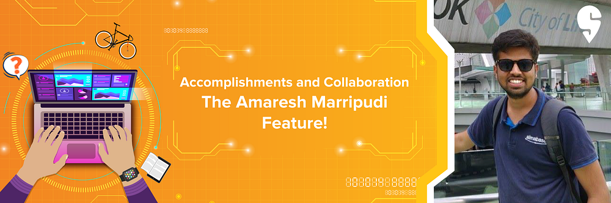
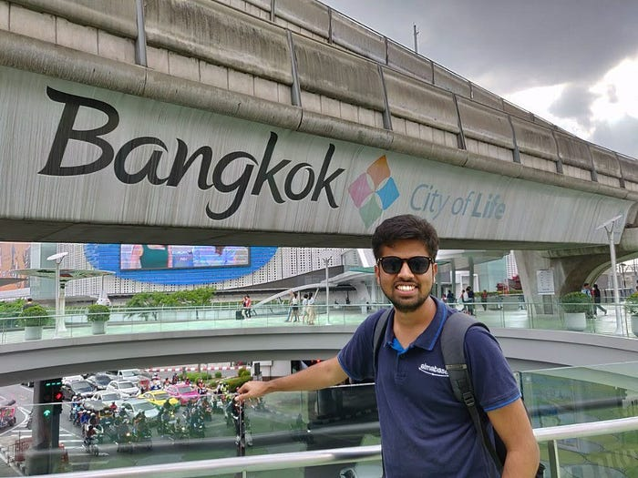
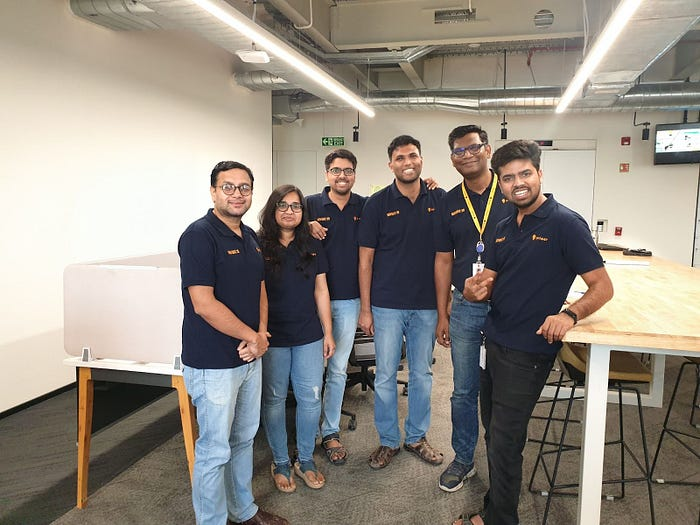
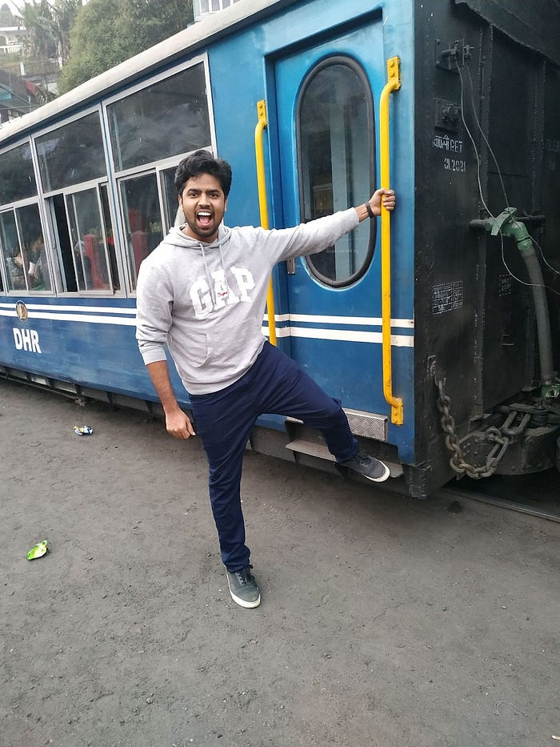

# He’s always curious, always learning: A Senior Product Manager’s Journey at Swiggy

Amaresh Marripudi shares his passion for tech, how he uses it to solve problems, and why he thinks technology is a leveller.

Amaresh is a man of few words and big impact. He has been instrumental in launching many of Swiggy’s features and is driven to solve tech challenges to give more value to Swiggy’s customers. Being a Senior Product Manager, Amaresh is keen on reviewing features and experiences. Here’s his take on the employee experience at Swiggy.

**Tell us about your educational background and areas of interest.**

I secured a B. Tech in Civil Engineering from Gandhian Institute of Technology and Management, Visakhapatnam. After that, I explored a bunch of professional paths, from working as a Civil Engineer and a Python Developer to working in Sales & Marketing, and even Analytics. Then in 2019, I joined Swiggy as a Senior Business Analyst. Outside of work, I read a lot with my favourite genres being science, fantasy, and history.

**What is the most exciting part of solving tech problems at Swiggy?**

I love picking up new unstructured problems and trying to solve them. The best part of working at Swiggy is that there is never a dearth of such problem-statements, simply because we’re always looking to make things better. I love and live the Swiggy value of “[Always be Curious, Always be Learning](https://blog.swiggy.com/2022/12/21/here-are-swiggys-values/)” which drives me to explore a wide range of challenges across teams and roles. The learning curve has been greatly fulfilling so far!

**What has your Swiggy journey been like?**

I have been working at Swiggy for more than four years now and I’ve had the opportunity to work with different teams in different roles. I still remember Nithin Mathew, my lead and later my manager, saying that I need to hit the ground running on day one itself. Ever since, my job has kept me on my toes, in a good way. Thanks to our open and encouraging culture, I get the autonomy to do things on my own while getting additional support whenever needed. I am at home with Swiggy, and feel supported and encouraged to do the things I like.

**What can you tell us about your team and the work you’ve been doing together?**

I am currently working on a project called XP, Swiggy’s in-house experimentation platform, which translates a hypothesis into a decision. We’re building this product to be cross functional so that everyone in the organisation can use it. Its aim is to help make trustworthy and well-aligned decisions at scale.

We are a small team tasked with cracking tough goals using technology. This involves keeping ourselves updated with the latest tech, continuous learning, experimentation, understanding project requirements, and so much more. Everyone in our team is driven by the love for problem solving, so we have set a high-bar for the work we deliver. I can proudly say that our team has lived up to and even exceeded the business requirements and people’s expectations. And this is thanks to the support, guidance, and occasional tough love from our amazing leaders.

**How has your work life changed from day one to now?**

I levelled up in many areas, and some of them are noteworthy to me. I have understood the importance of ownership and developed the ability to disagree. I’ve also learnt to commit to work, even when the situation seems uncertain. A considerable part of my growth has been due to the insightful feedback provided by the leaders with whom I worked. They have instilled in me the confidence to back my opinions with data and stand up for them.

And equally important — In the midst of all the daily chaos, I made some really good friends, and we even started the first community at Swiggy, the Quiz club.

**What does technology mean to you? Why did you decide to make a career of it?**

I look at technology as a leveller. Like education, technology has the power to bridge gaps, break down barriers, and provide opportunities for individuals regardless of their background or circumstances. While growing up, my brother made me read a lot of interesting books and introduced me to the world of science & technology. After reading books like Wings of Fire and the works of Richard Feynman & Richard Dawkins, I became fascinated with solving problems through technology. So, it was the obvious choice when it came to choosing a profession.

**Swiggy has been your home for some time now. What would you say is the most intriguing part of your work?**

I love how we make it convenient for a customer to get their favourite food. I am also intrigued with how a simple-looking feature on the user-end takes several complicated tasks in the backend. The thought, effort, and dedication we put in serving our customers is what makes Swiggy a special place to work at.

**What’s life like for a Senior Product Manager at Swiggy?**

It is very rewarding. You get to guide the entire lifecycle of a feature from ideation, to execution, to impact. I get to work with super smart and humble folks who are equally passionate about solving problems. My role requires me to get everyone on the same page, get them to believe in the common goal, and to enable them to contribute to the realisation of that goal. Every day involves a new challenge, some fire fighting, some brainstorming, a few meetings and reviews, and anything else required to make progress.

**Are there any projects or experiences that are especially close to your heart?**

It has always been the people who made the projects special for me. One cherished memory was working with my brother as a part of the Analytics team, as he was the one who ignited my passion for the subject. Another memorable project was when we reduced customer complaints by 50 percent in less than a month during the peak of COVID-19 in India. But my most significant success story so far was elevating the status-quo of the Experimentation Platform from a good-to-have to a must-have in the organisation.

**One of the benefits Swiggy provides its employees is a Learning Wallet, where you are given a certain budget to take on personal and professional development opportunities. How did you use your learning wallet in 2022?**

For professional development, I bought a few books to learn more about the world of statistics. And for personal development, I bought a Kindle and a bicycle, which have been greatly beneficial for my mental and physical health.

**You mentioned the Swiggy value ‘Always be Curious, Alway be Learning’. Why do you resonate with it the most?**

Both ‘[Always be Curious, Always be Learning](https://blog.swiggy.com/2022/12/21/here-are-swiggys-values/)’ and ‘[Display a Founder Mentality](https://blog.swiggy.com/2022/12/21/here-are-swiggys-values/)’ are the values I resonate with the most. The first because it motivates me to learn from every situation and the second because it gives me a sense of ownership and accountability, and also drives me to contribute to the organisation’s growth.

**How would you describe Swiggy’s culture to aspiring Swiggsters?**

The culture at Swiggy gives you freedom to learn, allows you to stay true to your moral and intellectual integrity, and encourages you with all the support you need. Our culture is people-process-progress oriented, thanks to which every Swiggster is naturally driven to push their best even further, while helping fellow Swiggsters do the same. To aspiring Swiggsters out there, I’d say that this is a place where different kinds of people can thrive equally.

**Can you tell us about your experience with **[**Swiggy’s Remote-First Future of Work policy**](https://blog.swiggy.com/2022/03/25/what-work-looks-like-at-swiggy/)**?**

Before COVID-19, I was one of those people who never worked from home, as I believed in having a distinct separation between office and home. During the pandemic, I went back to stay with my parents in Andhra Pradesh and continued working from there. Being physically present at home, I started talking more with my parents, helped my mom with her gardening, took care of them when my dad got COVID-19, and took them on vacations. I realised the new way of working was allowing me to be productive at work as well as helpful at home. This again proves my point of technology being an equaliser; with the help of a reliable internet connection, Swiggy helped me convert my village home into my workplace.

**What, according to you, makes Swiggy an unstoppable place to work at?**

The diversity of problems we solve at Swiggy and the level of ownership people have here is what I think makes Swiggy unstoppable. I have learnt what going above and beyond looks like by watching my peers. The atmosphere at Swiggy is full of energy, and you naturally feel driven to make things happen rather than waiting for them to happen. There were times when I didn’t perform my best, but I always got the right feedback and support to turn things around and get my mojo back!

---
**Tags:** Swiggy Life · Employee Experience · Product Manager Career · Indian Startups · Experimentation
