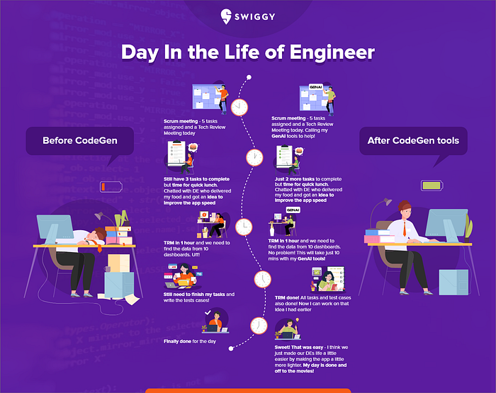
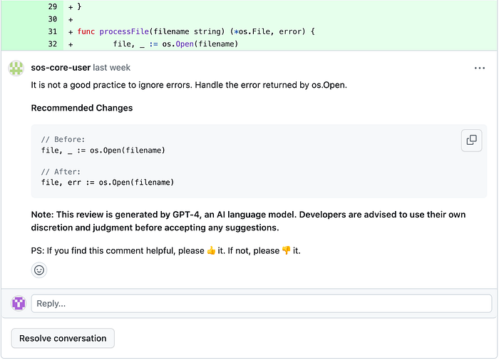

# How GenAI Codegen tools are helping us deliver convenience quicker

Recent surveys from Postman and Stackoverflow have shown that most companies are seeing about 15% improvement in efficiency due to CodeGen tools. At Swiggy, we started our journey earlier this year on utilising CodeGen tools and we share some insights into our journey and learnings.

At Swiggy, we have tried and adopted multiple CodeGen tools to support our engineers since March this year. Initially, adoption was challenging as there was a learning curve in terms of how prompts should be used and best practices wasn’t common knowledge. To address this, the Developer Experience (DXP) team at Swiggy conducted Office hours and set up a Tech Byte session on Ways of Working with Codegen tools. Hackathons were also conducted at Swiggy which promoted the usage of CodeGen tools and helped get traction for adoption. Swiggy now has over 75% adoption in the engineering vertical for codegen tools and this continues to increase every week.

While GenAI and CodeGen tools are ably supporting engineers in doing in-line code suggestions and comments / documentation, other non-obvious usecases have been unlocked with these tools. From using tools to write unit tests to creating our review meeting decks by pulling in information from various sources, we highlight 5 different usecases where the magic of GenAI and a smart engineer come together.

**Benefit / Use cases**

**Use Case 1:** Time-saving in Unit Tests: CodeGen tools reduced UT development time by 60–70%.

**Problem Statement:-** Writing Unit Tests (UTs) is essential for enhancing code quality through modular, well-structured, and maintainable code, while also catching bugs early in the development process. However, the process of creating extensive test cases can be time-consuming for developers.

**Codegen’s Contribution:** Using the tools, the Delivery Experience (DE) team significantly reduced the development time required for writing UTs by 60–70%. As an anecdote, the team utilized CodeGen tools to create unit tests for their project. Out of the 292 tests developed for a particular module, the tool directly contributed to 70% of them, resulting in approximately two days of time saved.

**Use case 2: **Code Simplification: ChatGPT eliminated redundant assets, reducing APK size by 4.8 MB.

**Problem Statement:- **One of our main objectives is to streamline the DE app by eliminating redundant and outdated code, while also optimizing the size of the APK. It is crucial to maintain simplicity while continuously adding new features.

**Codgen’s Contribution:- **DE App team team successfully developed a script utilizing ChatGPT’s assistance to identify and remove 301 redundant images and assets from the application repository. After improving the script using Chat GPT v4 and providing additional context through prompts, we were able to identify and remove an additional 165 images. Consequently, this has resulted in a substantial reduction of 4.8 MB in the APK size, bringing it down from 42.3 MB.

**Use case 3: Automating Data Gathering with ChatGPT’s Assistance**

**Problem statement:- **One of the rituals at Swiggy is the Technical Review Meeting (TRM) where the teams share the key metrics and stats that pertain to their systems. Constructing this deck can be a cumbersome and repetitive task. Developers were required to manually gather data from various sources such as Google Play Store, Firebase Crashlytics, Sentry, PagerDuty, NewRelic, and UserExperior.

**Codgen’s Contribution:- **ChatGPT has played a pivotal role in the development of the TRM Builder, providing invaluable assistance through incremental prompts. Approximately 80% of the code suggestions used in the TRM Builder have been derived from ChatGPT’s contributions. The tool’s capabilities have greatly reduced manual efforts, improved data accuracy, and increased the productivity of developers when generating TRM decks.

**Use-case 4: Rapid Data Recovery: Codegen’s high-speed script efficiently handled urgent updates in production.**

**Problem Statement:** In one instance, the production environment had encountered an issue where certain records had to be updated urgently. To address this, a specialized script was developed with the aim of updating these specific records.

**Codegen Contribution:** Our team made a significant contribution by developing a high-speed script tailored to handle the update of targeted records. The script’s optimization and efficiency have proven invaluable in quickly rectifying the production issue

The team wanted to fire an update api on all these conversions fetched, so that the missed events during the outage are replayed. Using ChatGPT, the team created a bash script to trigger apis to fetch conversation details and fire an update command. If done manually, this entire process would have taken 20 mins, but with ChatGPT, the team was able to create it within 5 mins which is invaluable time saved esp during a production issue.

**Use-case 5: Code review**

**Problem statement** — In the realm of software development, PR review stands as a crucial and pivotal phase within the Software Development Life Cycle (SDLC).

**Codegen contribution **— At Swiggy, we are leveraging GenAI for code reviews, which have proven to be incredibly beneficial. This technology assists the team in identifying fundamental coding issues such as error handling, null pointer exceptions (NPEs), and basic programming language practices. For instance, it can highlight areas where exception handling could be improved, or where potential NPEs might arise. Moreover, the review process facilitated by GenAI has also enhanced code documentation. It automatically points out sections where additional comments or explanatory notes might be beneficial, contributing to more comprehensive and well-documented codebases.

**Challenges and Next Steps**

As we gain traction in adoption of these GenAI tools, three key challenges remain in the short term

1. Automated effectiveness measurement

While we are today measuring the effectiveness of this tools and getting the acceptance percentage (lines of code accepted / suggested) and at project level (selective projects) measuring the effectiveness by tracking savings at a Sprint level, the true effectiveness will come when we determine what percentage of the overall code was contributed by the codegen tools when PR is raised or accepted.

2. Effective Context determination for existing code

Getting better recommendations for existing code & unopened code in the IDEs remains the challenge. The DXP team is working closely with our partner teams to solve this.

3. Measuring the quality of the recommendations

How do we measure the code that has been accepted is of good quality? To solve this apart from getting sample PRs reviewed by tech leads, the team is in-turn using GPT-4 to build automated PR checker which can recommend suggestions based on Swiggy coding guidelines.

_Authored by Ajith Kamath and Deepak Dhakad_

---
**Tags:** Generative Ai Use Cases · Codegen · Swiggy Engineering · Developer Productivity · Indian Startups
