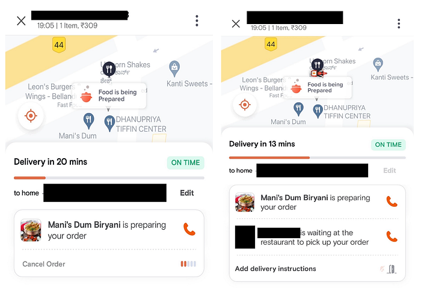
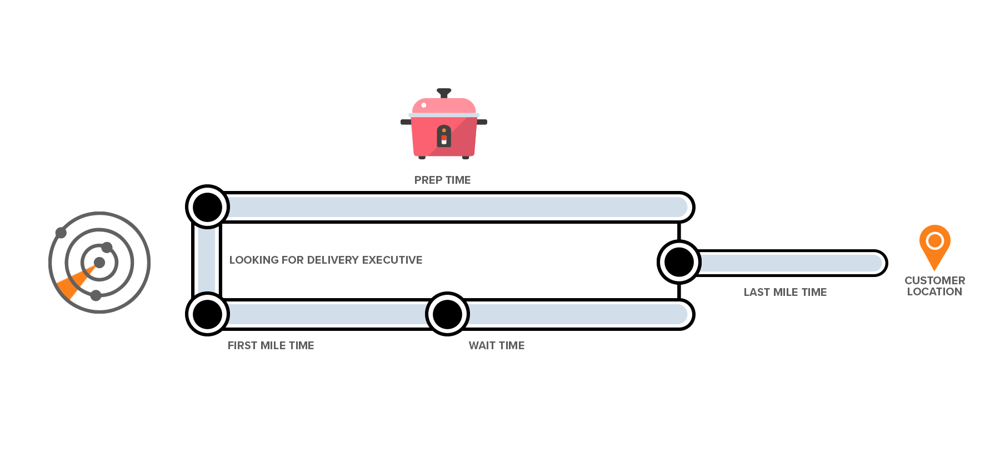
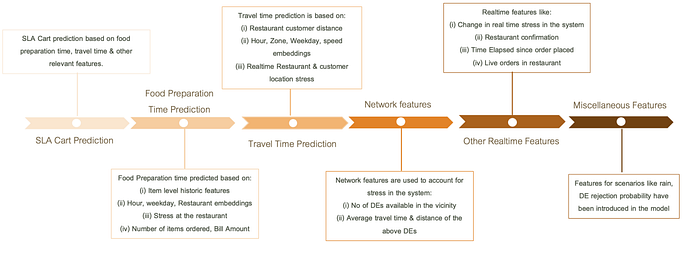
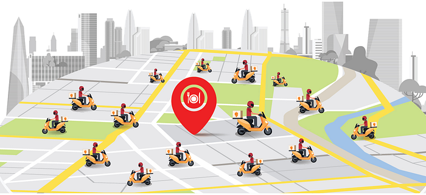
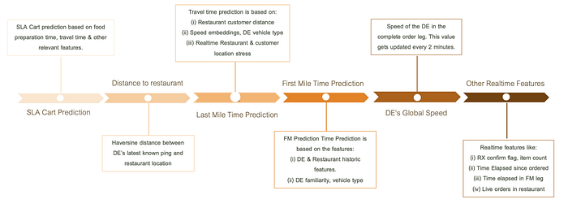
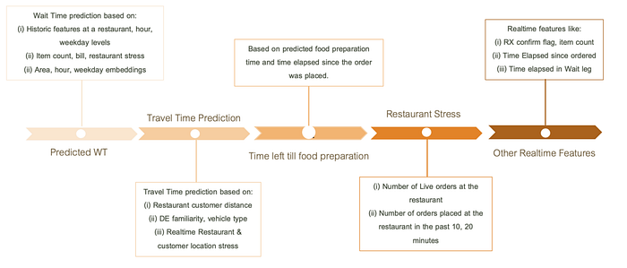

# Where is my order? — Part I

**With the blessings of technological advancements, we are able to predict Estimated Time of Arrival (aka ETA) of on-demand deliveries.**

As soon as we place an order on Swiggy, our eyes are glued to the tracking screen to see how far away our food is in realtime. Seeing the food getting prepared and being a short time away has a feeling of excitement. However, this is not the case when the food gets delayed and is a fair time away. We usually reach out to the customer care executives to find out the whereabouts of our order. This results in a not so great customer experience and also increases the operation costs borne. Consumer research suggests that customers usually anchor themselves to the **Estimated Time of Arrival (aka **ETA) shown on the tracking screen when they perceive whether the order is delayed or on time. Hence, the ETA shown on the tracking screen becomes an important input for customers to evaluate our delivery experience and also shapes how often the customer decides to reach out to us via chat or call and/or decides to cancel the order.

*The revamped Swiggy Track Screen powered by ML based predictions*

In this blog, we are going to discuss the data science models and their architectures that powers the ETA model for food delivery in Swiggy in the backend.

The Data Science team at Swiggy built an ML powered ETA service that works with real-time on-ground signals from assignment strategy, restaurant stress, delivery executive location pings and provides the most accurate & smooth post-order time estimates to our customers.

## ETA Model Architecture

The ETA architecture is a combination of 4 different models for the corresponding four different legs in the order journey with the predictions being refreshed at fixed time intervals, allowing the model to consume all the latest information available. The four order legs are- **O2A (Ordered to Assignment), FM (First Mile) , WT (Wait time) & LM (Last mile)**. The diagram below depicts a summary of a typical order’s journey at Swiggy. You can learn more about the order journey via this [blog](https://bytes.swiggy.com/the-swiggy-delivery-challenge-part-one-6a2abb4f82f6)

*Summary of a typical order’s journey at Swiggy*

The tracking screen ETA model is built on top of the Service Level Agreement (SLA) promise prediction shown to the customer at cart and improves on that by incorporating real time signals as the order progresses through its journey. These are additional real-time signals beyond what is considered for cart predictions. A order at any point of time can be in any one of the following stages:

1. **Ordered Stage (ETA OR):** Time period since the order is placed on Swiggy till it is assigned to a Delivery Executive (DE).
2. **Assigned Stage (ETA FM):** Time period between assignment of an order and the DE’s arrival at the restaurant or the First Mile (FM) time.
3. **Arrived / Wait Stage (ETA WT):** DE’s Wait Time (WT) at the restaurant to pick up the order.
4. **PickedUp Stage (ETA LM):** Picked Up to Delivered time or the Last Mile time.

The choice to go with 4 different models for tracking screen ETA stems from the fact that the model feature space varies for the different stages of an order. The underlying hypothesis behind the same is that different inputs impact an order’s progress at different stages — for example, when a DE is not assigned to an order, model makes use of network and assignment features to provide an accurate prediction , whereas when the order is picked up, the model uses DE’s pings and the corresponding speed/distance features derived from it. Hence, to improve the overall accuracy of the ETA these features need to be used in isolation in four different models.

## ETA Ordered Stage

The ETA Ordered Stage model is called when the order is received by Swiggy till it is assigned to a DE. The block diagram below explains the features consumed by the model.

*ETA Ordered Stage — Feature Block Diagram*

The ETA OR model is built on top of the SLA prediction provided to the customer at cart where a selection of restaurant and item has been made by the customer and a final cart page is created with billing information. The model consumes food preparation & travel time predictions made at cart along with network features like number of DEs available, their average distance from the restaurant to come up with an accurate prediction.

*The hyperlocal distribution of DEs around the restaurant plays a pivotal in ETA predictions*

If the number of Delivery Executives (DEs) in the vicinity of the restaurant are high as above, the model would adjust accordingly and provide a lower prediction value as compared to if there was a scarcity of it.

The model also utilizes other realtime features like system & restaurant stress, time elapsed to enhance the predictions further. Rare cases like rain & possibility of rejections by delivery executives are also provided as inputs to the model to deal with long tail cases.

## ETA Assigned Stage

The ETA Assigned Stage model is called during the time period from DE’s assignment of the order to the DE’s arrival at the restaurant. The model uses real-time DE pings and features built on top of it to come up with an accurate ETA estimate. The block diagram below explains the features consumed by the model.

*ETA Assigned Stage — Feature Block Diagram*

The ETA assigned stage model is the next stage of the ETA after the ordered stage. Similar to the ordered stage, it is built on top of the SLA prediction provided at cart. However, since a DE is assigned to the order at this stage, all travel time predictions have a DE component to it making them more accurate. Information on how familiar the DE is with the restaurant and customer locations, his/her mode of transportation (bike/bicycle/others) and historic trends are used to improve on the existing predictions. These leg-wise predictions along with features engineered using realtime DE pings like current speed, global speed, distance traveled combine to provide an accurate prediction. More details about the ping features are discussed in the second part of the blog where we discuss the LM stage in detail. The model also inputs realtime features like RX confirm flag, stress at the restaurant to enhance the predictions further.

There might be cases wherein you see an ETA of 37 mins changing into 25 mins post the assignment of a DE. These cases are generally when the assignment of DE happens earlier than previously expected (example- a DE just logged in for their shift).

## ETA WT Model

The WT Stage of the model is called when the DE’s waiting at the restaurant to pick up the order. The block diagram below explains the features consumed by the model.

*ETA Arrived Stage — Feature Block Diagram*

The predictions from ETA WT are built on the leg-wise predictions of WT & LM. Real time features like restaurant stress, live order count at the restaurant and item count is also used by the model. Features like time elapsed since food preparation started and time elapsed in the wait leg are introduced in order to make the predictions more complete.

*Difference in stress levels between weekend dinner slots and weekday snack slots at a restaurant is an important factor for ETA predictions*

The model also takes into account stress at the restaurant which is of paramount importance. During weekend dinner slots, the restaurants are at a higher than usual stress and even a small new order might take high preparation times due to kitchen stress. In comparison, weekday snacks slots are generally stress free as depicted in the illustration above. The model understands these patterns and provides an accurate prediction taking all the ground realities into account.

In this blog we discussed how we built a machine learning-powered ETA service — combination of four different models corresponding to different legs in the order journey, which refresh their predictions at fixed time intervals. The service is built on top of the Service Level Agreement (SLA) promise prediction shown to customers at the cart and improves on that by incorporating real-time signals as the order progresses through its journey. We discussed three of the four stages of the model in detail. We will return with a follow-up blog post that delves into the last stage of the ETA architecture along with the evaluation metrics and impact of the solution, as the blog is incomplete without discussing these crucial aspects. We will also discuss the future improvements that are planned to enhance the accuracy of ETA estimates even further.

---
**Tags:** Machine Learning · Deep Learning · Estimated Time Of Arrival · Hyperlocal Marketplace · Swiggy Data Science
