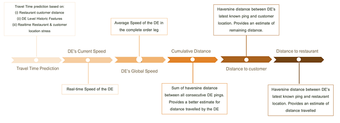
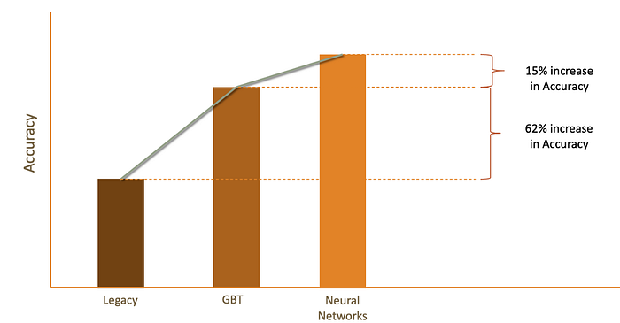
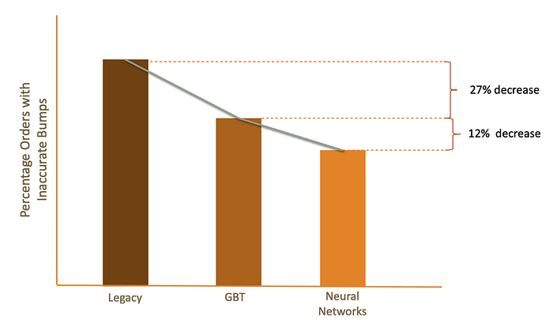

# How ML Powers — When is my order coming? — Part II

In a previous [blog](./how-ml-powers-when-is-my-order-coming-part-i-4ef24eae70da.md) , we examined Swiggy’s machine learning-powered ETA model that uses real-time signals from the assignment strategy, restaurant stress, and delivery executive location pings to provide accurate and smooth post-order time estimates to its customers. The ETA model architecture combines four different models for the corresponding four different legs in the order journey: O2A (Ordered to Assignment), FM (First Mile), WT (Wait time), and LM (Last Mile). Each model is designed to use different inputs that impact an order’s progress at different stages to provide accurate predictions. The model also incorporates other real-time features, such as system and restaurant stress, to enhance predictions further.

In this blog post, we’ll explore the LM Stage of the ETA architecture, evaluation metrics used by the models, as well as the shift from Gradient Boosting Trees to Neural Networks in our modeling approach. Finally, we’ll discuss some potential future improvements, including the use of sequence model architectures and Graph Neural Networks, to make Swiggy’s ETA predictions even more precise and accurate. So, let’s dig in!

## ETA LM Model

The LM Stage of the model is activated when the order is picked up from the restaurant. The diagram below shows the features used by the model.

*ETA LM Stage — Feature Block Diagram*

Real-time DE ping features are classified into time windows and examined for outlier pings that could result in inaccuracies before speed and distance features are computed.

To determine the current speed of the DE, the distance traveled is computed by adding up the haversine distance between successive pings in the time window. This distance is then divided by the time difference between the first and last ping timestamps.

To estimate the remaining distance to the customer, the haversine distance between the most recent DE coordinates and the customer’s drop location is calculated. Similarly, the haversine distance between the latest DE coordinates and the restaurant’s location is computed to estimate the distance traveled so far. In addition, the cumulative distance feature is calculated by summing up the haversine distance between successive pings throughout the entire last mile journey. This provides a more accurate estimate of the distance traveled by the DE than the haversine equivalent. Finally, the global speed of the DE is determined by dividing the cumulative distance feature by the time difference between the first and last ping timestamps.

*Real Time Traffic levels derived by speed features is an important feature to the ETA LM Model*

These features complement the initial travel time prediction and help to assess the real-time traffic situation on the road, enabling adjustments to the predictions. The real-time features take into account on-ground issues such as road closures, diversions, and the notorious Silk Board junction in Bangalore.

## Evaluation Metrics

The primary metric for evaluating ETA accuracy is the Mean Absolute Error (MAE) of the prediction, which is considered accurate if it falls below a predefined threshold. This metric reflects the overall effectiveness of the model at different stages of the order and the order journey. However, sudden jumps in delivery time estimates can cause customer anxiety and erode trust in Swiggy’s ETA estimates. Therefore, we also introduce an additional metric, the Percentage of Orders with Inaccurate Bumps, to measure the percentage of orders where an inaccurate sudden jump (in both positive and negative directions) in ETA predictions was observed. An ETA prediction is considered inaccurate if its MAE exceeds a specified threshold.

However, the Percentage of Orders with Inaccurate Bumps metric only penalizes cases where an inaccurate jump occurred. In some situations, ETA may need to adjust based on new information, such as batching, a stationary DE, or higher than usual restaurant stress. In these cases, sudden jumps may be necessary for the ETA to recalibrate accurately. Therefore, we must ensure that our metrics do not penalize these necessary adjustments, and we should take these factors into account when analyzing our ETA model’s performance.

## Modelling Approach

The initial modeling approach adopted was a **Gradient boosting trees (GBT) **algorithm with absolute loss function. The models were a big improvement in comparison to the legacy ETA framework with the Accuracy improving by ~62% and the number of inaccurate bumps decreasing by ~27%. However, even with the gains mentioned above, there were a few drawbacks of the GBT architecture. The GBT algorithm’s predictions can be considered less dynamic in nature compared to other machine learning algorithms. This is because GBT models are typically trained using decision trees, which are static models that do not adapt to changes in the data over time. Once a decision tree is built, it cannot be easily modified to incorporate new data or adjust to changing conditions. Therefore, the predictions made by GBT models may not always be as dynamic or adaptive as those made by other machine learning models, such as neural networks or recurrent neural networks. Hence, we decided to shift to a Neural Network based framework to solve the above issues.

**Neural Networks:** Each of the four ETA models has four hidden layers, with each layer comprising neurons that utilize a Leaky ReLU activation function. The models were trained for 50 epochs using the ADAM optimizer. The input hidden layer architecture for each of the four ETA models are as follows:

ETA OR (Ordered Stage): 4 layers (32, 32, 16, 16)

ETA FM (Assigned Stage): 4 layers (24, 24, 12, 12)

ETA WT (Arrived Stage): 4 layers (16, 16, 16, 16)

ETA LM (Pickedup Stage): 4 layers (8, 8, 8, 8)

The shift from Gradient Boosting Trees (GBT) to Neural Networks resulted in a significant improvement in accuracy, with an increase of approximately 15%. Additionally, there was a reduction of approximately 12% in the percentage of orders with inaccurate bumps, while simultaneously addressing the issues associated with the GBT architecture. By utilising neural networks, we were able to improve the precision and accuracy of ETA predictions, leading to enhanced customer satisfaction and trust in Swiggy’s ETA estimates.

## Model Performance

*ETA accuracy improvement: GBT model achieved a remarkable 62% boost compared to Legacy architecture, with an additional 15% gain through Neural Networks.*

*Reduced percentage of orders with inaccurate bumps: GBT model decreased by 27% compared to Legacy architecture, with an additional 12% reduction via Neural Networks.*

As a result of improved accuracy and reliability metrics in our tracking screen predictions, as shown in the graphs above, we witnessed a notable decline in customer-care agent interactions and order cancellations.

## Future Improvements

The revamped ETA model architecture has significantly improved the accuracy and reduced the percentage of inaccurate bumps. However, there is still room for further improvement. In the future, the team plans to explore sequence model architectures such as RNN and LSTM, as the order journey is essentially a sequence of events. Additionally, we will investigate the use of Graph Neural Networks (GNN) to enhance the last mile (LM) stage of the order.

We are also exploring other improvements, such as incorporating intelligent features based on Point of Interests (POIs) and DE rejection probability to address long-tail events. By incorporating these enhancements, we aim to make our ETA predictions even more precise and accurate, which will ultimately lead to improved customer satisfaction and trust in Swiggy’s ETA estimates.

---
**Tags:** Machine Learning · Deep Learning · Hyperlocal Delivery · Swiggy Data Science · Estimated Time Of Arrival
