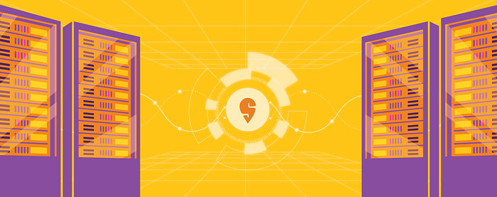

# How Swiggy migrated its k8s workload to Graviton

Swiggy, India's leading food ordering and delivery platform, is always looking for ways to optimize its infrastructure and reduce costs without compromising on availability and performance. Recently, Swiggy turned to AWS Graviton, a custom-built processor designed for cloud-native applications, and found it to be a game-changer.

In this blog, we’ll take a closer look at how Graviton is helping Swiggy achieve its goals and how you too can benefit from this technology.

## Why did we choose the Graviton machine for our K8s workload

At its core, [Graviton](https://aws.amazon.com/ec2/graviton/) is a custom-built processor designed for cloud-native applications. It is based on the Arm architecture and is optimized for performance, scalability, and cost-effectiveness. Graviton instances are available on Amazon EC2 and provide up to 40% [better price-performance](https://pages.awscloud.com/rs/112-TZM-766/images/2020_0501-CMP_Slide-Deck.pdf) compared to x86-based instances. This makes it an ideal choice for workloads that require high performance at a lower cost.

- **Cost benefits:** We run 10 Kubernetes clusters for serving our production and non-production workload that contains around 400+ EC2 instances(c5a.16xlarge, c5a.24xlarge, r5a.16xlarge.. etc.) which cost us approximately 13% of K8s worker ec2 on entire Infra cost. With Graviton, the cost was 10% cheaper as compared to…
