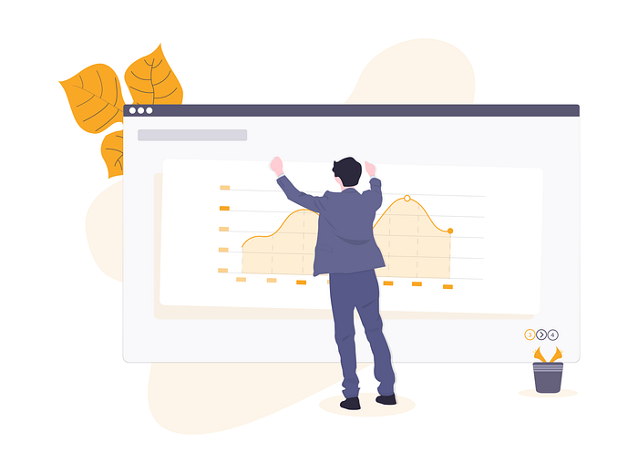
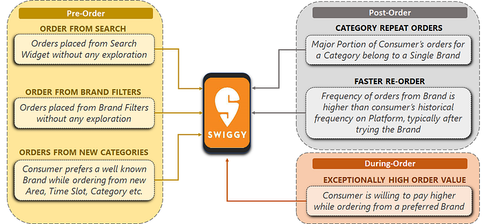
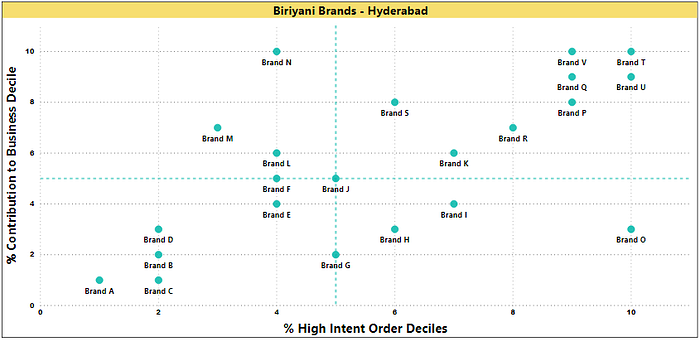
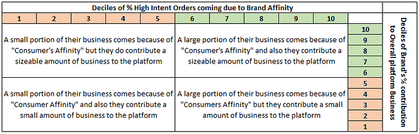

# How to identify and quantify ‘Consumer Love’ to drive business outcomes?

*Image source undraw.co*

In an online Marketplace Business, there is an abundance of competition amongst brands striving for consumer preference — with their product offerings, strategic pricing, and consumer engagement. And, from the consumer’s side, in line with Pareto’s principle, a major portion of the consumer base shows an affinity towards a relatively smaller subset of the brands on the platform. For an online Marketplace Business like Swiggy, it is of utmost importance to precisely identify the brands that consumers love and bring them even closer to the consumers.

_Why identifying consumer’s brand affinity is crucial_

1. **[Top-line] Improving revenue through consumer stickiness:** Improving coverage/availability of these brands would ensure customer locking to the platform
2. **[Bottom-line] Improving profitability:** Consumers are ready to pay a premium for a brand they love. Identifying these brands would be a step towards improving ticket size on the platform while keeping consumer conversion on the platform in check
3. **Customer experience:** Customers love brands because they provide great quality and experience. Making these brands easily accessible on the platform is bound to improve customer experience on the platform

There is an abundance of data available to conventionally identify these ‘best brands’ or ‘the brands that consumers love’ in the market. It could range from the ratings and feedback available on your own platform to all social media reviews across the web including the likes of Google, Facebook, Twitter etc.

_But the question is, do these conventional methods accurately capture consumer’s love for a brand, relevant for an aggregator business? _Let’s explore what is lacking in these traditional approaches

1. **Noise in in-house ratings:** In an online aggregator business, other than the quality of the products/services, ratings, are also a function of aspects such as delivery, packaging and the overall experience of ordering. These together cloud the actual product/service rating
2. **Noise in external reviews:** Social media ratings/reviews for offline services include other dynamics such as aesthetics, presentation, ambience, wait-time, etc. which could often be ambivalent for online services
3. **Varying baseline:** Baseline level on an absolute scale of ratings differ from consumer to consumer
4. **Small sample size:** Average star ratings are often based on insufficient sample sizes but, consumers trust them anyway
5. **Biased rating:** Quality being constant, expensive products and prevalent brands tend to get higher ratings

While these conventional methods give a straight-forward approach for identifying the best brands on the platform, the variabilities involved skew the outcome. Moreover, these conventional methods are a _‘representation of the outcome’_ and miss out on capturing the intent of the consumer i.e — _how_ and _why_ a choice was made.

Knowing that consumers prefer to order from the brands that they love, the question that needs to be answered is _how do we quantify consumer’s love for Brands?_ _What are the signals that consumers relay while placing an order?_ To answer this, there was a need for a framework that focussed on the journey of a consumer to reach order. In other words, taking a consumer backward approach to identify their affinity towards specific brands.

To address this, we designed a framework to segregate consumer journeys on a platform into high and low intent, which in turn quantifies the consumer’s brand preference.

**Identifying order Intent through Consumer Touchpoints/Journeys:**

_What are the broad categories of consumer touch-points/journeys that help us identify their intent?_

Based on consumers interaction on the platform, these journeys were broken down into 3 categories:

1. **Pre-order:** Browse/Explore to order behaviour — This focuses on how the choice was made. _Was it a specific choice that the consumer made?_
2. **During order:** This focuses on the attribute of the order placed such as order category, order value, etc.. _Was the consumer ready to pay higher? Did the consumer already have a perception of the brand?_
3. **Post-order:** Repeat Interactions with brands on the platform, post order fulfilment. _Did a past interaction with a brand influence consumer behaviour on the platform?_

Basis these order attributes, below image depicts some of the consumer journeys that were identified as high intent journeys on the platform which relay consumer’s intent to order.

Each consumer order could be mapped to multiple journeys mentioned above, hence to make them mutually exclusive these journeys were ranked basis priorities. For example — an order could be marked as ‘Order from Search’ as well as “Faster Re-Order”. In this case, basis priority, the order was categorized as ‘Order from Search’.

These marked orders have been coined as ‘**High Intent Orders**’ which means, the consumer journeys for these orders show a high intent to order from a preferred brand. Percentage of such **‘High Intent Orders’** at a Brand level has been defined as the brand’s **_Consumer Affinity Score (CAS)_**. Higher the CAS, higher is the ‘Consumer Love’ for that particular brand.

To make this score highly robust and readily consumable at a platform level, there was a need for some cleansing and wrangling -

1. **Outlier treatment:** It was possible for a brand with extremely low orders to have a very high Consumer Affinity score. To address this, the bottom 20 percentile brands basis contribution to platform orders were removed
2. **Scaling:** The range of CAS varied across cohorts such as cuisines, cities, etc. so, there was a need to scale these scores at a cohort level as applicable. Owing to the hyperlocal nature of the business, here, deciling was done across multiple cohorts

Keeping the Business Top-Line in mind, these scores were coupled with the brand level contribution to platform business (again scaled at cohort level). Below is an illustration as to how the brands in a particular cohort (City — Cuisine in this case) have been placed in an X-Y plane, with Deciles of CAS on the X-axis and Deciles of contribution to Platform Business on the Y-axis.

Here, the brands falling in the 1st quadrant (6th to 10th decile on both axes, marked in green) are the brands with high Consumer Affinity as well as high contribution to platform business.

In contrast, the brands falling in the 4th quadrant (with high deciles of High Intent Orders but a low contribution to platform business) are Brands that could have low discoverability on the platform. These brands could be termed as **‘Hidden Gems’**, basis the fact that they are high on consumer affinity score but, due to low discoverability or limited operations or because of targeting a niche segment, have a low contribution to platform business.

**_How can Consumer Affinity Score benefit across Businesses?_**

- Identifying the gaps across various cohorts basis average CAS score, and filling those voids with these high CAS brands would ensure scalable business growth and consumer’s stickiness to platform
- Differential treatment for these high CAS brands that already have a scale, would help improving consumer experience and profitability on platform
- Strategic Partnership with these high CAS brands could help in consumer acquisition as well as locking to the platform

A brand’s worth for a platform is only as much as the consumers value it. While all the traditional approaches serve their purpose as a feedback loop for brands to improve, those methods have their own challenges when it comes to defining a consistent and noise-free measure.

This approach moves away from ‘what consumers are saying’ to ‘what consumers are doing’ — a key distinction that differentiates between perceived and realized the value of a brand. The brand affinity score is not intended to help consumers choose a brand but to help aggregator businesses choose brands that are most valuable, based on how consumers interact with them. The exact consumer interactions that indicate higher intent or ‘love’ for a specific brand may vary from platform to platform, but including ‘the journey’ as part of the measurement framework is something businesses tend to overlook.

---
**Tags:** Swiggy Analytics · Swiggy Engineering
