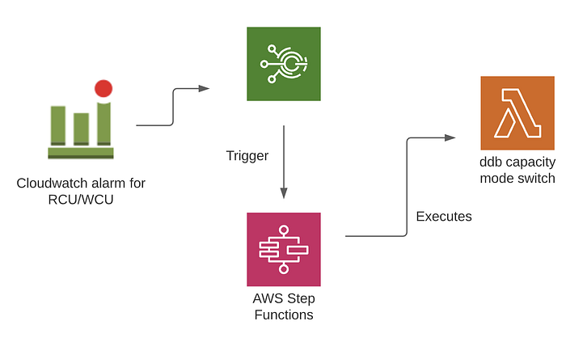
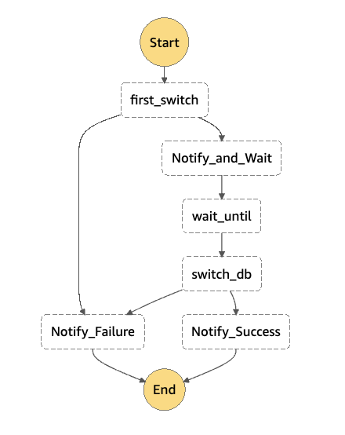

# How to limit autoscaling in on-demand DynamoDB tables?

*Photo by Florian Krumm on Unsplash*

_Update May 2023 — We have now open sourced this project and is available here _[_https://github.com/Swiggy/ddb-ondemand-protector_](https://github.com/Swiggy/ddb-ondemand-protector)

[Amazon Dynamodb](https://docs.aws.amazon.com/amazondynamodb/latest/developerguide/Introduction.html) is a fully managed NoSQL database service that provides fast and predictable performance with seamless scalability. It has two read/write capacity modes for processing reads and writes on your tables:

- **On-demand:   
**This is a flexible billing option capable of serving thousands of requests per second without capacity planning. DynamoDB on-demand offers pay-per-request pricing for read and write requests.
- **Provisioned:  
**In this mode, the user mentions the throughput capacity in terms of read capacity units (RCUs) and write capacity units (WCUs) that are required for the application. You will be charged for the throughput capacity (reads and writes) you provision in your Amazon DynamoDB tables, even if you do not fully utilize the provisioned capacity.

**How does scaling work in both the capacity modes?**

- **On-demand:  
**DynamoDB tables using on-demand capacity mode automatically adapt to the application’s traffic volume. On-demand capacity mode instantly accommodates up to double the previous peak traffic on a table. For example, if your application’s traffic pattern varies between 25,000 and 50,000 strongly consistent reads per second where 50,000 reads per second are the previous traffic peak, on-demand capacity mode instantly accommodates sustained traffic of up to 100,000 reads per second.  
The request rate is only limited by the DynamoDB throughput default table quotas, which can be raised upon request per account level, default value being 40k RCU/WCU [[Reference](https://docs.aws.amazon.com/amazondynamodb/latest/developerguide/Limits.html#default-limits-throughput)]  
Throttling can occur if you exceed double your previous peak within 30 minutes.
- **Provisioned:  
**Provisioned throughput is the maximum amount of capacity that an application can consume from a table or index. If your application exceeds your provisioned throughput capacity on a table or index, it is subject to request throttling.  
One can use auto scaling to adjust the table’s provisioned capacity automatically in response to traffic changes.  
DynamoDB auto scaling actively manages throughput capacity for tables and global secondary indexes. With auto scaling, you define a range (upper and lower limits) for read and write capacity units. You also define a target utilization percentage within that range. DynamoDB auto scaling seeks to maintain your target utilization, even as your application workload increases or decreases.

## Problem Statement:

We had a use case wherein we needed to pre-populate an on-demand DynamoDb table with over 1 Tb of data. The data was ingested using a job with concurrent reads and writes to the table. With the job running for a full day, the RCU/WCU of the table automatically scaled out to the fullest capacity, incurring a huge increase in cost.

Note that the RCU/WCU for on-demand are set at an account level and not per table basis unlike provisioned tables, making setting limits for RCU/WCU difficult.

This created a need for a mechanism that would limit the on-demand scaling thus keeping a check on the costs involved.

The document here talks about a solution that can be used to limit the RCU/WCU once the table has reached a certain threshold for an on-demand table, the threshold being lower than the limit set for an AWS account.

## Solution:

The solution deals with switching your on-demand table to provisioned with minimal RCU/WCU whenever the RCU/WCU exceeds the specified threshold. The switch will enforce the provisioned RCU/WCU thus limiting the consumption and the cost. The table can be switched back to on-demand after 24 hours due to the limitation on the switch between read/write capacity modes once every 24 hours. [[Reference](https://docs.aws.amazon.com/amazondynamodb/latest/developerguide/HowItWorks.ReadWriteCapacityMode.html)]

This approach is strongly recommended as a guardrail preventing a cost blowup in on-demand tables where the user can bear a degraded performance caused due to a low threshold set for RCU/WCU when the utilization reaches a particular threshold.

### Architecture:

### Components:

1. **Cloudwatch Alarm: **  
Alarm on the consumption of RCU/WCU. The alarm can be set based on historical data on the consumption of RCU/WCU of the table. Recommended statistics for such use cases is sum [Ref](https://docs.aws.amazon.com/amazondynamodb/latest/developerguide/metrics-dimensions.html) as the cost is incurred on the total RCU/WCU consumed [Pricing](https://aws.amazon.com/dynamodb/pricing/on-demand/).
2. **Lambda:**   
A lambda that will switch the billing mode of the table from on-demand to provisioned and vice versa based on the present mode.
3. **EventBridge Rule: **  
Trigger for invocation of step function once the metric exceeds the threshold. The rule is set on the state change of cloudwatch alarm to ALARM state.
4. **Step function:  
**Since we want to wait for 24 hours to switch the capacity mode of the table back to on-demand, step function is the ideal choice for such use cases.

Following are the states involved in the step function:  
a) **First_switch** is a task state which invokes the ddb switch lambda, on successful invocation it goes to Notify_and_Wait else it notifies in case of any failures.  
b) **Notify_and_Wait **is a notification state which send successful notification on the first switch and moves to wait state thereafter.  
c)** Wait_until **is a wait state that will wait for 24 hours to go to the next state.  
d)** Switch_db **is the next state which invokes the lambda function that is switching the capacity mode of the table back to on-demand.  
e) Terminal states are **Notify_failure** and **Notify_Success** which are used for failure and success notifications respectively.

## Points to Note:

1. While the capacity mode of the table is switched, the table goes into “updating” state, which is an asynchronous operation meaning that no other updates would happen while the table is in “updating” state. [[Reference](https://docs.aws.amazon.com/amazondynamodb/latest/APIReference/API_UpdateTable.html)]
2. **What other operations are affected?  
**Since UpdateAPI is a Control Plane option [[Reference](https://docs.aws.amazon.com/amazondynamodb/latest/developerguide/HowItWorks.API.html)] the other ControlPlane actions will be affected while updating. For a table, the only other action other than update would be “Describe” which will be affected while the change is made.  
All other actions like getItem, putItem falls under DataPlane action and hence will be unaffected.
3. **How much time would be taken for the capacity mode switch?**  
The time taken for the switch is not specified by the AWS and may vary from seconds to minutes depending on the table structure, size, and the partitions on the table. [[Reference](https://docs.aws.amazon.com/amazondynamodb/latest/developerguide/HowItWorks.ReadWriteCapacityMode.html#HowItWorks.SwitchReadWriteCapacityMode)]  
For example: switching from a provisioned to an on-demand table for the first time will take a longer time as the partitions need to be created and the on-demand mode guarantees 2x throughput than the previous peak. In the present case, we will be switching an on-demand table to provisioned which would take less time.
4. Same rule applies for the switch, if the table is in an updating state when the alarm is triggered i.e when the lambda is trying to change the capacity mode, the lambda would error out with ResourceInUse Exception. [[Reference](https://docs.aws.amazon.com/amazondynamodb/latest/developerguide/Programming.Errors.html)]

## Conclusion:

AWS currently provides limit at an account level for the on-demand tables. This becomes really difficult to handle when you have to put limits at a table level. When a team owns only a table and wants to make sure that they do not overshoot the budget, table level cap is very useful. This solution provides an option to be able to control the cost at a table level. It is a failsafe mechanism to put a guardrail on the cost involved when you are dealing with volumes of data.

---
**Tags:** AWS · Dynamodb · Autoscaling · On Demand · Swiggy Engineering
