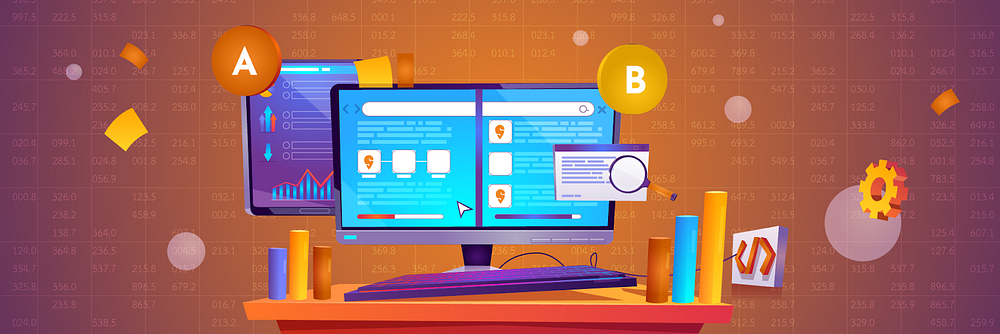
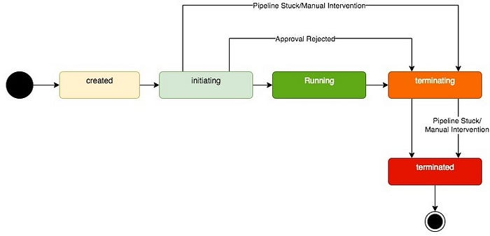
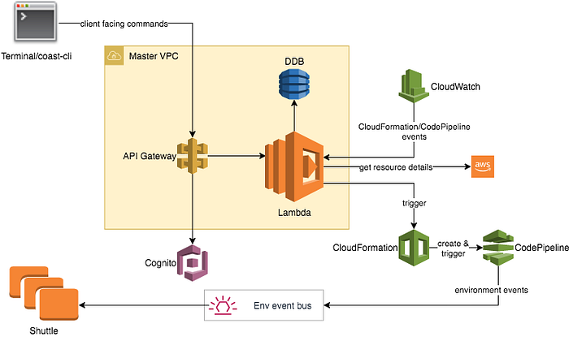
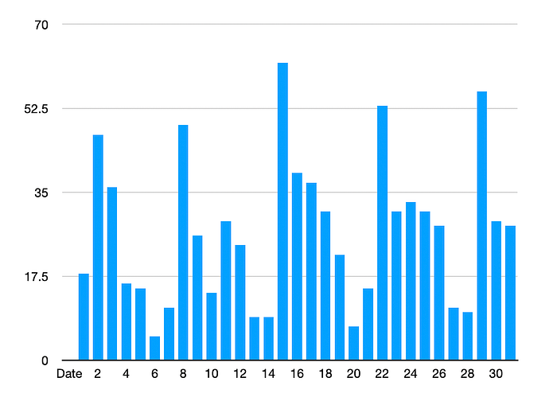
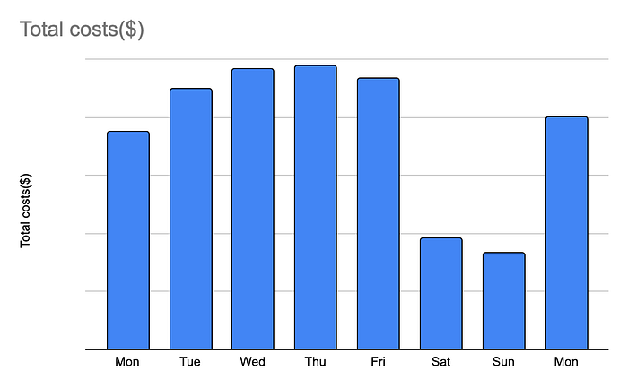
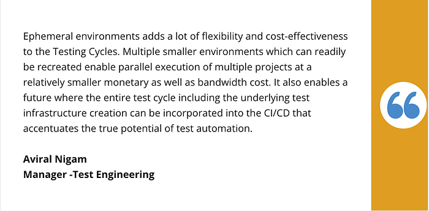
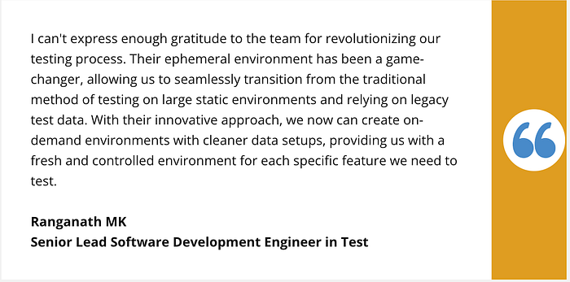

# How we improved testing processes using Ephemeral Environment

As a developer, have you been in a situation where your product feature missed the deadline due to the instability of UAT environments? Or maybe the environment was not available for testing due to another feature testing happening in parallel?

As a QA/Dev, are you working overtime to test the feature on the UAT environment due to environments being shared with multiple users, or not being able to run regression suites due to data corruption?

We, at Swiggy Tech, also faced similar problems, and production releases were often affected due to various issues in those testing environments. This is not acceptable as our consumers demand the best from us.

**At Swiggy, we have solved the bottleneck of environment instability and environment unavailability using the concept of Ephemeral environments for UAT testing**. This helped us in increasing execution speed and accelerating the software development lifecycle. Most importantly, this lets us test and ship the features to our consumers in a timely fashion.

## A bit of a history of testing environments at Swiggy

In the initial days at Swiggy during the MVP phase, all the deployments were done manually by logging into the box. Later as the tech team grew, we introduced the concepts of UAT environments. A few static environments were created for UAT testing and the deployment on those environments was done via Jenkins. Those static environments started becoming blockers for UAT testing due to instability, non-availability, and data corruption which resulted in a delayed production release cycle. As an enhancement, we have now introduced the concept of Ephemeral environment as a service(EaaS).

## What is an Ephemeral environment?

The ephemeral environment is an on-demand, short-lived environment created for a specific purpose that gets terminated on task completion. They can live for one hour or for a few days based on the task size.

Characteristics of the ephemeral environment:  
1. Automated and on-demand in nature  
2. Isolated  
3. Shareable  
4. Cost efficient  
5. Scalable

With an EaaS, one may spin up these environments, deploy all required services to test a feature, run the integration test cases, ship the code to production and shut them down when no longer needed.

It provides an isolated environment for your application that may contain all of your codes, libraries, infrastructure, settings, and applications. In essence, EaaS addresses developer productivity issues by providing settings that make it simple for developers to test and mimic real-world use cases of their systems. EaaS is an extension of IaaS.

**Capabilities of EaaS:**

- **Manage environment life cycle**:  
EaaS manages the life cycle of the testing environment from creation to deletion.  
The following diagram shows the state transition of the ephemeral environment:

- **Isolation  
**The environment created by EaaS is isolated in nature. A dedicated VPC (network) is allocated to each of the environments and those VPCs are not peer with each other
- **Governance:  
Ephemeral environment unit (EEU):** **  
**We have introduced the concept of EEU (Ephemeral environment unit) for the governance of temporary environments to make sure the resources are equally distributed across multiple teams in a cost-effective manner. Each of the team/pods is allocated a certain amount of EEUs  
**Definition of EEU: **  
EEU = Max(1, TotalService/30, (Cost/hour)/10)  
**Max TTL: **  
As ephemeral environments are disposable, we have introduced max TTL for the environment to make sure those are not getting converted to static environments.
- **Scalability  
**EaaS provides the capability to scale the number of environments based on demand and business needs. At the moment, we have provided the capability to create 150+ parallel ephemeral environments.
- **Shareable  
**One of the amazing features of EaaS is that you can share the ephemeral environment through a unique URL. Different stakeholders access the new ephemeral environment through the URL and can test and provide feedback on the code change early in the release cycle.
- **Dedicated environment  
**The traditional staging environment is a shared environment and contains code of different branches and versions. If one branch conflicts with other branches, then nobody can perform testing on staging until the conflict is resolved. In an ephemeral environment, the environment is created and dedicated to a particular branch and does not contain any other code changes. This allows teams to test each feature in isolation.

## Architecture

Ephemeral environment as a service (EaaS) is designed based on the serverless architecture of AWS (Lambda and API gateway). The below diagram describes the High-level architecture of EaaS:

**Environment Creation Flow  
**Anyone at Swiggy can create the environment via either an API or the CLI command

1. API gateway calls the lambda to create the environment
2. Lambda creates the AWS CodePipeline for the creation of base infrastructure
3. Communicate to users about various state transitions via Slack message
4. Publish an event for Base environment creation readiness and its Running Status

**EaaS creates the environment in two steps**

1. Deployment of base/foundational components  
The components/services which are shared across the environment. Other microservices are dependent on these components to be present as part of the base environment.  
E.g. — Network, Kubernetes NameSpace, Load balancer, Haproxy, Kafka   
 The time takes to deploy foundational components is ~15 minutes
2. Deployment of microservices.** **  
Once all foundation components are deployed successfully, the user can deploy the required microservices via the command line interface  
All the required resources of the service will get created in the same network.

### Advantage of EAAS:

We have adopted the 100% usage of ephemeral environments for all kinds of testing at Swiggy ( functional, regression, etc.). We have seen multiple advantages of moving from static environments to ephemeral environments.

1. **Environment availability  
**Now users can create an environment based on feature request testing, environment availability is not a blocker for any kind of testing.  
Daily environment creation trends

**2. Cost Elasticity:  
**Ephemeral environments are shorter-running environments. Hence, Pay as you use. We have seen that during weekends the cost of our UAT infra is minimal compared to weekdays.

**Testimonials from the team :**

## Conclusion

In this blog, we have shared the basis of the ephemeral environment and how the concept of the ephemeral environment helps Swiggy to increase the speed of execution with cost elasticity.

**Stay tuned for our next set of articles about   
**1. Shuttle — Platform for infra as code, which manages the resource creation and service deployments across environments.  
2. QGP — Wrapper over the EaaS and Shuttle to control the quality

---
**Tags:** Swiggy Engineering · Testing Tools · Ephemeral Environment · Sdlc · Eaas
