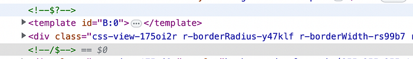
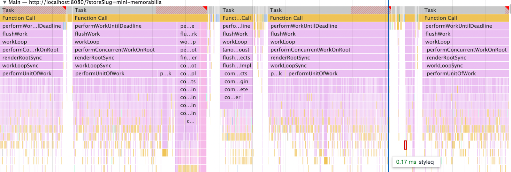

# How we optimised page load metrics for Minis web


### Introduction

Minis on Swiggy app was built using React Native to cater to growing needs of native experience and at the same time powering m-web and d-web via the react-native-web. We have developed it as a monorepo to be able to leverage the components across native and web stacks

React-native-web fundamentally converts RN components to React DOM elements. This by default renders the page on client side only which requires all assets to be downloaded, parsed and executed. APIs are fetched and subsequently react-native components are rendered before the user can view any meaningful content.

To optimize the page load time metrics and improve the SEO, we decided to go with implementing SSR for our webview.

### Server Side Rendering with React 18

1. With Concurrent Mode, React 18 allows the server to start streaming the HTML response to the client as soon as it becomes available, without waiting for the entire application to render. As soon as the content before the first [Suspense](https://react.dev/reference/react/Suspense) boundary is ready, the _onShellReady_ function is called, and the HTML can be streamed to the client.

```
ReactDOMServer.renderToPipeableStream(
        <App />,
        {
            bootstrapScripts: ['app.js'],
            onShellReady: () => {
                res.setHeader('Content-type', 'text/html');
                stream.pipe(res);
            },
            onError: (error) => {
                //log error
            } 
        }
  );
```

2. Hydration can start as soon as the JS assets are loaded. Other Suspended components can be streamed later. The waterfall model of SSR of previous React versions is not a bottleneck here.

3. HTML streaming is split into multiple chunks with React Suspense. The components which are streamed first are hydrated on priority. This is selective hydration. Also the components which are interacted first by the user, are hydrated first.

### Minis SSR Implementation

Below is the high level structure of React components for Minis homepage. _ShopLoader_ component is the placeholder which is rendered before the API calls in the suspended components are resolved.

```
<Suspense fallback={<ShopLoader/>}
       <StoreInfo/>
       <Suspense fallback={<InstagramPreLoader/>}
            <InstagramWidget/>
       </Suspense>
       <Suspense fallback={<CatalogLoader/>}
           <CatalogView/>
       </Suspense>
</Suspense>
```

Node server renders the app using React 18 streaming API — [_renderToPipeableStream_](https://react.dev/reference/react-dom/server/renderToPipeableStream). This allows to render Suspense Components which wasn’t possible with _renderToNodeStream_ earlier

- _Suspense_ acts as a split in the rendering process. In the above component structure, the first chunk rendered and streamed back to the client will be _ShopLoader_ as the first suspense boundary is hit.
- However, this is not what we want. First html response should be meaningful data. So it makes sense to fetch the_ API _data and provide the response as an initialState. So the _StoreInfo_ component will not suspend and _storeInfo_ html can be streamed in the first chunk itself.
- When a component is suspended in React 18, a template element is streamed along with a fallback component, which can be later replaced with the actual component that is streamed later. Additionally, a special comment tag: <! — $? → is added to mark the suspense boundary.


*Template element streamed*

React 18 also streams the script to replace this template component with meaningful content markup streamed later


*Script to replace the placeholder B:1 with actual component S:1*

- The rest of the components — <InstagramWidget/> , <CatalogView/> are streamed later when those suspended boundaries are resolved.
- The API response needs to be sent to the client for hydration. The data will be streamed by the component _ServerDataComponent_

```
renderToPipeableStream( 
  <>
    <App/>
    <ServerDataComponent />
  </>
)
```

```
//ServerDataComponent:

//track all the apis fetches status using React 18 useSyncExternalStore
const data = getAllAPIPromises();

<Suspense>
     <ServerData data={data}/>
</Suspense>
```

ServerData will remain suspended till all the API fetches are resolved. Once the promises are settled , ServerData will add a script with the data and will be stream to the client for hydration.

```
<script id="react-data" dangerouslySetInnerHTML={{_html:Json.stringify(data)}}></script>
```

React 18 provides a hook for this [**useSyncExternalStore**](https://react.dev/reference/react/useSyncExternalStore). It lets the app subscribe to the external store. ServerDataComponent use this hook to get the data from our app redux store once all promises are resolved.

### Static Assets

_CSS_

Extract the css using RN Stylesheet _getStyleElement_ which returns the object of all the styles of the components. And add to the head element as inline style

_Fonts and JS_

Using webpack build time manifest file, extract the chunk names of fonts and JS assets. Preload the fonts and add JS assets to the streaming HTML as async scripts

### Client hydration using react-native-web

Client side rendered DOM needs to match with the DOM sent from the server.

- Browser client can start the hydration as soon as the JS assets are downloaded , but in case the server hasn’t send the server data back yet , the hydration will fail . So add a listener on _DomContentLoad_ event to wait for the streaming to complete , get the initial state before starting the hydration process.

```
document.addEventListener('DOMContentLoaded', () => {
     el = document.getElementById(id) as any;
     if (el) resolve(getDataFromEl(el, id));
     else reject(new Error('failed to find DOM with rest hooks state'));
  });
```

- Add the argument _hydrate:true_ to runApplication function of **_React-native-web_** to hydrate the app.

```
    AppRegistry.registerComponent("App", () => WebApp);
    AppRegistry.runApplication("App", {
        rootTag: document.getElementById(ROOT_ELEMENT_ID),
        hydrate: true,
    });
```

- React 18 does progressive hydration with the help of Suspense without blocking the main thread thereby taking care of the responsiveness. Component-1 hydration happens in one task and Component-2 hydration happens in another.


*Hydration happening as separate async tasks.*

### Client only Components?

We might want to render some components only on the client side .

- One way is to add a state to the component and update it on useEffect. Return null or preloader if the state is false and return the component if state is true after useEffect update.

```
const [isMounted, setMounted] = React.useState(true);
React.useEffect(() => {
        setMounted(false);
}, []);

return isMounted ? <Component/> : <Preloader/>
```

- With the Suspense boundary , throw an error in a suspended component if the window object is undefined , this will prevent node server to proceed with SSR for that component.

```
export const useRenderClientOnly = (errMsg: string): void => {
    if (typeof window === "undefined" && Platform.OS === "web") {
        throw new Error(errMsg);
    }
};
//In a Suspended Component
useRenderClientOnly("Render this only on client")
```

### Impact

After implementing SSR, the time it takes to make relevant content visible to the user was reduced from **7.5 sec to 5.2 sec (90 percentile)**

Before SSR:


After SSR:


---
**Tags:** Swiggy Engineering · React · Swiggy Minis · React Native · Server Side Rendering
