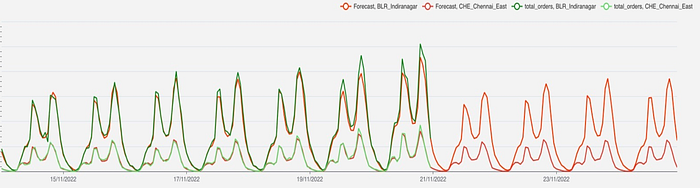
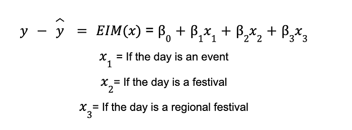
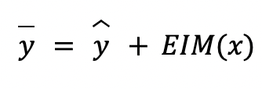
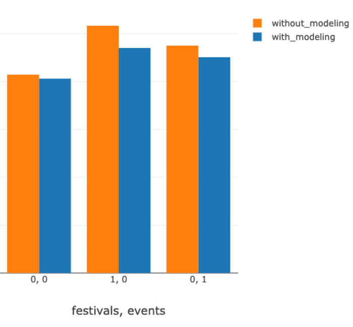
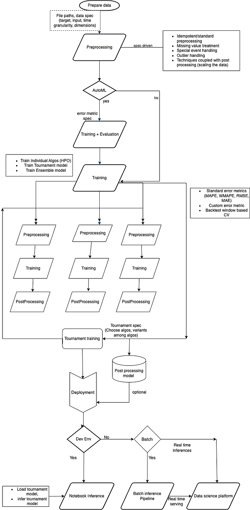
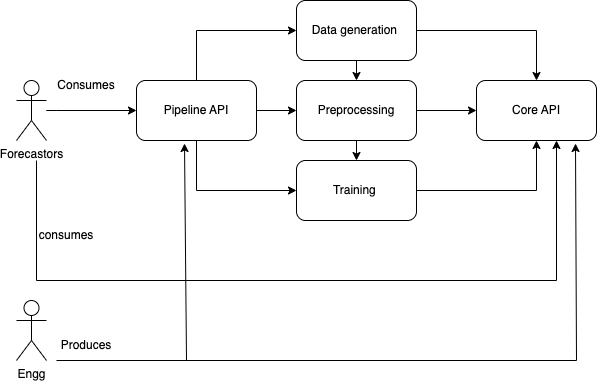
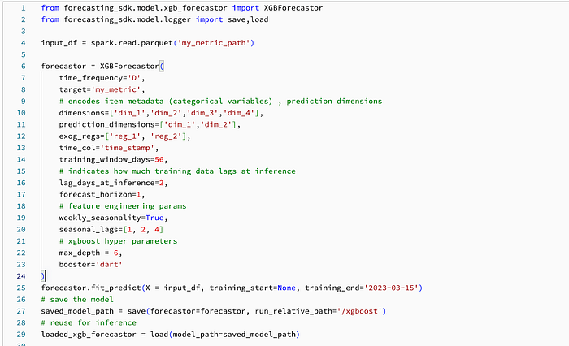
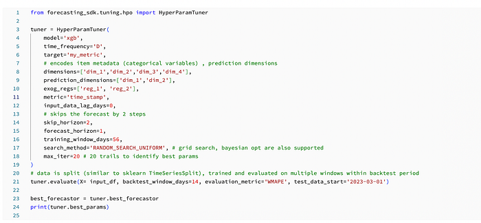
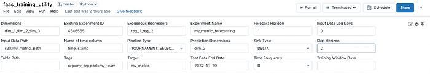

# Hyperlocal Forecasting at Scale: The Swiggy Forecasting platform

Co-authored with [Viswanath Gangavaram](https://www.linkedin.com/in/viswanath-gangavaram-4336937/), K[arthik Sundar](https://www.linkedin.com/in/smkarthiksundar/), [Ishita Dutta](https://www.linkedin.com/in/ishita-dutta-02b31b156/)

## Introduction

Food delivery is a complex hyperlocal business spread over thousands of geographical zones across India. Here zones represent smaller geographical areas. The ability to correctly predict the future state of the demand and supply at a hyperlocal level is paramount to running our operations optimally at Swiggy. In this blog, we aim to provide an overview of how we approach forecasting and the systems that were built to support forecasting at the scale for hyperlocal.

This blog is divided into the following sections — The challenges of forecasting at hyperlocal, and how our platform is designed to tackle these challenges. Then we give a detailed account of the forecasting platform, and along with it, we also cover the tenets and API design choices of the pipelines we’ve built. And in the end, we conclude with results.

## Time series forecasting at the hyperlocal level

Accurate forecasting of time series for smaller time granularities at the hyperlocal level is a challenging task due to the frequent and often huge variation of the actual time series. Time series models typically model the base, trend, and seasonality of the time series. From our experience, even after modeling for seasonality and long-term trends, real-world time series exhibit significant variance due to situations changing on the ground like delivery executive (DE) shortages, discounts on the consumer app, etc., and as well as external factors like festivals, sporting events, rains, strikes, etc.

To tackle the aforementioned issues, we devised the following set of techniques 1) a novel forecasting meta-model (tournament), wherein multiple models compete to provide forecasts for different spatiotemporal units, 2) ensemble techniques like simple, and weighted averages of the base models, and stacking of the base models, 3) the handling of events in independent pre and post-processing steps. We also experimentally found the following techniques help in further reducing the forecasting errors in some cases: 4) time-reduction: forecasting at a higher granularity and then distributing the forecasted value as a function of historical weights, and vice versa 5) time-shift: forecasting for a given time interval and using it for a different time interval.

## The Swiggy Forecasting platform (FP)

As suggested in the introduction, forecasting becomes a basic ingredient in various products at Swiggy. Individual teams developed different methods, used a variety of tools to generate forecasts (Databricks, AWS forecast, Python scripts, Excel) and operated in isolation. Due to the challenges mentioned above in the hyperlocal scenario, these teams had to solve the same problems and required significant analyst/data science/engineering bandwidth to maintain accuracy and scale the systems for a large number of time-series. By identifying the business value and the technical challenges of forecasting, a centralized forecasting platform can enable teams to focus on the core business problem statement and rely on the platform to do the heavy lifting of forecasting in a standardized, cost efficient way.

The Swiggy Forecasting platform is a centralized forecasting service, which enables the end-user to generate accurate forecasts in a quick span of time and at a cheaper cost vs. the alternatives.

Time series forecasting problems are well-researched and various approaches have been proposed and put to use on real-world data. As described in our previous [blog](./an-end-to-end-system-to-detect-and-explain-anomalies-in-operational-metrics-448bc74c700e.md), we invested in forecasting early on for our in-house anomaly detection framework, where traditional time series techniques (autoregressive, exponential smoothing), more recent forecasting methods (FB Prophet), neural networks (DeepAR), and gradient-boosted trees (XGBoost) are being used extensively. We also include baseline models (moving averages, seasonal moving averages) to compare with complex models and also to build candidates for composite models like tournaments and ensembles.

As described in sections 3.1.2 (Model Tournament) and 3.1.3 (Model subset selection) in our previous [blog](./an-end-to-end-system-to-detect-and-explain-anomalies-in-operational-metrics-448bc74c700e.md), we devised a novel forecasting meta-model, wherein multiple models compete to provide forecasts for different spatiotemporal units, and we experimentally found that this technique is found to reduce the forecasting errors by 15–30% on various time series metrics as compared to the base models. For more details on this technique, please refer to the [blog](./an-end-to-end-system-to-detect-and-explain-anomalies-in-operational-metrics-448bc74c700e.md). Our platform has in-built support for various ensemble techniques like averaging and stacking of baseline forecasts, these are proven to reduce the forecasting errors by 10–20% as compared to their baseline variants.

*Figure 1: Actuals and forecasted values of hourly demand for Indira Nagar and Chennai East zones. Here, the forecast horizon is 7 days with a forecasting delay of 7 days, which means on the Nth we are forecasting from N+8 to N+14th days.*

As mentioned above, the idea of time-shift has been shown to reduce the forecasting error by a reasonable margin, In figure 1, we need an hourly forecast from N+8 to N+14th days, we found that forecasting for N+1 to N+7th days, and use them as a forecast for N+8th to N+14th days is shown to reduce the forecasting error by 5–10% for some forecasting models.

## Event Handling

One of the common issues while doing time series forecasting is the occurrence of events like festivals, sporting events, etc. While some models like a prophet, and DeepAR can handle events, in our use cases, we found that these models are not that effective in modelling the event impact, whereas models like ETS, and ARIMA are not even devised to handle the events. The impact of events is twofold, the first issue is if we do not handle events in the historical data, generally, ML and forecasting models tend to inflate the forecasts for future dates, due to higher value on the events in the historical dates. The second issue is, while we forecast for future dates which contain event dates, generally, models tend to produce deflated forecasts. To handle the aforementioned issues, our forecasting pipeline has in-built pre and post-processing steps.

In the pre-processing step, for the days when we had events, we replaced actual values with forecasted values for the historical dates. This simple trick has proven to be extremely useful in forecasting the dates which come immediately after an event.

In the post-processing step, we are feeding forecasted values from the upstream forecasting models to an event impact model (EIM), which explicitly models the impact of events in a separate follow-up step. As we can see in Figure 3, the EIM can reduce the forecasting error in the range of 5–15% on event dates. The EIM models the historical residuals as a function of events, and in the post-processing, we take the sum of forecast value from the previous step, and the event impact, which results in event-adjusted forecasts.

*Figure 2: Event Impact model as a post-processing step*

*Figure 3: Results from Event Impact Modeling, and the y-axis is wMAPE. Here 0,0 is for the dates of no-festivals, and no-events; 1,0 for the dates of festivals, and no-events; 0,1 for the dates of no-festivals, and events*

## The End-to-End-Pipeline

A typical forecasting task follow the universal workflow of machine learning. A pipeline view of forecasting enables us to identify different modules (refer to Figure 4), define contracts and Non-Functional Requirements (scalability, reliability, observability) across all stages of the life cycle

*Figure 4: The Forecasting platform’s end-to-end pipeline*

Broadly the forecasting pipeline has the following functionality: Dataset definition and preparation, Pre-processing, Training, Post-processing, and Deployment.

**Dataset definition, and preparation**: Defines the target metric, and related metrics and generates the training data in a standardized format

**Pre-processing**: Format the input metrics to be fed into the models by handling outliers, missing values, event handling, etc.

**Training**:

1. Run AutoML, where for each algorithm the best hyper-parameters are identified by evaluating on predefined backtest windows.
2. Train a specific algorithm and build a model by specifying model-specific parameters as well as pre/post-processing steps
3. Build Composite models like tournaments and ensembles over base models

**Post Processing**: Adjusting forecasts to incorporate external event impact.

**Deployment**: Once the best model is identified, the forecasting service sets up schedules for batch forecasting use-cases or deploys the model for real-time forecasting use-cases onto the [DSP](https://bytes.swiggy.com/enabling-data-science-at-scale-at-swiggy-the-dsp-story-208c2d85faf9).

## Tenets for the pipeline design

**Modularity: **Each pipeline stage is structured as an independent module that operates within predefined standard inputs, and outputs and provides unique functionality (API). For example, the Data preparation module can ingest, transform (functionality) data from Snowflake/ Hive (inputs), and write into a feature Delta table (output).

**Extensibility**: Individual modules can be implemented differently and executed in different environments to provide new functionality. For example, a training module can be implemented to perform vanilla time-series model training as well as Tournament model training. Prophet training can happen in Databricks clusters and DeepAR via AWS Forecast.

**Scalability**: Individual stages can be scaled both vertically and horizontally to enable concurrent executions of the pipeline as well as operate on large volumes of data. For example, the Forecasting Pipelines can simultaneously run for _k_ metrics where each metric can contain up to 100,000 time series.

**Reusability**: Allowing the creation of templated pipelines for specific scenarios ensures reusability and reduces the cost of onboarding and duplication. Templated pipelines allow us to be flexible in handling edge cases. For example, a pipeline that computes an event handler model along with a time-series forecasting model is structurally different from a regular time-series forecasting pipeline.

**Collaboration**: The majority of the forecasting pipeline functionality is ideated by analysts/data scientists, pipeline design should be inclusive of their inputs (code, configs). For example, enable the Analyst to change the configuration of the post-processing step in one forecasting pipeline and allow data scientists to author a new model for training.

**Testability**: The code executed as part of the pipeline should be unit-testable and integration tests between modules can be automated. For example, unit tests need to be written on preprocessing code which handles missing values.

## Implementation

Based on the functionality to be built and the tenets listed above, there’s a need to develop a foundational library (SDK) that encapsulates the complexity of forecasting and provides a generic API for various time series forecasting use cases.

Figure 5 illustrates the components that make up the entire pipeline, Stages (i.e., data prep, preprocessing, training) are a thin layer of micro orchestration code that essentially executes Core APIs in isolated environments and operates under standard I/O interfaces. Pipeline API is an abstraction over stages that propagates context and provides an API to perform E2E forecasting reliably and in a reproducible manner.

*Figure 5: Actors and component view*

Since the DAG-like structure of an E2E forecasting pipeline is similar for the majority of use cases, we kept things simple by authoring the Pipeline API as pure Python classes. To make onboarding easy we authored Databricks notebook utilities that simply consume specs about the target metric and output a trained model.

The classes in the SDK enable forecasters to import code into their notebooks and start building models. Once the model error is in the acceptable range, we can quickly set up inference jobs for consumption.

The internal class design and spec follow[ Sklearn Estimator](https://scikit-learn.org/stable/developers/develop.html) semantics and base classes extend Sklearn’s API. The SDK uses Facebook’s[ time series](https://facebookresearch.github.io/Kats/) package to support a few algorithms, [open source XGBoost](https://github.com/dmlc/xgboost/tree/master/python-package), and [MLFlow](https://www.mlflow.org/docs/latest/index.html) for logging parameters and models. At Swiggy, we heavily rely on Databricks and Spark to run data pipelines and ML, keeping this in mind all the models and transformers implement a spark Dataframe in and Dataframe out contract.

Below is an example of how to use XGBoost for time series forecasting. Here the XGBForecastor class automatically does feature engineering and builds a set of lag features of target time series based on certain parameters and time_frequency

*Figure 6: XGBoost forecasting API*

The XGBForecastor is saved as a [custom MLflow Python model](https://mlflow.org/docs/latest/models.html#id52), where along with the native XGBoost model, the config used to train the model (data spec, training params), the signature of the model (input features, output vector), and the python environment (library versions) are saved. This enables the team to maintain a clear log on the type of data trained, algorithm config as well as the training environment, which helps us with version control and software upgrades.

Complex models like tournaments also implement the same interface as seen above. Time-reduction, time-shift and similar models implement a decorator pattern, where each model can be chained in any order to produce better results. (Ex: forecaster = time-shift(Reduction(Prophet)))

Below is an example of how to run hyper-parameter optimization on XGBoost.

*Figure 7: Hyper-parameter tuning API for XGBoost*

Pipeline API leverages [MLflow projects](https://mlflow.org/docs/latest/projects.html) and executes each stage in isolated Conda environments and individual Databricks job clusters. For example, if an auto_ml run is configured to use Prophet, XGBoost, and ARIMA algorithms then each algorithm is trained and tuned in isolated clusters. This enables our earlier defined tenet of scaling each stage horizontally and independently. Based on the number of time series in the input data, one can configure a cluster with different numbers of workers and different worker types (AWS EC2 instances). In practice, configurations with fewer workers loaded with an appropriate number of CPU cores and memory work better for ML workload due to reduced shuffle overhead between nodes.

This configuration of hardware is enabled by committing a profile file within the SDK code itself and setting the profile environment variable at run time.

New to forecasting users can simply run the Pipelines by providing data spec inside parameterized Databricks notebooks. This reduces the time to generate v1 models substantially since no prior understanding of forecasting or machine learning is required.

*Figure 8: The training stage User Interface to set up the forecasting pipeline, here tags are used as a mechanism to implement governance and manage the life cycle*

Forecasting configurations, as well as execution metadata of each stage of the pipeline, are logged into MLFlow. The metrics generated from training runs (wMAPE) and the logged models are readily available in the Databricks UI, post the successful completion of the pipeline.

## Conclusion

In this blog, we deep-dived into the engineering tenants and API design choices for implementing a general-purpose robust forecasting service. We presented how an Event Impact Model can reduce the forecasting errors on event days as compared to without EIM. We also got deeper insights into how composite models such as ensembles, and tournaments can reduce forecasting errors when compared to individual models.

Acknowledgments: This forecasting platform wouldn’t be possible without the persistent support of [Nishant Agrawal](https://www.linkedin.com/in/nishant-agrawal-83678967/), [Goda Ramkumar](https://www.linkedin.com/in/godaramkumar/), [Deepak Jindal](https://www.linkedin.com/in/deepak-jindal-661a4310/), [Soumya Simanta](https://www.linkedin.com/in/soumyasimanta/) and [Jairaj Sathyanarayana](https://www.linkedin.com/in/jairajs/).

---
**Tags:** Forecasting · Machine Learning · Software Engineering · Time Series Analysis · Swiggy Data Science
