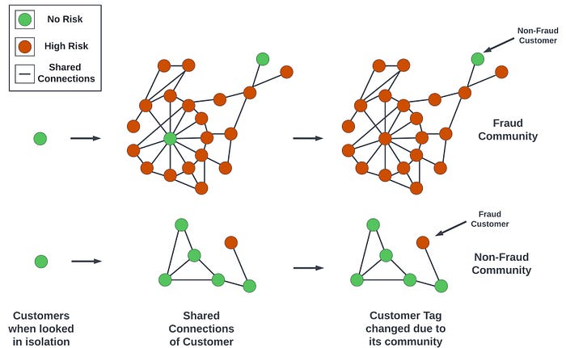
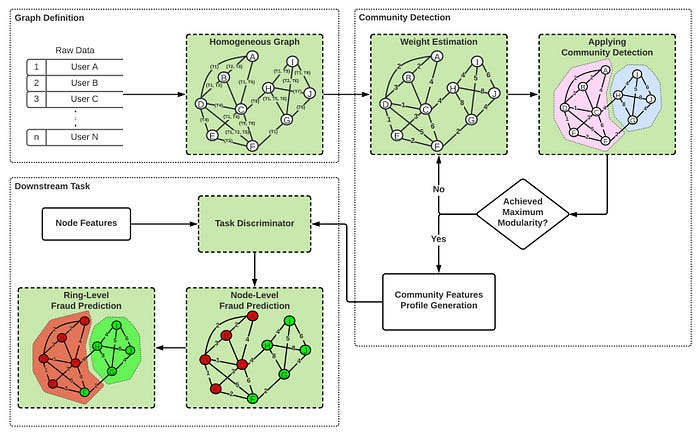
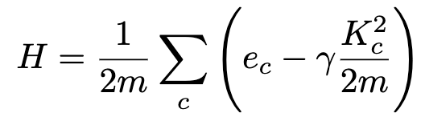
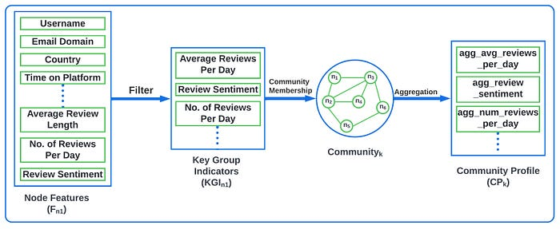
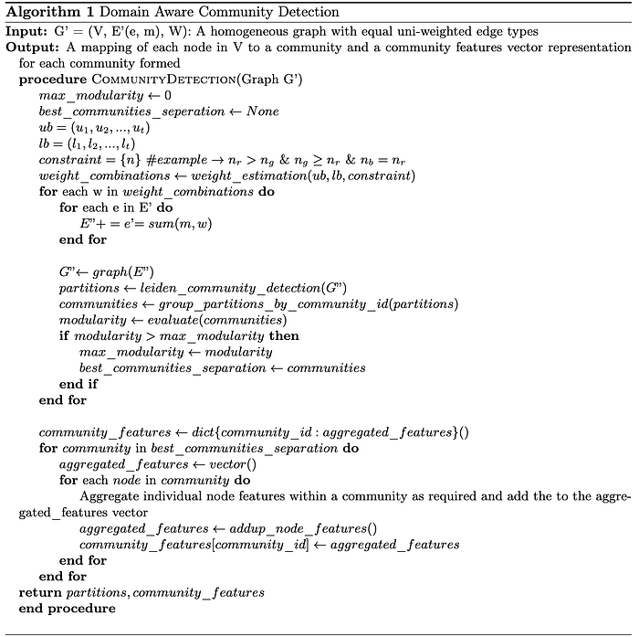
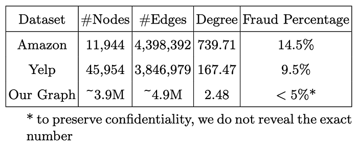
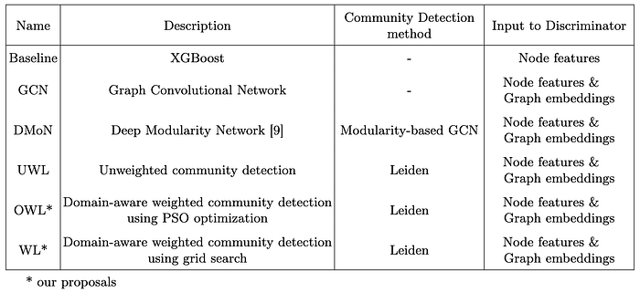
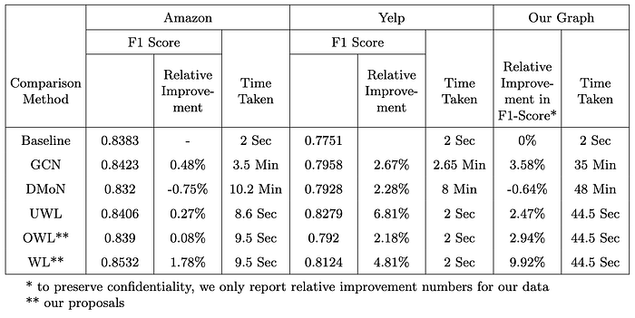

# Identifying Fraud Rings Using Domain Aware Weighted Community Detection

Co-authored with [Meghana Negi](https://www.linkedin.com/in/meghana-negi/), [Jose Mathew](https://www.linkedin.com/in/jose-mathew-550aa525/), [Jairaj Sathyanarayana](https://linkedin.com/in/jairajs)

## 1. Introduction

Similar to any e-commerce marketplace, every day, new loopholes are being exploited by fraudsters in hyper-local, online food delivery platforms. Fraudsters exploit business policies and services around food-issue claims, payments, coupons, etc., which have a material impact on the platforms’ bottom line. Most often, these fraudsters operate in collusive groups. In many cases, when looked at in isolation, it is easy to mistake the behaviour of these fraudsters as not that dissimilar to normal, non-fraudulent patterns; it is only when looked at as a group that fraudulent patterns become apparent. **Such fraud groups can cause more damage than individual fraudsters due to the collective knowledge they employ and can typically cover more surface area than an individual actor**. As a result, identifying fraud rings is a crucial piece in a platform’s overall risk mitigation plan.

For identifying frauds, graph-based approaches have been widely studied. Entities (like customers, sellers) in a marketplace and connections (like payment instruments, reviews) between them can be variously represented by homogeneous-, heterogeneous-, relational-, multi-, weighted graphs, and more. While weighted and multi-view graphs solve for multiple edge types and weights, to the best of our knowledge, providing domain information to identify optimal weights has not been explored. Domain information is usually available in the form of, say, payment-instrument linkages being ‘stronger’ indicators of connectedness vs linkages based on shared wi-fi addresses. Such fraud groups can cause more damage than individual fraudsters due to the collective knowledge they employ and can typically cover more surface area than an individual actor. As a result, identifying fraud rings is a crucial piece in a platform’s overall risk mitigation plan.

GNNs play an important role in building graph-based machine learning (ML) approaches because of their ability to learn from graph structure. Graph Convolution Networks (GCN) have been applied in domains like opinion fraud, insurance fraud, etc. For applications where graphs scale to millions of nodes with frequent updates and additions, scalability and run-time have been bottlenecks for GNN based approaches. On the other hand, community detection methods, which attempt to capture group structure by partitioning the graphs into communities, are typically more scalable. In GNN methods, the number of communities to be formed has to be provided beforehand as a hyper-parameter, and this limits the attainability of optimal separation of communities.

Most fraud detection literature typically targets a single fraud detection task, like fake reviews or spam detection. However, in most real-world marketplaces, new fraud modus operandi (M.O) emerge all the time, and it is typically impractical, or even infeasible, to build M.O-specific detection models. It is our observation that a large swath of fraud is perpetrated by rings operating in collusion, constantly cooking up new M.Os. There is not much literature on methods or frameworks that can be extended across multiple M.Os being committed by similar sets of fraudsters (i.e., rings).

We propose a novel generalisable framework to detect fraud rings using community detection on a graph whose edge weights are learned in a domain-aware manner. Our contributions are:

- We explicitly provide domain knowledge to community detection where optimal weights are algorithmically determined using weight bounds and edge priorities for fraud identification. This explicit feeding of information cannot be done in GNNs, as we expect them to learn this automatically, adding uncertainty.
- Our framework is modular containing graph construction, community detection, downstream discriminator. We first convert a multi-edge graph into a weighted homogeneous graph which is then used by Leiden-based community detection. Community information is then used by downstream tasks to perform fraud ring detection. The node-to-community mapping can be used to develop rules and models for multiple M.Os using simple community feature aggregations.
- We perform extensive experiments on two public benchmark datasets (Yelp and Amazon Reviews) and an internal dataset demonstrating the effectiveness of the proposed framework, both in terms of run-time and F1-score performance. Our framework shows a 1.7% relative improvement in F1-score on Amazon, 4.8% on Yelp, and 9.92% on internal datasets.

## 2. Fraud Detection Problem

### 2.1 Identifying Fraud Rings

A graphical representation of the user base of an e-commerce platform can have customers sharing stationary and non-stationary attributes. These customers can be grouped into communities, combined behaviour of which can be used to identify fraud rings. Figure 1 illustrates how an entity’s fraud status changes when looked at from the lens of its connections. Using only an entity’s attributes might classify the entity as not-fraud. However, if the entity is connected to a number of high-risk entities, then the whole community and the entity at hand could be classified as fraudulent. It should be noted that it is not possible to constrain rings identified to be composed solely of fraudulent actors. It is typically a business decision to either add some post-processing to reduce such false positives or choose to live with it.

*Figure 1: An illustration of fraud rings identification problem.*

### 2.2 Incorporating Domain Knowledge

In e-commerce marketplaces, it is pretty likely that the customers can be connected to other customers. One can create connections based on unique identifiers or behavioural aspects. The importance of such connections varies based on the problem one is trying to solve. For example, behavioural relations can boost the quality of recommendations, and identifiers can help identify swindling tendencies. Further, in rings identification, not all rings are equal. For example, in a graph-based recommendation system, a ring of entities connected by common purchased items is a ‘stronger’ signal compared to rings of clicked or liked items. It is crucial to encode this additional domain-specific knowledge in the graph.

Adding weights and domain knowledge to the graph helps enforce graph substructure by focusing on relationships that identify frauds with higher confidence and distilling the accidental or less relevant connections. The basic assumption is that “Not all the available information is useful or is of equal importance”. Without weights, all the edges will have equal importance, which might increase false positives. Weights benefit the graph algorithms by providing domain knowledge information required to learn better representation from the neighbourhood. These weights are learned automatically in GCNs but are taken as inputs in community detection. Explicitly setting weights to the edge relations provides us control over the amount of information to be used from the neighbourhood.

### 2.3 Other Challenges in Fraud Detection

- **Concept Drift: **Fraudsters are constantly inventing new M.Os leading to the breaking of models trained on older data distributions. This phenomenon is known as concept drift. We tackle concept drift in two ways. Firstly, several M.O-agnostic features are employed which do not change with time, i.e., stationary attributes. Secondly, by abstracting community detection from fraud identification discriminator.
- **Scalability:** With millions of customers, it is challenging to represent them in a single graph or as multiple subgraphs. Further, it is computationally costly and time-consuming to train graphical ML models on large graphs. We rely on Leiden methods’ fast local move approach to detect quality communities in much less time.

## 3. Proposed Framework

The proposed framework has three modules: Graph Construction (GC), Community Detection (CD), and Downstream Task (DT). The GC module molds the raw data into a graph representation. We then propose a way to convert a multigraph into a homogeneous one. The CD module processes this graph and segregates the nodes into possible rings based on their connectivity. This module also takes in the domain knowledge in the form of edge-weights optimised over the modularity metric. Finally, the DT module predicts communities as fraud rings and nodes as fraudulent customers. An illustration of the proposed framework is presented in Figure 2.

*Figure 2: Proposed community-based fraud detection framework.*

### 3.1 Graph Construction

### 3.1.1 Graph Definition

We construct a graph where customers are the nodes, and stationary attributes are the edges between them. All edge types in our graph are undirected. Each edge type has a weight that signifies the importance of that attribute in identifying fraud. Since we intend to use off-the-shelf community detection algorithms which require input graphs to be homogeneous, we make a simplifying assumption of treating our edge types as homogeneous (our nodes are already homogeneous).

### 3.1.2 Graph Representation

A multigraph is defined as G(V, E(e, t), W(t, w)),

where

> V is a set of vertices representing customers with ∥V∥ = n,E is the set of edges with ∥E∥ = m, each edge e having a relation type attribute t ∈ T’ = {1, 2, . . . , T} where T’ is the set of possible edge relation types, andW = (w1, w2 …, wT ) is a weight vector that maps each edge relation type t to a weight wt. By default, all edge relation types have unit weight.

The multigraph (G) is converted into a homogeneous graph (G’), by merging multiple edges between the same two nodes as one edge and summing the edge weights. G’ is defined as G’(V, E’(e, m), W ’),

where

> V is the same set of vertices representing users with ∥V∥ = n,E’ is the set of edges with ∥E’∥ = m’, each edge e having a merge set type attribute u ∈ P(T’), power set of T’, andW’ = (w’1, . . . , w’2n) is a new weight vector, where w’u is the sum of weights of all edge types in the merge set u.

We experimented with summation, averaging, and multiplication as weight aggregation techniques, out of which, summation worked best (as indicated by goodness-of-fit in downstream tasks) in our experiments. Figure 3 illustrates the conversion from a multigraph to a homogeneous graph.

*Figure 3: Left: A sample multigraph representation. Edge colours and numbers represent different edge types and their edge weights respectively. Right: The homogeneous graph derived where edge attributes store the merged information such as edge types involved and their weights aggregation. A simple summation of edge weights for aggregation is illustrated here.*

### 3.2 Community Detection

### 3.2.1 Weighted Community Detection

In a graph, a community is defined as a set of nodes that can be grouped together such that each set of nodes is densely connected internally, and loosely connected with the rest of the nodes. Several graph algorithms exist for community detection, which evolved over time from Newman, Louvain to Leiden algorithm. Our framework adopts the Leiden algorithm (LDN), which builds on the Louvain algorithm. LDN employs a three-step process for segregating communities:

- local moving of nodes
- refinement of the partition, and
- aggregation of the network based on the refined partition, using the non-refined partition to create an initial partition for the aggregate network.

LDN supports two objective functions known as Modularity and the Constant Potts Model (CPM). Modularity is a measure of how well a graph is partitioned into communities. It tries to maximise the difference between the actual number of edges in a community and the expected number of such edges and is defined as follows:

Here, e_c denotes the actual number of edges in community c. K_c²/2m denotes the expected number of edges, where K_c is the sum of the degrees of the nodes in community c and m is the total number of edges in the network. **𝛾** is the resolution parameter that ranges in [0, 1]. Higher resolution leads to more communities, while lower resolution leads to fewer communities.

Our framework’s novelty is the inclusion of domain knowledge in community detection. The various edge types between the customers can differ in the information they convey with respect to a task. This is incorporated as edge attributes using prior domain knowledge, which are processed and an importance score is generated and set as edge weight. Weighted community detection can then exploit this domain knowledge to better segregate a graph, compared to an unweighted or domain-agnostic method. The proposed way picks inspiration from constrained optimisation. We first define upper and lower bounds on importance score for each edge type. Then, we use a relative priority of edge types as constraints. The bounds can overlap among edge types, but estimated weight combinations should follow priority constraints.

### 3.2.2 Community Profile

Each node is represented by a set of features (F) derived from the node’s domain behaviour. Key group indicators (KGI) are a subset of F that can be directly influenced by a group context. Community profile (CP) is defined by the combined representation of the member node. A CP vector is an aggregate of KGI feature values corresponding to each node in the community. Figure 4 explains CP in a fraud reviews detection problem.

*Figure 4: Community Profile Generation*

### 3.2.3 Proposed Algorithm

The CD module comprises of the below step by step process:

1. Define weight bounds and edge type priorities for the input homogeneous graph
2. Iteratively select combinations of weights using optimisation methods like grid search.
3. Apply weighted community detection with weights from step 2 and modularity as the optimisation metric
4. Output the community separation with maximum modularity as the best separation
5. For each community in the best separation, aggregate node features to create a community profile

Figure 5 illustrates the algorithm of community detection module.

*Figure 5: Algorithm of community detection module in the proposed framework.*

### 3.3 Downstream Task

The DT module consists of a discriminator which takes node features and community profiles as inputs. In GCN-based methods, the task information is provided during the optimisation process, and hence, the learned node-embeddings are tuned to the respective M.Os/tasks. In the proposed framework, the communities identified in the previous step(s) can be used across M.Os. Community ‘profile’ consists of aggregated features across all possible identified frauds. Since the communities’ profile vector already encapsulates the incidence of various fraudulent actions, it can help in creating a variety of lightweight discriminators with little to no future feature engineering.

## 4. Experiments

We conducted experiments to study the effectiveness of our framework on real-world fraud detection problems, namely, opinion fraud and financial fraud. We also compare and contrast the framework in unweighted and weighted variants, using grid-search and PSO (particle swarm optimisation) methods for weights estimation, in addition to GCN-based and Leiden community detection. We use the end-to-end run-time of the framework and the F1-score of the downstream task as the comparison metrics.

### 4.1 Experimental Setup

### 4.1.1 Datasets

For opinion fraud detection, two open datasets are considered: restaurant-review spam data from Yelp and product-review fraud data from Amazon. Both have labels for each review/user being either fraud (spam) or benign (genuine). Both of these datasets can be represented as multi graphs, with one node type and multiple edge types.

Yelp dataset has reviews as nodes and 32 handcrafted node features with the following three relations:

> R-U-R: links different reviews posted by the same userR-S-R: links different reviews under the same product with the same star ratingR-T-R: links different reviews under the same product posted in the same month

Amazon dataset has users as nodes and 25 handcrafted node features with the following three relations:

> U-P-U: links different users reviewing at least one same productU-S-U: links different users having at least one same star rating within one weekU-V-U: links different users with top 5% mutual review text TF-IDF similarities

For benchmarking on our internal dataset, we tackle a M.O related to cash transactions where the graph is built on two months’ worth of cash-transacting customers. Our graph has customers as nodes and 60 node features with our relations (for confidentiality reasons, we cannot reveal the exact relationship types).

As mentioned previously, all datasets are converted to homogeneous graphs. Table 1 shows the statistics.

*Table 1: Graph Statistics of Reviews Datasets for Opinion Fraud Detection.*

### 4.2 Methods Compared

We compare our proposed methods (domain-aware, weighted community-detection based) against GCN methods as shown in Table 2. The baseline is an XGBoost classifier which also serves as the discriminator for all non-baseline methods.

*Table 2: Methods used for ablation*

### 4.3 Experimental Settings

For GCN variants, we implemented Deep Graph Infomax to learn node representations. A GCN with 2-layer and 128-dimension embeddings was used for comparison methods across all three datasets. For GCN-based community detection using DMoN, a 2-layer network each of 32 dimensions was trained for all datasets. Both GCN & DMoN were trained for 100 epochs with Adam optimiser with a learning rate of 0.001 and a dropout of 0.5. The choice of architectures for GCN and DMoN was primarily driven by the computing resources required. In the case of the XGBoost discriminator, hyper-parameter settings were kept the same for all the comparison methods but were specific to the dataset. To achieve a fair comparison, the classification threshold of the XGBoost discriminator was adjusted so that the fraud coverage (percentage of samples tagged as fraud by a model) was the same for all variants and equal to the dataset’s fraud percentage. This is called the threshold-moving strategy in the literature.

### 4.4 Implementation

Graphs were constructed and maintained using [networkx](https://networkx.org/documentation/stable/index.html) and [igraph](https://igraph.org/python/) libraries in Python. For PSO, the global optimisation variant was adopted from [pyswarms](https://pyswarms.readthedocs.io/en/latest/) library. We used the Leiden implementation from igraph with default parameters. For GCN and XGBoost implementations, [Stellargraph](https://stellargraph.readthedocs.io/en/stable/) and [XGBoost](https://xgboost.readthedocs.io/en/stable/index.html) packages were used respectively. All models were trained on an AWS m4.4xlarge CPU instance.

### 4.5 Experimental Results

Table 3 shows the F1 scores and time taken on the CPU of each dataset. As previously mentioned, the baseline method uses only node features, while the other methods use both node and neighbourhood information. On the Amazon dataset, only our WL method shows a pragmatically meaningful improvement (1.78%). On the Yelp dataset, all methods handily beat the baseline, demonstrating the usefulness of neighbourhood information. Our WL method trails UWL on the Yelp dataset. We hypothesise that this is primarily due to our limited knowledge of Yelp’s domain which has, in turn, had a direct bearing on and affects weight optimisation and the quality of communities formed.

*Table 3: Performance comparison on different datasets*

On our dataset, DMoN under-performs the baseline signifying that, in larger graphs, limiting the number of communities can negatively affect downstream performance. Both OWL (+2.94%) and WL (+9.92%) outperform UWL (+2.47%), indicating the importance of domain-aware weights. Between OWL and WL, we hypothesise that PSO was not able to optimise better by using only modularity as the objective function and hence could not outperform the grid-search-based WL.

On the computation time front, while for smaller graphs like Amazon and Yelp, the difference is in seconds, for larger graphs like ours with ~3M nodes, LDN concludes in less than a minute, while GCN methods take at least half an hour. We only used two months of data for these experiments; expanding this horizon will have a direct bearing on graph size. Hence, we hypothesise that for even larger graphs, training GCN will take much longer.

We also investigated the temporal stability of the communities formed. We constructed graphs over a moving time window of two months at a weekly level. We then compared the movements of customers’ assignments from one community to another in every iteration and found a 3–5% movement which is an acceptable threshold for us. As previously claimed, we were also able to create a rule-based classifier for an unseen-before M.O using the results from the community module within a few days (as opposed to weeks/months if we had to build models from scratch for this M.O). We were also able to change the threshold of these rules based on changing fraud behaviour with no change in the underlying graph or community modules. This framework is currently deployed in production, inferencing millions of transactions per day, with the graph and community modules being updated weekly.

## 5. Conclusion & Future Steps

In this paper, we proposed a novel end-to-end fraud detection framework to identify fraud rings. To the best of our knowledge, this is the first attempt at a scalable graph-based system utilising domain knowledge as weighted edge priorities in Leiden community detection. Experiments were conducted on large-scale open and internal fraud datasets demonstrating the effectiveness of the proposed framework using F1 score and CPU run-times.

As an extension, we plan to experiment with different objective functions and strategies that can potentially outperform grid searching. On the community detection front, we want to explore how we can extend this work to handle overlapping communities. Our current implementation uses stationary attributes for edges. Given the dynamic nature of fraud, it is important to explore ways to incorporate non-stationary attributes, which can potentially help make detections resistant to changing fraud patterns. In this work, we also made the simplifying assumption of converting heterogeneous graphs into homogeneous ones. We would like to explore if there are additional benefits to be derived by researching ways to directly use heterogeneous graphs instead.

---
**Tags:** Fraud Detection · Community Detection · Louvain · Graph Neural Networks · Swiggy Data Science
