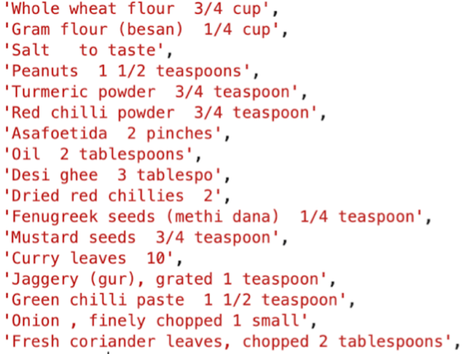
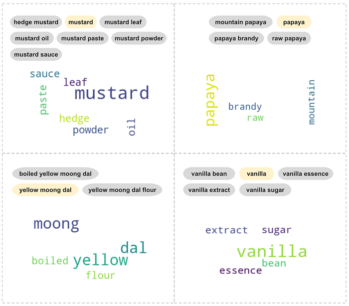
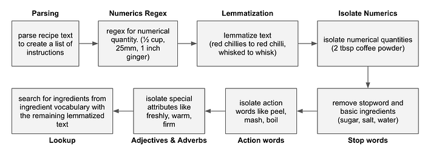
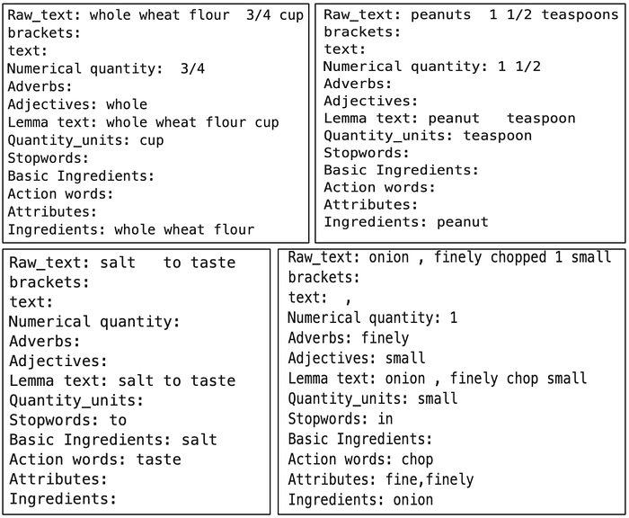
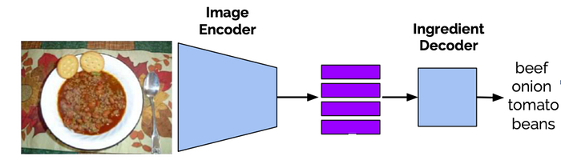
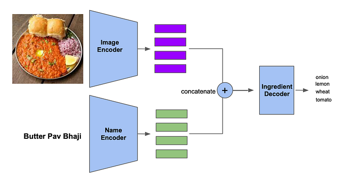
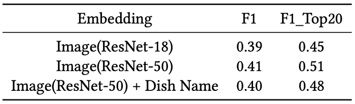
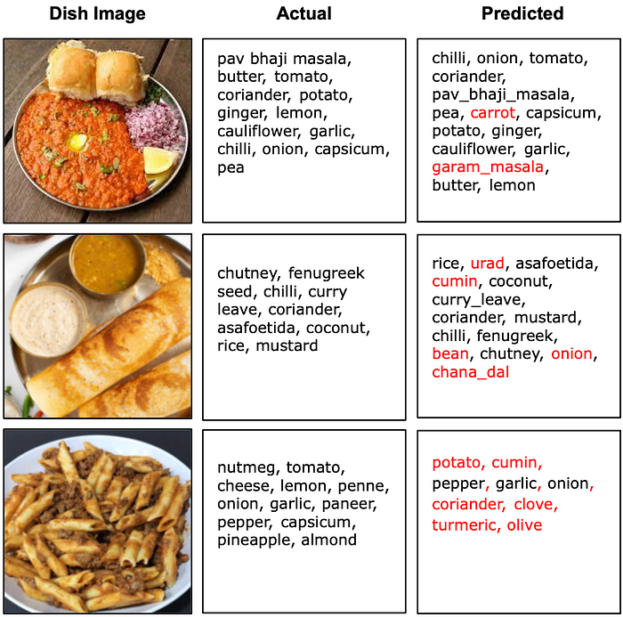

# Image Based Ingredient Prediction for an Indian Food Dataset

## Introduction

In online food delivery, while ordering food, customers rely on information provided which is usually limited to name and a high-level description of the dish, an image and if the dish is vegetarian. To further improve the food ordering experience, more information on a dish can help a customer in decision making like what all ingredients are involved in the dish or how the food is prepared. Curating this additional information typically requires non-trivial manual effort. Multiple deep learning based work has been performed on food images which we discuss in detail in the related work section. We observed that there are existing models which provide ingredient information given a dish image but the challenge is in the data distribution. [This paper](https://ieeexplore.ieee.org/document/7544519) explains the differences in ingredients across regions and countries, which implies difficulties in using pre-trained models on a different set of cuisines. Hence there is a need for curating the data based on observed dishes specific to a country the business is operating in. Existing work can help with the overall approach but we have to curate our own datasets with images and ingredients and given the nature recipe datasets avail- able from a variety of sources, the extraction of ingredients from the recipe itself is a challenge. In this blog we try to address this problem specific to Indian cuisine and the contribution of the blog can be summarized as:  
 − An ingredient harvesting framework to extract the ingredients information from recipe text data.  
− Achieving a 0.41 F1 score for ingredient prediction on our dataset which is ∼5× smaller compared to dataset used in the [inverse cooking paper](https://arxiv.org/abs/1812.06164).

## Dataset

Given the relevance and importance of ingredients, it is surprising that not many datasets of Indian dishes with images and ingredients are publicly available. To the best of our knowledge, the [IIITD CulinaryDB dataset](https://ieeexplore.ieee.org/document/8402036) is the only dataset with a mapping of ingredients to dishes, but it lacks images. There are other larger datasets like [Recipe1M+](http://pic2recipe.csail.mit.edu/) and [Food101](https://link.springer.com/chapter/10.1007/978-3-319-10599-4_29) but they do not index high on Indian dishes. Hence we prepare an Indian food focused dataset with images. Our dataset contains, for every dish its image, recipe, and ingredients used to prepare it. Next, we will discuss the techniques and the challenges we solved during data collection and preparation.

## Data Collection and Cleaning

In addition to directly using the IIITD CulinaryDB, we also scraped textual data from websites focused on Indian cooking. We pass this  
through a custom-built pipeline that extracts key attributes from the raw data.  
Since the data was collected from several disparate sources, a considerable amount of processing is needed. These include (and not limited to) handling special characters, irrelevant phrases, numbers, casing, etc. For example. “_Chicken Bar-Be-Que”_converted to “_chicken barbeque”_, “_Palak Namakpara — Diwali Special”_ converted to “_palak namakpara_”. The ruleset to handle these and other cases was developed through trial and error and iteration. Data duplication was another issue we had to handle. In our case, only the exact duplicates were removed where both the dish name and the set of ingredients were the same. However, since the same dish can have different styles of preparation involving different sets of ingredients, we chose to keep the instances where the dish names were the same but the list of ingredients was different.  
To harvest images for dishes, we again used the web and search engines. We created a multi-threaded Selenium-based bot that used dish names to fetch relevant images. Using this method, we collected images for 62K dishes.

## Ingredient Harvesting

Since our collected data had sets of ingredient text for each dish as shown in Figure 1, we needed to extract the exact ingredient list from this which would serve as the ground-truth.

*Figure 1: An example of raw ingredient text for a dish*

The next step was to build a high-quality vocabulary of ingredients which essentially serves as the classes to be predicted in our multi-label classifier. To build this vocabulary, we resorted to ingredients listed in the IIITD CulinaryDB dataset as well as scraping ingredients-focused websites. Since the data came from different sources, we applied a variety of text processing to clean it. Even after extensive post processing, we saw that we still had too many distinct ingredients. However, we observed that this was due to several ‘overlapping’ ingredients, for example, bread buns, brown bread, brown bread buns. We made a design as well as a pragmatic choice to keep only the ’base’ ingredients. We used K-means clustering to achieve this. Before clustering, we lemmatized the ingredients to bring uniformity among the tokens, for example, Leaf, leaves -> leaf.  
We clustered on vector representations of ingredients coming from a TF-IDF vectorizer with uni-, bi-, and tri-grams. The TF-IDF vectorizer creates vector representations on text documents based on how relevant a word is to a document in a collection of documents. We iterated on the clustering step ending with 325 clusters. To create labels for each cluster, we analyzed the n-grams of each ingredient in the cluster and chose the n-gram closest to the cluster centroid as the label for that cluster. Results from clustering along with the labels assigned can be seen in Figure 2.

*Figure 2: Some ingredient clusters formed using K-means. The closest n-gram of all the ingredients in a cluster is chosen as cluster label, highlighted in Yellow*

*Figure 3: Ingredient extraction flow*

Once the ingredient vocabulary (and hence the classes for our classifier) was developed, we built the training data by extracting ingredients from the text for each dish in our corpus, as shown in Figure 3.

Extensive and iterative text processing culminated with lemmatizing all the tokens, extracting a quantity of measure (for example, tablespoon, cup, etc.). We also note that our stop-words included basic ingredients like salt, sugar, etc. Finally, we extracted the ingredients from the remaining text using the ingredient vocabulary built earlier. Figure 4 shows the final output after ingredient harvesting.

*Figure 4: Working of Ingredient Harvesting explained on a few examples*

## Inverse Cooking Model

*Figure 5.a: First part of the inverse cooking model. ResNet-50 is the image encoder and a transformer for ingredient-decoder*

In this section, we briefly explain the recipe generation model which takes a dish image as input and outputs the recipe instructions. This model is divided into two major parts, the first predicting the ingredients from the image embeddings as shown in Figure 5.a, and the second predicting recipe from combined image embedding and ingredients embedding. The idea behind breaking the problem into two parts is that the recipe generation from the image can benefit from the intermediate step predicting the ingredients and then combined information of the image and the ingredients will aid in predicting the recipe. Firstly the image embeddings are extracted using a ResNet-50 encoder. This is fed to the ingredient decoder which is a transformer based model that predicts the ingredients as a sequence. The transformer treats ingredients as a list and predicts in the same fashion until the end-of-sequence, eos token is encountered. Given such a design, the model penalizes for the order of ingredients, but since the final goal is to just get a set of ingredients, the outputs at different time steps are aggregated using the max-pool operation. Also, to ensure that the ingredients are predicted only once without repetition, for all the previously selected ingredients the pre-activation is pushed to be −∞. The model is trained by minimizing the binary cross-entropy between the pooled output and the ground truth.  
The second part of the model is to generate the recipe by using predicted ingredients as well as the input image. The predicted ingredients are encoded to generate ingredient embeddings which are further fed to transformer blocks. Three different strategies, namely concatenate, independent and sequential were experimented with to fuse image and ingredients embeddings. From the experiment, concatenation of embeddings performed the best mainly because of the flexibility to give importance to one modality over the other.  
We borrow the first part of this model for our use-case. In the next sections, we will discuss our training strategy as well as the performance of the model on our dataset.

## Experiments & Evaluation

All experiments were performed on the 62K dataset described above. We split this into 54027 training, 6759 validation, and 6740 test samples. As noted earlier, the final ingredient vocabulary (after clustering) has 325 unique ingredients.

> We used the publicly available PyTorch implementation of the inverse cooking model and trained it with our dataset on a 4-core Linux machine with 61GB memory and Nvidia Tesla K80 GPU. We trained the models using Adam optimizer while monitoring validation loss.

Along with training the inverse cooking model on our dataset, we experimented with including the dish name based embeddings. These 128-dimension embeddings were learned separately using a skip-gram Word2Vec model on dishes ordered on our platform. These embeddings were then concatenated with the 512-dimension image embeddings and passed through 1D convolution to reduce the dimension from 640 to 512 and then fed to the ingredient decoder as shown in Figure 5.b.

*Figure5.b:Here we introduce dish name embedding which are concatenated with image embeddings from the image encoder before passing to ingredient decoder*

We evaluated the models in terms of F1-score, computed for accumulated counts of True Positives (TP), False Negatives (FN), and False Positives (FP) over the test dataset of 6740 samples. Table 1 shows the F1 score of various variants. We experimented with ResNet-18 and ResNet-50 as the image encoder in which the ResNet- 50 variant performed slightly better. The model with the dish name embeddings included did not improve upon the ResNet-50 variant’s performance.

> We note that we were able to achieve an F1-score of 0.41 with ∼5× smaller dataset compared to the data used in the inverse cooking model where the authors achieve an F1-score of 0.49.

*Table 1: Performance of different models on our dataset in terms of F1 score calculated considering all ingredients as well as F1_Top20 which is weighted F1 score for top 20 ingredients based on frequency.*

Also, we observe that, out of the 325 ingredients in our vocabulary, many have a low frequency and hence the model does not seem to be able to learn for these ingredients. We observed that the model performs fairly well for ingredients with higher frequency as shown in Table 1. Finally, Figure 6 presents a few qualitative results from the model with ResNet-50 based image encoder.

*Figure 6: Sample ingredient prediction. Ingredients are highlighted in red if they are not present in the actual list of ingredients.*

---
**Tags:** Swiggy Data Science · Machine Learning · Deep Learning · Indian Food · Foodtech
