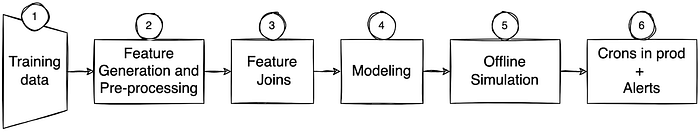
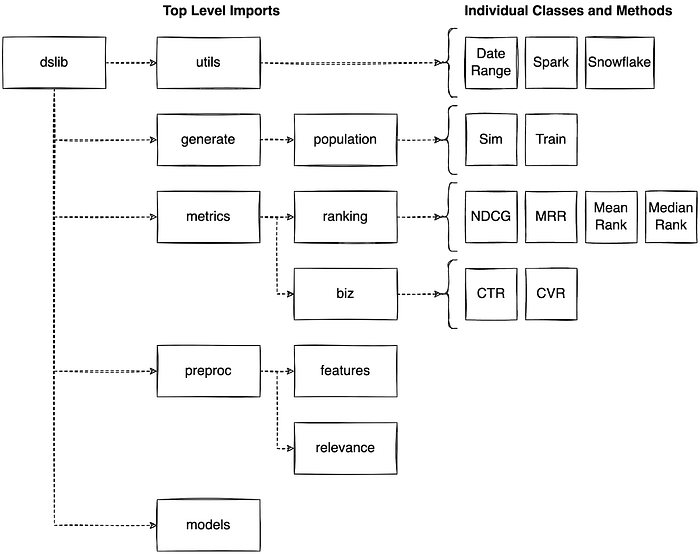
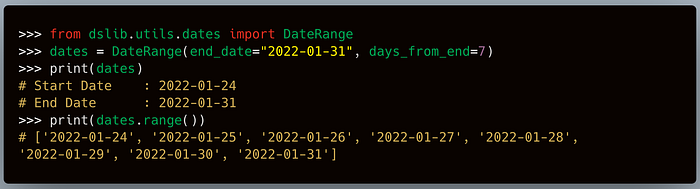
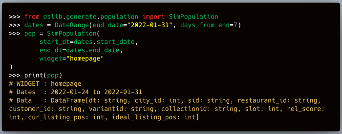
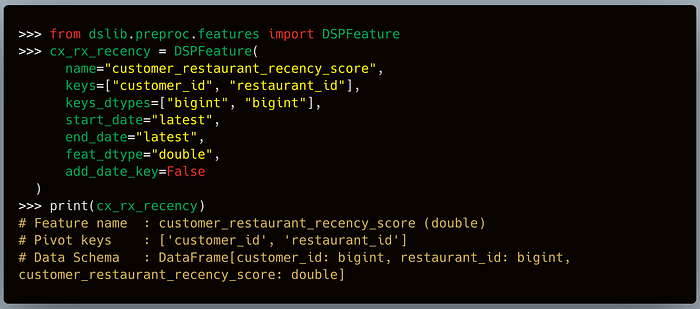
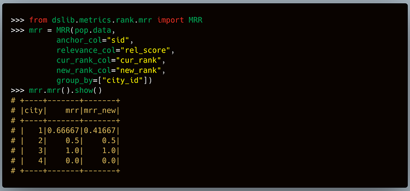
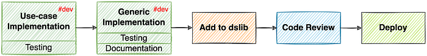
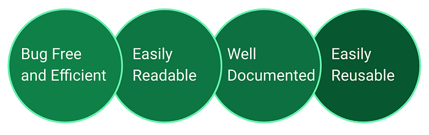
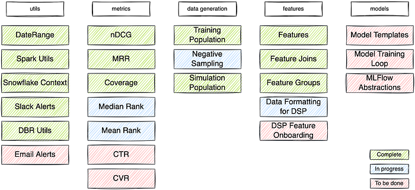

# Improving data science productivity with dslib

Doing machine learning is [hard](https://ai.stanford.edu/~zayd/why-is-machine-learning-hard.html). There are multiple dimensions where ML can fail — data, modeling, and implementation. We only achieve success if we are correct in every dimension. With deployment and monitoring, complexities increase further. With increased complexity, debugging becomes hard. So, it’s imperative to prune this “debugging space”.

Today, we use notebooks for most of our exploratory or prototyping work. We deploy production-ready re-training/inference notebooks after we are ready with our prototype models. A typical Data Science notebook involves multiple steps — data fetch, data processing, data cleaning, feature engineering, model training, model evaluation, inferencing, pushing data to production databases, and alerting. We observed that many Data Scientists clone the old notebooks and repurpose them for their use cases. Many such cloned notebooks are legacy, only touched during minor bug fixes.

There are multiple inefficiencies in this workflow:

- All the new notebooks repurposing older code require more effort and time in rewriting. You need to understand the older code to rewrite it for your project. They also require more maintenance. You have to maintain every new job derived from the previous notebook.
- Inefficient code propagates easily with such code. For instance, if part of the Spark code is doing a lot of unnecessary shuffles, we need to optimize and update it in all the derived notebooks.
- Newer inefficiencies can creep in with legacy code. Most libraries release frequent updates with optimized code and newer functionalities. Without modular and reusable code, it is hard to upgrade legacy code scattered across notebooks.
- Just like inefficiencies, bugs also propagate with legacy code. If there is a filter missing in the training/inferencing data generation in the legacy notebook, then one will have to update it in all the derived notebooks.
- New members of the team could be reluctant to touch legacy code. The possibility of hitting myriad landmines could further drive them away from reusing it.
- Repurposing the cloned code also leads to multiple implementations of the same concept. For instance, if you implemented a new loss function, it could apply to other models as well. Enough copies later, we could end up with multiple variants of the same loss function. It is hard to trace these variants and reuse the tweaks.

As you would have noticed, cloning the legacy code in itself is not a major problem. The core issue is non-modular code scattered across legacy and newer notebooks. Abstracting such reusable code segments via a library helps in several ways:

First, it ensures that the code remains correct. All the bug fixes once tested, reviewed and merged with the main branch, will be automatically available with version upgrades.

Second, it standardizes the code and pipeline. For example, the MRR measure calculated in two separate flows will remain comparable. Similarly, the simulation environment created for a use case can be easily reproduced for future experiments.

The “non-ML code” adds to the maintenance costs and increases the points of failure. These abstractions will also reduce this boilerplate code from our notebooks.

Contributions from multiple DS teams like — Ranking, Ads, Fraud, Maps, Delivery, Forecasting — will create a feature-rich repository.

Lastly, collaboratively working on this library, following industry practices, would also bring [humility](https://humbletoolsmith.com/2020/08/10/the-importance-of-humility-in-software-development/) to our process.

## The New Library — dslib

Data Scientists use a variety of libraries like Scikit, Pandas, Tensorflow, Pytorch, Scipy, and more use-case specific libraries. The dslib is not built to replace these mature libraries. It is built on top of them to make us more productive.

## Motivation from the Industry

Almost every data-driven company has built or is on the path of building abstractions around its processes. These abstractions enable Data Scientists and MLEs to spend more time on the problem statement instead of writing boilerplate code. Following are a few examples of how teams started small and with time, created big enough tools to be shared with the community.

1. [Luigi](https://github.com/spotify/luigi): Spotify’s library to manage workflows for batch jobs. It provides abstractions to define our data pipeline. Not built to replace Hive, Pig etc.
2. [Metaflow](https://metaflow.org/): Netflix Metaflow provides Python APIs to the entire stack of technologies in a data science workflow, from access to the data through computing resources, versioning, model training, scheduling, and model deployment.
3. [Pyro](https://github.com/pyro-ppl/pyro): Uber’s framework lets experimenters automate OED on a giant class of models that can be expressed as Pyro programs. [[blog](https://eng.uber.com/oed-pyro-release/)]
4. Michelangelo: Uber’s Michelangelo is designed to cover the end-to-end ML workflow: manage data, train, evaluate, and deploy models, make predictions, and monitor predictions. The system also supports traditional ML models, time series forecasting, and deep learning. [[blog](https://eng.uber.com/michelangelo-machine-learning-platform/)]
5. PyML: Uber’s platform that enables rapid Python ML model development. [[blog](https://eng.uber.com/michelangelo-pyml/)]
6. [Feast](https://github.com/feast-dev/feast): Feast is an open-source feature store jointly developed by Gojek and Google Cloud.
7. [Apache Airflow](https://github.com/apache/airflow): A platform created by Airbnb to programmatically author, schedule, and monitor workflows.
8. A host of other frameworks at Airbnb — [blog](https://medium.com/@rchang/a-beginners-guide-to-data-engineering-the-series-finale-2cc92ff14b0).

## Library Design

Most Data Science pipelines roughly include the following parts.

*A typical data science pipeline*

1. Training/Inferencing Data: Query data from multiple sources and save it on disk or S3. If there are offline pipelines, then repeat similar steps for inferencing.
2. Feature Generation and Preprocessing: Knead the generated data in a suitable format. Fetch previously added features from the feature store and perform new feature engineering for the models.
3. Feature Joins: Prepared features can be pivoted on users, restaurants, dates, meal slots, geohashes, or a combination of these. These features should be merged without any errors with the training/inferencing data.
4. Modeling: Decide on the model and prepare the training loop — defining optimizer, weights, loss functions, etc.
5. Offline Simulation: Selecting the model(s) to take for A/B requires an unbiased offline simulation. Set up the simulation environment and calculate the metrics — technical (eg: nDCG, MRR) and business (eg: CTR, CVR).
6. Alerting: Deploy the pipeline and set up the alerts for monitoring. This includes identifying unforeseen bugs or drifts in the pipeline and alerting via slack or email.

## dslib API

Using the above guide, we formalized our submodules as follows:

1. Utils: small utilities that do not lie under any category
2. Generate: data extraction functions
3. Preproc: data preprocessing functions
4. Metrics: relevant evaluation and business metrics
5. Models: abstractions related to the model building stage

*dslib module hierarchy*

## Utils Module

This module contains the utility functions which do not come under other categories. Some of the added utilities are manipulating dates, slack alerting, spark utility functions.

## Demonstration

We often filter on dates in our queries. These date ranges are calculated using Python’s timedelta method. It is then formatted into a string for the query. At many places, we also need to iterate through all the dates in the range.

## Generate Module

This module contains all the methods related to extracting and generating data. In the _population module_, we added classes that query data from Hive for our requirements.

## Demonstration

Use case: For offline simulations, we query the clickstream events between a start date and end date for a specific widget/page. Clickstream table is further joined with 2–3 other tables to add more details.

## Preproc Module

This module contains all the data preprocessing functions. It also covers the feature engineering pipeline and its integration with [DSP](https://bytes.swiggy.com/enabling-data-science-at-scale-at-swiggy-the-dsp-story-208c2d85faf9), our internal data infrastructure platform.

## Demonstration

Use case: To read features from the DSP feature store, we query the feature table. Query parses the key column to get the feature pivots. It also casts all the columns in the right data types. Of course, this is done for the past dates in our training/evaluation pipelines and the current date in our inference pipeline.

## Metrics Module

This module contains all the relevant evaluation and business metrics. These metric classes take a dataframe with the needed columns and provide methods to calculate the metric.

## Demonstration

Use case: In the ranking and relevance team, we calculate Mean Reciprocal Rank (MRR) in all our offline evaluation reports. We do it at different levels like cities, customer segments, and overall. We also want the side-by-side comparison of two different models.

## Models Module

All the model related abstractions would come under this module. Those abstractions include model architecture definitions, loss functions, pre-trained embedding layers, and more. We haven’t yet added this module to the prod dslib.

## dslib Development Process

Data Scientists come from diverse backgrounds. They are not all software engineers. As an aid, we came up with the following heuristics to decide on when to abstract a feature.

- Follow classes and functions based development — [OOP in Python](https://realpython.com/python3-object-oriented-programming/).
- If you have repeated a code segment more than once, turn it into a function. For example, generating date ranges using timedelta every time you use dates in your queries.
- If multiple functions logically serve one purpose, put them under a class. For example, different queries to create training data for the homepage relevance models can be a part of a single class.
- If a class or function is usable in other projects, put them in a module and use the module instead.

This generic module created at the end is the right candidate for dslib.

## Development

*dslib dev process*

To add the identified abstraction to dslib, we follow the below steps:

1. Implement it as a part of our project. Test everything end-to-end and maybe even deploy in production. That builds the confidence that the utility works.
2. Make it generic enough to be usable by others and test the pipeline with the modification.
3. Add inline comments and docstrings in the added functions and classes. We follow scikit documentation guidelines. That helps sphinx generate the documentation from the docstrings in the scikit-learn format.
4. Add the interface at the correct hierarchy in dslib. Add all the relevant tests.
5. Commit and push to a new branch in the internal Github repo. Create the pull request and ask MLEs and other Data Scientists to review it.

Once approved, the reviewer merges the PR with the main branch. The CI pipeline builds the Python wheel and automatically deploys it on our internal package store. DataBricks (DBR) clusters automatically install the latest version through init scripts.

## PR Review Process

*dslib codebase strives to follow these four principles.*

When a Pull request is submitted, the reviewers review the code for generic and domain-specific patterns.

General checks are about the structure and formatting of the code. The PR should follow the PEP8 guidelines. All the variables should be named appropriately. Comments should satisfactorily explain the code decisions. All the docstrings in functions and classes should be relevant and correct.

Data Scientists, MLEs, and Analysts perform more specific checks depending on their expertise:

1. Correctness of the Query
2. Correctness and format of the training, simulation, inference datasets
3. Sane model parameters
4. Correctness of hyperparameter tuning
5. Correctness of the model training loop
6. Are unit tests written
7. Coverage of the unit tests
8. No data leakage
9. The spark code doesn’t use any expensive operation

The reviewers will suggest changes to the author. The PR is approved when the reviewers are satisfied with the code quality.

## Progress and Achievements

The following figure shows the various features currently added, in progress or under review.

*Feature support in dslib*

The Relevance team is leading the efforts in developing dslib and in using it. We have observed several advantages with the adoption of dslib.

- The development and deployment of the 13+ features happened in about nine months.
- We replaced many separate implementations of the same thing with a single ground truth implementation. For example, a single version replaced three different versions of nDCG.
- We have improved our offline simulation times: we eliminated ~5 days of implementing or modifying the population query and metrics code to a single day in the relevance team.
- We have improved the time taken by a new DS to start with their projects. We eliminated ~5 days of implementing/using nDCG and other queries.
- We are now quicker at using DSP features in our notebooks. We have essentially replaced five lines (querying + data formatting) for each model feature with a single line. That significantly simplifies the code if there are 100+ features in a notebook.
- We have significantly reduced the complexity of our notebooks. At many places, we replaced 200+ lines with just one function call.
- It led to an internal git fundamentals session for the Data Science team.
- Around 30% of all data scientists are using dslib in their exploratory notebooks.
- Four DS pods that have adopted dslib to some capacity.

## Challenges & Future Steps

We faced many challenges to bring dslib to its current level.

Today, CI/CD pipeline for dslib is not scalable. Python is not a first-class programming language at Swiggy, and thus, our internal CI/CD tooling does not support python codebases. We did not want to wait for the support and instead created a workaround. We could automate the .whl deployment, but we still have to run the tests and build the documentation manually.

Not every data scientist is well versed with git and moving around the codebase in an editor. As cliche as it is, the saying that a data scientist is a better software engineer than a statistician and a better statistician than a software engineer is true. Thus, we also conducted a few git sessions for the team.

There is a lukewarm adoption by the teams right now. We are taking walk-through and brainstorming sessions to raise awareness. Hopefully, it will pick up some steam in the coming months.

To increase the adoption, we also came up with a contribution plan for interns. We are encouraging the current crop of interns to contribute at least one feature to dslib during their internship. For interns, the advantages would be two-fold:

- They will contribute to a library that we use in production projects. They can easily claim that on their resume.
- They will also get hands-on practice on git, a very practical skill used everywhere in tech.

If you are a prospective intern, now you know one place where you will deliver an impact after joining. :)

It will be advantageous for the teams as well:

- dslib will receive regular updates. As more features are added, it’ll be beneficial for us.
- If the interns join us full-time, we will get people who know git which will make our future processes efficient.
- Having contributed to dslib, they will also adopt it in their projects and encourage others in the team to use it. That will lead to more updates to the library as there will always be something to add/improve. New relevant features will lead to more usage. It creates a positive feedback cycle.

Lastly, dslib is currently internal to Swiggy DS. We will also look at open sourcing it as it matures more.

## Conclusion

We identified an opportunity to improve the productivity of Data Scientists at Swiggy and created an internal library called dslib. This library has helped declutter our workflows/ notebooks and made us more efficient. We have deployed multiple features to the library and have many more ideas lined up. Our interns are also going to contribute to dslib from this term onwards.

---
**Tags:** Process Improvement · Productivity · Software Development · Swiggy Data Science · Git
