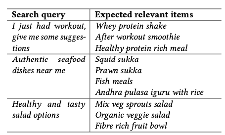
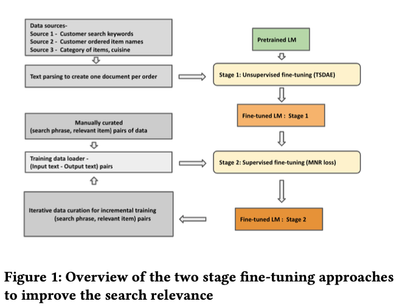
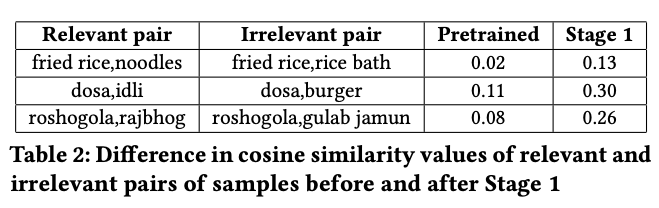
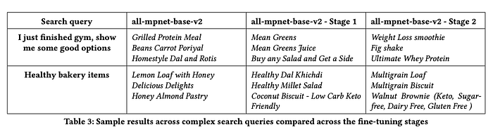
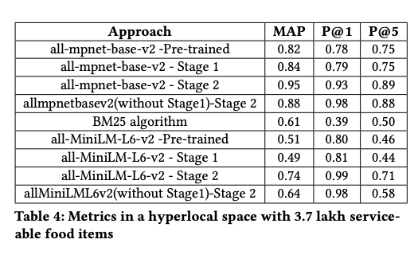
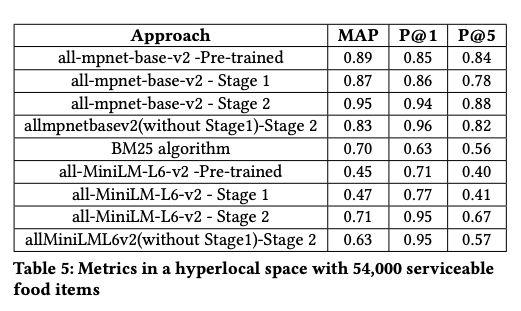

# Improving search relevance in hyperlocal food delivery using (small) language models

Co-authored with[ Jose Mathew](https://www.linkedin.com/in/jose-mathew-550aa525/), [Srinivas N](https://www.linkedin.com/in/srinivas-n-54a6b98/), [Jairaj Sathyanarayana](https://www.linkedin.com/in/jairajs/)

## Introduction

The ability to accurately understand and serve customer search queries is critical to Swiggy. This need is amplified in food delivery platforms operating in India due to the wide variety of languages, cuisines and tastes. Our platform alone offers millions of items from hundreds of thousands of restaurants across India. Not only do Indian dish names have a tremendous amount of regional variety, international cuisine served in India is typically customised to the Indian palate. This variety is reflected in search queries where these can be a combination of words including dish names, dish categories, cuisine, preparation style, occasions, dietary preferences, just to name a few.

*Examples for broad intent queries*

In Indian food delivery space, often the queries are an amalgamation of multiple intents related to dish preference, dietary preference, time slot of the day and the customer’s latent mood of food preference at that point of search session within the hyperlocal space. A hyperlocal space is defined as a particular geographical area (usually 5 kilometer radius) around the customer with serviceable restaurants available for food delivery. Given the diversity of dishes across multiple restaurants in the country, language models play a huge role in understanding the relevancy between search query and the corresponding dish names suitable for the query.

*Examples of complex search queries and expected dish names that are relevant to the corresponding queries.*

These queries are indicative of the customer’s behavior towards exploring a wide variety of relevant choices for specific requirements. Generic search queries directly related to a dish name are solved using the string matching algorithms but in this paper we are mainly focusing on complex queries where a direct string match might not fetch relevant items. We started with an open source language model almpnet-base-v2 seeking a balance of quality and latency requirements for our use case. We propose a two-stage fine-tuning approach. Figure 1 shows the high level overview of the system.

1. Unsupervised Fine-tuning a suitable language model based on historical search queries and ordered dish items. This step is to make the language model aware of the text data related to food delivery search and item names across multiple restaurants of the country .
2. We further fine-tune the model with query,item pairs of data created manually. Here, we relied on our internal food intelligence knowledge taxonomy that categorizes all the food items, we further curated the possible complex queries for each category and relevant food items for each query. We also performed data augmentation using large language models available and verified further for the data quality. This stage helped the language model to establish the relationship between query keywords and relevant item names.
3. After two stage fine-tuning, this model is used to retrieve the top items among all the serviceable items in a particular area for a given query based on embedding similarity. We specifically focus only on the retrieval part of the search recommendation in this paper.

## Methodology

## Unsupervised fine-tuning

In this stage, we collect the historical search queries that eventually got converted into successful orders in our application. Here the search query associated with a particular order, name of the item bought by the customer, metadata of the item from our internal food intelligence knowledge taxonomy that includes category, cui- sine and preparation style are together parsed into a text document. Eg: “Customer searching for ‘healthy juice for summer’ bought the item ‘Sugarcane juice with lemon and ginger’ from the restaurant AB Juice center. This item belongs to ‘beverages’ category and ‘fresh juice making’ preparation style”. Another example is “Customer searching for ‘punjabi curries’ bought the item ‘Paneer lababdar’. This item belongs to ‘curry’ category, ‘Punjabi’ prepa- ration style”. Collection of such documents were then processed to fine-tune the pre-trained language model in an unsupervised manner. **We then used Transformers and Sequential Denoising AutoEncoder (TSDAE) approach for unsupervised fine-tuning.** TSDAE approach introduces noise to input sequences by deleting and swapping the tokens within the sentences. These noise induced sentences are passed into the encoder of transformer architecture. Another decoder then reconstructs the original input from the noisy data created before. **This approach is different and superior to Masked Language Modelling (MLM) mentioned. While MLM approach utilizes the full-length word embeddings for every single token, TSDAE uses the entire sentence vector produced by the encoder in attempting the re-construction of noise induced input sentences.** We chose the TSDAE approach in stage one. This stage serves as domain specific adaptation and was able to differentiate the food items based on the user search history. Table 2 shows some of the qualitative analysis. We selected a few dish items and found a relevant and irrelevant pair according to historical user queries. The absolute difference in cosine similarity for relevant and irrelevant pairs is much higher in stage one compared to pre-trained models. After stage one training, we can observe that ‘Fried rice’ is more similar to ‘Noodles’ compared to ‘Rice bath’. ‘Dosa’ is more similar to ‘Idli’ compared to ‘Burger’. ‘Roshogolla’ is more similar to ‘Rajbhog’ compared to ‘Gulab jamun’.

## Supervised fine-tuning

In the previous stage, fine-tuning mainly happened on existing search queries and the dish items historically ordered from the ap- plication. In this stage we further fine-tune the model by collecting complex search queries and the relevant dish items across the food categories. In the previous stage, historical search data does not contain all types of complexities based on dish descriptors, dietary preferences and regional style of preparation styles. We manually curated a set of queries possible for each dish category and then the relevant items suitable for the query are used to create pairs of training data. This data is passed to fine-tune the previous model obtained from stage one in a supervised manner. As the curated data contains input query and relevant item names, we treated this data as (anchor, positive) samples to pass into the Siamese style of training. However, as there are no strict negative samples that can act as (anchor, negative) samples we stick to Multiple Negatives Ranking Loss (MNR loss). This approach considers the available positive sample as strict positive and randomly chosen samples within the data as soft negatives and optimize the loss function to minimize the approximated mean negative log probability of the data. We also designed an incremental training pipeline where evaluation can be done over a period of time, collect the training samples where the search queries are not performing well, manually curate the relevant items and further pass into training.

## Training and results

The dataset considered for stage one fine-tuning consists of 996,000 historical text documents prepared based on historical orders. These documents were passed into the stage one unsupervised training mentioned above. For stage two fine-tuning, from our existing wide food intelligence database and also leveraging the Large Language models we collected the additional metadata including regional cuisine, main ingredient, preparation style and preferred time slots for the consumption of item. This meta data for every food item helped us in creating the diverse set of possible queries expected from the customers for every dish available in catalogue. We further did manual verification and editing if required for each training sample. In this way we curated more than 300,000 Query-Item relevant pairs which act as anchor-positive pairs to further pass into stage two.

We trained the two stage fine-tuning approach mentioned with multiple baseline semantic search language models available open source in huggingface repository. To start with, we have a latency constraint for real time query embedding generation of up to 100 milliseconds. This can support our existing search infrastructure based on cpu instances and handling the search requests traffic. Thus, we started with the smallest available models having prior bench- mark performance over semantic search and are meeting the latency requirements. We selected two models “all-mpnet-base-v2” , “all-MiniLM-L6-v2” and further fine-tuned them with stage 1 followed by stage 2. We also trained the base models directly with the training data used in stage2 to understand the importance of stage 1. We also compared the results with the classical BM25 relevance algorithm that uses TF-IDF based scores to understand the importance of leveraging language model embeddings.

Our test dataset contains 5000+ samples that includes queries related to 5 international cuisines, 15 Indian regional cuisines, 10+ dietary preferences (Eg: healthy, workout, breakfast etc.,) and they also contain the generic natural language typing words like “Show me, Find me, “ I am looking for’’ etc., Each retrieved item for a query is further tagged with ground truth mentioning about relevancy. We used a binary relevance marking that indicates if the retrieved item is relevant or irrelevant. Table 4 and Table 5 represent the MAP(Mean Average Precision), Precision@1 and Precision@5 metrics measured over two different hyperlocal spaces. We can observe that the serviceable items in sparse hyperlocal space are approximately one sixth of the denser hyperlocal space but our fine-tuned model was able to perform well maintaining the relevancy metrics unlike the base model where the results were not consistent. Among the experiments, “all-mpnet-base-v2” fine-tuned in two stages outperformed all the other variants in overall MAP and Precision@5. We also trained the models directly with stage 2 training data and observed that Precision@1 was significantly improving however overall MAP was still lower. This could be mainly because stage 1 provides the domain adaptation of language model and similar items with different vocabulary come into closer space and hence the retrieved list is superior when the model is trained in two stages. We also observed the results qualitatively. Table 3 represents some of the results from all-mpnet-base-v2 across different stages of fine-tuning. Highlighting a few examples, we can see that after the fine-tuning over two stages, items like “whey protein” are top retrieved items for search query involving words like “gym”. Items like “multigrain loaf, keto and sugar free brownies” are top retrieved items for “healthy bakery items”. “Mysore Pak, Chandrahara” which are famous sweets in Karnataka(State in India) are top retrieved items for “Karnataka famous sweets”. We also ingested an offline incremental training pipeline where the complex customer queries and the existing results can be curated and corrected over a period of time. This is further passed into the stage two fine-tuning for continuous improvement.

## Conclusion

We explored a two stage-fine tuning approach for a pre-trained language model suitable for deployment in our infrastructure and evaluated the results for multiple complex search queries qualitatively and quantitatively. **Currently this feature is in the experimental phase and is being tested with a small cohort**.

## Reference

This work was published in the 7th Joint International Conference on Data Science & Management of Data (11th ACM IKDD CODS and 29th COMAD) (CODS COMAD 2024), January 4–7, 2024, Bangalore, India.

[https://doi.org/10.1145/3632410.3632428](https://doi.org/10.1145/3632410.3632428)

---
**Tags:** Language Model · Food Delivery · Information Retrieval · Swiggy Data Science · Deep Learning
