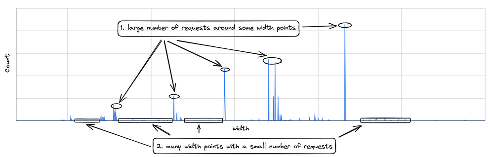
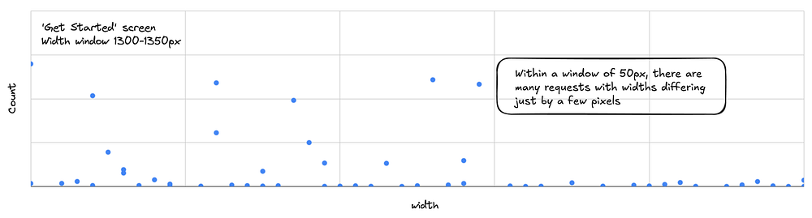
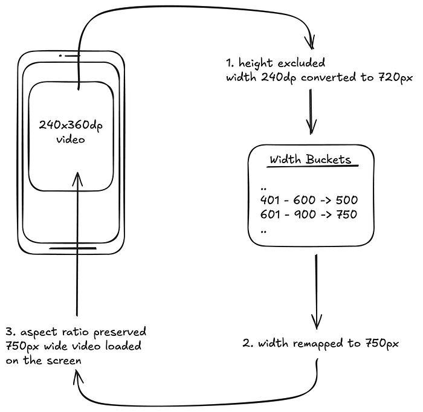

# Improving Video Cache Hits on Swiggy Apps

Swiggy uses videos in different parts of the application: some generate ad revenue; some enhance the overall user experience and others help users explore new dishes and restaurants.

While the video experience is well-optimised on Swiggy, there were opportunities to improve technical metrics like cache hit ratio and response time. Despite providing the best video experience to users, managing the costs of bandwidth and video processing was a major challenge.

*Videos used in different parts of Swiggy*

## Overview

When a video needs to be loaded in the app, the video is requested with a width matching the view on which the video is loaded (container view). The width of the view is converted from density-independent pixels to pixels before the request is made. The height parameter is excluded to maintain the original aspect ratio of the video.

The request is directed to a third-party digital asset management (DAM) service responsible for transforming the video to the requested width and sending it back. This consumes video processing credits based on the transformed video’s resolution and length.

Additionally, this transformed video is cached in a CDN, so, for any subsequent video requests with the same width, the video can be directly served from the CDN without a transformation having to be done.

## Analysis

An extensive analysis of the video requests made by the app revealed the following:

*Width Distribution of Videos Requests*

1. a large number of requests around some width points
2. many width points with a small number of requests (as low as 1)

Another interesting observation was that there were many video requests for the same videos with widths differing just by a few pixels. These requests cost us a lot of additional video processing credits and increased the latency.

*A scatter plot of widths for the video on the ‘Get Started’ screen*

This analysis revealed that the cache hit ratio can be improved and the credit consumption can be minimised by width-based bucketing.

## Bucketing

The problem now boils down to creating discrete width buckets and mapping the video requests that fall in a bucket range to a specific width. The bucket ranges need to be chosen in such a way that minimises the standard deviation within each bucket. This ensures that the loss of quality due to remapping the width is minimised, such as when a 270-pixel wide video request is remapped to 250px.

[K-means](https://en.wikipedia.org/wiki/K-means_clustering) is a clustering algorithm that clusters data and minimises the variance within the clusters. The width distribution was run into k-means and 8 discrete clusters were obtained. When the width of the view (on which the video is loaded) falls within a cluster, the request is remapped to the cluster’s centroid.

The standard deviation within the different clusters, in our case, was ~100px which means that a typical request remapped to a centroid may only deviate from the originally requested width by 100px. With high PPIs in modern smartphone displays, a 100px deviation is negligible.

On the client side, a `Bucketizer` transforms the original video URL to the width-remapped URL. A data structure `MediaBucketMap` is created, to provide the remapped width (centroid) for the requested width.

The `Bucketizer` uses this `MediaBucketMap` to remap the widths to the centroid. The video is downloaded from the network using this bucketized URL.

*An example showing a 240x360dp video being loaded on the app.*

## Results

Since there is only a limited set of buckets for each video, 8 in our case, the number of transformations is reduced. The following table lists the improvements in different metrics.

---

The buckets are specifically derived for Swiggy’s video width distribution and is suitable only for this scenario. The analysis must be replicated with your app’s unique video width distribution for optimal results.

The buckets and centroids may become obsolete as new videos are added to the app or devices with higher pixel density devices enter the market. So continuous monitoring is important to update the buckets and centroids.

_I am _[_Vignesh Muralidharan_](https://www.linkedin.com/in/vignesh-em/)_ from the Consumer Apps division at Swiggy. I would like to extend my thanks to _[_Farhan Rasheed_](https://www.linkedin.com/in/farhanrd/)_ and _[_Sambuddha Dhar_](https://www.linkedin.com/in/sambuddha-dhar-84769356/)_ for improving this article and providing valuable insights. I would like to express my sincere gratitude to _[_Tushar Tayal_](https://www.linkedin.com/in/ttayal/)_ for reviewing the article and providing feedback._

---
**Tags:** Media · Optimization · Swiggy Mobile · Android
