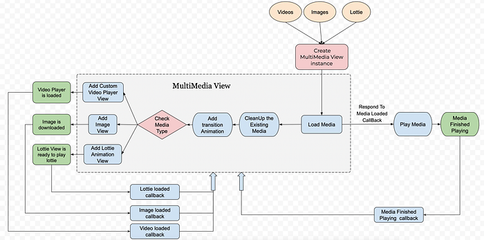
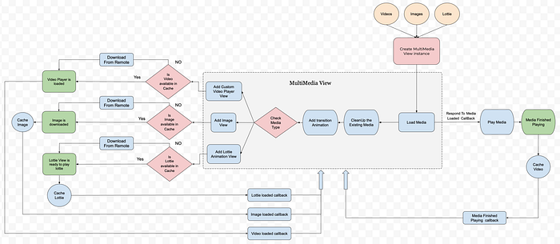

# Insight into Swiggy’s new Multimedia Card

## Introduction:

We at Swiggy always thrive to deliver a rich customer experience. And in the process of achieving this goal, we always try to come up with new and innovative ideas.

Till now we were mostly using images and lottie animations as a primary source of media content. But now we have moved a step further and would be using videos more extensively in the app.

### Advantages of Videos and Animations over static Images.

- Videos help in making a lasting and memorable impression on our current and potential new customers.
- Videos boost conversion rate. When users see video content on an app, there is a high possibility that a user spends more time on that app than bouncing off it.
- Videos and animation are a great way to convey technical and complex ideas or messages in the form of a short story. One of the practical examples could be using videos and lotties for onboarding our customers to any new feature released.

*Video for onboarding users to new features*

To summarise, videos and animation can be a powerful engagement tool, it’s a great way to start connecting with your customers, make them remember you, engage new audiences and drive more conversions.

## Problem Statement:

We wanted to create a feature where we can showcase our restaurants in the form of stories similar to Instagram stories. Most Importantly, the feature should be flexible enough to render any type of media(image, lottie, video) configured for that restaurant.

## Solution:

- The solution we came up with in our iOS app is to create a centralized reusable **multimedia view** that should be capable of rendering all the media types i.e. Images, Animations and Videos.
- We would fetch the media configuration from the Backend and model the data to power the generic **multimedia view**.
- A wrapper can be created over this multimedia view to support product requirements and future use cases.

## Lets Deep Dive more into the process

*Flow Diagram MultimediaView*

**Generic multimedia view**: Creating a view that is responsible for rendering all the three media’s images/ lottie(animations) / videos.

- Creative Type enum that needs to be passed with the loadMedia() function which would determine the type of media to be rendered.
- The associated values data and optional placeholder are the data sources for rendering the media.

- Protocol **MultiMediaDelegate** would provide the necessary callbacks when the state of the media is changed.

- We at Swiggy are using [Texture(Async Display Kit)](https://texturegroup.org/docs/getting-started.html) as our UI Framework. But the concept holds the same for UIKit or SwiftUI as well.
- The responsibility of this class is to load, render and cache the media content and give callbacks when the state of the media is changed. eg when the media is loaded, media finished playing and more if required.
- For** Image Rendering **we are using texture’s ASNetworkImageNode, we can also use other Image rendering libraries such [SDWebImage](https://github.com/SDWebImage/SDWebImage), [PINRemoteImage](https://github.com/pinterest/PINRemoteImage), etc. which provide async image downloading with cache support and also features like progressive loading.
- For **Rendering Animations** we are using AnimationView which is given by the [lottie-iOS library](https://github.com/airbnb/lottie-ios).
- For **Rendering Videos **we have created our own Video Player using AVPlayer. Please refer to this [blog](https://medium.com/swiggy-bytes/video-stories-and-caching-mechanism-ios-61fc63cc04f8) by [Agam Mahajan](https://medium.com/u/ede4f93130a7?source=post_page---user_mention--3229d7b4ae75---------------------------------------) for more details.

- **Use of Cloudinary for media Hosting**: [Cloudinary](https://cloudinary.com/documentation/), helps in uploading Images/ Lottie JSON and Videos to the cloud and automates smart manipulations of those media. Cloudinary then seamlessly delivers our media through a fast content delivery network (CDN) and optimizations.
- **Adding mechanism of LRU caching for all the media:** Caching helps in reducing the expensive network call to fetch the data again. By this the user’s internet will be saved and also load on the server will be reduced. Caching also provides a smoother and gitter-free experience to a user. LRU here stands for **Least Recently Used** and the idea is to remove the least recently used data to free up space for the new data.

*Flow diagram with caching*

> We have created our own caching mechanism interface for iOS which we have integrated for images/lotties and videos. We provide options for memory/disk/LRU caching. For LRU we have a set of configurations which we are driving from remote configs.

**Final Result** 🚀

*Final Result with caching*

## Conclusion:

We are extensively using images and lotties in our app and we have tried our hands with videos as well, for creating the [Videos Stories](https://medium.com/swiggy-bytes/video-stories-and-caching-mechanism-ios-61fc63cc04f8). But this multimedia card can indeed be a Swiss Knife to power multiple media contents in our app. We would try to use this capability to the fullest so that we can give a rich and memorable experience to our customers.

> Credits : [Agam Mahajan](https://medium.com/u/ede4f93130a7?source=post_page---user_mention--3229d7b4ae75---------------------------------------), [Mano Balaje](https://medium.com/u/903eec21f65c?source=post_page---user_mention--3229d7b4ae75---------------------------------------) for their support.

## References:

- [https://medium.com/@tarasuzy00/build-video-player-in-ios-i-avplayer-43cd1060dbdc](https://medium.com/@tarasuzy00/build-video-player-in-ios-i-avplayer-43cd1060dbdc)
- [https://developer.apple.com/documentation/avfoundation/avplayer](https://developer.apple.com/documentation/avfoundation/avplayer)
- [https://bytes.swiggy.com/video-stories-and-caching-mechanism-ios-61fc63cc04f8](./video-stories-and-caching-mechanism-ios-61fc63cc04f8.md)
- [https://github.com/airbnb/lottie-ios](https://github.com/airbnb/lottie-ios)

---
**Tags:** IOS · Mobile App Development · Swift · Multimedia · Swiggy Mobile
