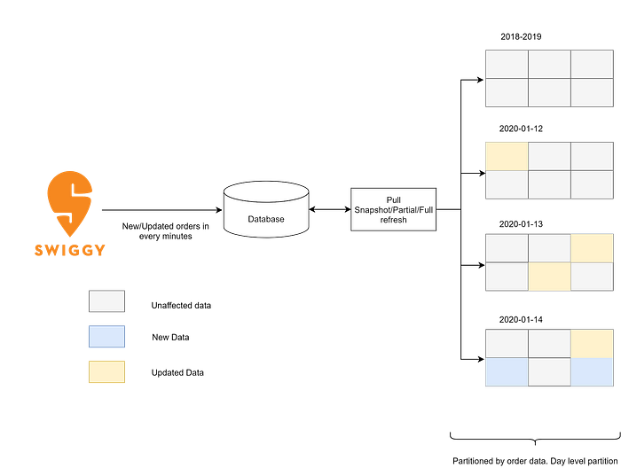
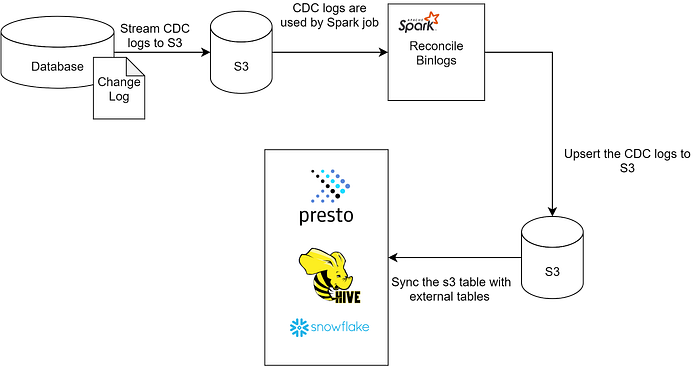

# Introduction to CDC System — An efficient way to replicate Transactional data into Data Lake

Demand for new efficient mechanisms for creating a near real-time replica of a transactional database into an analytical database is growing. The main reasons are

- Traditional transactional database replicas are not suitable for analytical workloads (OLAP).
- They can not scale for long running analytics (OLAP) queries.
- Cross database joins are also not easy and typically span multiple transactional domain boundaries.
- OLAP queries can interfere with OLTP workloads which can have an impact on the transactional flow.

Companies are continuously trying to solve these problems in different ways. One approach is to schedule batch jobs to periodically ingest data into the data lake / warehouse. However, for near real-time use cases this is challenging because

- **Freshness:** To operate in real-time, there is a need for providing data consumers with the latest data. Typically there is a 12/24 hours latency, which is high for most use cases.
- **Performance**: Storing large numbers of small files affects the read latency.
- **Consistency**: For incremental snapshot based ingestion systems there is a need for a solution which supports update and delete operations for existing data.

To address this, at [Swiggy](https://www.swiggy.com/), we built **_CDC _**(Change Data Capture) **system**, an incremental processing framework to power all business critical data pipelines at low latency and high efficiency.

## Motivating use-case: Late arriving updates and deletes

Let us consider the lifecycle of a Swiggy order. The order typically flows from the pre-order system (Storefront), fulfillments and delivery systems and post-delivery systems (customer care). While the majority of order updates are done within a span of an hour, every minute we get new orders and a bunch of updates for existing orders. Some of these updates (e.g., customer service related updates, refund reconciliation etc) may come for the orders created in the last 15 days.

The general idea is to store these order updates data in different partitions (e.g., data partition by date, hour or city.) Partitions make management of large dataset easier and the read queries also work faster on partitioned dataset. The primary challenge is updating older partitions. Because, updating older partition involves —

- Finding the correct partition and the correct file where data is present, requires a lot of data scan.
- Ensuring data consistency while updating the file is difficult.

## What is CDC?

[_CDC_](https://en.wikipedia.org/wiki/Change_data_capture#:~:text=In%20databases%2C%20change%20data%20capture,taken%20using%20the%20changed%20data.)_ (Change Data Capture)_ is a design pattern that captures all the changes happening on the data instead of dealing with the entire dataset.

Instead of copying the entire database, using CDC, only the data that has changed in the database is captured and those changes are applied (in the same order) on the analytical database to keep both the databases in sync.

This is more scalable because it only deals with data changes. For example, let us consider the case of a table that has 1 billion records but only a few million changes per day. This approach allows us to apply only the changed records (~ millions) incrementally instead of copying the entire dataset (~billions) everyday.

## CDC Based Approach

The principal idea of CDC based approach is to apply the changes on the analytical side in the same way as the transactional database does. Reading the entire dataset and overwriting on the destination storage is replaced by the continuous and incremental application of changes based on the transaction type (insert/update/delete). The load on the source system reduces significantly as the size of the transactional logs are very small and it is an incremental process.

With the CDC based solution the above mentioned use case of late arriving updates can be solved easily, efficiently and in a cost effective way. Whenever the system encounters the updates, based on the partition and record key to file name index, it will pick the files which need to be updated and it will update the specific records.

The approach of building a near real-time replica system involves two major steps:

- Create a copy of the current state of the transactional database.
- Apply current changes on this copy in the same order as they appear in the transactional database.

An important part of this approach is correctness — to capture “all” change events from the transactional database. This process should be able to recover from failure and should not lose data. If a single event is lost, the data will be inconsistent. Another key consideration is the timing to start this activity. If we start the change event collection process after creating the replica of the transactional database, we will lose the events which are coming during the bootstrap process. The best practice is to start the CDC process first then start the bootstrap process.

Once we have the current records of the database we use incremental upsert technique to read the data from the source and apply the changes(insert/update/delete) as tagged in the source data based on the primary key field.

Finally, to query on this dataset we sync the table schema and partitions with Hive metastore and Snowflake metadata.

The high level components and data flow looks like this -

## Pros and Cons of using CDC instead of Bulk extract and load

Though CDC has its own benefits, it comes with some costs. Here we will discuss the costs in terms of cons.

### Pros

- **Distributed load** — It distributes the load round the clock. The overhead of bulk extract and load is broken down into small sets of incremental changes which makes the ingestion easy and efficient.
- **Scalable** — The system is scalable to support _a number_ of sources and it’s very easy to scale at different points of the system like CDC replicator, S3, Spark jobs etc.
- **Fast and efficient upsert** — As it deals with incremental changes, time to upsert is very low as compared to bulk insert/overwrite. It’s also efficient because the write operation happens incrementally.
- **Availability** — Tuning the availability is important for near real-time use cases. CDC system provides the freedom to the user to choose the latency requirements. Based on the requirement it decides the polling interval/ refresh frequency.
- **Consistency — **One of the key tenets of this system is consistency and to achieve this we have used a reliable, fault tolerant and easily recoverable system which guarantees 100% consistency of the data.
- **Cost** — Cost of running the system is very competitive with the Bulk extract and load process. The cost is optimized by using simple infra components like, _lambda, DynamoDB streams, AWS DMS, S3_, shared _Spark_ clusters, Lightweight services using _Golang_. Major cost gain is achieved by removing the _MySQL_ read replica of the sources.
- **Easy Recovery — **The failure recovery process is very easy and simple. In case of failures, the system starts from the last checkpoint and duplicate events are handled at the spark layer.

### Cons

- **Complexity** — CDC is a more complex system compared to Extract and Load.

## Limitations

- **Dependency on Record Key — **Upsert of late arriving updates is only supported for the data set which contains record key. Source data without primary key is supported as an append only table.

In the next blog, we will discuss the architecture of our CDC system at Swiggy and how we have used robust and off-the-shelf components to solve specific use cases. Stay tuned.

---
**Tags:** Cdc · Replica · Etl · Ingestion · Swiggy Engineering
