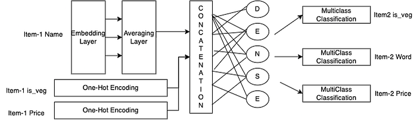
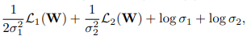
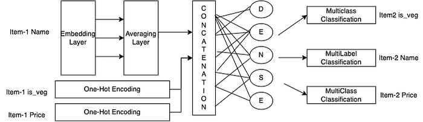
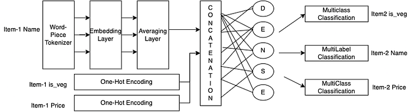
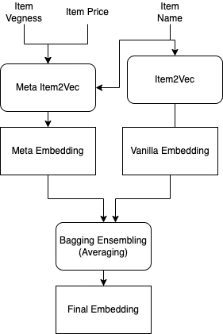
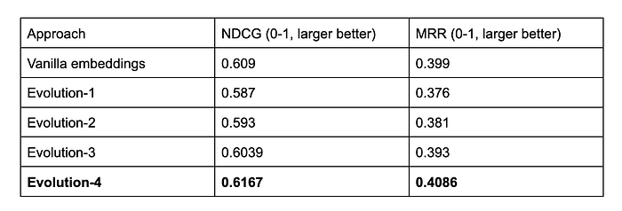

# Item2Vec with Metadata: incorporating side-information in item embeddings

With inputs from [Rutvik Vijjali](https://www.linkedin.com/in/rutvik-vijjali-338410155/), [Mithun TM](https://www.linkedin.com/in/mithuntm/)

## Introduction

Most people have a sense of knowing the similarity between items, i.e, given an item say “Veg Burger’’, we can relate it to a list of similar items, starting from burgers, to pizzas, fries and so on. Can machines do this? Possibly. This can be achieved by learning a distributed representation for each item which forms the basis of many of the recommendation systems we see and use. Learning these embeddings is not just limited to recommendation systems but they are useful for several other tasks. For instance, at Swiggy, the item embeddings are used to derive restaurant embeddings and customer embeddings as both restaurants and customers are defined by the items they serve and order respectively. Combo meals rankings and other advanced applications make use of item embeddings as inputs. Therefore ensuring quality and reliability of the embeddings is critical and must.

## Vanilla Item2Vec

Among the different candidate approaches including simple word comparisons, statistical methods which consider co-occurring frequencies and matrix factorisation techniques, word2vec was chosen because of its performance and flexibility. Word2vec can handle large vocabulary sizes efficiently compared to the other approaches. For learning the item embeddings using word2vec, we can consider past purchase sessions as sentences and the item names in those purchases as words. This formulation is based on the foundational intuition of learning word embeddings from sentences which is “You shall know a word by the company it keeps”. The same intuition applied to a purchase dataset would be “Similar items are purchased along with their similar counterparts”.

The main thing to note here is that unlike other word2vec formulations which have their object relationships to be learned as atomic entities, here we have our item names as a combination of words which are atomic in themselves. If we ignore this and consider each item name as a unique entity, we will be losing a lot of similarity information in the input itself. For example, “Chicken Biryani” and “Fish Biryani” when considered as two unique atomic entities, we are excluding the fact that these two items belong to the “Biryani” category. So the idea is to add to the sequence, the individual words of the item name and the item name itself as entities. So the item name “Chicken Biryani” is added to the sentence as [“chicken”, “biryani”, “chicken biryani”] and the window length is taken to be long enough to capture this relation.

So, a sentence in word2vec domain for order [“mexican pizza”, “chicken burger”] looks like [“mexican”,“pizza”, “mexican pizza”, “chicken”, “burger”, “chicken burger”]. As a vanilla model, previous three month’s’ purchases were used and a skip-gram model is trained with window length of 5 with the above mentioned configuration.

## That’s not it!

Though this approach works reasonably well in constructing the item embeddings, it has several limitations.

1. It does not address the **cold start** problem. When a new item which is not present in the training set is given, we are not able to construct an embedding for it, at least a reasonable one.
2. An item is not alone defined by its name and its neighbouring items in an order. For instance two same items from different restaurants can vary a lot in price which is an important consideration for recommendation. Another example is that a simple sandwich can be from a veg or non-veg category.

These limitations are crucial in application and when removed, can greatly affect the quality of embeddings. So, this problem is handed over to “Meta Item2Vec”.

## Evaluation

Before moving to our topic of interest, we need to evaluate our embeddings on some reliable quantitative metric to see the effectiveness of each approach. For this, we first roll our item embeddings to restaurant level by averaging across the past ordered items in that restaurant say for 84 days. From this, we get restaurant embeddings and then evaluate these embeddings on two metrics:

1. NDCG (**Normalized Discounted Cumulative Gain). **You can learn more about it on[ this](https://towardsdatascience.com/evaluate-your-recommendation-engine-using-ndcg-759a851452d1) post. In short, it evaluates the embeddings based on the ranking quality which in this case is the ranking of restaurants. We have the data of restaurants the users searched for and the restaurants they clicked. We want our embedding of the query restaurant to be as close as the clicked restaurant, i.e the clicked restaurant embedding similarity with the query restaurant embedding should be high as compared to any other restaurant.
2. MRR **(Mean Reciprocal Rank)**. MRR is almost similar to NDCG as it is evaluated on ranking but the way of calculating it slightly differs. It takes average of the reciprocal of the ranks given to the clicked instances. You can learn more about it[ here](https://towardsdatascience.com/ranking-evaluation-metrics-for-recommender-systems-263d0a66ef54).

Both these metrics range from 0 to 1 and more the score on these metrics, the better the embeddings. The scores for the above vanilla model for NDCG and MRR metrics are respectively 0.609 and 0.399.

## MetaItem2Vec

Metadata in general refers to data about data. In our context, it means the features/information about the item apart from its name which can include, price, vegness, dish category etc. Fusing this information into the item embeddings can greatly enhance their quality and also solve the cold start problem, since these features provide a certain default point for creating embeddings of new items.

There is some existing work regarding the inclusion of meta information — [meta prod2vec](https://arxiv.org/abs/1607.07326). The work focuses on including the meta features at the train time but it does not explicitly integrate the information into the embedding i.e while inferencing to get the final item embeddings, the method does not take meta features into account. Unlike this method, meta item2vec directly integrates meta information into the embeddings.

## Framework and data

The first step to take in migrating to the meta item2vec embeddings is to select a set of relevant features to integrate into the embeddings. Throughout our experiments, we take the price and vegness of an item as its meta features. The price of each item is taken as a categorical variable representing Low, Medium and High prices. This is done by creating 3 quantiles from the price of all items belonging to a category and then taking the first quantile as LowP, next as MediumP and the rest as HighP. The “vegness” is also a categorical variable with its classes belonging to Veg, Non-Veg and Egg categories.

The next step is to formulate the task to train the network. We use a bigram model with multitasking. Specifically, given a pair of items, we propose the task as predicting the later item’s name and its meta features given the former item name and its meta features. This implies that we use a bigram model and the network is a multi-tasking network.

The dataset pairs are generated by taking the past one month’s orders and forming item pairs by flattening the order data. A final sample of data contains the pair of items i.e, their names, price categories and vegness categories. The total dataset size is approximately nine million which means we have nine million pairs of items and their metadata.

There are several details and design choices to take into consideration before training the model. We will slowly evolve our modeling from a simple approach to a decent one.

## Evolution — 1

This is the first migration step towards meta item2vec. The main design choice to make here is how do we handle the entities i.e, should we consider the entire item name as a unique entity or consider them at a word level. The former approach increases the tokens size and also explicitly removes word level relationships between different items of the same dish family. So, we carefully model the later approach.

Now, we have to decide how we model the inputs and outputs of the network. The meta information is easy to deal with. At the input side, they are represented as one hot encoded vector and at the output side, they are predicted as multinomial distribution via softmax. The input item name is processed using the embedding layer followed by an averaging layer which finally gives out a fixed dimensional embedding representing the input name. The critical issue is the prediction of the next item’s name which is of variable length. To start simple, we sample a single word out of the output’s name and make the model predict this word via softmax.

*Architecture of Model 1*

As you can see, the network has three tasks, ergo a multitasking network. The main challenge in the multitasking network is that one task dominates the other resulting in sub-optimality in the overall optimization. The most direct way of solving this is to scale/balance the losses which in turn scales the gradients across the network. The best work in this direction is shown by the[ Multitasking with Bayesian Task uncertainty.](https://arxiv.org/abs/1705.07115) This approach weighs the losses based on the variance in the loss of the task. Intuitively, a difficult task or a loss with high variance is allowed to learn slowly by decreasing its weight and an easy task or a task with less variance has its weighting increased, so that it’s learning is accelerated.

*Structure of the Multitasking loss function with two tasks*

L1 and L2 are losses from two loss functions conditioned on parameters W. These loss functions can hold outputs from Gaussian Distribution for a regression task, and multinomial distribution for a classification task. If the loss is consistently high, implying that the outputs are deviating more from their mean (ground truth) values, the variance of the represented distribution for that output is high. The trainable parameters represented by the (1/σ^2) balance this variance which from the model’s perspective reduces the learning rate for that task.

This gives us a base model that can integrate meta information into the embeddings. At inference, we pass the item’s name, price and vegness into the model and get the embedding from the dense layer.

The scores obtained on NDCG and MRR are respectively 0.587and 0.376. It can be observed that the meta model performs worse than the vanilla one. For one thing, the meta model is hand constructed and is trained on only one month’s data due to time and compute constraints while the vanilla model is trained on three month’s data beforehand. Also, the interactions between the entities in the vanilla model are dense as the window size is high and we consider the flattened version of the item name enabling it to learn much denser representations. No to mention that this model has several flaws. The main thing is that we are only predicting one word of the output item’s name. To make the task standard, we have to find a way to predict the entire name of the item. This brings us to evolution 2.

## Evolution — 2

In this evolution, we modify the model to predict the entire name of the output item by the task of multi-label classification. Unlike multi-class classification where we output a multinomial distribution that supports a single class output, in multi-label classification, the prediction of each class is treated as an independent binomial distribution. So the active classes will be the words which are present in the name of the item and are set to 1 and the remaining classes are set to zero.

One of the challenges is that, out of the large vocabulary of words, only few (upto three of them on average) are 1’s and remaining are 0’s. This leads to a high class imbalance which intuitively can hack the network into predicting zeros for every class irrespective of the input. To solve this problem, we deploy the class weighting strategy where we weigh the classes set to 1 with the ratio of the number of negative classes to the number of positive classes.

*Architecture of Model 2 (the difference is in the task of the Item name prediction)*

All the other configurations are set constant as in the previous evolution such as using the dynamic weighting, averaging, etc. The scores on the NDCG and MRR metrics for this method are 0.593 and 0.381 respectively. Though this is an improvement over the previous evolution, still the vanilla model performs better. So, now we go on to tackle the problem of lacking the dense interactions in our methods as opposed to the vanilla approach.

## Evolution — 3

In the vanilla approach, we are flattening the item name at a word level and using a skip-gram model with window length of 5. This enables more interactions between the word entities and as a result the embeddings relate more with each other. This can be called dense interactions in the network. There is no such opportunity in our architecture as the same idea is not applicable to the meta features.

So, we solve this issue using a Sub-word Tokenizer specifically Word Piece Tokenizer. You can read more about this[ here](https://towardsdatascience.com/wordpiece-subword-based-tokenization-algorithm-1fbd14394ed7). Basically, the word piece tokenizer splits up rare words and retains the frequently occurring words as they were.

*Architecture of Model -3 (Difference comes in the addition of Word Piece Tokenization Module)*

This has a few advantages:

1. Reduce vocabulary Size
2. Better handling of OOV’s.
3. More interactions of the subwords, which is relatively better than words.

This along with multi-label classification solves the problem of the dense interactions to a great extent. The NDCG and MRR scores for this evolution are 0.603 and 0.392 which is a great improvement.

## Evolution — 4

To be fair, the vanilla model has bias in terms of data used and the dense interactions gained due to skip-grams formulation giving it an upper hand. We also want to prove that the meta information is valuable but due to less data and lack of dense relations, the scores are little less than the vanilla model.

The best way to increase the performance of these embeddings and at the same time visualize the value of the meta information is using ensembling. While the meta embeddings have the advantage of having meta information, the vanilla embeddings are trained on more dense signals. Combining them by bagging, specifically averaging the embeddings should give the best of both worlds.

*Architecture of Model 4 — Ensembling by Bagging*

The NDCG and the MRR scores for this ensemble approach are 0.6167 and 0.4086. This approach performs better than the vanilla approach on the same subset of data, which means that the metadata played a role in improving the embeddings.

## Conclusion

The evaluation metrics for different approaches are:

*Metrics for each of the approaches*

In conclusion, the meta information for any product or entity is important because customers consider their similarity not only on the product itself but on various other factors like price, brand, etc. We expect the recommendation systems to capture the same notion of similarity which is dependent on all these factors. It is also important to note that an embedding of a given size can hold limited information before it forgets/misses other relationships when there are a lot of meta features. Another approach we can think of is using a sequence to sequence architecture to take input names and get the other item’s name as output. LSTMs were tried with different settings but failed as these layers hindered the direct learning of the embeddings. So, adding continuous or other time series features to these architectures is still challenging.

---
**Tags:** Multitask Learning · Recommender Systems · Deep Learning · Word Embeddings · Swiggy Data Science
