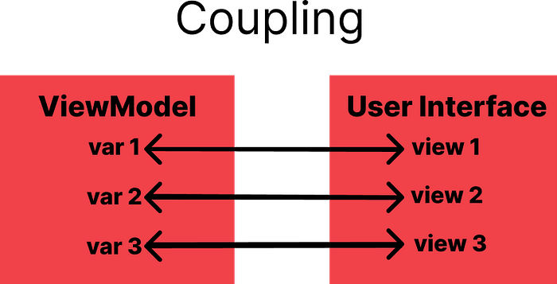
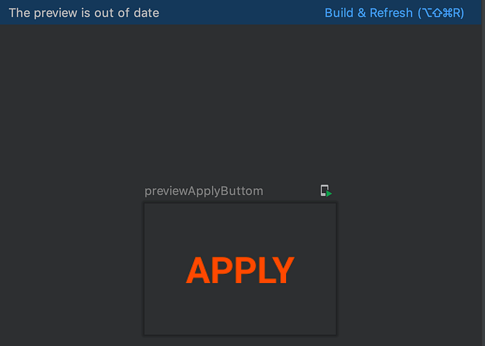
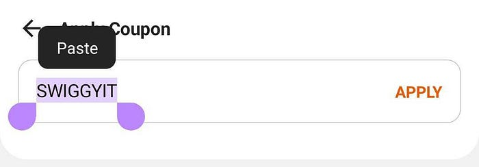

# Jetpack Compose- Powering Swiggy’s new coupon listing page

## Why we chose jetpack compose as a UI toolkit?

We at Swiggy wanted to move away from xml’s UI development to a more robust, more readable and a much faster UI toolkit. Since, compose ticks all these points, we decided to use it for building the new coupon listing page.

*coupon listing page*

---

This article explains how we improved the Swiggy’s Android app by adopting jetpack compose to build the UI and also what all challenges we faced while building it.

**Before moving forward, let’s breakdown the coupon listing page**  
In new coupon listing, we introduced 5 categories of coupon:  
1. **Best Coupon**, which is the best applicable coupon.  
2. **Great Deal Coupon,** which is next best applicable coupon.  
3. **More Offers Available Coupon**, which doesn’t fall in either of the above categories and are applicable.  
4. **More Offers Non-Available Coupon**, which also doesn’t fall in either of the above categories and are not applicable.  
5. **Bank Offer Coupon**, which falls under alliance coupon category.  
Except the 5th type, all the coupons have a half punch hole view, whose background colour changes with the applicability of the coupon.

*More Offers Available Coupon, Best Coupon, More Offers Unavailable Coupon (From Left to Right)*

*Bank Offer Coupon, Great Deal Coupon (From Left to Right)*

## Goodness of building UI in jetpack compose

1. **Reusability of code: **One most important advantage we got from compose is that the layout functions that compose exposes have been broken down to such a small level that we can easily create generic compose functions by passing ui specific variables as parameters. Let me explain with an example:

We can clearly see from the above code that the code is generic enough to be reused anywhere in the app. All we need to do is this:

Also, due to this we were able to create all the 5 different types of coupon using a single composable function.

2. **Reduction in code and development efforts: **Due to reusability, there has been a drastic reduction in the number of lines of code. Other reasons are like the introduction of LazyColumn compose function, which when compared with android native recycler view, is very easy to implement and with few lines of code. Due to this we were able to create a scrollable list in 15 seconds. Whereas if you see in native recyclerview, we had to write adapters, viewholders and then binding adapters. This is a lot of boilerplate code which has been simplified in compose. Here’s the example:

That’s it. Only this much code was needed to create a scrollable list. Here’s the result:

*Scrollable list using lazy column*

3. **Reduced implicit coupling: **Coupling is a concept which defines how much two modules are interconnected with each other. More the rate of coupling, the more difficult it is to scale the code. We often encounter this coupling between viewmodel and UI.

*Coupling depiction*

You can see what a big mess this coupling is. And when viewmodel and UI are in two different languages (like in case of xml), it becomes an even bigger pain point. Because coupling is implicit in nature and any small change in the life cycle of one variable in a viewmodel might lead to exceptions which could eventually lead to crash.  
Since compose is a kotlin based UI toolkit, the coupling of viewmodel and UI becomes explicit. Thus easy for other developers in our team to understand and maintain the code.

4. **Pure separation of concern: **Separation of concerns is a design principle in which code should be broken down into distinct sections and each section is independent of each other. Composable functions have helped achieve this by receiving data in the form of parameters. Like in the apply coupon listing page, we are passing data in the form of states instead of passing the viewmodel itself like shown below:

Calling composable function from it’s fragment:

The benefit of writing code in this way is that now viewmodel and compose are totally separate from each other. If we want to implement the same UI in some other app team, all we have to do is copy this composable function to that app and pass data through that app’s viewmodel.

5. **Able to use the goodness of kotlin: **Since compose is a kotlin based UI toolkit, we were able to use all goodness of kotlin like null safety, writing less amount of code etc.  
This can be better highlighted through the code below:

Another example which highlights this goodness:

From the above code, we can clearly see how easy it was to change the color of text in the UI file itself. If we wanted to implement the same in xml then we would have to use data binding to set the color and then inside the init block of viewmodel, we would have to write the if else logic.  
But by using compose in coupon listing page, the flow became unidirectional instead of bidirectional (in case xml was used).

---

## Challenges faced while building UI in jetpack compose

1. **Build every time to preview: **Even though compose’s UI preview is so much better than xml with interactive mode but the downside of all this is we have to rebuild every time to preview any new changes added to the UI. This comes as a big problem because rebuilding takes time.

2. **Non-availability of all features in TextField: **TextField is compose’s equivalent of xml’s EditText. Although very simple to integrate and customise. But one flaw in compose’s TextField field is that it doesn’t have all the features which EditText supports.  
Here’s what I mean by this:

*Jetpack compose’s TextField*

*Xml’s EditText*

Due to the above reasons, we had to prefer xml’s EditText over compose’s TextField.

## Final Thoughts

Reduction in code and reusability of code are one the most powerful benefits we got from compose. If we increase compose’s adoption to other pages as well, then we will definitely see reduction in app size and also reduction in dev efforts estimation.

---
**Tags:** Jetpack Compose · Android · UI · Mobile App Development · Swiggy Mobile
