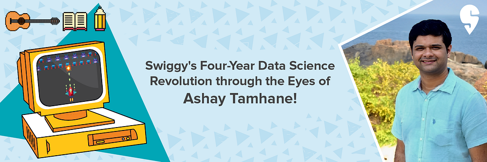
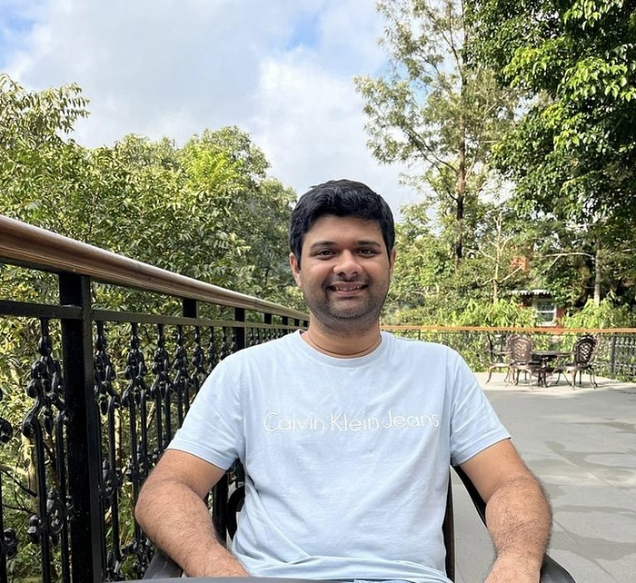
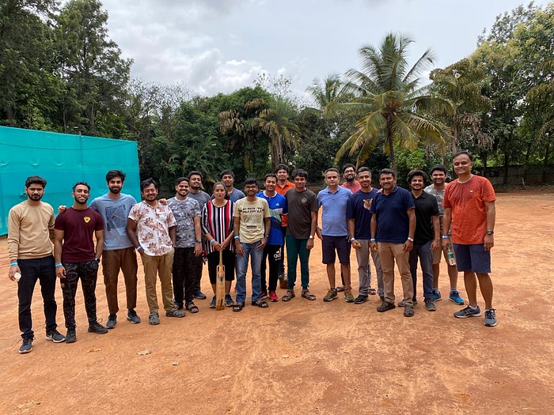
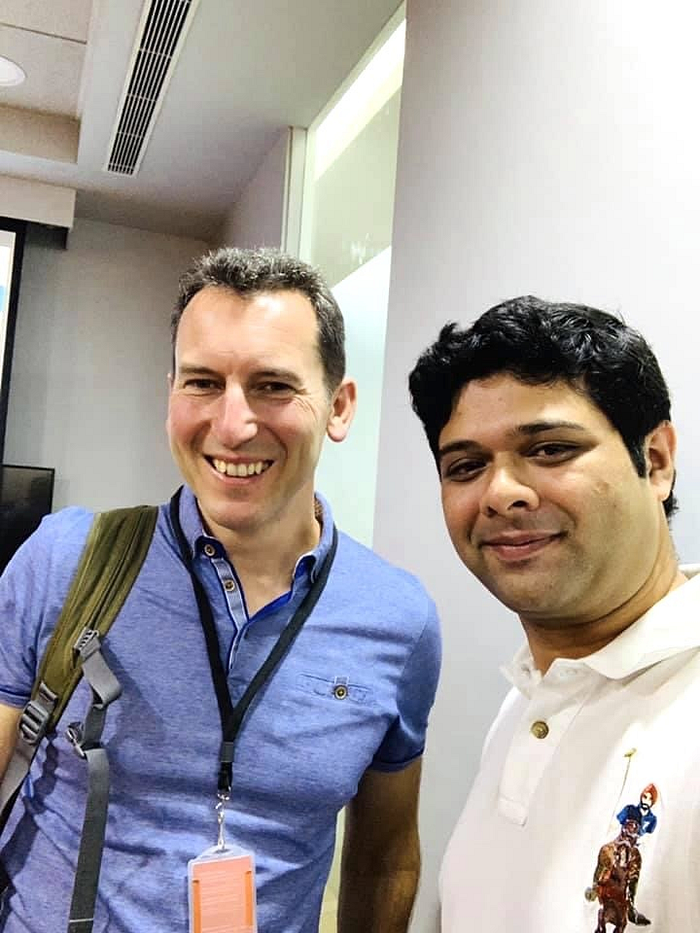

# Latest data on the work-life of a data scientist at Swiggy

## The director of the data-science team, Ashay Tamhane, shares his love of tech, creating impact, and staying humble.

The opportunity to solve complex tech problems and create large-scale impact is what drew Ashay Tamhane to Swiggy, and working with intelligent, grounded people is what motivates him to stay with the organisation. In his four-year journey with Swiggy, Ashay has scaled from a staff data scientist to the director of the data-science team. His growth is testament to his ability to learn, work hard, and deliver results. Along with his technical skills, Ashay’s success is driven by his love and admiration for his peers. Today, he guides the advancement of Swiggy’s technological capabilities and also ensures the growth of his associates.

**Tell us about your educational background and areas of interest**

I was in the third grade when I was introduced to a computer at school. Ever since, I’ve been hooked! My dad had a computer at our automobile shop and I used it to create simple sci-fi games and animations in GW-BASIC. Then, I developed a keen interest in AI during my undergraduate degree at Pune University in 2009. In 2011, I pursued an MS in Computer Science from the State University of New York, Buffalo, specialising in AI. Other than tech, I like going on long drives, exploring new places, and playing cricket. There was a time when I used to write poems on a funny blog I hosted, and I also used to play the guitar, but it got massively de-prioritised over time.

**What is the most exciting part of working at Swiggy and solving tech problems?**

Swiggy has a diverse customer base with varied dietary and restaurant preferences. A large part of our work involves predicting what our customer needs at any given point in time and showing them relevant options. This is a challenging task, and solving it at scale using innovative approaches is one of the most exciting parts of working at Swiggy. Additionally, interacting with brilliant yet humble people, and learning from them, is also an unmissable perk.

_(recent offsite during Jamboree)_

**Having spent more than four years here, tell us what your Swiggy journey has been like.**

When I joined the company four years back, the Data Science footprint on the Swiggy app was limited compared to the present day. Today, most of the things you see on the app are directly or indirectly powered by a data science model. Our team enabled data-driven decisions and algorithms for the app, which led to meaningful customer-backward impact. It has been quite a fulfilling journey for me and the data science team. Apart from the business and customer impact, we also filed a patent and published a paper that won the best paper award at Conference of Data Science and Management of Data in 2022 (CODS-COMAD’22). This combination of technical, business, and academic success is what most data scientists look for in their careers. And we’re blessed to experience it with Swiggy.

**Tell us about the work you and the team have been doing here.**

We use a combination of machine learning and intuitive heuristics to simplify and personalise a customer’s journey on the Swiggy app. Specifically, the restaurant recommendations that you see across Swiggy’s food page or the item recommendations on any restaurant’s menu are some of the important storefront properties powered by our team’s work. Since every customer is unique, predicting what they need at any given moment and suggesting relevant options is a challenging task. But the team solves them through experimentation and innovation, while being mindful of time and cost constraints.

**How has your work life changed from day one to now?**

Being in a startup environment, one needs to wear multiple hats. What started off as data analysis soon got combined with managing stakeholders, influencing team members, and mentoring. My role also required me to explain tech in simple language, think objectively, communicate clearly, and to help team members grow their capabilities. The development of such skills has enabled me to have an exciting career at Swiggy.

**How is your work-life as the Director of Data Science at Swiggy?**

Each day differs from the other. It usually revolves around doing whatever it takes to deliver impact and help people grow. This involves helping and enabling the team to solve a problem, reviewing technical approaches, firefighting any customer backward problems, managing stakeholders, tracking and unblocking goals, and mentoring to help the team grow in their careers.

_(after attending a talk by Amex Smola on Reinforcement Learning in 2019 at the Swiggy office)_

**Are there any projects or experiences that are close to your heart?**

All projects have been meaningful to us. But there are a few that we ideated from scratch, pitched, collaborated, implemented and delivered impact. These projects certainly hold a special place. For instance, I still remember having long discussions on why we need data science-powered recommendations on the menu. The impact of this decision was so powerful that now it feels ‘stone age’ to not have data-backed recommendations tailored to customers’ preferences. Another was the recently launched ‘[WhatToEat](https://blog.swiggy.com/2023/07/05/swiggys-industry-first-whattoeat-feature-helps-users-order-food-attuned-to-their-moods-and-cravings/)’ project, which involved collaboration, ideation, and hard work across multiple teams. Projects are special because of the technical & non-technical challenges, the people we work with, and the impact they produce. And most projects at Swiggy involve all of these.

**One of the benefits Swiggy provides its employees is the Learning Wallet, where you are given a budget to take on personal and professional development opportunities. How did you use your learning wallet in 2022?**

I bought a few technical books on deep learning and reinforcement learning which have been incredibly useful in upskilling myself. Apart from this, I also got a Kindle. But that has now been taken away by my wife for her baking recipes. So it is helping the entire family learn!

**As a Swiggster, which company value do you connect with the most? And how would you describe Swiggy’s culture to aspiring Swiggsters?**

There are two Swiggy values I connect with the most, “[Always Be Curious, Always Be Learning](https://blog.swiggy.com/2022/12/21/here-are-swiggys-values/)” and “[Be Humble](https://blog.swiggy.com/2022/12/21/here-are-swiggys-values/)”. I believe anyone who imbibes these two values will succeed despite challenges.

Swiggy is a fast-paced learning environment where both of these values are nurtured, and it therefore sets-up people for long-term success. An example of constant learning and knowledge sharing is the recently organised tech orientation which involved collaboration across multiple functions where engineering, data science, and product teams came together and shared domain knowledge to democratise information held by only a few people. This also helps build empathy and enables better collaboration.

**What are your thoughts on diversity & inclusion in the tech industry and at the workplace?**

All of us have inherent biases in our thinking. The beauty of diversity and inclusion is that it helps minimise such biases and helps the organisation take logical and unbiased decisions. Diversity should be present not just in gender and orientation, but also in thought processes. When people offer multiple perspectives on the same problem and share interesting insights from their life experiences, that is when you can build a complete solution. This is why it helps to have people from different backgrounds come together to build a world-class product.

**Can you tell us about your experience with **[**Swiggy’s Remote-First Future of Work policy**](https://blog.swiggy.com/2022/03/25/what-work-looks-like-at-swiggy/)**?**

The policy was first introduced to ensure the safety of our employees when COVID struck. But soon, people found a bigger reason to work remotely — Bengaluru traffic! This has undoubtedly saved me and the team several hours of commute time. Further, many of my team members are not even in Bengaluru and we are still able to collaborate effectively. The flexibility of going to the office when you want to brainstorm or just to catch up in person is amazing. This way of working took a little while to get used to initially, but Swiggsters have now mastered it and are leading the way for others to follow.

**If you had to give one piece of advice to aspiring data scientists, what would it be?**

Focus on the fundamentals of machine learning early on in your career without worrying too much about the latest hype. Social media will distract you and give you FOMO, but make sure you invest time and patience in developing mathematically sound foundations. At the same time, it is equally important to develop a good understanding of the product and industry to create a meaningful impact. Another skill that is typically underrated among data scientists is written and verbal communication. If you add effective communication to your technical skills, you will be outstandingly successful.

---
**Tags:** Employee Experience · Swiggy Life · Data Science Careers · Indian Startups
