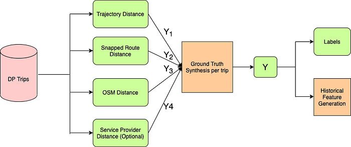
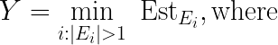
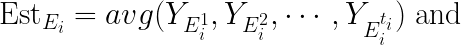
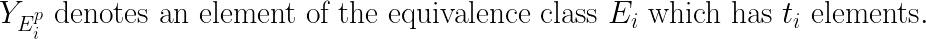
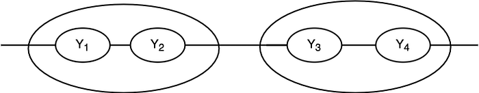
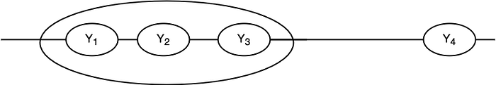
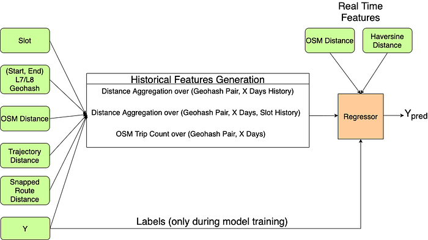

# Learning to Predict Two-Wheeler Travel Distance

Co-authored with [Gaurav Pawar](https://www.linkedin.com/in/gaurav-pawar-a4560589/), with contributions from [Bharath Nayak](https://www.linkedin.com/in/nanavath-bharath-nayak-143280b2/), [Ritwik Moghe](https://www.linkedin.com/in/ritwikmoghe/), [Tanya Khanna](https://www.linkedin.com/in/tanya-k-372683160/), and [Kranthi Mitra Adusumilli](https://www.linkedin.com/in/kranthi-mitra-adusumilli-13836142/)

## Introduction

Estimating travel distance between two geographical locations is one of the primary services offered by maps service providers such as Google Maps, Mapbox, HERE Maps, and GraphHopper which uses OpenStreetMap (OSM) as the base map. In this blog, we discuss why we did not find existing services to be ideal for Swiggy specific use-cases and how the Data Science team at Swiggy built a machine learning (ML) model to predict two-wheeler travel distance accurately by leveraging historical GPS trajectory data of its delivery partners (DPs).

Before we dive deep, let’s look at some important terms and acronyms used in the blog.

**DP**: Delivery partner.

**2(4)W**: Two (four)-wheeler vehicles.

**GPS**: Global Positioning System.

**MAE**: Mean Absolute Error

**Geohash**: Geohash encodes a geographic location into a string of letters and digits. It quantizes the geographical locations into grids and the grids can be configured at different resolutions such as L1 to L12. The cell widths of [L7 and L8 geohashes](https://www.movable-type.co.uk/scripts/geohash.html) are at most 157 m and 38.2 m, and the cell heights of L7 and L8 geohashes are at most 157 m and 19.1 m respectively.

**Latitude, Longitude**: The latitude and longitude specify a geographical location on the earth’s surface in the two-dimensional [WGS-84](https://en.wikipedia.org/wiki/World_Geodetic_System) reference coordinate system.

**OSM**: OpenStreetMap, a crowd-sourced and open-source maps data repository that includes road segments and road network information.

**FM trip**: First-mile (FM) trip is the journey DP makes to reach a restaurant partner.

**LM trip**: Last mile (LM) trip is the journey DP makes from the restaurant partner to the customer location.

**GPS trajectory**: A GPS trajectory is a sequence of GPS points which records the spatial track of a GPS receiver. In our case, a DP’s GPS trajectory during the order pick-up and delivery is obtained through the DP’s mobile application.

Some of the noisy sources of distance estimate that we use are listed below.

**Haversine distance**: It is the shortest distance between two points on the surface of a sphere. The earth’s surface is approximated to be a sphere and the haversine distance represents an approximation of the shortest distance between two points on the earth’s surface. The road network distance is often longer than the haversine distance between two points.

**OSM distance**: Distance estimate provided by OSM-powered GraphHopper API. This represents the shortest (fastest) OSM road network distance between two points when the ‘shortest’ (‘fastest’) configuration is used. Since OSM is crowd-sourced, it might miss road segments, have non-existent road segments marked, and the legal travel directions might be wrongly marked. Hence, this source of distance is noisy.

**Trajectory distance**: Distance estimate obtained as haversine distance aggregated across the GPS traces in a given trajectory. Since the GPS traces are noisy, the distance estimate obtained from them is also noisy.

**Snapped route distance**: Distance estimate obtained by aggregating the length of the road segments along the snapped route. The snapped route is obtained by using the [map-matching engine of GraphHopper](https://github.com/graphhopper/map-matching). The snapped route is predicted by matching the noisy GPS traces to the OSM road network so that the actual road trajectory taken by the DP is obtained. Since the fidelity of the snapped route is dependent on the accuracy of the [map-matching algorithm](https://www.microsoft.com/en-us/research/publication/hidden-markov-map-matching-noise-sparseness/) and the reliability of the OSM road network, this distance estimate is also noisy.

At Swiggy, predicting 2W travel distance plays a vital role in the following workflows.

- Determining the set of restaurants serviceable to each customer.
- Determining the set of DPs reachable to a given restaurant.
- Evaluating the delivery charges for an order payable to the DP.

When a customer places an order on the Swiggy mobile app, the backend system looks for a DP to pick up and deliver that order. The DP receives a request with an estimate of the travel distance and the expected payout based on it. The DP then commutes the FM from the present location at the time of order assignment to the restaurant location, picks up the order, and travels the LM to the customer location to deliver the order. Therefore, the distance to be estimated includes the distance traveled during the FM and LM trips. Incorrect travel distance predictions might result in incorrect payouts, and hence, these predictions need to be very accurate.

Our goal is to predict the point-to-point travel distances before the start of the FM and LM trips. The novelty of our work includes synthesizing ground truth distance from diverse noisy distance estimates and feature engineering that offers a reasonable trade-off between the accuracy of the model predictions and trip-wise coverage.

## Motivation

Most leading map service providers offer only 4W travel distance in Indian cities and in cases where 2W distance APIs are available, they come with an additional cost. The routes taken by two-wheelers are different from four-wheelers in a lot of cases. Road widths in India have high variance and some roads accommodate only two-wheelers. Two-wheelers find it easier to take certain turns or u-turns or junction crossings which four-wheelers avoid due to traffic density and road space. At enterprise scale, differences in distances due to these factors become non-trivial. Since OSM distance, trajectory distance, and snapped route distance are all error-prone as mentioned in the first section, we cannot rely on any single source for accurate 2W distance prediction. We now propose a novel algorithm to match these diverse sources to smoothen out errors in the individual distance estimates.

## Y-label Synthesis: Synthesising The Ground Truth

In this section, we describe an algorithm to synthesize the ground truth distance for a trip from an arbitrary number of noisy distance estimates from diverse sources. These distance estimates include the trajectory distance, snapped route distance, OSM distance, and could also include the distance estimates obtained from any of the maps service providers.

The ground truth distance is used as the target variable to train the ML model and the historical versions of the ground truth distance are used as features for real-time distance prediction.

*Ground truth travel distance synthesis from diverse noisy sources.*

Before we move ahead, let us first summarise the definition of an equivalence relation on a set _S_.

_Definition_ ([_Equivalence relation_](https://en.wikipedia.org/wiki/Equivalence_relation)_ on set_ _S_): A binary relation ~ on a set _S_ is said to be an equivalence relation if, for any element a, b, c in set _S_, the following conditions are satisfied.

- Reflexivity: a ~ a
- Symmetry: a ~ b implies that b ~ a.
- Transitivity: a ~ b and b ~ c imply that a ~ c.

Denote the set of distances obtained from _v_ diverse sources by _S _= _[Y₁_, Y₂, …, _Yᵥ_]_._ We now define an equivalence relation on the set _S_.

_Definition_ (_Match relation between distances_): A pair of distances _Yᵢ_ and _Yⱼ_ is said to match if |_Yᵢ — Yⱼ_| < _100 m_ or there exists _Yᵤ_ such that |_Yᵢ — Yᵤ_| < _100 m_ and |_Yⱼ_ — _Yᵤ_| < _100 m_, for _u≠ i, j_.

It follows from the definition that match relation is an equivalence relation on the set of distances _S_. It is well known that an equivalence relation partitions the set _S_ into equivalence classes. Let _E₁_, …, _Eₑ_ denote these equivalence classes which are disjoint subsets that partition _S_. We now propose the following formula for synthesizing the ground truth distance for a given trip from the equivalence classes of the set _S._

*Second Level of Distance Estimate.*

*First Level of Distance Estimate.*

The first level of distance estimate is the average of distances within each non-singleton equivalence class. The second level of the estimate which synthesizes the ground truth distance is taken to be the minimum of the estimates from the non-singleton equivalence classes.

The average of noisy observations of a ground truth corresponds to the [maximum likelihood (ML) estimate](https://en.wikipedia.org/wiki/Maximum_likelihood_estimation) of the ground truth when the noise is i.i.d and Gaussian. We assume that conditioned on the distances from the diverse sources matching, they constitute independent noisy observations of the ground truth distance corrupted by Gaussian noise. When the ML estimates from the non-singleton equivalence classes are hypothesized to be samples from a uniform distribution U[_a, b_], the minimum of these estimates is an ML estimate for _a_. A few toy examples are presented below.

**Example 1**: If _S_ = [1043 m, 1100 m, 1230 m, 1270 m], then _E₁_ = [1043, 1100] and _E₂_ = [1230, 1270]. Therefore, _Y_ = min((1043 + 1100)/2, (1230 + 1270)/2) = 1071.5 m. A pictorial representation of the equivalence classes is given below with the non-singleton equivalence classes encircled.

**Example 2**: If _S_ = [1230 m, 1270 m, 1327 m, 1100 m], then _E₁_ =[1230, 1270, 1327] and _E₂_ = [1100]. Therefore, _Y_ = min((1230 + 1270 + 1327)/3) = 1275.67 m. A pictorial representation of the equivalence classes is given below with the non-singleton equivalence class encircled.

**Example 3**: Let _S_ = [900 m, 1023 m, 1230 m, 1343 m]. Since no two distance estimates match, we do not synthesize the ground truth distance for this case. A pictorial representation of the singleton equivalence classes is given below.

The non-singleton set condition acts as a confidence filter for the distance estimate. When two diverse estimates of distance match, it is less likely to be a coincidence.

## Feature Engineering

We design both real-time and historical features for the ML model. We use point-to-point haversine distance and OSM distance as real-time input features and use historical trip data aggregated along geographical, temporal, and time of the day (slot) dimensions as historical features for the model. Descriptions of these dimensions are presented below.

**Geographical dimension**: We aggregate the historical data by quantizing collocated points in the geography as geohashes. We observed that the distances for trips with the same start geohash and the same end geohash are highly correlated due to routes overlapping on the road network. Hence, we aggregate features at L8 and L7 (start, end) geohash pairs depending on trip sparsity at L8 geohash pairs. The (start, end) geohash pair refers to the geohashes where the start location and the end location for a trip fall in.

**Temporal dimension: **We expect the road network to undergo changes like roads being blocked for maintenance or containment zones in the COVID world or changes in traffic rules such as newly designated one-ways. To enable our model to adapt to such temporal factors, we designed features at different spans of temporal aggregation. For instance, a 7-day feature aggregation is more likely to have adapted to road network changes on the ground as compared to a 60-day feature aggregation.

**Time of the day (slot) dimension**: The fastest route for the same start and end location can change across different time slots. To capture these traffic patterns, we aggregate historical data at a time slot level as well.

**Source confidence dimension**: Since OSM distance is the key real-time feature, we capture the confidence in the OSM distance in a given geohash pair by the number of times OSM distance is one of the matching distances used to compute the ground truth for the historical trips in a geohash pair. This feature is referred to as ‘OSM Trip Count’.

The overall system diagram for model training is presented below.

## The ML Model

We observed that a simple averaging of historical ground truth distances across L7 geohash pairs would not be an accurate distance estimate since the 10–90 percentile swing in the historical distances could be as large as 1 km. Due to non-linear interaction among the features in general, we experimented with non-linear models such as random forest and gradient boosted trees for regression. The MAE between the model prediction and the ground truth distance for the two models were similar. The input to the regression model is a vector of real-time and historical features as described above. We observed that the errors were higher for higher OSM distances, and hence, we do not predict for large distances. Large distances were also associated with relatively sparse historical data. We predict only for geohash pairs with a sufficient history of trips in L8 or L7 geohash pairs depending on data sparsity in L8 geohash pairs. These choices enabled a good trade-off between the MAE of the model and the trip-wise coverage of the model. In other words, the model gave accurate predictions for a significant fraction of the trips. For the rest of the trips in geohash pairs that do not have sufficient trip volumes, we use a fallback legacy system (not based on ML) to give a distance estimate. The proposed model gave a 50 % reduction in MAE compared to our legacy system.

**Adapting to road network changes**: During COVID-19 lockdowns, there were temporary road network changes due to the creation of containment zones. Our DPs had to take different (in some cases longer) routes as the movements in streets or geographical zones were restricted due to a large number of COVID-19 cases. We observed using the MAE metric that the model generalised well throughout the peaks of the first and second COVID-19 waves as well as the waning phases of the two waves in India.

**Feedback loop**: The predictions for high volume geohash pairs with high errors are masked using an automated feedback loop. In other words, we generate “error masks” on geohash pairs that have a sufficiently large number of trips historically with a significant fraction of the trips having high prediction errors with respect to the ground truth distances. If an incoming distance prediction request corresponds to such a masked geohash pair, we don’t use these predictions in the downstream system. The error masks ensure that there aren’t geographical clusters of high error and the errors are almost uniformly distributed throughout the geography. The error masks are also demasked in an automated fashion once these geohash pairs stabilize to low error predictions. Such a stabilization (intuitively) happens when the variance across the ground truth distances of the trips between the geohash pairs reduces. The error mask reduced the MAE of the model output by 10 % with just a 3 % hit on the trip-wise coverage.

## Conclusion

We proposed an algorithm to synthesize ground truth distances from diverse noisy sources since none of them individually was a reliable estimate of the ground truth travel distance for two-wheeler vehicles. We used the synthesized ground truth distance as labels and as historical features to build an ML model to predict the 2W distance accurately. We used an off-the-shelf random forest implementation to train the model. A deep neural network (DNN) based model could overcome the limitations of hand-engineered features. Custom loss function with a DNN to penalize large prediction errors is also worth exploring.

---
**Tags:** Machine Learning · Geospatial Intelligence · Geospatial Data · Maps · Swiggy Data Science
