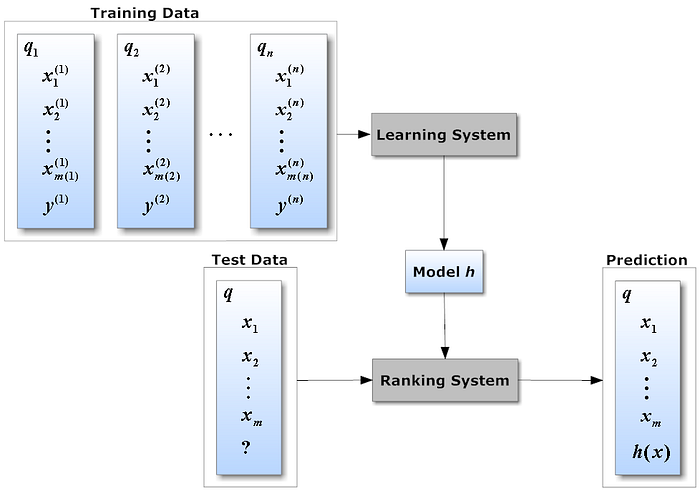
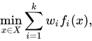
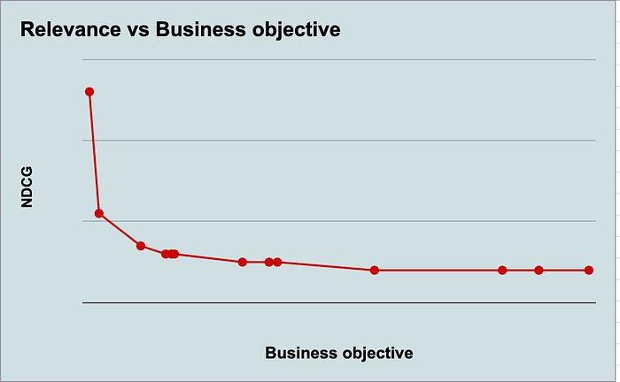
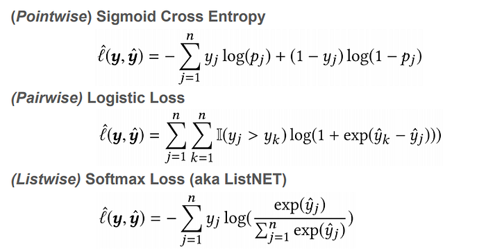
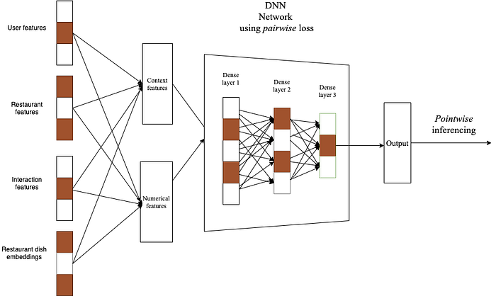
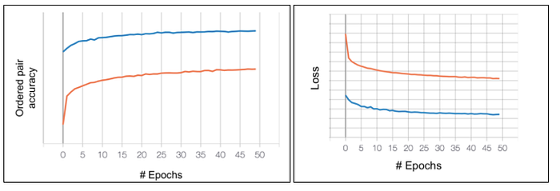
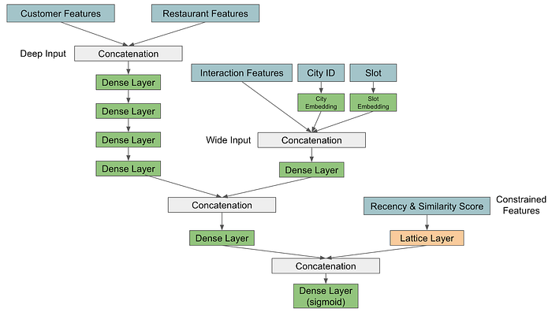
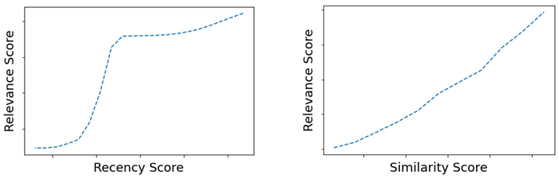
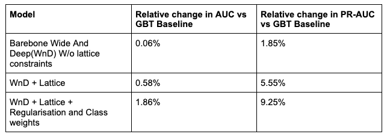
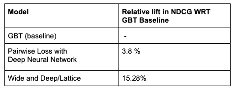

# Learning To Rank Restaurants

Co-authored with [Jagrati Agrawal](https://www.linkedin.com/in/jagrati-agrawal-097435149/), [Rutvik Vijjali](https://www.linkedin.com/in/rutvik-vijjali-338410155/) and [Akash Deep](https://www.linkedin.com/in/akash-deep-65755aa4/).

**Introduction**

Millions of customers order food via AI-powered restaurant recommendations shown on the Swiggy homepage. We typically observe a strong correlation between the quality of ranking and conversion rates. It is, therefore, crucial for us to constantly keep improving our ranking models in order to provide the best experience to our customers.

In a [previous post](https://bytes.swiggy.com/evolution-of-and-experiments-with-feed-ranking-at-swiggy-17204769e79f), we described the evolution of our ranking models from a simple utility function to a GBT based ranking model. In this blog, we continue our journey towards building Deep Learning models for a personalized ranking of restaurants. While the pointwise GBT based ranking performed well in practice, it had a few limitations that we address in this blog:

1. **Multi-Objective Optimization: ****While** relevance is the primary objective of all our ranking models, we also care about other important business objectives like delivery experience. The GBT model in itself was unable to optimize for multiple objectives. We describe how we use linear scalarization to effectively balance multiple objectives.
2. **Relative Ordering: **The GBT model was trained using a pointwise loss function. Therefore, the model could only learn the customer’s preference for each restaurant in isolation. However, in a ranking use case, we would like the model to rather learn the relative ordering between restaurants. We experiment with pairwise and listwise loss functions for training our model in order to handle this limitation and show that pairwise loss works the best for us.
3. **Memorization and Interpretability: **The GBT model generalized well across customers, but in a few scenarios the exact individual preferences of customers were “forgotten”. Memorizing individual preferences is important because customers expect a healthy balance of reordering from their favorite restaurants, and exploring new ones. What we therefore require is a balance of generalization and memorization, as described by [this blog](https://ai.googleblog.com/2016/06/wide-deep-learning-better-together-with.html). We take inspiration from the Wide and Deep architecture and augment it with [TensorFlow Lattice](https://www.tensorflow.org/lattice) in order to inject domain knowledge into the learning process.

Before we can dive deeper into the various techniques and architectures that we use, we briefly describe our learning to rank framework.

**Framework and Evaluation**

We use typical learning to rank framework, as shown in the figure below. Here, each row in the training data corresponds to some context (customer, restaurant, time) and the corresponding y label is either 0 or 1 depending on whether that customer ordered from the particular restaurant. Since Swiggy has thousands of restaurants on the platform, the number of rows with negative labels (case when the customer did not order from the restaurant) can be very large compared to the rows with positive labels (case when a customer ordered from the restaurant). After multiple trials, we arrived at a random sampling strategy to generate the negative labels. We use a wide range of features across customer order history, engagement, embeddings for customers and restaurants along with real-time context like time of the day in order to predict the label. Therefore, a restaurant is ‘relevant’ if a customer would order from it in a given session. The same definition of relevance is used to compute NDCG in order to measure the quality of our ranking in both offline (simulation) and online AB settings. We have typically observed a good correlation between our offline simulated ranking metrics and AB results.

*Learning to Rank Framework. Image Courtesy: Catarina Moreira*

**Linear Scalarization for Multi-Objective Optimization**

We briefly discussed how considering multiple business objectives is important for ranking. We use a linear secularized objective function to optimize multiple goals. For example, say our goal was to maximize the relevance of our recommendations while also reducing the last mile distance of the recommended restaurants. A faraway restaurant may be very relevant for a customer, however recommending it may have a negative impact on the delivery experience. It is therefore important to strike the right balance between the relevance of a restaurant to a customer and other business objectives. The typical equation for linear scalarization is shown below, where the weights w are parameters. Using offline simulation, we tune these weights across different objective functions.

Tuning of weights is done by plotting the Pareto-optimal curve between NDCG (relevance metric) and other business objectives. We simulate various scenarios and choose the weights by analyzing the trade-offs. The following curve shows the simulation on historical customer sessions:

*Pareto curve between NDCG and a business objective*

**Learning Relative Ordering Of Restaurants**

The following equations show different loss functions that can be used to train our learning to rank models. The sigmoid cross-entropy loss (pointwise loss) optimizes purely for predicting an individual restaurant’s label for a given customer context. However, this loss does not take into account the relative ordering between restaurants. The pairwise and listwise loss functions, on the other hand, penalize incorrectly predicted ordering of restaurants as can be seen from the loss function.

*Loss Functions — Courtesy: Google Research*

While we want to experiment with various loss functions, we also want to harness the power of deep neural networks to learn additional feature representations. Therefore, we replace the earlier GBT based model with a deep neural network to train our ranking model. As shown in the diagram below, the architecture is trained with a pairwise/listwise loss, while our inference still remains pointwise. We implemented this model using [TensorFlow Ranking](https://github.com/tensorflow/ranking).

*Pairwise/listwise training with pointwise inference model architecture*

We went through various optimizations in the model to reduce the loss and improve the accuracy.

1. **Pairwise vs Listwise Loss: **As a first step, we tested both pairwise and listwise loss. We observed that the ordered pair accuracy was 9% higher for the pairwise function as compared to the listwise loss. Hence for all the next iterations of the model, we used a pairwise loss function
2. **Dropout:** To regularize the model, we added a dropout layer in our architecture. We performed a grid search for the dropout rate. The dropout rate of 0.5 gave us the best performance with a 17% drop in the loss. This, however, did not change the ordered pair accuracy significantly.
3. **Other parameters:** We tweaked the number of hidden layers in order to avoid overfitting. We also observed that the ADAM optimizer performed better than ADAGRAD. After several iterations, model tuning led to a gain in ordered pair accuracy by 1.2% and a drop in loss by 10.3%.

The loss and ordered pair accuracy plots (vs number of epochs) for the final model can be observed below.

*Ordered pair accuracy and Loss vs # of Epochs*

**Generalization and Memorization with Wide and Deep Architecture**

*Model Architecture — Wide and Deep Network with Lattice-Based Constraints*

**_Wide and Deep input heads_**

To help our ranking model memorize individual preferences, we take inspiration from the Wide and Deep architecture, with certain tweaks for our use case. Similar to the original architecture, we expect the deep part of the network to learn to generalize across customers and the wide part to memorize preferences. The deep network is fed with raw features related to customers and restaurants so that the model can infer complex interactions and feature patterns. We feed the sparse interaction features into the wide input to help memorize customer preferences. We also generate embeddings for city and time-slots of the order and feed those representations to the memorization layer.

**_Lattice input head_**

In addition to the wide and deep heads, there are other interaction-related features that we want to explicitly constrain our model output with. For example, we want the output prediction to be higher for a restaurant that was recently ordered from, by the customer. We model such features as recency and similarity scores and feed them into our [Lattice](https://www.tensorflow.org/lattice) input head. Lattice is an interesting abstraction of neural network layers that enable us to inject domain knowledge directly into the model. We set monotonic constraints based on heuristics and this makes the model behavior more predictable and robust to changes in feature distribution.

We experimented with several strategies to optimize our model.

First, we trained a barebones Wide and Deep architecture without any lattice layer. We then added a Lattice Layer in the final concatenation. Finally, we experimented with regularization and class-weighting strategies.

As described earlier, we added monotonic constraints of recency and similarity to the final model layer. In order to validate these constraints, we observe the output relevance score by changing the constrained feature value. The following plots show how monotonic behavior with respect to these constrained features is maintained.

*Monotonic Constraints Vs Relevance Score*

The set of hyperparameters and optimizers we used are as follows:

**Optimizer: **As with the [original paper](https://jmlr.org/papers/volume17/15-243/15-243.pdf) on Lattice networks, we started experiments with SGD optimiser and experimented with learning pace for other optimizers including ADAGRAD and ADAM. Through our experiments, we saw that ADAM and SGD nearly gave similar offline results but the convergence rate was faster in ADAM.

**Regularization and Class imbalance:** For regularization, adding a dropout to every fully connected layer, with a dropout rate set to 0.3 improved model performance on the validation set. Our sampling strategy also entails class imbalance, and to counter that, we modified the loss function to account for class weights. Class weights were added in inverse proportion to the counts of each class.

This final architecture achieved a ROC AUC gain of 1.86% and a PR-AUC gain of 9.25% compared to the GBT baseline. As can be seen from the below table, adding a Lattice layer with dropout and class-based loss function substantially improves the model performance.

*Relative lift in AUC for variants of Wide and Deep models*

**Final Results**

We computed NDCG for each of the models using the earlier described framework. The NDCG comparison between GBT, Pairwise loss with DNN, and Wide and Deep/Lattice models is shown below. As seen, both the DL architectures show promising improvements over the GBT baseline. However, the Wide and Deep architecture with the Lattice layer performs substantially better than the other models.

*Relative lift in NDCG vs. baseline*

**Next Steps**

The journey to further improve the models is far from over. In the upcoming iterations we plan to build customer segment-specific models in order to better capture varied customer behavior. We also plan to experiment with more real-time signals in order to capture the in-session intent of customers.

_Thanks to _[_Jairaj Sathyanarayana_](https://www.linkedin.com/in/jairajs/)_ for inputs._

---
**Tags:** Learning To Rank · Recsys · Deep Learning · TensorFlow · Swiggy Data Science
