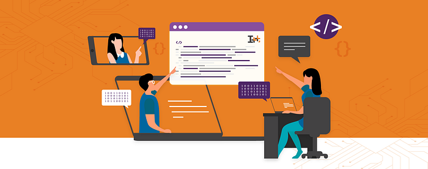

# Level up with Swiggy’s i++

Some problems are good, because they push us to look for solutions. We either find them or create them, as was the case with [i++](https://www.ipp.swiggy.in/) — Swiggy’s exclusive upskilling programme that recently concluded.

When Dale Francis Vaz, Swiggy’s CTO and Vidhya Seetharaman, Director- Chief of Staff realised that there was a dearth of talent within the tech industry, they knew that one of the ways to work on this gap was to create a learning programme.

“It’s one of those large blue sky problems that we were thinking about. We have always wanted to engage with the community and share our knowledge. We’ve been doing that through [Swiggy Bytes](https://bytes.swiggy.com/) (Swiggy’s tech blog) and Gigabytes (the company’s flagship tech forward conference), but we knew that the problem was much bigger. So we decided that we should share our knowledge through a structured learning module,” says Vidhya.

Today, schools, colleges and other online learning platforms follow a certain curriculum, despite this, there’s still a knowledge gap. The team wanted to explore and understand where they were falling short, that’s how the curriculum of i++ fell into place.

i++ in programming parlance is an increment operator, where the value of i is incremented by 1, “We realised that this name fits perfectly for our upskilling programme and went with it,” says Vidhya.

**Exhibiting bias for action**

The programme trains people in relevant engineering skills that are required to meet the needs of internet-scale consumer-product companies

The team, along with Vijay Anand Seshadri, Senior Vice President at Swiggy, worked on ensuring that participants got the best out of it. “Vijay was heavily involved in the programme and we constructed a curriculum out of several components. It included back-end development, and it was not just about programming. We thought of the whole picture, how do you think about a problem statement from end-to-end and then write it, solve it and deploy it to production — we covered that entire flow. That’s what the entire curriculum covers,” Vidhya adds.

Speaking about the programme and his experience, Vijay says. “I think of this program as imparting the key skills required to develop highly scalable and available microservices. We focused on enabling participants to have E2E application development experience on a modern technology stack. I believe this program is creating the next generation of engineers needed to foster a vibrant consumer product ecosystem in India.”

In addition to this, the 26 students of the first batch were part of live classes, with assessments and hands-on labs to build their portfolio. They received access to tech leads and senior engineers from Swiggy, who conducted six masterclasses and AMA sessions.

This programme required participants to dedicate three hours every day. This was spread over the span of 12–13 weeks, and every second Friday saw one masterclass session.

**Breaking barriers**

The first season of this programme began in January 2022, and saw a whopping 12,00o applications from across the country. “We were overwhelmed with the responses. Once we finalised a set of applicants, they were part of two assessment tests. Post that we were able to finalise 30–35 applicants. It was a humongous task, but we were glad with the number of applications,” she adds.

So what was the criteria for people applying to i++? Applications were open to final year students and people with 0–3 years of experience from across the country. “We were definitely looking to support more of the under-represented cohorts from Tier 2, 3 and 4 colleges and cities. I think that shows nicely in the final set that we worked with,” Vidhya says.

There wasn’t any specific skill that they were looking for in the participants, “The curriculum was designed to impart key technical skills, best practices and exposure to experts in product development. We were not looking for any specific technical skills, but for strong motivation to learn, a commitment to succeed in the program and the drive to apply key concepts learnt to build practical solutions,” Vijay explains.

One of the other things that the team was looking for was the ‘ability to learn on their own’. “Self-learning is a huge plus. As much as this is a guided programme, it requires discipline and work, since they had to put in at least 20 hours per week. So the applicant needs to pick up what is being taught and have that drive to achieve it. We also filtered applicants after we understood their intent. And that really was the goal,” Vidhya says.

**2.0 in the making**

When upskilling programmes begin, the enthusiasm is sky high, but sometimes participants drop off along the way. Vidhya mentions that despite their busy schedules, over 75 percent were able to complete the programme.

The masterclass sessions were a hit with the participants. Fasihullah Askiri, whose masterclass on was one of the most popular sessions says, “While preparing for the masterclass, I was surprised to know that the audience had taken a programming challenge as an entrance criteria. This meant that I was presenting to a group of young engineers who already demonstrated that they were serious about learning from the program, so I changed the content accordingly.”

So what happens after the programme? Vijay says, “Among the many methods companies such as Swiggy have for talent ingestion, I think this program is a unique way to upskill and ingest talent that can be productive in corporate environments starting Day 1. I look forward to future iterations of the program where we can apply what we learnt so far and have a broader impact to upskill product engineering talent in India.”

“We have rolled out five entry-level offers, three of which have already been accepted. A lot of them are still completing their internships,” says Vidhya, while adding that a total of three participants have accepted job offers at Swiggy.

Speaking about his experience of the programme, Aaditya Khetan, who accepted a job offer in Swiggy says, “I had a remarkable experience with Swiggy’s i++. The program provided me with a platform to learn some of the best practices in software development. The technical knowledge gained helped me immensely in landing a job at Swiggy. It built a foundation starting from the basic concepts and took us through complex, widely used technologies in backend development.”

While the first season was free of charge, the team could charge a nominal fee for future programs.

As the team prepares for version 2.0, one thing is certain, the program might be packed but if you get through to the other side, you’re already a victor.

_Story by _[_Priyanka Praveen_](https://medium.com/u/9584bb209360?source=post_page---user_mention--a902b73db00a---------------------------------------)

---
**Tags:** Swiggy Life · Learning · Upskilling · Tech Startups · Swiggy Engineering
