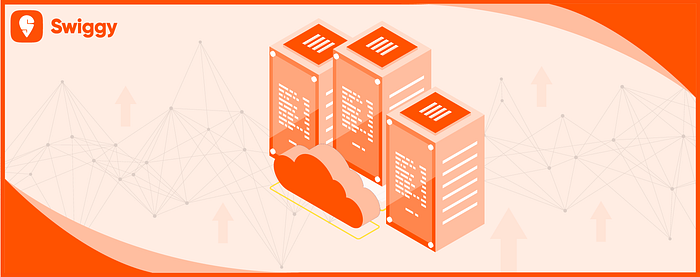
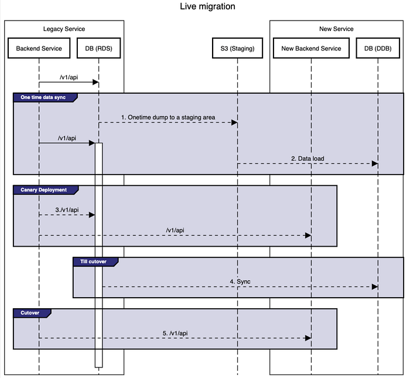
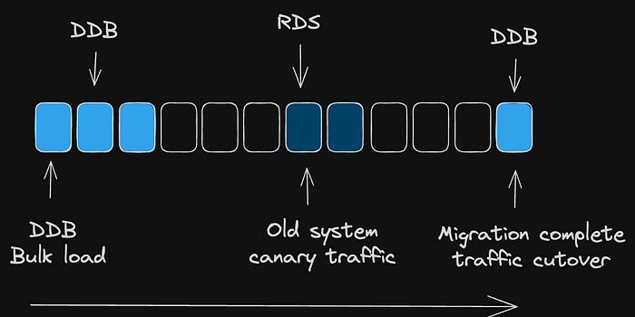

# Live Data Transfer: RDS to DynamoDB Made Easy

## Problem Statement:

In our latest tech initiative, we’ve embarked on a significant security enhancement by developing a centralised auth platform. This state-of-the-art platform adheres to rigorous security standards and incorporates advanced security features. Our journey involved seamlessly transitioning from a legacy system to this new setup without any downtime. This transition also required a database migration. Previously, all details were stored in an RDBMS . Now, they needed to be moved to a new database specifically designed for handling elasticity — and we chose DynamoDB for this purpose. This blog post will delve into the strategy we employed to successfully execute this extensive migration.

## Step1: Data import to DDB

Moving on to the initial phase of our migration process, the primary task was to transfer the existing data into the new DynamoDB (DDB) database. To facilitate this, we harnessed the capability of [imports from s3](https://aws.amazon.com/blogs/database/amazon-dynamodb-can-now-import-amazon-s3-data-into-a-new-table/), an AWS feature that lets you import data from s3 to DDB provided the DDB table does not exist already.

For this pipeline to run, the data needs to be present in s3. Following are the supported formats:

- CSV: Issue with CSV is that it assumes all the attributes to be in _string_ format. No retention of data types of the attributes.
- DynamoDB Json: This is a JSON with DynamoDB recognised data types
- DynamoDB Amazon ION: A special format recognised by DynamoDB

Both DynamoDB JSON and DynamoDB ION retained data types, we opted for the DynamoDB ION format for its ease of conversion and compactness.

To tackle the format conversion, we developed a script specifically designed to parse the data from the CSV format and convert it into the ION format. This script was a crucial component of our migration strategy, ensuring that the data not only transferred successfully but also maintained its integrity and structure in the new environment.

## Eventual Consistency Considerations

### Static Data Import:

While the pipeline imports static data from s3 location to DDB, the table is locked for reads and writes. The data that is being provided in the file is guaranteed to be migrated to the table, if there is any error processing the data, the same will be logged in the cloudwatch logs. However, one cannot do any operations on this new table until the import is complete.

This means that the updates and creations happening on the legacy service while the import pipeline is getting executed will be missed in this new database. These “missed” items have to be taken care of and synced back to the DDB once the import is completed.

### Slow Rollout:

Considering the criticality of the system, we decided to keep a long canary deployment with 2 peaks observed on the canary.

During the slow canary process, updates and creations were happening simultaneously in both the old and new systems. However, the old system wasn’t syncing data back to the new one, leading to potential missed updates during the transition. Additionally, both systems were generating IDs using the same logic, raising concerns about possible ID conflicts with both systems active.

For missed updates, a data store can be utilised which logs the updates having timestamp as identifier. Filtering on timestamp will give all the updates missed in the new table in the specified timeframe.

These creations and updates can be populated to DB using custom scripts/AWS CLI.

**For the ID clashing issue:**

For addressing clash issues, lets say RDS relies on highest ID as one of the parameters to generate a new ID. Let’s assume the last generated ID is 10 by the RDS and the new system starts generating the ID from 50. Since the logic to create ID is same in both RDS and DDB, this can lead to clashes in the ID generated by the new system and RDS. To mitigate such issues, a pseudo entry can be created with a big enough value, let’s say 1000 in RDS before the canary. Now, RDS will use this 1000 in the logic to generate ID. So, during canary the new system generated ID using 50 while RDS using 1000 as the identifier leading to no clashes. Point to note here is that the last ID in the new system needs to be updated to a much higher value post the complete cutover, say 2000 assuming RDS created records with ID < 2000.

## Cost and Execution Time:

[DynamoDB import from S3](https://aws.amazon.com/blogs/database/amazon-dynamodb-can-now-import-amazon-s3-data-into-a-new-table/) doesn’t consume any write capacity, so you don’t need to provision extra capacity when defining the new table. The cost for migrating the data would be the cost for running the pipeline, the s3 storage cost to store the data and the s3 Get object.

The execution time depends on the data structure and is not standardised according to the AWS.

Check [this](https://aws.amazon.com/dynamodb/pricing/on-demand/) for per GB pricing details.

## Points to Note:

1. The migration uses [imports from s3](https://aws.amazon.com/blogs/database/amazon-dynamodb-can-now-import-amazon-s3-data-into-a-new-table/) to import the table. This can be used in cases where the backend can handle a switch over of the new schema as the new table will only have the new schema.
2. This cannot work on existing tables so a new table has to be created as part of the imports.
3. This can even be used for db migration where the source is DynamoDB by utilising [exports to s3](https://docs.aws.amazon.com/amazondynamodb/latest/developerguide/S3DataExport.HowItWorks.html) to get the data, transform the data and use imports to create a table with new data.
4. The imports continuously use user credentials to get the object from s3 to upload to DB for the entire migration. One needs to make sure the user role/credential is active for the entire process.

Migrating a vast amount of data from a legacy system to a new, scalable database like DynamoDB can be a complex process. However, by carefully considering factors like data format conversion, eventual consistency, slow rollouts, and potential ID conflicts, we were able to achieve a seamless transition with minimal downtime. This blog post has hopefully provided valuable insights into the strategies we employed and the considerations we took into account.

Do you have any questions about our migration process? Share your thoughts or experiences with database migrations in the comments below!

---
**Tags:** Dynamodb · Rds · AWS · MySQL · Data
