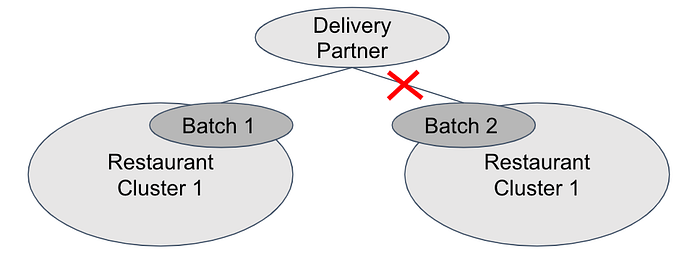
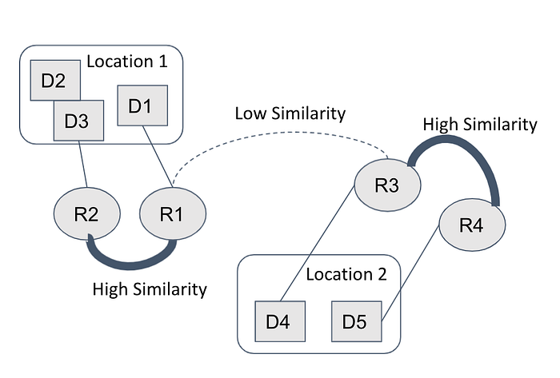
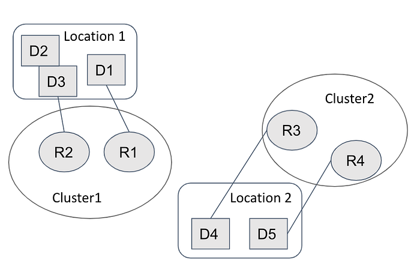
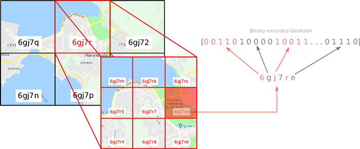
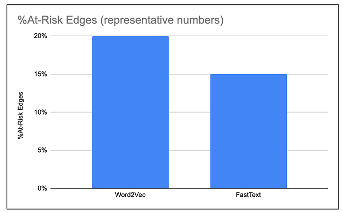

# Logistic Zones for Assignment

Imagine this — You are a data-scientist working with one of the largest convenience delivery firms in the world. For the past few days, you have been working on a new algorithm that would speed up deliveries and cut costs! This algorithm is a new way of deciding which delivery-partner should be assigned to which order. This algorithm is good because it consumes inputs from several machine learning predictions. Predictions which have helped you account for all the potential variables — the customer’s expectations, the real-time traffic and the delivery-partner’s familiarity with the area.

You eagerly deploy this algorithm to test it out in a city. But it doesn’t work out. Why? Because it is simply too heavy. It simply takes too long to run! Orders keep piling up and delivery-partners keep waiting for their next duty — but the algorithm is just too slow! You can increase its speed by making it simple, removing a feature here, a tree there. But all that does is it turns your algo into a Random Forest Gump!

At Swiggy’s Core-Logistics data science team which focuses on algorithms to improve the delivery experience, this is a doomsday scenario we are all afraid of! Swiggy has been growing at a remarkable pace since its inception. With the recent foray into grocery delivery, the growth does not seem likely to slow down anytime soon! Doomsday hasn’t happened yet, and we are working proactively on ways to avoid it! The solutions have been quite fun — like combining word-embeddings with maps-data to create location-clusters. This may sound like a random juxtaposition of ML buzzwords. But the solution we’ll walk you through in the upcoming blog does precisely this. First, let’s start with a brief overview of the assignment algorithm itself.

**Assignment Algorithm**

A batch consists of one or more than one orders that are delivered together by a single delivery partner. The assignment algorithm decides which batch of orders should be assigned to which delivery partner. At max one partner can be assigned to one batch. It is an Integer Linear Program ([ILP](https://en.wikipedia.org/wiki/Integer_programming)) optimization algorithm that tries to minimise the overall cost of delivery and maximise customer experience. To attain optimum solution, all batches and delivery partners that could influence each other should participate together in the optimization run. As such, the assignment algorithm runs for all the active batches and partners from a particular city. Runs happen at short and regular intervals.

The runs for different cities are also asynchronous and hosted on different machines. As such the latency of any assignment run is constrained by the number of batches and partners present in the particular city. There are two reasons for an increase in latency of this algorithm:

- Increasing number of orders: This leads to an increase in the number of batches. We also hire more delivery partners to serve the higher number of orders. Both these factors lead to an increase in latencies.
- Machine Learning Algorithms: Machine learning algorithms are used to compute inputs to the assignment algorithm. Eg: Delivery cost is driven by the total distance travelled by the partner and the time spent waiting at the restaurant. Individual ML algorithms are used to predict both of these components. ML algorithms are integrated using APIs. When the model is called, relevant features are fetched from a DSP platform. As such, each call to the model has some latency associated with it. As the number and complexity of such algorithms increase, the latency increases.

**Logistic Zone or Cluster level Assignment**

One way of maintaining low latency despite these factors is to divide the city into logistic zones and run independent assignment algorithms for each logistic zone. This would reduce the number of orders considered for assignment in any single run of the algorithm and would thus reduce the overall runtime.

**Sub-optimality in cluster-level assignment**

As mentioned in the section on the assignment algorithm, at max one partner can be assigned to one batch of orders. This is one of the constraints in the setup of the assignment algorithm required to provide a feasible solution. This constraint is easily enforceable in a single city-level assignment run. In cluster-level assignment however, since assignment for multiple clusters could run in parallel, one delivery partner could be assigned to two or more batches from two different clusters.

*Figure 1*

In such a scenario, we would assign the partner to the first cluster to complete its assignment run. The batch from the other cluster would now need to wait until the next scheduled run to get assigned to a new delivery partner. If it is assigned to a partner who is further away from the restaurant and would need to travel more- the delivery cost could increase.Delivery for the order might also get delayed due to the delay in assignment, leading to a decline in customer experience. The final cost of assignment for such a batch could be higher than its original cost of assignment. This scenario which pops up due to cluster level assignment would be the source of sub-optimal assignment.

**Methodology to create Logistic Zones**

A method of creating logistic zones for assignment should have the following characteristics:

- Minimise sub-optimal assignments: The method should minimise the number of instances where the same delivery partner is assigned to more than one batch from different logistic zones
- Auto-scaling: The expected runtime for the assignment algorithm depends on the number of (delivery partner,batch) combinations that participate in assignment. Increasing the number of clusters would increase suboptimal assignments. As such, the method should automatically pick the right number of clusters based on the expected runtime. The number of clusters should increase as the expected runtimes increase.

Based on these, we propose the following method for creating logistic zones (or restaurant clusters):

**Step1: Training Restaurant Embeddings**

Create embeddings for each restaurant. Train the embeddings in such a way that orders from restaurants with similar embeddings are usually assigned partners from similar locations.

In the example seen in figure 2, orders from restaurants R1 and R2 are historically assigned partners from location 1 while orders from restaurants R3 and R4 are historically assigned partners from location 2. The embeddings would be trained in such a manner that R1 and R2 would have high similarity while R1 and R3 would have low similarity

*Figure 2*

**Step2: Deriving Clusters from Embeddings**

Create hierarchical restaurant clusters based on the embeddings. Restaurants with high similarity would have a higher chance of belonging to the same cluster. This would reduce the chance of a delivery partner being assigned to two batches from different clusters. In the example from figure 3, R1 and R2 would form cluster1 while R3 and R4 would form cluster2. Since partners from location1 are usually assigned to orders from cluster1 and partners from location2 are usually assigned orders from cluster2, the chance of a cross-cluster assignment reduces.

*Figure 3*

**Step3: Dynamic nature of clusters**

Hierarchical clustering maintains the hierarchy of restaurants based on their similarities. Clusters of different sizes could be derived from the same hierarchy. At low latencies, we could be at the top of the tree with no clusters. As latencies increase, we could move down the hierarchy and create a higher number of clusters.

**Restaurant Embeddings**

We have looked at the overall proposal to create the hierarchical zones in the previous section. The most interesting piece of the puzzle is to create the restaurant embeddings. The objective is to train the embeddings in such a way that orders from restaurants with similar embeddings are assigned partners from similar locations. That is where the location-intelligence/nlp crossover comes in!

- First, let’s abstract out restaurants with their locations. Restaurants in close proximity to each other would be assigned delivery partners from a similar locality as well. As such, we create embeddings for restaurant-locations, not restaurants.
- Restaurant locations are captured by geohashes. Each geohash denotes a rectangular grid. A geohash encodes a geographical location into a short string of letters and digits. Geohashes have a hierarchical structure as seen in figure 4. All restaurants from a certain geohash7 (150*150meters) have the same embedding.

*Figure 4*

We derive training data from all (batch,delivery-partner) combinations that were considered for assignment over a historical period. The training data is devised as follows:

- Consider all (batch,dp) combinations that were ever considered for assignment. Each such combination is called an edge
- Let r = r(batch) be the respective restaurant for the batch
- Let g(r) be the geohash for restaurant r
- Let g(dp) be the geohash for the location of the delivery partner when he/she was considered for assignment with the batch
- g(r) and g(dp) are both alphanumeric representations of the respective geographical locations. As such, they can be treated as words.
- Every combination (g(r),g(dp)) can thus be treated as a sentence

Going back to the philosophy behind the restaurant clusters, restaurants with similar embeddings should be assigned partners from similar locations. As such, restaurant-geohashes which frequently co-occur with similar dp-geohashes should be similar.

This is very similar to the idea behind word embeddings like word2vec — words which often co-occur with similar words(and thus have similar context) should have similar embeddings. Since we are treating geohashes as words, we can use the word-embedding methods to derive the embeddings for our restaurant locations!

And there you have it! Logistics, Location Intelligence and NLP all put together! We consider two different methods of creating word embeddings:

- Word2Vec: Word2Vec creates word-embeddings in such a way that two words with similar context have similar embeddings. Remember the king:man::queen:woman examples from yore!
- FastText: FastText is an extension of Word2Vec. Along with words, it considers individual n-grams which make up a word. Embedding for a word is the mean of the embeddings of the individual n-grams that make up the word. In classical NLP, this allows us to get embeddings for new words that aren’t a part of the training data. In our use-case, FastText serves a different purpose altogether!
- In our use-case, we treat geohashes as words. As shown earlier, geohashes have a hierarchical representation. Eg geohash6 like ‘gbsuv1’,’gbsuv2’, ‘gbsuv3’ etc would all map up to a common geohash5 — ‘gbsuv’. This would in-turn map to a common geohash4 — ‘gbsu’ and so on.
- Thus n-grams derived from geohashes capture geographical information! Say we plan to derive the embedding for a geohash6 like ‘gbsuv1’. While training the embedding, if we set the minimum-length of the n-grams to 5, then two possible n-grams would be considered in training — ‘gbsuv’ and ‘bsuv1’. The first of these would effectively capture the geographical proximity of ‘gbsuv1’ to all its sister geohashes.
- As we will see in the following section, restaurant embeddings derived from FastText perform much better than vanilla word2vec due to this reason.

**Evaluating the restaurant clusters**

As seen earlier, cluster-level assignment leads to sub-optimality when one delivery partner is assigned to two or more batches from different clusters.

A delivery partner (dp) is said to be at-risk if s/he is considered for assignment for two or more batches from different clusters. Each (batch,dp) combination or edge created by that dp is said to be at-risk. The best embedding method would minimise the percentage of such at-risk edges.

*Figure 5*

Clusters created using FastText were observed to have a significantly lesser percentage of at-risk edges as compared to those created using Word2Vec.

**Evaluating the on-ground impact of the clusters**

To evaluate the on-ground impact of splitting assignment within clusters, we created a version of these clusters in our simulation environment. Results from these simulations showed that we were able to reduce the run-times for the assignment algorithms with minimal impact on any of the business metrics like cost or customer experience.

With this, we concluded our POC for cluster-based assignments. Work on actually integrating these clusters within the production assignment algorithm is currently underway. We will share the results from real-life implementation of these clusters in the future!

**Acknowledgements**

Thanks to Aadit Kapoor for tenaciously driving the project. Special thanks to Goda Doreswamy for visualizing the project and leading us through its execution!

---
**Tags:** Swiggy Data Science · Logistics · Predictions · Machine Learning · Indian Startups
