# Making Swiggy Buttery Smooth

A good mobile developer not only does the day-to-day feature building but also takes care of the performance of the app and tech enhancements.

At **Swiggy, **providing a seamless experience to our end users is our core focus, where we always push ourselves to make the mobile app smooth as butter and give the best possible experience to the end-users.

In this article, we will jot down the various tech and app improvements we have made to the Swiggy iOS app.

## 1. Measuring User perceived performance.

An improvement of any sort is no good if you don’t have numbers to back it up. Therefore it’s very important, that you always add analytics/instrumentation to see the impact of your changes.

For our app, we already had page load times. But that is not necessarily significant for the end-user as he/she will perceive page load differently.

**One example is: **When our app is launched, before showing Home Page, we have intermediary screens and logic which also takes some amount of time.  
So we came up with a Metric called **First Time to be Interactive.  
**How much time will it take for users to interact with our app?  
This is the time taken from the app icon clicked to our Home Page Rendered.

> In iOS terms, it starts from AppDelgate to Splash Screen to SDKs Initialization to Location Fetch and then Home Page Rendered after API call.

**Another example is: **From the moment user clicks on any Restaurant from anywhere to the time its Menu Page is rendered - **Menu Screen Load Time**

> In iOS terms, it starts from didSelectItem to Push View Controller to Menu Page Rendered after API call.

We then started measuring these kinds of metrics over NewRelic and worked on improving those numbers. After our changes below, we were able to clearly see the reduced load times via graphs.

## 2. Smart API sequencing

Like any other app, we also have our Home Page where we show all our offerings. But this is not the first screen the user sees. First comes Location Screen, where we show the user's current location. After that comes the Home Screen, where we call a home API to fetch the data.

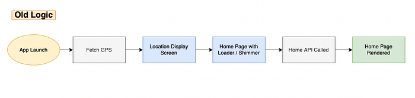
*Steps before Home Page is rendered*

As of now, we were calling all these APIs synchronously, one after another.  
Our Home API just needs latitude and longitude to give us the required data.

Then we thought, why not call our Home API as soon as we get the user's location, cache the response in the app, and then when the user lands on Home Screen, use that response to render the page.

This means, that the user doesn't have to wait on the Home Screen for the API call to complete. Instead, that page will be loaded instantly.

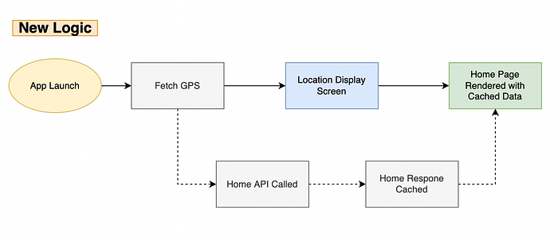
*Parallel API Calling*

Side by side comparison of the app before and after this. Won’t tell which is which. It should be visible :P

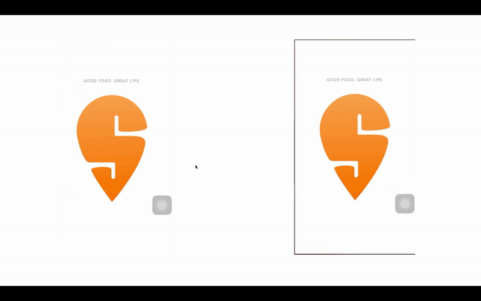
*Before and After Smart API Sequencing*

Talking about the numbers, these changes have helped us **reduce our First Screen Visible time by half (from 6 secs to 3 secs)**

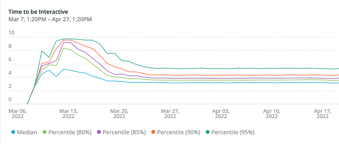
*Time taken from App Launched to Home Page Rendered*

---

## 3. Prefetching API Response

In cities where we have multiple offerings besides food, we have kept a tab bar where our 1st tab is Home Page which is a landing page that shows all our offerings. And our 2nd tab is the Food Page which shows the collections of restaurants in your area.  
As Food is our MSP, we thought why not prefetch the second tab response beforehand only. Thus when the user switches tabs, he/she would not experience any loading state.  
This technique helped us **reduce our Food Tab Load Time from** **2 secs to 0.5 sec**

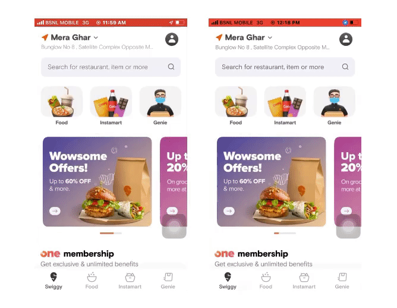
*Left one without prefetching and right one with prefetching response*

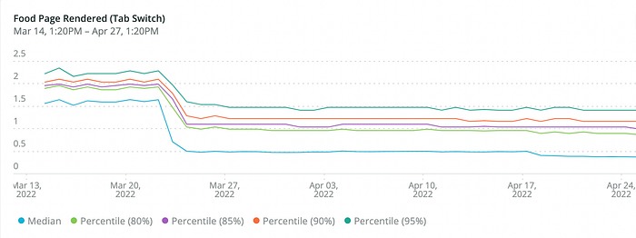
*Time taken from 2nd Tab Clicked to 2nd Page Rendered*

---

## 4. Rendering Smaller Images on Bigger Views as placeholders

Swiggy is a content-rich app. For any Restaurant Item, its image appeals a lot to the user. Therefore the quality should be best for that. But a good quality image will be large in size and takes time to download. We faced the same problem on our Menu Detail page where the image takes a lot of time to download as it's large in size.

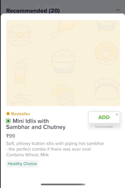

To fix this problem, we came up with a unique idea. We already had the same image in a different dimension for the in-line menu item. We thought why not use that image as a placeholder till the time, the bigger image gets downloaded.  
We expanded the smaller image over the bigger image view, which looked a little blurry but gave a preview of the dish and when the bigger image was downloaded, we safely replace the same.  
This gives the user a feel of a progressive image without increasing any network usage.

---

## 5. Managing Image Scale Factor

Different devices have different pixel densities. Therefore they can have different DPR(device pixel ratio). Depending on the device, we can accomplish better rendering by multiplying the number of pixels in each image by a specific scale factor. That's why we have 2x and 3x images in our Xcassets file.

For our remote images also, we add the scale factor(image multiplier) to fetch higher resolution images depending upon devices. For eg: If we have an imageView of 50*50 and a device let's say iPhone Xs, we fetch 3x image size(150*150) from our remote server.

Recently we revamped our whole UI. On our Menu page, the dish image size got increased. Bigger dimension images started taking more time to download, therefore increasing our page load time.

What we observed was, that if the images are not that big in a size, for higher density phones, instead of making the dynamic scale factor (3x), we can make it 2x, it won't have any visual difference, but the size decreases significantly.  
This has helped us in reducing our page load time significantly.

*The same image with 3x resolution is 19KB and 2x is 9KB*

Note: For our bigger images, we have still kept the dynamic scale factor so that image quality is not compromised.

---

## 6. Navigation Bar Smoothening

Navigation is the most important part of the user experience. Our goal is to help users move swiftly in the app. On many screens, our navigation experience was broken. When the user tried to navigate with the swipe gesture, our navigation bars started breaking.

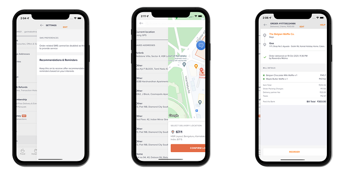
*Broken Transitions*

This was happening because we were using a mix of default navbars and custom views. And, hiding/unhiding those navbars was causing the issue.

Thus, to fix it, we came up with our own navigation system, which can act either as a default navigation bar or as a custom view. Each View Controller has a base class through which the VC can initialize Navbar. It can be initialized by passing title, subtitle, and bar button items making it similar to the default navbar or a custom view can be passed.

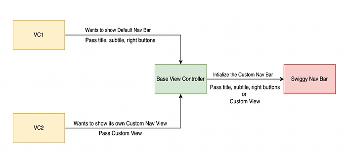
*Initialize Navbar through Base VC*

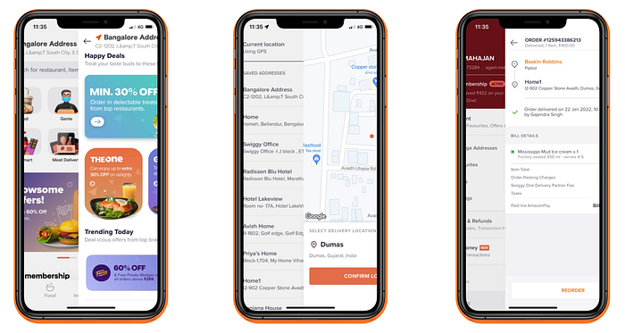
*Transitions now working smoothly*

---

## 7. App size Reduction

In addition to making the app smoother and faster, we should also take care of our app size.

Since Swiggy as a company is getting into different offerings, our code, libraries, and assets also keep on increasing. It's very important for us to keep a check on our app size and try to reduce it as much as possible so that a user doesn’t feel that we are taking up too much space on their device.

We did a couple of exercises to help achieve our goal

1. We scanned our app for unused media assets. Removed which were no longer getting used.
2. We scanned our app for unused libraries and removed the same.
3. For our image assets, we ran them over the [Tiny PNG](https://tinypng.com/) tool which optimized our images and reduced the image sizes significantly.

## What does TinyPNG do?

> TinyPNG uses smart lossy compression techniques to **reduce the file size** of your WEBP, JPEG and PNG files. By selectively decreasing the number of colors in the image, fewer bytes are required to store the data. The effect is nearly invisible but it makes a very large difference in file size!

All these exercises help in **reducing app size by ~8MB. **  
This is an ongoing exercise and we will continuously optimize our app size.

---

## 8. Clear Media Cache

Over the period, any app’s cache keeps on increasing. The main contributor to this is Videos and Images. And, increase in cache means an increase in the user’s storage.

Unlike Android, iOS doesn't give an option to the user to clear a specific app’s cache. We thought why not give an inbuilt setting within the app for users to clear the media cache (accumulated by caching videos and images).

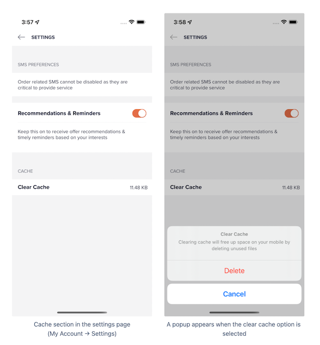

This option gives power to the user to see the run time app consumption and clear the same.

## Conclusion

Being a consumer-first organization, we at **Swiggy** are not just focused on creating an interactive user interface but are also driven to create a high-quality, enhanced, and buttery smooth user experience. 🧈

> Credits to the entire iOS team of Swiggy for helping to achieve these performance improvements.  
> [Mitansh Mehrotra](https://medium.com/u/cb86010f8eb?source=post_page---user_mention--5e3a15b931bf---------------------------------------), [NIHAR RANJAN](https://medium.com/u/4d81372863f6?source=post_page---user_mention--5e3a15b931bf---------------------------------------), [Shashwat Mithyantha](https://medium.com/u/9e32ea731bff?source=post_page---user_mention--5e3a15b931bf---------------------------------------), [Priyam Dutta](https://medium.com/u/828c8792b774?source=post_page---user_mention--5e3a15b931bf---------------------------------------), [Ashirvad Jena](https://medium.com/u/6fcc2857c082?source=post_page---user_mention--5e3a15b931bf---------------------------------------), [sreekanth m](https://medium.com/u/fac662e5a2ea?source=post_page---user_mention--5e3a15b931bf---------------------------------------), [Hari Krushna Sahu](https://medium.com/u/37866fe157b4?source=post_page---user_mention--5e3a15b931bf---------------------------------------), [Garima Bothra](https://medium.com/u/8954ff43cd93?source=post_page---user_mention--5e3a15b931bf---------------------------------------), [Lunasahil](https://medium.com/u/44f8a24a0ac4?source=post_page---user_mention--5e3a15b931bf---------------------------------------), [Mayank Jha](https://medium.com/u/4bb1b7609dfe?source=post_page---user_mention--5e3a15b931bf---------------------------------------)

---
**Tags:** IOS · Mobile App Development · Swift · Swiggy Mobile · Performance Improvement
