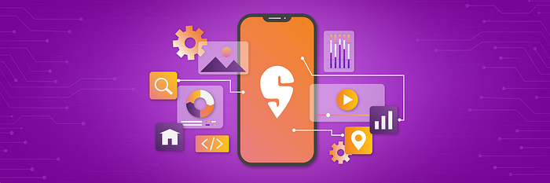
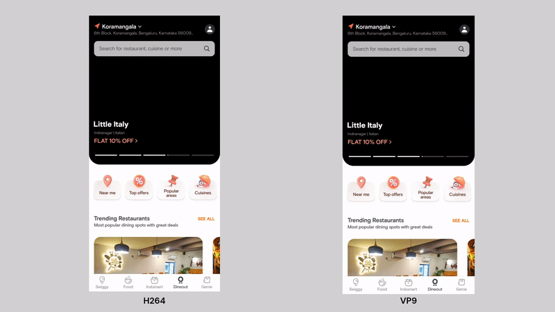
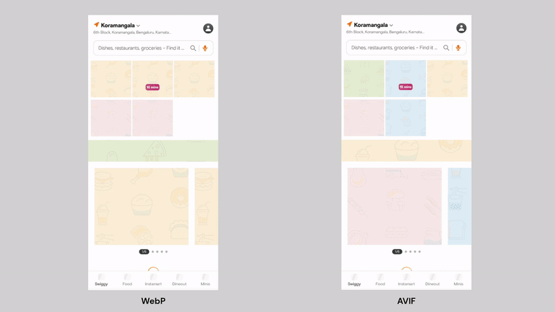
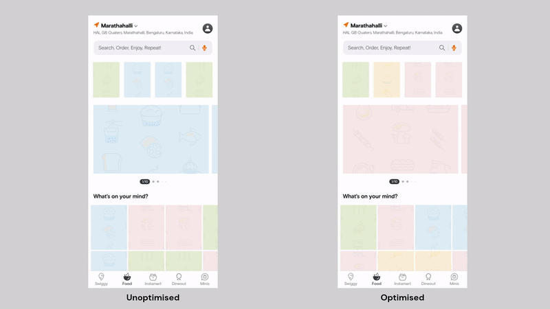
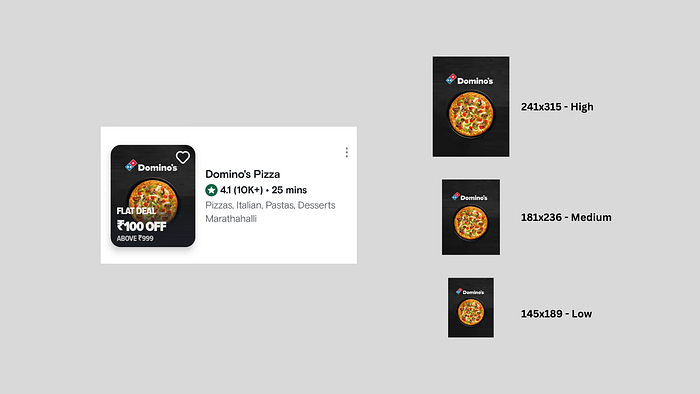
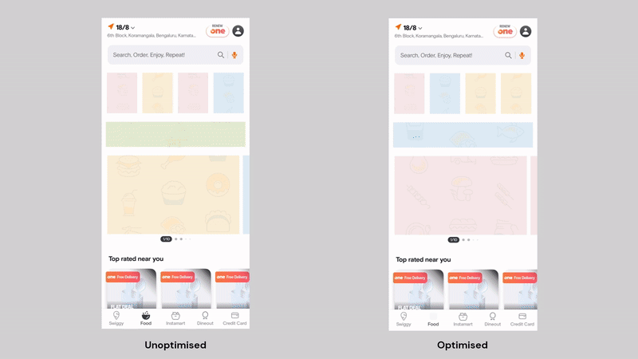
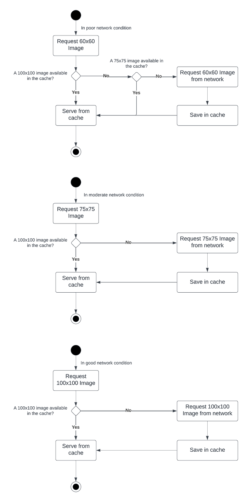
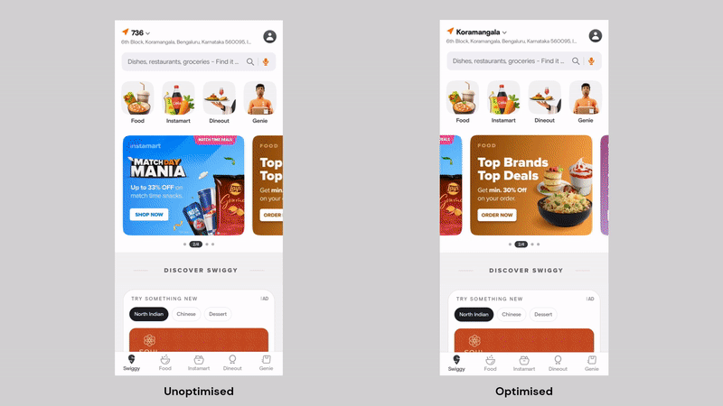

# Media on Swiggy’s Mobile Apps

Swiggy believes that a seamless and enjoyable user experience is essential to boost engagement. Images and videos are an integral part of that experience. Promotions, marketing campaigns, featured products and discounts in Swiggy are highlighted with eye-catching visuals that encourage users to explore them.

Users open Swiggy with various intentions. Users ordering in look for the variety of food the restaurants offer. Users shopping for groceries may look for a collection of fruits and vegetables available. Users dining out look for the dining menu and the ambience. Pictures and videos help them discover what they want. So it is essential to showcase them in high quality.

An experiment at Swiggy revealed that using high-quality media with animations improves clickthrough rates by a very good margin. However, ensuring the users are experiencing high quality while optimising for performance and cost is a big engineering challenge. Users access the app from a variety of devices and network conditions, and slow page loads, unresponsive apps and delays in data retrieval frustrate users.

This article uncovers the techniques and methodologies Swiggy uses in the mobile apps to deliver high-quality media optimised for user experience, performance, network and cost.

## 1. Media Codec

Choosing the right codec and format for media is crucial. The compression technique used significantly reduces the file size of the media. Swiggy is a media-heavy application. File sizes have a direct impact on the load time and consequently on the user experience.

### Videos

H.264 ([Advanced Video Coding — AVC](https://en.wikipedia.org/wiki/Advanced_Video_Coding)) is a common codec used with the MP4 format. This is supported by a wide range of mobile devices and has extensive hardware decoding support.

[VP9](https://www.webmproject.org/vp9/) is an open-source video codec developed by the [WebM project](https://www.webmproject.org/) delivering good quality at lower bitrates and smaller file sizes.

Swiggy uses VP9-encoded videos to leverage the good quality they provide at relatively lower bitrates. This translates into faster video load times as the download size is small, delivering a seamless user experience.

*Videos encoded with VP9 loading faster than H264*

The average response time of the app’s video requests reduced by **~42%** on using VP9 videos.

[AV1](https://en.wikipedia.org/wiki/AV1) is an open-source royalty-free video codec developed by [Alliance for Open Media](https://aomedia.org/) delivering better quality at even lower bitrates than VP9 with much smaller file sizes.

While AV1 retains more details at lower bitrates, Swiggy is still experimenting with this format as encoding times for these videos are higher than VP9, not many media management services support AV1-encoded videos, and very limited devices support hardware-accelerated decoding.

### Images

[WebP](https://en.wikipedia.org/wiki/WebP) is an efficient image format that uses the VP9 compression algorithm. Most apps and websites today use this format for efficient delivery of images. WebP images are ~30% smaller in size than JPEGs.

AV1 Image Format ([AVIF](https://en.wikipedia.org/wiki/AVIF)) is an advanced image format based on the AV1 compression technique that delivers high-quality images with best-in-class compression. AVIF images are on average ~30% smaller than equivalent WebP images.

Swiggy uses AVIF for images to capitalise on the good quality it offers at a relatively smaller file size. The pages load relatively faster as the file size is smaller.

*AVIF images loading faster than WebP*

[Glide](https://github.com/bumptech/glide) has an [integration library for AVIF](https://bumptech.github.io/glide/int/avif.html) which uses [libavif](https://github.com/AOMediaCodec/libavif), a C implementation of AVIF decoder developed by AOMedia.

Using AVIFs reduced the average response time of the app’s image requests by **~21%**.

## 2. Dimensions

When loading media in a mobile app, it is ideal to load them with a resolution matching the dimensions of the view in which they are rendered. This has the following benefits:

1. Optimal Visual Quality
2. Optimal Bandwidth Usage
3. Efficient Rendering

Loading images with resolution matching view dimensions ensures the image is rendered sharp with the right amount of details for the dimension. This also prevents loss of quality because of upscaling to fit the size of the view.

The original images stored in the media management service are of very high resolution, and are dynamically resized on air to the requested resolution and cached in the CDN.

High-resolution media are large and require more bandwidth to download. Loading media matching the view dimension ensures optimal bandwidth usage as it is much less in size than the original high-resolution media, and loads faster resulting in an enhanced user experience.

*Requesting images with optimal resolution leading to faster page loads*

Upscaling, downscaling or transforming media on the device consumes a significant amount of computational resources. High-resolution media require more memory to process and render. Loading images at optimal resolution reduces overall computations and memory usage leading to better performance when rendering.

## 3. Network Conditions

Factors such as fluctuating network speeds, intermittent connectivity, and varying network congestion pose a huge challenge when handling media in a mobile application. These diverse network conditions and uncertainties lead to slow loading times.

Slow loading times hamper the responsiveness of the app and lead to poor user perception of the app’s performance, resulting in decreased user satisfaction and engagement.

During conditions where the device is struggling for bandwidth, uninterrupted user experience is the top priority. The media has to be downloaded as fast as possible with the limited bandwidth available. During these cases, media with slightly lower resolution than the original one can be requested, so it is smaller in size and quickly downloaded.

To provide the best experience for our users under different network conditions, the connection quality is categorised into 3 different types: **good, moderate and poor**.

Determining the quality of the network can be tricky and being connected to a 5G network does not guarantee high internet speeds. [Network Connection Class](https://github.com/facebookarchive/network-connection-class) is a library developed by Meta that helps identify the quality of the connection by listening to the network traffic and categorising the quality.

During poor network conditions, the media requested from the network is 40% less in resolution than the originally requested resolution. The magic number 40 is based on our continuous experimentation balancing image quality with load time. The media requested is less in size and downloaded quickly ensuring an uninterrupted user experience during poor network conditions.

During moderate network conditions, the app provides a much richer experience while balancing the load time. The magic number for moderate network conditions turned out to be 25. The media requested are 25% smaller in resolution than the originally requested one providing a richer experience with better media quality.

During good and excellent network conditions, the app provides the best experience possible as loading times would not be an issue. The media requested during these conditions are the same as the originally requested media ensuring a high-quality user experience.

*Images downloaded at different resolutions based on network conditions*

*Load time improvement during poor network conditions*

## 4. Caching

The Swiggy Android app uses [Glide](https://github.com/bumptech/glide) to load images and [ExoPlayer](https://developer.android.com/guide/topics/media/exoplayer) to load videos.

Swiggy primarily uses caching for the following reasons:

1. **Improved Performance**: Images already available in the cache can be served directly.
2. **Optimal Bandwidth Usage**: Already requested images do not have to be re-downloaded reducing network calls.
3. **Cost Savings**: Reduced bandwidth usage on CDNs saves money.

In addition to standard caching techniques used with these libraries, the app maximises the utility of cached data particularly during poor and moderate network conditions.

### Intelligent Cache Search

As discussed in the previous section, the connection quality is categorised into 3 types: poor, moderate and good, and the images are requested with the optimal resolution for the connection quality. The app enhances the experience during poor and moderate network conditions by making optimal use of higher-resolution images that may already be available in the cache.

For example, if the app needs to render a 100x100 image onto an `ImageView` and the network condition is poor, the image would be requested with a reduced resolution of 60x60 optimising for poor network. But before actually requesting it, Glide is configured to look for a 100x100 image that may be cached during good network conditions and a 75x75 image that may be cached during moderate network conditions.

*Cache search under different network conditions*

This is made possible by modifying the `MultiModelLoader` of Glide, acquiring alternate keys from `LoadData` and using the constructor variant of `LoadData` that accepts alternate keys.

By implementing this, the user experience during poor and moderate network conditions is enhanced as users experience faster page loads with improved image quality. Additionally, image delivery cost is saved as the higher-resolution images available in the cache are reused.

*Rendering of high resolution images from cache during poor network condition. In reality, some images would still be loaded from the internet as the content on the page changes from time to time.*

---

This article has uncovered how Swiggy apps navigate engineering challenges in media delivery.

_I am _[_Vignesh Muralidharan_](https://www.linkedin.com/in/vignesh-em/)_ from the Consumer Apps division at Swiggy. This article would not have been possible without contributions and support from the team. I would like to thank _[_Minaal Arora_](https://www.linkedin.com/in/minaal-arora/)_ for helping with the implementation of Intelligent Cache Search. I would like to extend my thanks to _[_Farhan Rasheed_](https://www.linkedin.com/in/farhanrd/)_ for improving this article and providing valuable insights. I would like to express my sincere gratitude to _[_Sambuddha Dhar_](https://www.linkedin.com/in/sambuddha-dhar-84769356/)_ and _[_Tushar Tayal_](https://www.linkedin.com/in/ttayal/)_ for reviewing the article and providing feedback._

---
**Tags:** Media · Performance · User Experience · Android · Swiggy Mobile
