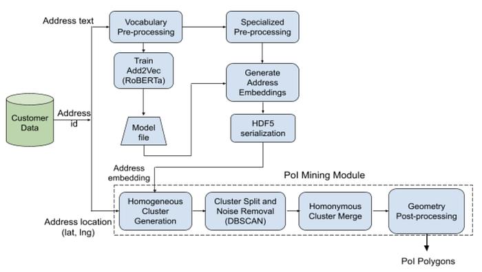
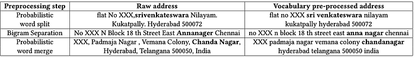
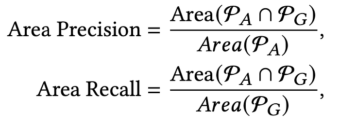
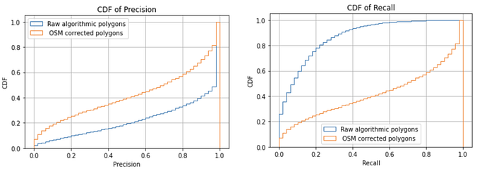
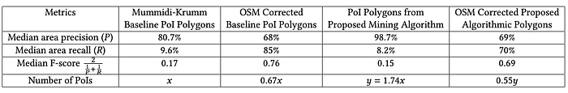
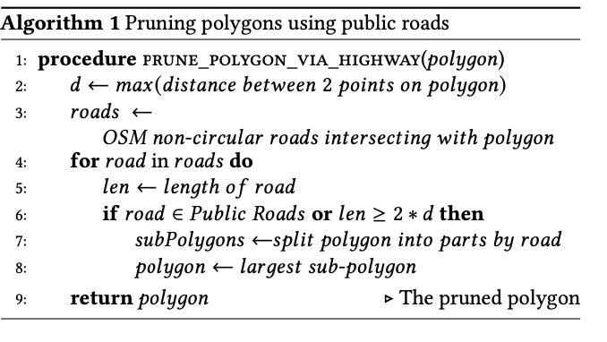
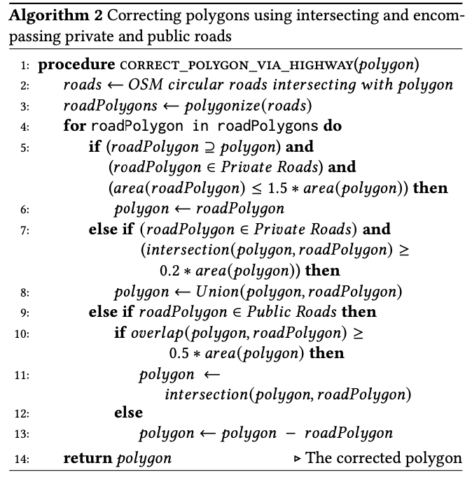
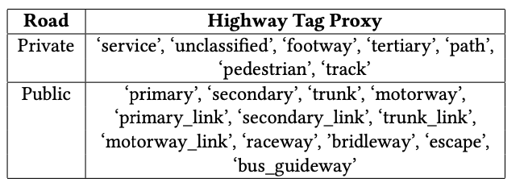

# Mining PoIs via Address Embeddings: An Unsupervised Approach

Co-authored with [Anubhav](https://www.linkedin.com/in/anubhav-5209729/) and [Jose Mathew](https://www.linkedin.com/in/jose-mathew-550aa525/)

## Introduction

A “point of interest” (PoI) is defined as a geographical location with simple associated metadata that could include a name, unique address identifier, information about the building at the location such as opening and closing hours, and other complex metadata like three dimensional models of the building at the location. PoIs include wide categories of public and private spaces such as hospitals, shopping malls, restaurants, retail stores, residential compounds, business establishments, educational institutions, sports centres and parks. These PoIs are typically represented as a point on a digital map or as a polygon indicating the boundary of the PoI. We refer to polygon representations of PoIs as PoI polygons.

Vast repositories of open-source data on PoIs are available as Voluntary Geographic Information (VGI). VGI includes crowd-sourced digital maps such as the OpenStreetMap (OSM). The use of raw VGI data for enterprise applications is limited by the absence of data quality guarantees. For example, data quality issues can arise due to various reasons such as lack of expertise of the volunteer in consistent use of terminologies (such as `road’ or `street’) and absence of well-defined guidelines in countries like India where addresses can be diversely structured.

The work by [Mummidi and Krumm](https://link.springer.com/article/10.1007/s10708-008-9181-5) used text annotated geographical pushpins that were obtained by crowdsourcing for an early version of Microsoft Bing maps. This work used hierarchical agglomerative clustering on the geographical locations and independent thresholds on Term Frequency-Inverse Document Frequency (TF-IDF) and Term Purity (TP) of n-grams for each cluster in order to shortlist the PoIs. The TP factor measures the fraction of points within a cluster that contains a certain n-gram. The TF-IDF criterion measures the fraction of points within a cluster that contains an n-gram as opposed to the appearance of the n-gram in the overall corpus. The extracted n-grams were declared to be the PoI names.

Our work focuses on mining PoI polygons in the context of online food ordering and delivery platforms. Online food deliveries happen in a hyperlocal setting with bounded delivery times, typically under thirty minutes to deliver an order. Customers onboard their addresses using their smartphones indicating the location where they want the delivery to happen. Each address for every customer is assigned a unique identifier _address_id_. Each _address_id_ is associated with an address text, which is the textual representation of an address, and an address location which is the geographical location of the address collected using GPS and represented as a (latitude (lat), longitude (lng)) pair. The PoIs need to be identified from such onboarded address texts and address locations. To reiterate, these PoIs could represent residential complexes, office spaces, hostels, and hospitals to name a few. At enterprise scale of data, these PoIs could be densely located in a given geography, and hence, algorithmically locating these PoIs accurately becomes challenging even with location data. Some of the challenges in our dataset are listed below.

- Customer addresses in India are not structured homogeneously like in some developed western nations. In other words, the customer addresses are not neatly partitioned into their entities such as the flat number and the PoI name. It’s practically impossible to enforce this at the scale we operate.
- Customers do not use consistent spellings in English. A vast majority of the PoI or locality names written in English are rooted in Indic languages which are mostly phonetic while English is not a phonetic language.
- It’s not known a priori if an address belongs to a PoI until we manually investigate the addresses. The PoI names are also unknown a priori.

The challenge lies in mining PoIs from unstructured addresses that are written with diverse spell variations in dense urban settings where traditional approaches based on location-only clustering or using Term Purity like in the work of Mummidi et al. have limitations. Location-only clustering based on density has no address text intelligence and are hard to tune in Indian settings where the addresses have high variance in the geographical distribution. The approach in Mummidi et al. does not account for spell variations. For instance, a PoI by the name _HappiStay_ is written as _Happy Stay_, _Happystay_, and _Happi stay_. These spell variations are best addressed through contextual text embeddings.

Some use-cases that the PoI polygons serve in our context are listed below.

- These boundaries serve us in batching orders for deliveries for those originating from the same PoI around the same time to ensure efficient deliveries.
- Knowledge of entry gates to the PoIs helps with efficient last-mile routing. In other words, it helps to route our delivery partners to the closest entry gate for a customer order in case of large PoIs with multiple entry gates. The PoI boundary helps in algorithmically identifying entry gates to the PoIs by overlaying our Delivery Partners’ (DE) GPS trajectories collected during order deliveries. Note that we are not interested in building footprints themselves which are the typical available polygons on the OSM database. We want to draw a boundary that encompasses the whole private access compound of a residential apartment or an office building. Such boundaries are useful in identifying entry gates to the PoIs.
- Knowledge of PoI boundary helps segment customers which in turn can be used for targeted coupons and discounts.

The high-level ideas of our unsupervised PoI mining system are presented below.

- The address texts are preprocessed using locality data obtained from real estate websites in India. These address texts are converted into a 300-dimensional contextual vectorial representation (Add2Vec) using a deep learning-based model, [RoBERTa](https://arxiv.org/abs/1907.11692). We concatenate this address embedding with the address location given by (lat, lng) using a scaling factor to form a feature vector for every address id. This feature vector is used for hierarchical agglomerative clustering to identify PoI candidates.
- We shortlist the clusters as PoI candidates using a cluster homogeneity criterion.
- The shortlisted PoI candidates are then post-processed in a novel manner by eliminating noisy GPS points in the clusters, merging clusters with similar names through a graph-based technique, discarding redundant polygons, and merging intersecting polygons. The PoI polygons are obtained as the convex hulls of points within the clusters.
- The polygon boundaries are manually validated and adjusted using satellite imagery.
- Our algorithm also identified 74.7 % more PoIs than that identified by the Mummidi-Krumm baseline algorithm run with relaxed parameters over our internal dataset.
- In order to improve the median F-score of the algorithmic polygons, we correct the polygon boundaries using building footprint polygons and roads data in the OSM database. This algorithm makes use of OSM polygons that intersect with the algorithmic polygon and expands the boundary of the polygons if and when a “closed private road” encompasses them. The algorithm also retains only the largest polygon if the resulting polygon cuts across a public road.

---

## Mining PoI Polygons: System Design

The end-to-end system design is presented below.

*System Design for mining PoI polygons from address texts and locations.*

Each address is identified by its location and address text. The modules in the system are explained below.

### Vocabulary Pre-processing

This address text pre-processing step adopts the same steps for preprocessing as listed in [Mangalgi et al.](https://arxiv.org/abs/2007.03020) with minor modifications. We call this vocabulary pre-processing and use this to “standardise” the addresses. We partition the address corpus of approximately 6 million addresses across India into five geographical zones, namely south, central, north, east, and west. The following pre-processing steps are applied to the address texts within the zones.

- _Common text pre-processing:_ This step comprises of substituting punctuations and special characters by a single space, replacing whitespaces by a single space, and lower-casing all the alphabets.
- _REGEX split:_ Split alphanumeric words into words containing the only alphabet and numeric characters. This split can be done using a regular expression (REGEX) pattern search. Customers often miss out on including space between the alphabet and numeric characters. These numeric characters could represent floor numbers, flat numbers, or Postal Index Number pin-codes. An example of this from our address corpus is the city name and pin-code joined together as _bangalore560066_ which is split as _bangalore 560066_.
- _Probabilistic word split:_ Here, the words are split based on the empirical probability of occurrence. A word is split into two at any location if the product of empirical probabilities of the individual words is more than the probability of the compound word. An example of this split in our corpus is _borewellroad_ split into _borewell road_.
- _Bigram separation_: The probabilistic word splitting step does not account for spell variations that one encounters in the Indian context. If a split word has insufficient support in the corpus but happens to be a spelling variant of a valid locality or a PoI name, such word splits might get missed. Therefore, a dictionary of bigrams is constructed and those words which are close to these bigrams in the sense of edit distance and phonetic match are split into these bigrams. For example, in our corpus, the mistyped word _Jaibheemanagr_ was replaced by the bigram _jaibheema nagar_.
- _Probabilistic word merge:_ This step is similar to probabilistic word splitting. This is required because customers inadvertently include whitespaces within words when the regular spelling does not include them. An example of this merging is the bigram _ram krishna_ merged to be _ramkrishna_.

Note that we do not include the spell-correction step from [Mangalgi et al.](https://arxiv.org/abs/2007.03020) that involves edit distance and phonetic match between the word pairs since we observed that it resulted in many false corrections qualitatively. These false corrections were more pronounced in the case of unigrams and much less in the case of bigram separation. For example, the word _bhuvana_ got corrected to _bhavana_. These are completely different words and phonetic match doesn’t capture the pronunciation difference between the words well in the Indian context. A few examples of vocabulary pre-processed addresses are given in the following Table.

*Examples of vocabulary pre-processed addresses. The words that underwent one of the vocabulary pre-processing steps (3)-(5) are highlighted in bold. The flat number identifiers in the addresses are anonymised as XXX.*

### Add2Vec Model Training

The zone-wise vocabulary preprocessed address dataset is used to train a masked language model (MLM) to learn the address embeddings. We use the RoBERTa architecture which was demonstrated to produce reasonable contextual embeddings for a classification task in Mangalgi et al. for Indian addresses. No train-test data split is used here since the focus of this work is not on generalisable models on unseen data. The address texts are tokenised using Byte Pair Encoding (BPE) which comes packaged in a standard [HuggingFace](https://huggingface.co/) implementation. The address token sequences in a batch are padded to the maximum length of the token sequences in the batch or truncated to a length of _max_position_embeddings_. The hyperparameters used are given below.

vocab_size=52000, _max_position_embeddings_=70, _num_attention_heads_ = 10, _num_hidden_size_ = 300, _num_hidden_layers_=6, _batch_size_=256, _num_epochs_=10.

The address embedding for an address is generated as the average of outputs corresponding to each token from the last layer with dimension _num_hidden_size_. The default values for _num_hidden_size_ and _num_attention_heads_ are equal to 768 and 12 respectively. However, the default dimension of 768 makes the subsequent stages of processing infeasible in terms of run-time for mining PoIs. Therefore, we use a reduced dimension of 300, and since the architecture requires that the _num_attention_heads_ has to be a factor of _num_hidden_size_, we use _num_attention_heads_ = 10. The value chosen for _max_position_embeddings_ is similar to the one used in Mangalgi et al. since our addresses are of similar length.

### Specialised Address Pre-processing

The RoBERTa model trained on the vocabulary pre-processed addresses is inferenced on the addresses which undergo specialised pre-processing for mining PoIs. For online food delivery, the trained model is also useful for other use-cases such as fraud detection and address anomaly identification. For horizontal scalability in an industrial setting, we do not train the model over address texts that go through the complete pre-processing pipeline specialised for mining PoIs. Instead, we train the model on “standardised” address texts where the standardisation is achieved through vocabulary pre-processing.

The specialised preprocessing for address texts involve the following steps and some examples are presented in the table below.

![This table illustrates examples of specialised pre-processing of addresses. In the first example, the unigrams `floor’, `street’ and `chennai’ are eliminated due to top-words filtering, and the shortened pincode `28' is removed due to character pre-processing. The unigram `mandaveli’ indicates a locality name that is not removed because it is not present in our locality list. In the second example, the (sub)locality unigrams `indiranagar’ and `adyar’ are eliminated during the locality pre-processing step, and the unigrams `st’ and `chennai’ are removed using the top-words pre-processing step. The anonymised numbers XX are eliminated in the character pre-processing step.](../images/a4d412e55f68a07e.png)
*This table illustrates examples of specialised pre-processing of addresses. In the first example, the unigrams `floor’, `street’ and `chennai’ are eliminated due to top-words filtering, and the shortened pincode `28' is removed due to character pre-processing. The unigram `mandaveli’ indicates a locality name that is not removed because it is not present in our locality list. In the second example, the (sub)locality unigrams `indiranagar’ and `adyar’ are eliminated during the locality pre-processing step, and the unigrams `st’ and `chennai’ are removed using the top-words pre-processing step. The anonymised numbers XX are eliminated in the character pre-processing step.*

_Character pre-processing_: This step comprises of removing numeric characters and removing single alphabets. This helps remove pin-codes, flat numbers, and floor numbers that do not carry any information on the PoI names.

_Top-words and locality removal_: Here, we remove top-10 frequently occurring unigrams and (sub)locality names from the address texts city-wise. The (sub)locality names are tokenised into unigrams and the unigrams are used as stop-words in the pre-processing. In the city of Chennai in India, the top-10 frequently occurring unigrams are {`street’, `chennai’, `nagar’, `road’, `block’, `th’, `st’, `floor’, `flat’, `no’}. The city-wise locality names are obtained from real-estate websites, but these are not an exhaustive list. Not including this pre-processing step resulted in 23% false polygons that represented localities even in the Mummidi-Krumm baseline algorithm evaluated in a small geography in a top Indian city.

### Generating Address Embeddings

The specially preprocessed addresses are inferenced through the trained RoBERTa model and the address embeddings are generated as the mean of the hidden states of the last layer (a fully connected layer) corresponding to the input tokens of the addresses. These address embeddings are serialised in an HDF5 format to be consumed by the subsequent clustering step. The file can be accessed in a similar manner as arrays while the serialised data is not stored on the RAM. This is essential because the PoIs need to be mined from a large dataset of millions of addresses.

### PoI Polygon Mining

The PoI polygon mining is a 4-step process. These steps are run parallely on addresses whose locations are partitioned into [L5 geohashes](https://en.wikipedia.org/wiki/Geohash) and subsequently into geographical bins. The geographical bins are generated as 5x5 linearly spaced partitions between the minimum and maximum latitude and longitude of the customer locations present in the geohash so that each bin is roughly 1 km². The PoI mining module is described in the subsequent sub-sections. Some of the largest residential and office PoIs are approximately of area 500 m² in India, but these are relatively too few in number. So, the chosen bin size ensures that with high probability the PoIs fall within the bins. All the parameters used in this section were chosen by running the PoI mining module over approximately 9000 addresses in a bin in a large Indian city and qualitatively validating the polygons obtained. We could run the algorithm at scale (for 6 million addresses as mentioned earlier) on a shared Spark cluster in 45 minutes.

![An illustration of the PoI mining algorithm. The red polygon indicates the ground truth PoI polygon. The highlighted yellow points in (a) indicate points within a single homogeneous cluster. The homogeneous cluster is split into multiple clusters (the blue points in the red polygon that appear clustered) by DBSCAN and noisy locations are discarded as shown in (b). The cluster highlighted in (b) is obtained from the blue circled set of points in (a). Homonymous cluster merge indicated by the points highlighted in yellow is shown in (c). The split clusters in (b) were identified to have the same high confidence names, and hence, got merged. The convex hull of the merged cluster is shown in (d). An example of a small polygon substantially intersecting with a big polygon appears in (e) and the convex hull of the two polygons is shown in (f).](../images/224f6dba05536cbe.png)
*An illustration of the PoI mining algorithm. The red polygon indicates the ground truth PoI polygon. The highlighted yellow points in (a) indicate points within a single homogeneous cluster. The homogeneous cluster is split into multiple clusters (the blue points in the red polygon that appear clustered) by DBSCAN and noisy locations are discarded as shown in (b). The cluster highlighted in (b) is obtained from the blue circled set of points in (a). Homonymous cluster merge indicated by the points highlighted in yellow is shown in (c). The split clusters in (b) were identified to have the same high confidence names, and hence, got merged. The convex hull of the merged cluster is shown in (d). An example of a small polygon substantially intersecting with a big polygon appears in (e) and the convex hull of the two polygons is shown in (f).*

### Generate homogeneous clusters

The PoI candidates are generated as homogeneous clusters as follows.

- Concatenate the scaled and normalised customer location _(loc_scale*lat_norm, loc_scale* lng_norm)_ and address embedding _v_ for every address id to be a feature vector _(loc_scale*lat_norm, loc_scale*lng_norm, v)_ with a location-scale of _loc_scale = 10_, for every address ID in the geographical bin. The normalised locations _(lat_norm, lng_norm)_ are mean 0, variance 1 normalised versions of the actual customer locations _(lat, lng)_ within a geographical bin. The latitudes and the longitudes are normalised independently. We now perform hierarchical agglomerative single linkage clustering on the feature vectors f. The location-scale is chosen by qualitatively evaluating the outputs in a geographical bin. Note that if _loc_scale_ is large, the clustering “tends” to the location-only clustering as in the Mummidi-Krumm work, while if _loc_scale_ is small, the address embedding proximity between the addresses dominates the clustering. In the former case, the similarity between addresses is not taken into account, and in the latter case, “falsely” close address embeddings in the Euclidean space tend to get clustered together. Only clusters containing at least 10 points are retained.
- Homogeneous clusters are obtained as clusters where address embeddings of 90 % of the points in the clusters have a cosine distance of at least 0.9 with the median centroid address embedding of the cluster. The median centroid embedding of the cluster is defined to be the coordinate-wise median of the address embeddings of all the points within the cluster.
- Redundant homogeneous children clusters are discarded, i.e., only homogeneous clusters at the top of the agglomeration are retained and all the children clusters that also cleared the homogeneity checks mentioned above are discarded.

It is possible that addresses that don’t belong to the same PoI pass the address homogeneity check because the address embeddings end up being similar due to common locality names or relatively common names like ‘floor’ or ‘ground’ despite choosing a high cosine similarity threshold. It also remains to be explored if training the Add2Vec itself on the preprocessed addresses does better in such cases.

### Splitting clusters and GPS noise clean up using DBSCAN

The input into this step is the set of PoI candidate clusters from the previous sub-section and the customer locations that constitute these clusters. Each PoI candidate cluster is either discarded or split up into multiple candidate clusters or retained as it is at the end of this step of processing. The noisy GPS locations result in misleading PoI boundaries and this step cleans up the noise using density-based clustering namely DBSCAN. This step also serves the dual purpose of splitting up the points that were falsely clustered together into a single PoI candidate cluster. DBSCAN uses a point density check in finding at least _num_neighbours = 5_ address locations within a neighbourhood of _10 m_. If a customer location does not have sufficiently many neighbours, the location is discarded as noise. A cluster is grown by recursively scanning the points for dense neighbours and scanning the neighbours for further dense neighbours and so on. A new cluster is formed at a point that is not in the dense neighbourhood of the points in the earlier clusters.

### Merging homonymous clusters

Splitting the PoI candidate clusters in the previous step results in splitting some genuine sub-PoIs (like towers) within the same PoI (like residential complexes). This step generates high confidence names for PoI candidate clusters from the previous step, if such high confidence names can be extracted, and merges the clusters with similar high confidence names with minor spell variations which are captured by edit distance. The clusters with similar high confidence names are referred to as _homonymous clusters_. The steps involved are listed below.

1. Generate n-grams for _n=2, 3, 4 _from the list of addresses that are present in each PoI candidate cluster.
2. Classify the clusters into ones with high confidence names and low confidence names, namely high confidence name clusters (HCNC), and low confidence name clusters (LCNC). High confidence names are the n-grams that are present in at least 70 % of the addresses in the cluster. There could be multiple high confidence names for a given cluster. The other clusters are classified as LCNC.
3. For HCNCs, form a graph with the clusters as the nodes. Nodes have an edge between them iff there is a common high confidence name between the clusters up to an edit distance of one (e.g. `mangalya suryodaya’ and `ma**a**ngalya suryodaya’ ) and distance between the cluster centroids is less than a threshold of 100 m.
4. Run depth-first search (DFS) to identify connected components in the above graph. Merge the connected component HCNCs into a single cluster.
5. The merged HCNCs, the HCNCs that are not merged, and the LCNCs are passed on to the next step.

### Post-processing on PoI polygons

This step comprises generating the polygon representation of the PoIs, discarding redundant polygons, and merging intersecting polygons. More specifically, the steps are listed below.

1. The PoI polygons are generated as the convex hull of the locations contained within the clusters from the previous step.
2. Embedded polygons are discarded, i.e., those which are completely contained within the others are discarded. Note that this is also partially achieved by discarding children clusters during the homogenous cluster generation step. However, there might still be clusters that aren’t necessarily parent clusters, but in the polygon representation, they might contain polygons from other clusters. This can happen due to differences in the way addresses are written and consequently don’t get clustered in a parent-child hierarchy in the Euclidean space.
3. Merge intersecting polygons if, at least one of the intersecting polygons have a 70 % area overlap with the other polygon. It might happen that there are multiple such intersecting pairs with shared polygon candidates. To handle these cases, this step requires a little more sophistication which is described below.
4. Form a graph with the polygons as vertices. Edges are drawn between these vertices if they intersect and at least one of the intersecting polygons have a 70 % area overlap with the other polygon. We run DFS to get connected components in this graph. These connected components are merged by computing the convex hull of the connected components.

Note that we merge polygons only if they intersect substantially. This is because, in dense urban geographies in India where small buildings are close to each other, a significant number of noisy customer locations spill over to the adjacent buildings.

---

## Evaluation of the Algorithm

We use the following area based evaluation metrics.

*P_A and P_G represent the algorithmic and ground truth PoI polygons respectively, and only the polygon pairs with a non-zero intersection area are used for the metric computation.*

We run the Mummidi-Krumm algorithm on our data with reduced thresholds of _TP=0.7_, _TF-IDF= 0.1_, and the number of points per cluster set to _15_ to generate PoI polygons. These thresholds were relaxed compared to the thresholds _TP=0.9_ and _TF-IDF= 0.9_ used in the Mummidi-Krumm work to enhance the coverage of polygons (i.e., the number of polygons). We note that the work focussed on a specific sub-region of Seattle and are not evaluated on Indian addresses. The polygons were post-processed to merge polygons with the same name since we used a low TF-IDF threshold.

The boundaries of the polygons were manually corrected using satellite imagery to fit the actual boundary of the PoI. Also, only 72 % of these polygons were found to represent valid PoIs. The rest of them turned out to be polygons containing locality names or street names. These manually validated polygons are used as ground truth to evaluate the proposed algorithm in this paper. The total number of these polygons is a few tens of thousands. The proposed algorithm identified 74.8 % more PoIs than that identified by the Mummidi-Krumm baseline algorithm and 67.5 % of the ground truth polygons are identified by the proposed algorithm.

The cumulative distribution function (CDF) of area precision and area recall of pairs of intersecting algorithmic and ground truth PoI polygons are presented in the figure below. The median area precision is 98.7 % and the median area recall is 8.2 %. This means that 50 % of the intersecting algorithmic polygons lie well within the ground truth polygons and do not cover the ground truth polygons completely.

For better understanding, examples of high precision and low recall, and low precision and high recall are presented in the figure below.

*Left: The algorithmic polygon contained well within the ground truth polygon represents a case of high precision and low recall. Right: The algorithmic polygon substantially leaking out of the ground truth polygon, but substantially overlapping with the ground truth polygon represents a case of low precision and high recall.*

The median F-score is 0.15. These results along with the comparison against the metrics for the baseline polygons are summarized in the table below. In summary, the median F-scores of the proposed algorithm and the baseline algorithm are similar, but the proposed algorithm identifies 74.8 % more PoIs than the baseline algorithm.

*Metrics of algorithmic polygons and OSM corrected polygons compared with that for the Mummidi-Krumm algorithm.*

---

## Polygon Correction Using OSM Building Footprints And Roads

Improving the recall without degrading the precision of the polygons reduces the manual validation time. We only present the basic idea here through Algorithm 1 and 2 and briefly explain them below.

*Pruning polygons using public roads or roads wrongly marked as non-public roads. The relative length of the road is taken to be the proxy for public roads.*

*Correcting algorithmic polygons by intersecting the unionized algorithmic polygon and the intersecting OSM building footprints with closed private roads or public roads with appropriate conditions on the intersection area.*

The basic idea is to correct the algorithmic polygons using intersecting building footprint polygons on the OSM database. The OSM polygons are sometimes incorrectly specified as a wrong sequence of _(lat, lng)_ pairs. To account for such cases, we take the envelope of the sequence of _(lat, lng)_ pairs using alpha-shape.

The algorithmic polygons leak onto public roads in cases where customers mark their locations outside the gate of the PoI or due to noise in the customer locations or points on either side of a road getting clustered together. Therefore, in cases where a public road cuts across an algorithmic polygon, we retain only the largest polygon on either side of the public road (Algorithm 1). It must be noted however that there is no foolproof classification of private and public roads on OSM, and since the data is crowdsourced they are also error-prone. Therefore, we split the polygon cutting across a road (marked public or not) if the road is substantially long (line 6, Algorithm 1). In the case of a large PoI, internal roads form a closed loop around the PoI and such a loop is a better representative of the boundary of the PoI. Therefore, we also make use of “closed private roads” to correct the boundaries of the algorithmic polygons (Algorithm 2). The highway tags on OSM used as private and public road proxies are specified in the table below.

*Highway tag proxies for public and private roads on OSM.*

As shown in the table in the previous section, the median area recall metric improves substantially to 70 % with a degradation in the median area precision which is equal to 69 %, and the median F-score is given by 0.69. A similar substantial improvement is also observed with OSM polygon correction applied on the baseline polygons. However, note from the last row in the table that 45 % of the proposed algorithmic polygons are not present on OSM.

---

## Discussion

The apparent degradation in precision after OSM based polygon correction happens mainly due to ground truth polygons having marginal overlap with the neighbouring OSM building footprint polygons (belonging to a different PoI). This happens because the manually validated polygons are fit on satellite imagery taken at oblique angles and even the OSM polygons are prone to marginal errors.

*The algorithmic polygon on the right (filled with pink colour) does not intersect with the ground truth polygon on the left (filled with blue colour) while the OSM corrected polygon (filled with brown colour) intersects marginally with the ground truth polygon.*

Some top causes for low recall of the PoI mining algorithm are discussed below. The address locations in our dataset do not span the area of the PoI polygon. This is either due to the choice of the dataset itself (which was chosen by high order volumes per address) or due to only a few customers within the PoI being registered on the platform. The algorithm misses the inclusion of some addresses belonging to the same PoI within the homogeneous clusters. The RoBERTa embeddings are not specifically optimised for similar embeddings for addresses within the same PoIs. They are generated from a model trained as a masked language model (MLM) that predicts a token in the address given the context tokens in the same address. This is very different from the end task we are looking at. Though this learns contextual embeddings, the context is not necessarily tied up to predicting PoIs. In other words, the address embeddings for the addresses within the PoIs aren’t particularly optimised for the choice of cosine distance metric . A representative example of such a case is the pre-processed address ‘_polycab india limited unit godrej genesis_’ not included in the homogeneous cluster containing the pre-processed addresses [‘_godrej genesis building_’, ‘_futures first godrej genesis building ep gp opp to syndicate bank sector sa_’, ‘_futures first godrej genesis_’ ].

Though the DBSCAN step splits up some homogeneous clusters falsely representing the PoI candidates, some valid sub-clusters belonging to the same PoI also are split up. They do not get merged in the homonymous merge step because these sub-clusters do not have a high confidence name.

---

## Conclusion

Mining PoI polygons from address texts and address locations were achieved by jointly clustering the locations and the address embeddings through hierarchical clustering using the Euclidean distance metric. The PoI candidates were identified through cosine distance similarity between the address embeddings within the cluster and the centroid address embedding of the cluster. However, note that the address embeddings generated using RoBERTa are not particularly trained to optimise for Euclidean distance or cosine distance metrics between addresses within the same PoI. This paper however shows through empirical studies that such an unsupervised system design is still significantly useful and offers better coverage than the Mummidi-Krumm baseline algorithm evaluated on our internal dataset. We believe that a supervised approach where the address embeddings are trained to optimise a given distance metric for addresses within the same PoI would achieve a better recall metric and will be the focus of our future work. We also proposed an OSM building footprint based post-processing algorithm that can be used with any PoI mining algorithm. We used it to specifically improve the recall. We however note that the metrics are only directionally indicative. An exact validation of the output polygons will have to be done manually.

**Note**: This work was published in 5th ACM SIGSPATIAL International Workshop on Location-Based Recommendations, Geosocial Networks, and Geoadvertising (LocalRec’21), November 2–5, 2021, Beijing, China. [https://doi.org/10.1145/3486183.3491002](https://doi.org/10.1145/3486183.3491002)

---
**Tags:** Points Of Interest · Address Embeddings · Location Intelligence · Geospatial · Swiggy Data Science
