# Mobile DevOps Journey | Accelerating iOS Development at Swiggy with Bitrise| Episode 2

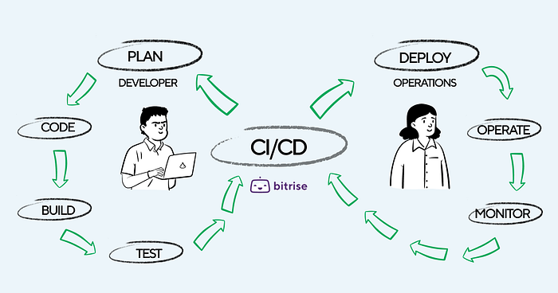

In[ part 1 of our Mobile DevOps journey](./mobile-devops-journey-evolving-mobile-development-at-swiggy-with-bitrise-episode-1-970442617654.md), we explored Swiggy’s transition from an in-house CI/CD setup to Bitrise, highlighting the significant improvements in build times, efficiency, and code quality. We discussed the challenges faced with our previous setup and how Bitrise’s capabilities helped us overcome these obstacles, leading to a more agile and efficient development process.

Building on this foundation, part 2 will delve into the specifics of implementing CI/CD for our iOS applications using Bitrise. We will cover the setup process, key configurations, and best practices that have enabled us to streamline our iOS development pipeline. Additionally, we will share insights on how automated builds, tests, and deployments have enhanced our ability to deliver high-quality updates swiftly and reliably.

## Swiggy’s CI/CD Journey for iOS Apps:

### Continuous Integration (CI) :

Upon a developer raising a feature PR against the release branch, we have enabled CI checks to ensure code sanity and quality. Our checks include:

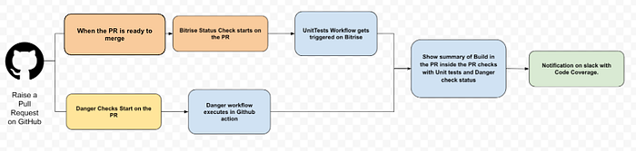
*Continuous Integration (CI) flow*

- PR tagged with a relevant JIRA.
- Relevant GitHub labels added (e.g., Review Required, QA Completed, Ready to Merge).
- Static code analysis via SwiftLint to enforce Swift guidelines and conventions.
- Release Milestones added.

**_Unit Tests:_**

- Whenever the PR is ready to merge with all the Danger checks passed, a script is executed via Github Actions that identifies the changed modules in our modular codebase.
- We have added our own GitHub action workflow which checks if the PR is reviewed by 2 reviewers at least and also have approval for that particular code owner. If the above two condition are satisfied we automatically add a PR Approved label.

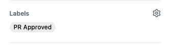

- We have mapped this trigger to Bitrise Pull Request Trigger Map.
- Once **PR Approved** label is added, on Bitrise we analyse the modules and trigger Unit Test Workflows for different modules via Bitrise Pipelines.

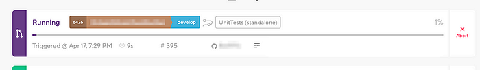
*Build Progress on Bitrise*

- Summary of all the Github Status including Bitrise and Github Actions are updated based on the Check Status.

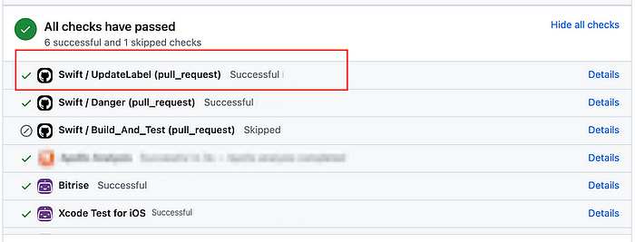
*Github Checks Summary*

- Inside Bitrise checks, summary of the Unit Test PipeLine is generated with status of individual stages and workflows.

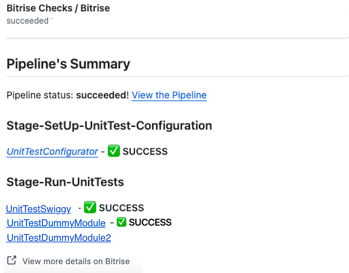

- Our in-house code coverage calculator script then analyses the `.xccoverage` file to calculate the PR's code coverage, with the status reflected on GitHub checks and detailed coverage analysis added as a bot comment on GitHub.

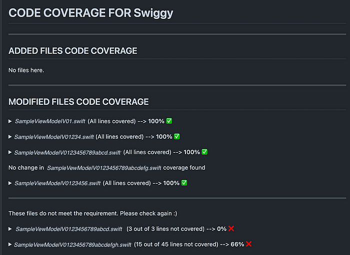
*Code Coverage*

### Continuous Deployment (CD) :

1. We would support 5 build configurations for different use cases:

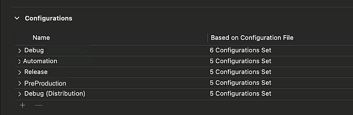
*Build Configurations*

- **Debug [**Export type: `Development`] — This would be used for Creating development builds from Xcode to run on iPhones.
- **Automation [**Export type: `Development` ]— This would be used for creating automation builds.
- **Debug(Distribution) [**Export type: `Ad hoc`] — This would be used to share the builds to QA via `Firebase distribution or Bitrise Distribution.`
- **PreProduction** [Export type: `app store)`] — This would be a replica of the Release build with some security checks disabled like SSL pinning for our internal Debugging. These would be the Release Candidate(RC) builds and would be used for dogfooding and release bug bash via `TestFlight.`
- **Release [**Export type: `app store`] — This would be the final Release build with all the security checks enabled that would be published to Appstore.

2. As we require multiple runtime configurations while triggering a build, we need a UI that can take input from the user and trigger a build on Bitrise, passing all the custom parameters as environment variables.

- We have created our own tool to trigger a Bitrise build.

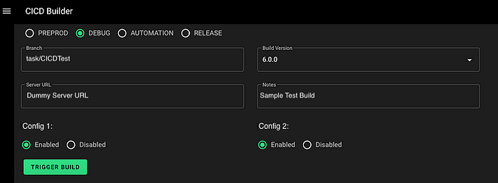
*CI-CD ToolKit*

3. When the build is triggered a slack notification is triggered tagging the developer, informing the build has started.

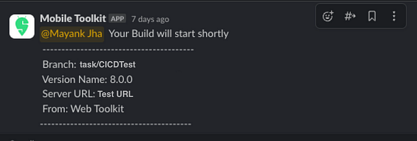
*Build Start Notification on Slack*

4. We run different workflows based on the type of build triggered such as :

- **UATWorkflow**- Includes Steps, runs custom scripts and inject different params and endpoints required for UAT build.
- **SwiggyDeployWorkflow** — Includes steps required to generate an ipa and upload to TestFlight.
- **SwiggyBitriseWorkflow** — Includes Steps to generate an adhoc distribution ipa and upload to Bitrise and firebase distribution console.
- **SwiggyAutomationWorkflow** — Includes Steps to generate an automation ipa with accessibility identifiers enabled and uploading to our Automation Test Suites.

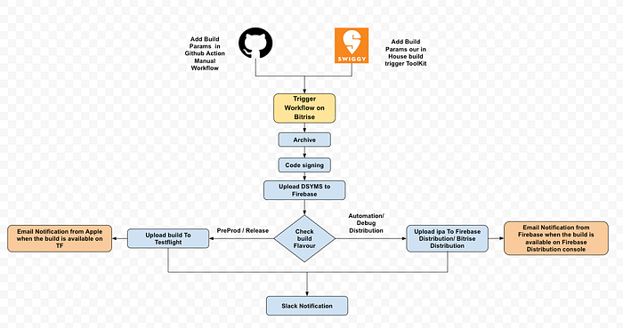
*Bitrise Build Trigger Workflow*

4. Once the build is generated and the workflow is completed we get a notification in the same slack thread.

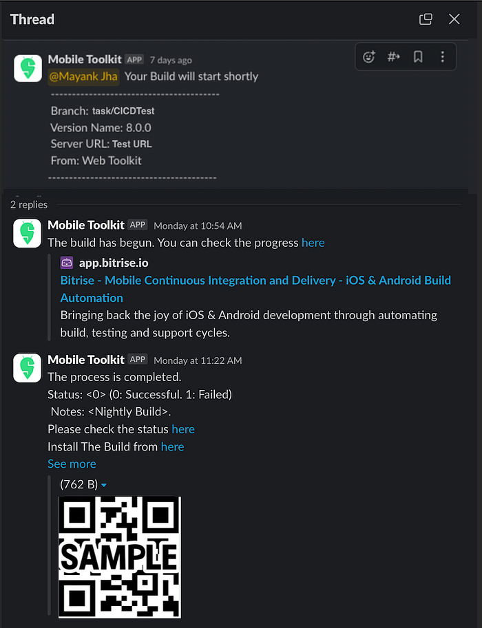
*Build Success Notification on Slack*

5. For Debug build a QR code is generated and is attached in the build notes. To install the build just QR code needs to be scanned. Release or PreProduction build are directly uploaded to TestFlight.

## Monitoring and Alerting:

- Monitor our important metrics such as credit usage, build count, build time, build failures and many more from the [Bitrise Insights](https://devcenter.bitrise.io/en/insights.html) dashboard.

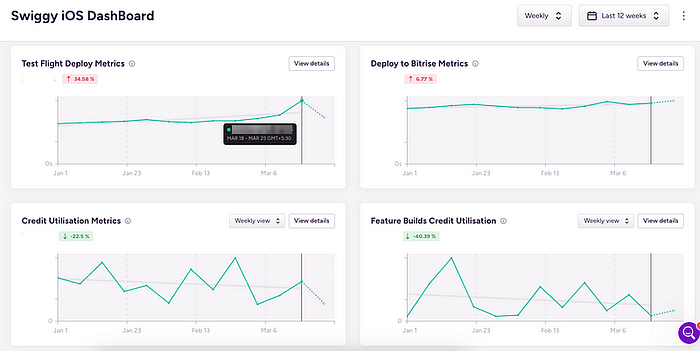
*Bitrise iOS Insights DashBoard*

- Added alerts for identifying any anomalies.

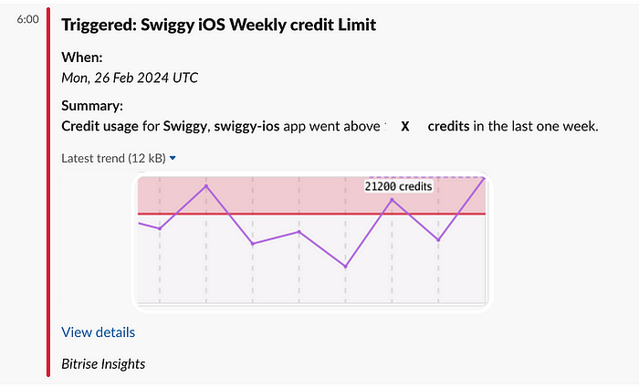
*Weekly Credit Limit Trigger*

## Impact:

Transitioning to Bitrise has yielded significant improvements:

- **80% reduction in wait time** due to enhanced concurrency.
- **8–10 minutes reduction in build time** by leveraging powerful remote machines and caching.
- **60% improvement in time** invested in tech stack upgrades (e.g., Xcode, Fastlane, Ruby).

## Conclusion:

As we forge ahead on our Mobile DevOps journey with Bitrise, our commitment to innovation and excellence in mobile app development remains unwavering. We are excited to delve into additional features such as build cache, release management, and integrations provided by Bitrise. These tools will not only optimize our development process but also ensure we stay at the forefront of the ever-evolving market demands.

## References:

- [https://devcenter.bitrise.io/](https://devcenter.bitrise.io/)
- [https://docs.github.com/en/actions](https://docs.github.com/en/actions)

> Credits: Special Mention to [Agam Mahajan](https://medium.com/u/ede4f93130a7?source=post_page---user_mention--ff66fed6578b---------------------------------------) for his constant support throughout this journey.

---
**Tags:** Mobile Devops · Ci Cd Pipeline · IOS · Swiggy · Bitrise
