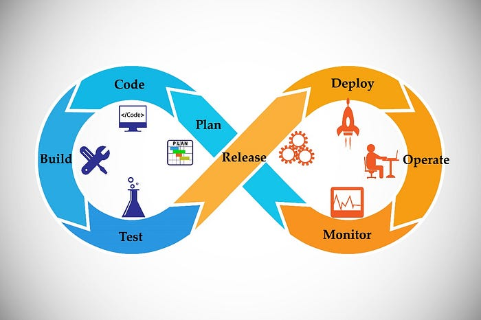
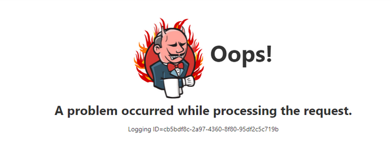
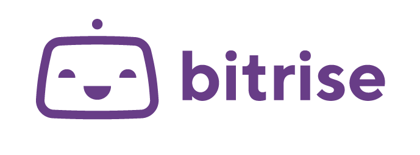
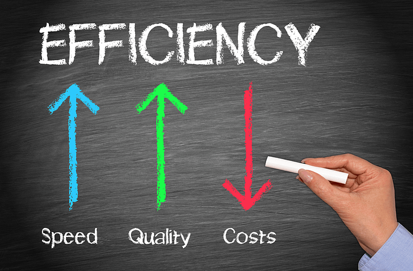

# Mobile DevOps Journey | Evolving Mobile Development at Swiggy with Bitrise | Episode 1

## Introduction:

Swiggy, India’s foremost food, grocery, and dining platform, has consistently led the charge in innovation, relentlessly pursuing ways to elevate user experiences and optimize operations. At the heart of this endeavor lies our mobile application, catering to millions of users each day. Recognizing the imperative to evolve our mobile development process to sustain our competitive advantage, this article explores Swiggy’s Mobile team’s transition from an in-house CI/CD setup to [Bitrise](https://bitrise.io/), a leading CI/CD platform. This shift marked the inception of our Mobile DevOps journey, aimed at fostering efficiency, collaboration, and quality throughout the development lifecycle.

## Mobile DevOps — Why it Matters?

**1. Speedy Delivery:** Mobile DevOps enables rapid development cycles, ensuring swift updates and feature releases to stay ahead of the competition and meet user demands promptly.

**2. Collaborative Workflow**: By fostering teamwork and breaking down silos between development, operations, and QA teams, Mobile DevOps promotes seamless collaboration towards a common goal of delivering high-quality apps.

**3.** **Enhanced Quality and Reliability**: Automated testing and continuous integration practices ensure that code changes are thoroughly validated, resulting in fewer defects and a more reliable user experience.

**4. Seamless Deployment:** DevOps principles automate deployment processes, facilitating smooth updates to production with minimal downtime and disruption to users.

**5. Continuous Improvement:** A culture of continuous improvement underpins Mobile DevOps, allowing teams to analyze feedback and performance metrics to refine their processes and deliver better mobile experiences over time.

## The Need for Change:

At Swiggy, we employed an in-house CI/CD setup managed through Jenkins

> **Android**: EC2 instance of Jenkins  
> **iOS**: On-premise machine of Mac Pro

It effectively supported our operations for numerous years, granting us control and flexibility within the development pipeline. Nevertheless, with the expansion of our mobile application in complexity, user engagement, and team size, we encountered issues regarding scalability and maintenance.

Several significant challenges arose:

- Insufficient concurrency/parallelism resulting in prolonged wait times.
- Frequent instances and machine outages.
- Manual upgrades.
- Integration complexities with third-party extensions.

Manual intervention proved necessary at different junctures throughout the development lifecycle, causing bottlenecks and impeding the timely delivery of updates to users.  
The mobile technology landscape at Swiggy has continuously expanded, with support now extended to numerous tech stacks overseen by distinct teams across our diverse app offerings.  
Acknowledging this evolution, we identified the necessity for a more resilient, automated solution to expedite our development process and guarantee the delivery of high-quality releases.

## Evaluation:

We conducted a comprehensive assessment of various platforms including Bitrise, GitHub Actions, and Dedicated EC2, focusing on the following criteria:

1. Faster builds: Prioritizing speed of execution.
2. Parallelization of builds: Minimizing wait times.
3. Latest Tech Stack support: Ensuring compatibility with M1 for iOS and the latest Android versions.
4. Stability: Aim for negligible downtime.
5. Integrations: Supporting third-party extensions such as Slack, GitHub, and AppstoreConnect.
6. Support, Observability, and Insights: Enhancing overall efficiency through robust support and insights.
7. Cost: Ensuring the platform’s benefits in terms of developer time saved and improved efficiency outweigh the platform’s cost.

Following a thorough evaluation, we opted to integrate Bitrise into our existing infrastructure. Bitrise’s user-friendly interface, extensive feature set, and seamless integrations with popular tools and services rendered it the optimal choice for our requirements.

## Integration:

Harnessing Bitrise’s capabilities, we embraced a more agile and efficient development approach. Automated builds, tests, and deployments became standard practice, slashing manual overhead and facilitating expedited delivery of features and bug fixes. With Bitrise handling the heavy lifting, developers reclaimed valuable time to concentrate on coding, enhancing productivity across the board.

## Key Benefits Realized:

1. Faster Build Times: Utilizing Bitrise’s latest tech stack resulted in a 40–50% improvement in build pipelines.
2. Increased Efficiency: The parallelization capability reduced waiting time by 70–80%.
3. Improved Quality: Automated testing and continuous integration facilitated the integration of UT and lint checks reports on GitHub, enhancing code quality.
4. Enhanced Maintainability: Over the past year with Bitrise, we’ve experienced minimal downtime, contributing to easier maintenance.
5. Insights: Bitrise’s insightful capabilities allow us to monitor build times, and credit usage, set thresholds, and continually enhance our processes.

## Future Outlook:

As we advance on our Mobile DevOps journey with Bitrise, our dedication to innovation and excellence in mobile app development remains unwavering. Our future endeavors include delving into additional features such as build cache, release management, and integrations provided by Bitrise. By harnessing these capabilities, we aim to further optimize our development process and proactively address evolving market demands, ensuring that we stay at the forefront of mobile app development.

### Acknowledgments

[Mayank Jha](https://medium.com/u/4bb1b7609dfe?source=post_page---user_mention--970442617654---------------------------------------) [Farhan Rasheed](https://medium.com/u/2f0dfadbf951?source=post_page---user_mention--970442617654---------------------------------------) [Garima Bothra](https://medium.com/u/cf5af6a99299?source=post_page---user_mention--970442617654---------------------------------------) [Minal Arora](https://medium.com/u/39cccc0dac1c?source=post_page---user_mention--970442617654---------------------------------------)

---
**Tags:** Mobile · DevOps · Swiggy · Mobile App Development · Ci Cd Pipeline
