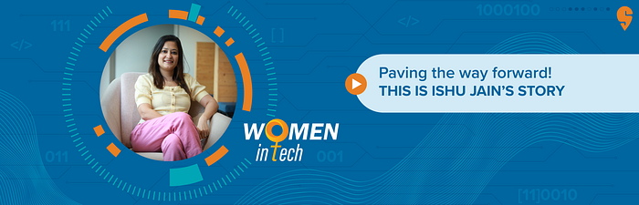

# More than just numbers: Featuring Swiggy’s analytics lady, Ishu Jain.

Ishu Jain heads the analytics space in Swiggy as a Director. Being a leader and leading women comes naturally to her. After all, being born in a joint family with 11 girls as cousins adds to the training.

Soft-spoken and calm might be the first two traits you notice about Ishu, but make no mistake, she is a powerhouse of energy and all things analytics. With over 16 years of experience in the data science industry, Ishu started her career as a rookie data scientist.

A self-confessed lover of “organising and planning things”, it comes as no surprise that Ishu took an instant interest in the field of data science. It appealed to her so much that she knew it was the only way forward for her career.

**The Ishu Story**

Born into a “traditional Jain family”, Ishu was influenced early on by her family with 11 female cousins. “I had a strong desire to be independent and create my own identity. All the girls in the family were raised to be strong and more importantly financially independent. We were encouraged to make our own decisions and learn how to take care of ourselves. That kind of upbringing goes a long way,” she says.

There are many whose interest in data science piques after working in different fields, but Ishu was not one of them. Right from the start, she knew she wanted to explore it. “Initially, I did not have anything specific in mind in terms of my career path, I heard from a friend that Data Science/Analytics was an up-and-coming profession and would play a key role in businesses going forward. I started exploring and was fortunate enough to get into Sriram College of Commerce and Delhi School of Economics,” she says.

Ishu started her career at Genpact as a rookie data scientist and then moved on to Dell where she had the chance to climb the tech ladder and “work my way through being a senior analyst and then a senior manager”. Post that stint she joined Fractal Analytics and that ultimately led her to Swiggy.

Speaking about why she chose to work with Swiggy, Ishu says. “I was always enamoured with the brand and the desire to work on core business in India y,” she says.

“Back in the day there was a lot of buzz around Swiggy becoming a Unicorn. I couldn’t see the real impact of my work with my previous companies, because they were mostly client-oriented or US-based consumer brands. That feeling of seeing the impact of your work the very next day and being a part of a data-first company, was an exciting opportunity for me and that is essentially why I chose Swiggy,” she says.

Explaining how important her work is at Swiggy, Ishu says. “Take a look at what happened during the pandemic. People weren’t able to get groceries or dine out, and delivery became important. During this time, we launched quite a few initiatives, including contactless delivery and max safety protocol, to make sure that the food was delivered in a healthy and safe manner.

Analytics played a central role in all of these initiatives as they were powered by data. Working with our partners and making sure they were following safety protocols, which involved taking pictures and asking restaurants to submit temperature certificates, were made possible through our work..”

**Making space for more women in tech**

Being a leader in a space that is niche and usually dominated by men is rewarding, but isn’t easy. She says, “It is a lot of responsibility and work to make a space for ourselves in this field. But this is what I’ve always wanted to do, break stereotypes and set an example. I hope more women enter the tech field and take on leadership roles. I always try to encourage women who have the potential to be leaders and give them all the support I possibly can. So in a way, that is my mission.”

While things are changing, women prioritising their careers is still an issue in many places. What does Ishu have to say about this? “We do not encourage women to be ambitious. Having them play a role where family comes first and having a career is optional. This is the advice I always give to women who get married and/or have kids. Never treat your career as optional. Try to figure out how you can do both and build a new ecosystem. They have to be driven themselves. In India there are many smart people. The world recognises it. For every role that is created, there are multiple people vying for it. So we have to make sure we are out there, available to work.”

She adds, “While many companies are introducing maternity, travel, daycare and many other policies/initiatives for women, we need to expect more support from them.One thing I always tell women: No one can make you network with people and or even enrol for courses which are needed to remain in the market. Women need to ensure they continue to be a part of the workforce and also be in leadership,” she adds.

Ishu always leads by example. While making time for work and family are essential according to her, one mustn’t forget the leading character in their lives: themselves.

“We must take good care of ourselves. I’ve started investing more in my health. I wake up in the morning, do yoga and then start working. Work begins by 8:30 am and I get done by 6–6:30 pm. Swiggy’s remote work mandate has helped me manage my work much better since I’m able to cut down on travel time and it has also enabled me to spend more time with my son,” says the mother of one who “would probably be an event manager” if not a data scientist.

Ishu has changed the way people look at data analysts. And according to the data we have analysed, the tech world needs more Ishu Jains.

---
**Tags:** Swiggy Life · Analytics · Women In Tech · Careers · Women Leaders
