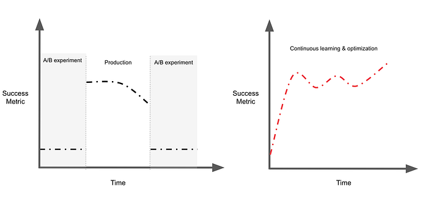
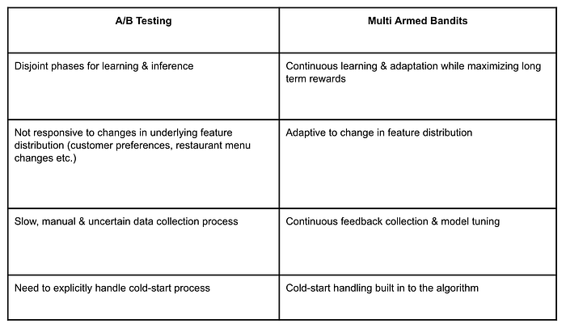
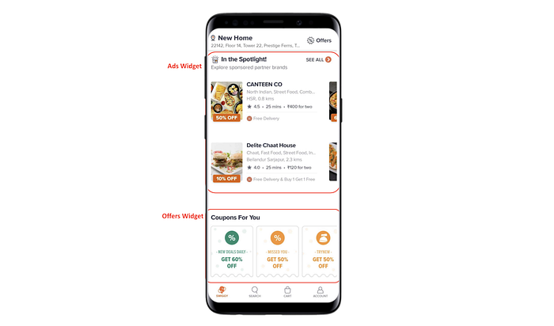
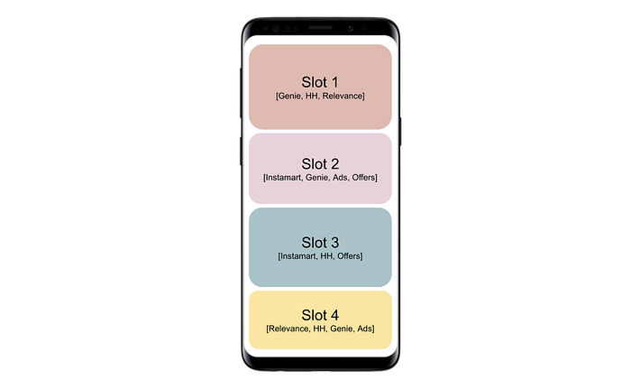

# Multi-Armed Bandits at Swiggy: Part 1

Co-authored with [Viswanath Gangavaram](https://www.linkedin.com/in/viswanath-gangavaram-4336937/)

## Introduction

This article aims to provide an intuition of Multi-Armed Bandits & offer a glimpse of their applications at Swiggy. We have intentionally kept the article free of math and code in order to broaden the appeal to a wider audience including Product Managers, Developers and Data Science enthusiasts. Let’s get started!

## To Explore or to Exploit — that’s the question!

One can imagine human life as a series of decisions we make based on the limited information available in a world whose workings we don’t know. Every single day, we make a tradeoff between trying something new (exploration) vs. sticking to what already works (exploitation). This tradeoff can be seen playing out in daily life even at a mundane level like Swiggying your next meal (repeating the good old Biryani vs. tasting a Quesadilla) or Netflixing (watch F.R.I.E.N.D.S vs. the latest tv show).

Mathematicians have modeled the explore-exploit tradeoff through various algorithms in a quest to minimize the long term ‘regret’ under the umbrella of ‘s**_equential decision-making under uncertainty_**’. Through a multi-part series of blogs, we will double down on these algorithms and applications. More specifically we focus on what are called Multi-Armed Bandits (MABs) and talk about some of the use-cases at Swiggy. In this article, we will cover a brief overview of MABs, its advantages over an A/B setting and some interesting problem statements at Swiggy where we are using them.

## ‘Bandits’ eh?

The term multi-armed bandit comes from a hypothetical experiment where a person must choose between multiple actions (slot machines also called ‘one-armed bandits’) in an attempt to obtain a reward. Each arm has an unknown payout and the goal is to determine the best or most profitable outcome through a series of choices. The objective is to pull the arms in a sequence such that we maximize our total reward collected in the long run. Some of the popular MAB algorithms are Epsilon-Greedy, Thompson Sampling and Upper Confidence Bound (UCB).

*Slot machines at a casino (single arm bandit)*

## A/B testing vs. MABs

A/B testing is considered to be the gold standard in industrial settings whenever we wish to find out the best performing variant among a set of available variants. Standard A/B testing consists of two distinct phases:

- A **short pure exploration phase**, in which the experimenter assigns an equal number of experimental units across different variants. The goal in the exploration phase is to estimate the expected response rate of each variant with statistical significance. The period of pure exploration is a function of the number of experimental units per variant and the response rate
- A **long pure exploitation phase**, in which the experimenter tries only the successful variant/idea and never comes back to variants that seemed to be inferior

What might be wrong with the above strategy?

- The phase of pure exploration incurs an opportunity cost by exploring inferior variants in an attempt to gather as much information as possible to learn the actual response rates with statistical significance. But the experimenter might not want to gather information about strikingly inferior variants once she has gained sufficient confidence.
- While a particular variant might be the best one in the exploration phase, it may not remain so with time. Again an opportunity cost (also known as regret) is incurred which is the difference between the response rate of the optimal variant and the variant of choice. A/B testing makes a discrete jump from pure exploration to pure exploitation, whereas the experimenter may wish to continuously transition between the two, thereby significantly reducing the opportunity cost.

Bandit algorithms address these drawbacks of A/B testing in the following way:

- They operate in the realm of perpetual exploration/exploitation where, at each time instance, they focus the experimenter’s resources on the optimal variants instead of wasting time on suboptimal variants which otherwise would have been over-explored in an A/B experiment
- MABs smoothly decrease the amount of exploration over time instead of requiring the experimenter to make an abrupt jump
- There is no one absolute winner at all times; as the situation changes, MABs are naturally able to determine the best action to take under the new circumstances

Because of their smooth to and fro transition between exploration and exploitation, bandit algorithms are preferable in situations where expected rewards could change or new variants get added with time. Due to their adaptive nature, we can constantly feed the bandit with new hypotheses to test without getting stuck with suboptimal variants.

The chart and table below present a summary of the advantages of MAB over A/B testing:

*Lifecycle of an A/B experiment vs. Multi-Armed Bandit (plot inspired from Bain)*

*Advantages of MAB over A/B testing*

A drawback of MAB algorithms like UCB or Thompson Sampling is that they assume a linear relationship between the input and output (payout) which might not be true. Although use of non-linear learners like trees and neural networks in an MAB setting is an active area of research, non-linearities can be introduced in MABs using approaches like segmentation. More on this later.

## Let’s talk applications!

At Swiggy, we have a number of problem statements where MABs** **seem like the go-to algorithms given their numerous advantages. Following is a glimpse of some use cases:

**Restaurant Ads**

In the ads space, we are using contextual bandits, a version of MABs with side information to estimate clickthrough rate (CTR) for a given <**customer, restaurant**> pair to rank ad-partner restaurants.

*Ads & offers widget on Swiggy’s Homepage*

When a user opens the Swiggy app, a list of ad-partner restaurants who are serviceable in the geo-location at that instance are sent to the bandit model for ranking. Context information like ETA, rating and customer preferences are fetched from the datastore and fed to the bandit algorithm which provides a score for each pair. The restaurants are sorted according to these scores and displayed to the user. A customer might click on one or more of these restaurants which is fed as a reward to the model based on which the model updates its parameters in order to improve predictions the next time around.

**Push notifications**

Let’s admit it, push notifications (PNs) are a tricky territory! Sending too few of them translates to leaving money on the table; send too many — you risk annoying the user. Another dimension to take into consideration is incorporating diversity and novelty aspects. For example, a user may have a higher affinity towards a specific PN but sending it over and over again might lead to fatigue in the long run.

*Different variants of the same Push Notification (PN)*

And here come ‘segmented hierarchical bandits’ making our PNs smarter each day. Segmented MABs incorporate contextual information by segmenting the customer base, followed by running separate MABs for each segment. **We use Thompson Sampling for estimating the CTRs for a particular <******Customer, PN******> which samples the CTR from a beta distribution of the segment**. The estimated CTRs are fed into a downstream optimizer which incorporates diversity and novelty constraints like maximum PNs per day/week, maximum number of PNs per user, etc. and creates an optimized weekly plan for each customer.

**Homepage widgets**

Apart from these use-cases which mostly fly under the radar, the way Swiggy’s homepage looks to a user will soon be an output of an MAB. We have multiple widgets on the homepage such as ‘_Top Picks For You_’, ‘_Popular Brands_’, ‘_Coupons For You_’ and more. Based on experiments, we have found that different cohorts of users have different preferences towards these widgets at different times of day and day-of-week. Some may want widgets containing coupons at the top, whereas some may want to see popular brands and the list goes on.

*Swiggy’s homepage visualized as arms of an MAB*

In terms of both time and effort, it is expensive to conduct experiments to find an optimal order of widgets for various users. This problem is further exacerbated by the dynamic nature of Swiggy’s homepage. New widgets are introduced frequently, old widgets get redesigned, some are paused and re-introduced. Instead of manually determining this layout, why not automate it? MABs to the rescue again! We employ contextual MABs which consider the user and time context to rank-order widgets on the homepage. With time, the bandit receives feedback through clicks and uses it to update the parameters. Eventually, it learns the customer preferences and is able to rank widgets accordingly, thus making the order journey a tailor made experience!

## End notes

In conclusion, we are long on MABs and as part of subsequent articles, we plan to give an in-depth tour of the use cases at Swiggy and explore the interesting world of bandits. Next up is a blog piece which takes a deep dive into popular MAB algorithms and their regret properties in contextual and non-contextual settings.

Until then, Swiggy karo, phir jo chahe karo 😁

---

Credits to ShivamRana for reviewing & editing this article.

---
**Tags:** Multi Armed Bandit · Advertising · Push Notification · Homepage · Swiggy Data Science
