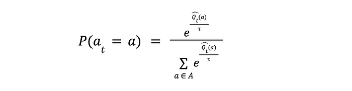
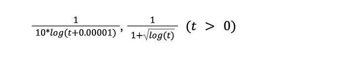
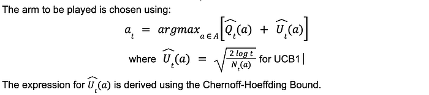
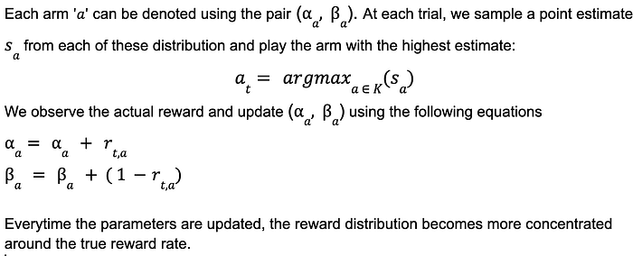
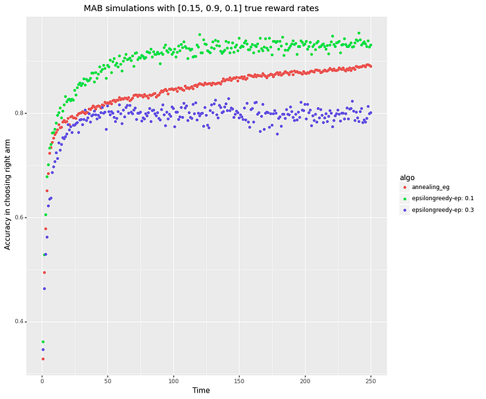
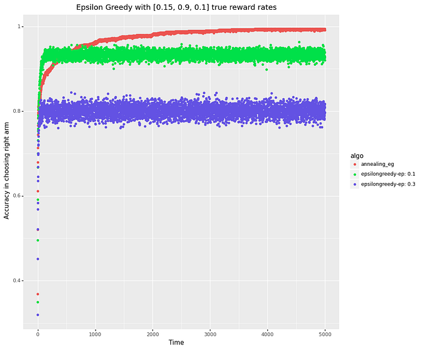
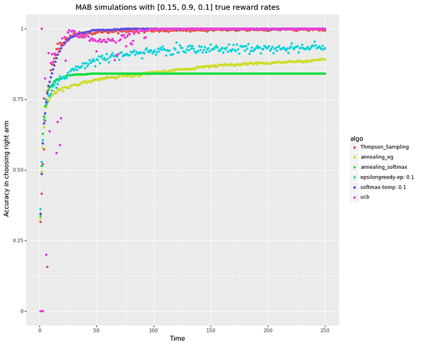
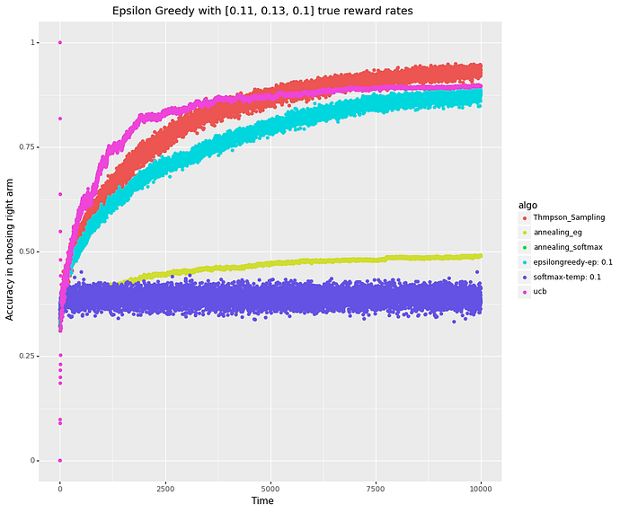

# Multi-Armed Bandits at Swiggy: Part 2

Co-authored with [Shreyas Mangalgi](https://www.linkedin.com/in/shreyasmangalgi/)

In our [last post ](./multi-armed-bandits-at-swiggy-5b1a4b1c2724.md)on Multi Armed Bandits (MABs), we talked about the explore-exploit dilemma and introduced the concept of MABs. We compared the advantages of using Multi Arm Bandits over a traditional A/B testing approach. We also talked about some of the use cases where MABs are in use, like Ads recommendation, Homepage widget ranking and Push Notifications at Swiggy.

In this blog post, we will first introduce various terminologies associated with the theory of MABs and then deep dive into some of the popular bandits algorithms namely Epsilon Greedy, Softmax, Upper Confidence Bound and Thompson Sampling. Post this, we will present the simulations of the algorithms in two hypothetical scenarios and compare their regret and convergence properties.

**MAB Terminologies**

Following are the terminologies which are frequently used in case of bandit algorithms:

**Arm set** (**_K_**): A set of possible actions which the algorithm has to choose from at each timestep. Each arm within the arm set is denoted by ‘a’. The arm which is played at timestep t is denoted by a_t.

**Reward function** (**_R_**): A set of probability distributions describing the reward that one would get by choosing an arm. The expected value of R is termed as expected reward rate. In this article we use reward and reward rate interchangeably.

**Horizon** (**T**): The total number of timesteps for which we run the algorithm

**Value** (Q): A value of an action can be described as the expected reward given an arm is chosen and is denoted by Q(a) =𝔼[r|a] .

**Optimal arm**(a*): Arm with the highest Q Value.

**Regret: **The difference between the expected reward rate of the optimal arm and the arm of choice in a particular trial.

**Cumulative Regret (L_T)** is the summation of the per-trial regret over the horizon. Essentially, it is the total loss in expected reward accrued by choosing a particular MAB strategy.

*Equation 1: Cumulative Regret*

The goal of a bandit algorithm is to minimize the cumulative regret over the horizon(T).

MAB Algorithms can be classified into two types:

1. Context-free MABs : Algorithms that don’t use the side information for choosing the arm (action)
2. Contextual MABs : Algorithms that do make use of the side information for making the choice

In this article we focus on context-free MABs with **stationary rewards**. As in, reward distributions for each of the arms don’t change with time. More specifically, we assume the rewards for each of the arms to be [Bernoulli](https://en.wikipedia.org/wiki/Bernoulli_distribution) distributed. This assumption makes sense in applications like click prediction at e-commerce companies, although the assumption of stationary rewards might not hold in most cases but we go ahead with it for the sake of simplicity. We will dive into contextual MABs and discuss the case of non-stationary rewards in Part 3 of our blog series.

**Context-free MAB algorithms with stationary rewards**

A typical **_‘K’ _**armed bandit algorithm with unknown reward distributions denoted by {**θ1**,**θ2**, . . . ,**θk**} respectively can be described as follows:

At each time step

- A bandit algorithm chooses an arm based on the reward estimates and observe an actual reward **r** (Note: We don’t observe rewards for all the actions we don’t choose)
- Based on the observed reward, algorithm updates the estimate of the expected reward rate.
- The goal of the algorithm is to choose arms at each instance such that the cumulative reward over the horizon is maximized

Epsilon-Greedy, Softmax, UCB and Thompson Sampling are some of the most popular among context-free MAB Algorithms.

**Epsilon-Greedy**

One of the simplest bandit algorithms, epsilon-greedy, as the name suggests explores an arm randomly with a probability of ‘_epsilon_’ and exploits, i.e., chooses an arm with the best reward estimate with a probability of ‘_1-epsilon_’.

The algorithm can be summarized as follows:

- Choose an arm which has the highest estimated reward rate (total rewards / number of trials) with a probability of (_1-epsilon_)
- Choose an arm uniformly at random with a probability of _epsilon_
- Update the reward rate for a chosen arm

The estimated value for an action can be defined as follows:

*Equation 2: Estimated reward rate*

Where 𝟙 is the indicator function, Nt(a) is the number of times action a was chosen till time t. This essentially is the average of all the rewards obtained whenever the action a was chosen up until time t.

The arm choice when the algorithm wants to exploit can be denoted as follows :

*Equation 3: Chosen arm at trail t*

A drawback with this approach is that the extent of exploration always remains constant (_epsilon_) even after we have gathered enough samples through exploration. This can be addressed by ‘annealing’ the exploration probability so that we explore less with increasing number of trials.

**Softmax**

As mentioned above, epsilon-greedy chooses the arm with the best estimated reward rate when we are exploiting and chooses an arm uniformly at random whenever we are exploring. But what if we could explore arms based on our current estimate of the reward rate? The Softmax algorithm for MABs does exactly that. We can write the probability of choosing a particular arm at any trail as :

*Equation 4: Probability of choosing a particular arm*

**Here ****_tau_**** denotes the extent of exploration. Higher the value, lesser the exploration & vice versa.**

This formulation has the explore-exploit trade-off implicitly built-in unlike epsilon-greedy since we explore the highest reward rate more number of times but continue to explore other arms albeit with less frequently.

**Annealing**

This concept in the context of epsilon-greedy and softmax algorithms refers to varying the hyper parameters namely, Є and with time so that we limit the exploration. Hence we can choose any function which monotonically decreases as a function of time (no of trials). Some of the functions which we experimented with, for annealing, are

*Annealing functions*

**Upper Confidence Bound (UCB)**

The UCB algorithm operates with the notion of ‘optimism in the face of uncertainty’. It assigns an optimistic score to those arms which haven’t been played enough number of times leading to exploration of such arms. At each trial, the UCB score is computed as a sum of two terms: (i) the empirical estimate of the mean reward and (ii) a term which is inversely proportional to the number of times an arm has been played ( Nt(a)).

*Upper Confidence Bound*

The details of which can be found [here](https://www.cs.bham.ac.uk/internal/courses/robotics/lectures/ucb1.pdf).

**Thompson Sampling**

The idea behind Thompson Sampling is that of ‘probability matching’, as in we want to pick the arm based on the probability of it being the optimal arm. We do this by constructing a probability distribution based on the rewards obtained up until now and then sampling a point from the distribution. This method implicitly encodes the confidence associated with the estimate by making the reward distributions narrower for an arm every time it is chosen.

At each round, we draw a sample from each of the distributions and pick the arm with the largest sample value. We then update the posterior distribution for the chosen arm based on the reward observed (0 or 1).

The reward distribution associated with each arm can be modeled through a beta distribution with _alpha = No. of successes_ (reward =1) and _beta= No. of failures_ . This makes sense since the Beta distribution is a [conjugate prior](https://towardsdatascience.com/conjugate-prior-explained-75957dc80bfb) for the Bernoulli distribution.

*Thompson Sampling*

One can refer to [this](https://gdmarmerola.github.io/ts-for-bernoulli-bandit/) link to understand how the beta distribution changes with changing values of (_alpha, beta_)

**Simulations**

We now proceed to simulate these algorithms and investigate their convergence and regret properties. Given the online learning nature of bandit algorithms, [Monte Carlo](https://www.ibm.com/in-en/cloud/learn/monte-carlo-simulation) simulation is a suitable methodology for studying their properties. Monte Carlo methods rely on repeated random sampling to obtain numerical results. In our case, since each trial is powered by sampling from a Bernoulli distribution, the results can be noisy. To reduce the noise, we run multiple simulations and compute the average value at each trial.

In this blog, we are interested in studying the nature of bandit algorithms under two scenarios:

**Scenario 1**: When there is a significant difference between the reward rate of the optimal arm and the rest of the arms, say a situation where we have 3 arms with true reward rates as [0.1, 0.15, 0.9]. Here Arm 3 is significantly superior compared to Arms 1 and 2.

**Scenario 2**: When the optimal arm is marginally better than the rest of the arms, say a situation where the reward rates are [0.10, 0.11, 0.13]. In this scenario Arm 3 is still the optimal choice but the difference between the true rewards rates is not significantly large when compared with Arm 1 or 2.

We can make observations on the convergence properties of the MAB algorithms discussed above by plotting the accuracy of choosing the optimal arm (arm with the highest reward rate) as a function of the number of trials. This is a proxy for the regret equation described in equation (1). Note that, in real life applications, the true reward rates are not known.

[Scenario 1: True reward rates [0.1, 0.15, 0.9]](https://github.com/viswanath57/Bandit-Algorithms-Demo/blob/main/ContextFree-MABs/Bandit%20Simulations%20with%20True%20Rewards%2010%25%2010%25%2090%25.ipynb)

*Figure 1*

In Figure 1, we can see that a lesser per trial exploration (epsilon = 0.1) leads to better accuracy than a higher level of exploration (epsilon = 0.3). The variance drastically reduces when we use annealing. We also observe that both the purple and green curves (vanilla epsilon-greedy) have converged to an accuracy level of ~80% and 92% respectively whereas epsilon-greedy with annealing is yet to converge (red curve). Thus, in a time frame of less than 250 trials, annealing is not turning out to be a superior choice.

The situation changes when we extend the simulations to 5000 trials as depicted in Figure 2. We see that annealing epsilon leads to a much higher accuracy post convergence for the red curve and it ends up being the superior choice among the three post 3000 trials and achieves an accuracy close to 100% in choosing the arm with the highest reward rate.

*Figure 2*

In Figure 3, When we compare all the algorithms discussed in the previous section for Scenario 1, we observe that Thompson Sampling, UCB and Softmax — all converge in under 50 trials with near zero per trial regret (indicated by an accuracy of 1.0 post 50 trials) whereas annealing epsilon-greedy and annealing softmax tend to underperform.

*Figure 3*

[**Scenario 2: True reward rates [0.1, 0.11, 0.13]**](https://github.com/viswanath57/Bandit-Algorithms-Demo/blob/main/ContextFree-MABs/Bandit%20Simulations%20with%20True%20Rewards%2010%25%2011%25%2013%25.ipynb)

More often than not, in real life applications we are faced with choices (arms) where the difference in true reward rates is not very big. Yet, being able to capture this difference can lead to significant business value. Hence, it is essential to simulate the behavior of bandit algorithms under such a scenario.

*Figure 4*

As we can see from Figure 4, when the difference between true reward rates is not very significant, all the algorithms take much longer time to converge. We can also see that annealing epsilon-greedy tends to underperform compared to the un-annealed version even after 10k trials. Although, one can tweak the annealing function to achieve a more superior result. UCB converges faster compared to Thompson sampling but settles at a lower level of accuracy while Thompson sampling turns out to be the algorithm with the best accuracy (least regret) after 10k trials.

In conclusion, we observe Thompson sampling turns out to be a good choice under both the scenarios if we want the least regret over a longer horizon. UCB on the other hand is a good choice if we want faster convergence while not compromising heavily on regret. We also observe that while annealing can help the performance of simple algorithms like epsilon-greedy, it is not very straightforward and one has to tweak the annealing function to achieve the performance lift.

The source code for the bandit simulations can be found [here](https://github.com/viswanath57/Bandit-Algorithms-Demo/tree/main/ContextFree-MABs).

Next up is a blog piece which takes a deep dive into the world of contextual MABs.

Until then, Swiggy karo, phir jo chahe karo 😁

Credits to [Shubha](https://www.linkedin.com/in/shubha-shedthikere-233a3814/) for reviewing & editing this article.

**Relevant resources:**

[Bandit Algorithms for Website Optimization [Book]](https://www.oreilly.com/library/view/bandit-algorithms-for/9781449341565/)

[The Multi-Armed Bandit Problem and Its Solutions | Lil’Log](https://lilianweng.github.io/posts/2018-01-23-multi-armed-bandit/)

[Introduction to Thompson Sampling: the Bernoulli bandit | Guilherme’s Blog](https://gdmarmerola.github.io/ts-for-bernoulli-bandit/)

---
**Tags:** Multi Armed Bandit · Mab · Simulation · Swiggy Data Science · Data Science
