# Multi-objective ranking using Constrained Optimization in GBTs

Co-authored with [Shubha Shedthikere](https://www.linkedin.com/in/shubha-shedthikere-233a3814/) and [Jairaj Sathyanarayana](https://linkedin.com/in/jairajs)

## Introduction

In most marketplaces, there is usually a need for ranking models to incorporate the multi-dimensional nature of relevance as well as business constraints. Traditional ML methods cannot easily handle such multiple objectives in a single model. While these multi-objective optimization (MOO) problems can be modeled using Operations Research approaches, they are typically to hard to solve in the time and latency constraints imposed by large-scale recommender systems.

In this post we highlight a method to systematically solve the multi-objective problem in a constrained optimization framework, which is integrated with Gradient Boosted Trees. This method is inspired by [Multi-objective Ranking via Constrained Optimization](https://arxiv.org/pdf/2002.05753.pdf) which introduces multi-objective optimization in Search by incorporating constrained optimization in LambdaMART, a popular LTR algorithm.

Our implementation is open-sourced and is available on Swiggy’s [Github](https://github.com/Swiggy/Moo-GBT).

## MOO: Get the optimal mix of the Primary Objective and the Sub-Objective(s)

For recommendations in general, in a point-wise modeling approach, user-product pairs are scored based on previous interactions between users and products. The outcome of this interaction (say, click or conversion) becomes the target variable and is typically the primary objective of the ML model. However, in most cases, there are other objectives (or constraints) that will need to be handled. For example, cost-of-delivery, time-to-delivery, fairness-to-partners, diversity, repeat-rate, etc. Furthermore, the importance of these additional constraints can vary subject to other factors. Let’s call these constraints sub-objectives.

Consider the plots below. Fig 1 and Fig 2 represent two target variables with respect to two features f1 and f2.

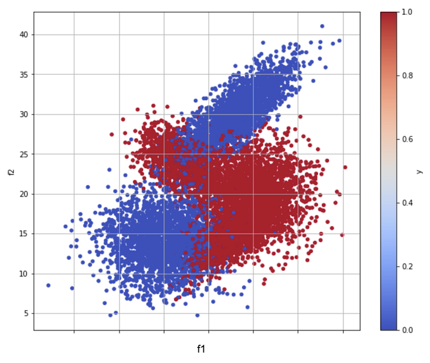
*Fig 1 shows the scatter with respect to the primary objective of whether there was a click on a restaurant ad*

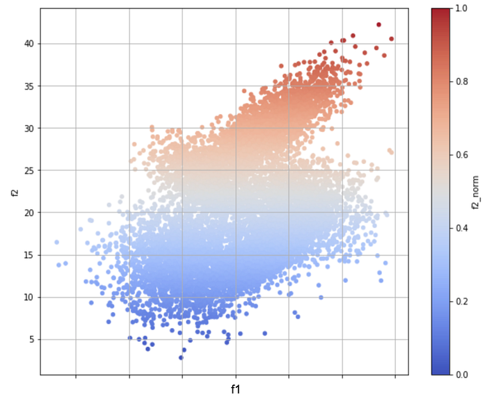
*Fig 2 shows the scatter with respect to the sub-objective which is the normalized SLA of delivery from the restaurant*

Our goal is to develop a model which optimizes for both the primary objective (say, clicks) and the sub-objective (say, SLA).

## Possible Approaches

Several methods have been explored to handle MOO. Broadly, there are (at least) 3–4 classes of methods:

1. scalarization or post processing (where the additional objectives are not really part of the learning process but are handled post facto). Construct a convex linear combination — λ * _S1_ + (1-λ) * S2, where S1 and S2 are scores from individual models trained on different objectives and λ is the weight learned from a Pareto analysis. This method works surprisingly well in practice and is a very credible baseline.
2. changing the training data (where the model is built on data that is [sampled](https://arxiv.org/pdf/2008.10277.pdf) from the ‘desired’ region).
3. changing the way labels are aggregated (for example, [stochastic label aggregation](https://assets.amazon.science/4d/9c/69cbef8346408349385c780cac48/scipub-1195.pdf) method of David Carmel, et al.).
4. changing the loss function itself (this post). To solve for multiple objectives we modify the Gradient Boosted Trees (GBT) algorithm to include constraints in it’s loss function, which are specified as upper bound on the cost value for the sub-objectives. Below we highlight the constrained optimization framework used.

## Constrained Optimization formulation

We combine GBT with the [Augmented Lagrangian method](https://en.wikipedia.org/wiki/Augmented_Lagrangian_method), which is a class of algorithms to solve constrained optimization problems.

We define the constrained optimization problem as:

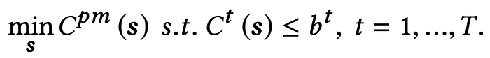
*Eq. 1*

> where “_Cpm_” represents the cost of the primary objective and “_Ct_” represents the cost of sub-objective - “_t_”. “_T_” is total number of sub-objectives. “_b”_ represents the upper bound specified for the sub-objective cost during training.

The Lagrangian is written as:

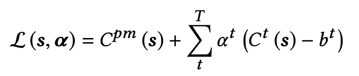
*Eq. 2*

> where α = [α1, α2, α3…..] is a vector of dual variables. The Lagrangian is solved by minimizing with respect to the primal variables “s” and maximizing with respect to the dual variables α.

Augmented Lagrangian has an additional penalty term AL that iteratively solves the constraint optimization problem:

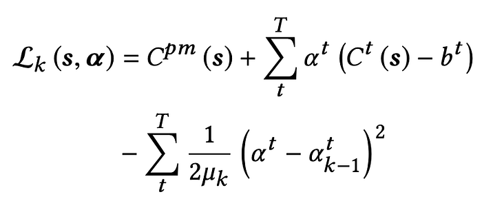
*Eq. 3*

> where α t k−1 is a solution in the previous iteration and a constant in the current iteration k. μ is a sufficiently large constant associated with each dual variable α.

Updating the dual variables:

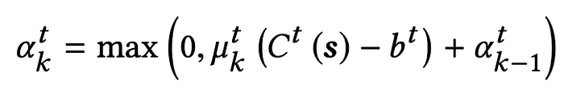
*Eq. 4*

> At an iteration k, if the constraint t is not satisfied, i.e., Ct (s) > bt, we have   
> α t k> α t k-1. Otherwise, is the constraint is met, the dual variable α is made 0.

## Constrained Optimization on GBT

We modify the loss function of GBT and combine the iterations of GBT (building trees) with the iterative constrained optimization framework (AL) defined in the previous section.

Below is the GBT algorithm for Classification/Regression and how we modified it to serve for multiple objectives. GBT requires a differentiable loss function. We modify a traditional loss function to include the constraint terms and the AL term which is constant for an iteration, as specified in Eq. 3.

---

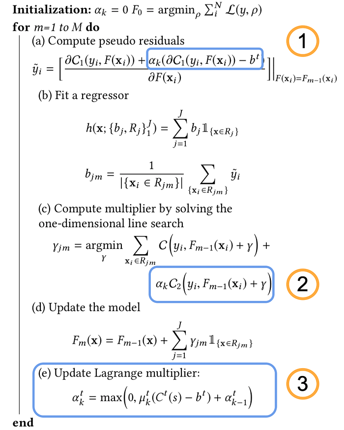
*Steps in the algorithm*

1. GBT uses residuals as target values to build the current tree. Calculation of these residuals changes as we modify the GBT loss function (Eq. 3) to include sub-objective constraints and the AL term (constant for an iteration)
2. For each leaf we calculate an output value, gamma, such that it minimizes the loss function
3. Modify the dual variables, alphas, which are used in the loss function based on the respective constraint being met or not

## Multi-Objective Optimized GBT

We have modified the scikit-learn [GBT Classifier](https://scikit-learn.org/stable/modules/generated/sklearn.ensemble.GradientBoostingClassifier.html) and [GBT Regressor](https://scikit-learn.org/stable/modules/generated/sklearn.ensemble.GradientBoostingRegressor.html#sklearn.ensemble.GradientBoostingRegressor) to optimize for multiple objectives using the above approach.

The implementation is open-sourced and is available at [https://github.com/Swiggy/Moo-GBT](https://github.com/Swiggy/Moo-GBT)

### Package Usage

1. Run unconstrained GBT on the Primary Objective
2. Calculate the loss function value for Primary Objective and sub-objective(s)  
 _- For MooGBTClassifier calculate log loss between predicted probability and the sub-objective label  
 - For MooGBTRegressor calculate mean squared error between predicted value and sub-objective label_
3. Set the value of hyperparamter _b_ (upper bound) to be less than the calculated cost in the previous step and run the unconstrained MooGBTClassifer/MooGBTRegressor with this _b_. The lower the value of _b_, the more the sub-objective is optimized

We test out our implementation on a dataset available [here](https://www.kaggle.com/c/expedia-hotel-recommendations/data?select=train.csv). This is a hotel recommendation problem where we try to optimize for two binary objectives — “is_package” and “is_booking”.

### Package demo on a real-world dataset

We first run an unconstrained GBT Classifier on the Primary Objective which is “is_booking” and note the performance and cost values for all objectives. The table below summarizes the results on training and validation data.

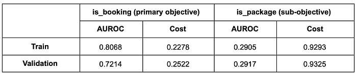
*Performance of unconstrained GBT, trained on the Primary Objective*

Since our cost value for the sub-objective in the training and validation data is ~0.9, we set constraint on the sub-objective cost as upper bounds which are less than 0.9. The lower we set the constraint the more we optimize on the sub-objective.

The table below summarizes results from the Moo-GBT for different constraints. We measure the relative gain (%gain) from the unconstrained model above as a way to show the goodness of the algorithm. As can be seen, at b=0.8, there is a 40% improvement in the sub-objective’s AUC for a relatively small drop of 1.7% in the primary objective’s AUC.

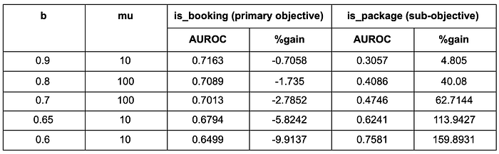
*Performance of Moo-GBT, on primary objective and sub-objective*

Additionally, the figures below show how the primary-objective and sub-objective costs change across boosting iterations in the GBT when we set an upper bound of 0.6 on the sub-objective cost. We can see from the first figure that the sub-objective cost oscillates around 0.6. The dual variable alpha also oscillates between 0 and a positive value as and when the constraint is met and not met. From the third figure we see that GBT continues to optimize on the primary objective as we see the cost going down while meeting the constraint on the sub-objective cost.

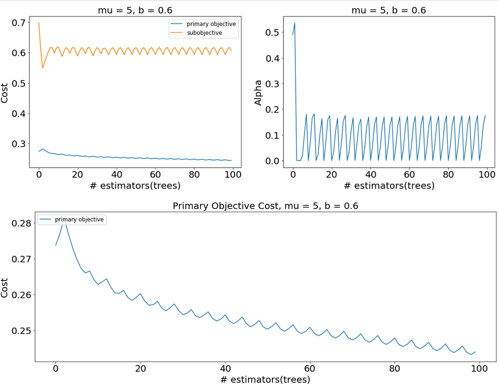

Finally, for the sake of comparison, we present the results from the Scalarization approach, in the table below (w1 is λ, w2 is (1-λ), apologies for the nomenclature mix-up). Moo-GBT clearly outperforms scalarization for the same/similar loss on the primary objective and requires less model iterations and hand-tuning of hyper-parameters.

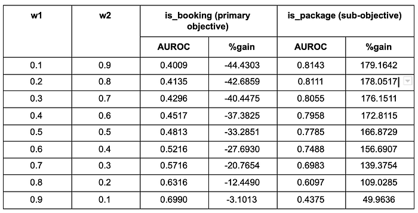
*Performance of Scalarization on individual model scores. w1 and w2 represent weights given to the individual model score of primary objective and sub-objective*

## Conclusions

In this post we presented our adaptation of the AL based constrained optimization method for MOO, using GBTs. We also open sourced this as a Python package/ library and demonstrated usage and efficacy on real-world, large-scale datasets.

A few lessons learned in our MOO journey so far.

1. Scalarization works surprisingly well and it should be your first choice as you head into MOO. It starts breaking down when you have more than two objectives or when the individual models start drifting in potentially opposing directions thereby invalidating the originally set λ value.
2. Moo-GBT-like methods appear to work better when the objectives are somewhat orthogonal in nature. For example, if your primary objective is improving clicks and the sub-objective is improving conversions and since all conversions require a click, the objectives are potentially highly correlated.

---
**Tags:** Multi Objective · Constrained Optimization · Gradient Boosting · Open Source · Swiggy Data Science
