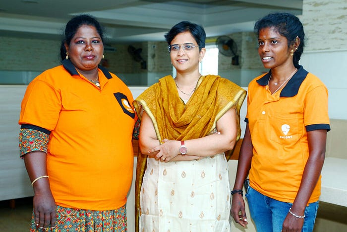

# Navigating new routes — Meet the ladies who read & build Maps

“I have always loved maps. Having moved cities, countries, and continents over the years, I have been fascinated with the idea of navigating secret bylanes. Finding my way around in foreign lands has helped me develop a great sense of direction”, says Pradnya Karbhari, VP Engineering, Location Intelligence at Swiggy.

Well known amongst her peers as the ‘Lady behind Swiggy Maps’ leading a team of navigators and map experts — both technical and non-technical, for Pradnya, maps are a way of life, a passion, and a necessity. Her travels have taken her across continents and cultures across North America, South East Asia, Europe and Australia to name a few. In India, she has navigated living through Mumbai, Bengaluru and now is based out of Chennai.

*Pradnya Karbhari, VP Engineering, Location Intelligence at Swiggy*

**Reaching the customer doorstep**

Swiggy idealizes a world of convenient deliveries where delivery executives are able to seamlessly locate an address, and orders are delivered well within the proposed ETA. One of the building blocks of this is to get the customer’s accurate location and reach the order without calling the customer for directions. Understanding the location and route maps becomes a necessity for delivery partners to enable smooth and efficient pick up and drop of orders. At Swiggy, Pradnya is an Engineering leader, who is helping Swiggy solve this challenge.

**Mapping my ‘desh’ & breaking stereotypes one map at a time!**

Pradnya knows her country is a labyrinth of many little notes and non-standardized addresses; of directions which are far from accurate but all this and more are vital inputs. Pradnya and her team build both on standard mapping providers as well as develop custom-made maps for Swiggy. This includes enabling Swiggy’s usage of maps with various aspects such as location intelligence, including points of interest, addresses, distances, routes and more.

For seamless deliveries there are certain customized or special requirements. Pradnya and her team work on various parts of the delivery mile — recording customer addresses at the backend, providing mapping at different stages of the order, providing them with accurate locations, nudging them for the right directions and ensuring they reach the customer doorstep. The team has to account for more than a million orders that are placed throughout the day accounting for peak order times such as breakfast, lunch, dinner and special occasions.

> On breaking stereotypes Pradnya shares, _“Mapping is technically challenging. It is extremely cross-functional — there’s engineering, product, data science, operations, analytics, and a lot more aspects_ _that come_ _into play. But I got into this field, learned along the way and today I have managed to excel at what I do. Do not get bogged down by judgements or stereotypes. Take on things that challenge you, interest you and be good at what you do!”_

**Mapped for Success — Ensuring smooth deliveries**

While a lot of complex mapping happens at the back end, one important aspect about ensuring a smooth delivery is that the end-users that are the delivery partners can use the maps right. Delivery partners get assigned for an order basis various factors including their availability and current location from the pickup point. They are usually, but not always familiar with the area. Pradnya’s team ensures that the delivery partner can read the right maps and find their way to the exact location. Delivery partners sometimes aid the process with feedback about location accuracy and this is then used to improve existing maps.

**Delivering to customers with more accuracy**

*Pradnya Karbhari with delivery partners Mary Queen Mercy and Revathi Ramesh.*

We asked our delivery partners to tell us how they used maps.

**Swiggy delivery partner Mary Queen Mercy**

Mary Queen Mercy, a mother of two, joined Swiggy as a delivery partner a year ago to assist her husband in running the household more efficiently. Mary was well acquainted with the market, having previously worked as a door-to-door service person.

When she first began, she was supported in completing her deliveries by Swiggy’s video training which also had instructions on using the maps. “Maps on Swiggy app make my job easy. They are of tremendous help as they assist me in locating the exact customer location on time, which results in a smile on customer faces and makes me feel accomplished” says Mary.

On hearing that the Swiggy Maps team was headed by a woman! she added** “**I am surprised and happy to know that a woman heads this team. Thank you for the help in making my job easier!

**Swiggy delivery partner Revathi Ramesh**

Revathi Ramesh, joined Swiggy as a delivery partner recently, supports her family of five as her husband’s income is minimal.

“The map feature on the Swiggy app is very useful in helping me fulfill orders quickly and efficiently. They are easy to read and help me reach the customer addresses in areas I haven’t been to before” says Revathi.

On hearing that the Swiggy Maps team was headed by a woman! she added** “**Pradnya ma’am and her team have done a great job in making those maps. They are very useful and anyone can use them with ease.”

_Originally posted on blog.swiggy.com on March 8. Story by Priyanka Praveen_

---
**Tags:** Swiggy Life · Women In Tech · Location Intelligence · Maps · Delivery Partners
