# New-User Product Recommendations for Q-Commerce via Hierarchical Cross-Domain Learning

Co-authored with [Shubha Shedthikere](https://www.linkedin.com/in/shubha-shedthikere-233a3814/) and [Jairaj Sathyanarayana](https://linkedin.com/in/jairajs)

**1 Introduction  
**In this work, we address the new user cold start problem in the product recommendation system for a quick-commerce (q-commerce) grocery delivery service. Traditional recommendation systems built on user-product interaction data tend to perform poorly for new users owing to data sparsity. This has led to the emergence of cross-domain recommendation systems, which leverage the data from a relatively richer ‘source’ domain to improve recommendations in the target domain. In our case, online food delivery, being one of the more evolved services of our platform, is the source domain to the online grocery delivery referenced above. This enables us to leverage the data from the food domain.** There is a large body of literature on cross-domain recommendation systems which typically involves learning a cross-domain mapping function between the customer or the item embeddings in the two domains and leveraging that mapping function to derive the embeddings for new users in the target domain.** We show that such approaches are sub-optimal where sales distribution is long-tailed, making the embeddings noisy. This is further aggravated when applied to q-commerce settings where location-specific geographical and cultural diversities have to be considered. Given these nuances, we propose a neural network-based hierarchical cross-domain mapper, which leverages the inherent hierarchy in the item taxonomy and learns multiple mapping functions between customers’ food category preferences and product category preferences in the grocery domain. These category-level preferences are then used to personalize product recommendations in the grocery domain through a learning-to-rank model. We show that the proposed algorithm outperforms the embedding mapping-based approach and the popularity-based baseline by 30% and 8% respectively, in terms of NDCG in an offline experiment and 4% improvement in conversions.

*Figure 1 We experimented with the proposed approach on the very first widget the customer sees when they open Instamart. This widget recommends different products for different user segments. In this work, we focussed on improving the recommendations for New Users and Early Repeat Users.*

**2 Data Analysis**

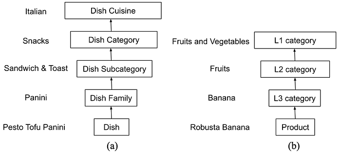
*Figure 2 Hierarchical classification of a dish in the food service(a) and products in the grocery service(b).*

For our solution, we utilized the existing taxonomy leveraging the in-house Food Intelligence Engine, which provides the hierarchical classification of dishes in the Food domain and products in the grocery domain shown in Figure 2.

In Figures 3 and 4, we highlight two different analyses utilizing the above-defined classifications that show evidence of a cross-domain relationship between our source (food) and target (grocery) domains.

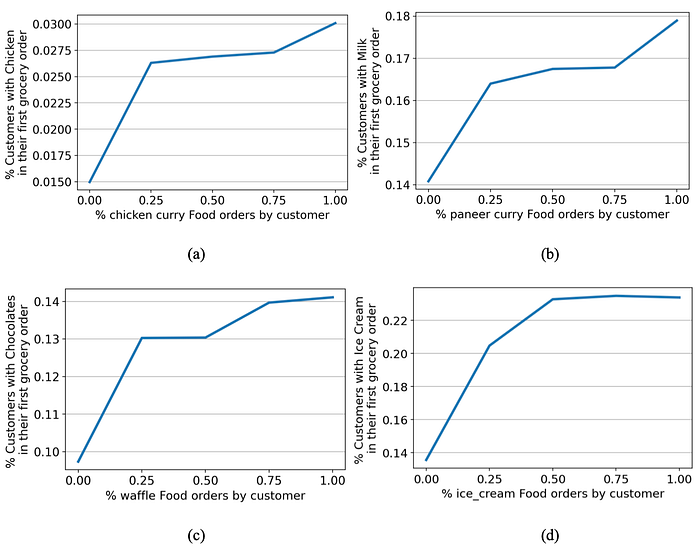
*Figure 3 Correlations between customer’s order percentage of a specific dish family and the percentage of those customers who ordered a specific L2 category in their first grocery order*

From Figure 3(b) we see that 14% of customers with no “paneer” orders in the food service order Milk in their first Instamart order;  
While 16.5% of customers who have 50% paneer curry orders, order Milk in their first Instamart order.

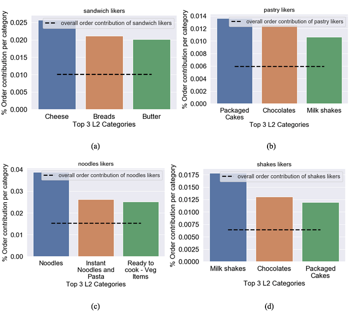
*Figure 4 Order contribution of specific cohorts in the food domain*

In Figure 4(b), we see that customers who are ‘sandwich likers’ on the food domain make up 1% of all sales on Instamart. However, they have a higher contribution in certain categories, such as 2.5% to all cheese sales and 2% to bread and butter sales.

After objectively examining various scenarios in which information from the source domain (food) affects the target domain (grocery), and also subjectively evaluating whether the connections are logical based on our understanding of the domains, we conclude that there is a cross-domain dependency between them. By utilizing cross-domain-based recommender systems, we can enhance our recommendations, particularly for cold users, resulting in increased engagement and revenue in our target domain.

**3 Methodology  
**In this section, we explain the product ranking problem for new users using cross-domain learning.   
We first define the candidate set generation(retrieval) methodology which is common for all ranking methodologies which have been evaluated.

**3.1 Candidate set generation (Retrieval)  
**We use a common retrieval approach for evaluating all the approaches. The candidate list consists of popular products for a location and time slot. The popularity of a product is determined by it’s order frequency in the last X days with a recency-weighting factor such that more recent orders are weighted more. We call this the **recency weighted frequency(rwf)** score denoted by **ρ_._**

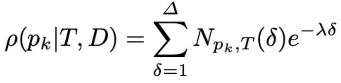
*Figure 5 Recency weighted frequency score denoted by ρ*

where **𝜆** controls the recency weight, **𝑁**ₚₖ,T(𝛿) is the number of units of product **𝑝ₖ** that were ordered **𝛿** days before the current date in slot 𝑇 from store 𝐷.

The figure below shows the difference in the weight assigned for with respect to recency(**𝛿**) for different values of **𝜆**

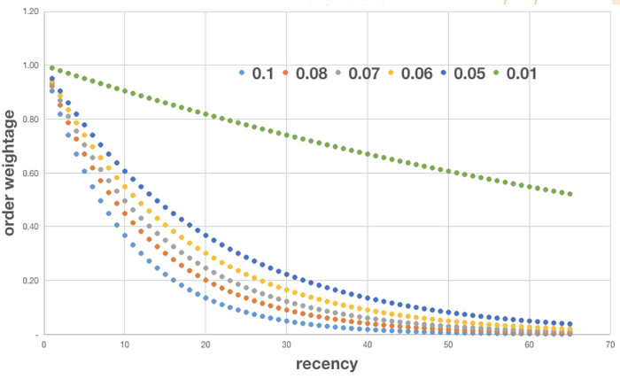
*Figure 6 Weight assigned to orders 𝛿 days ago for different values of 𝜆*

**3.2 Hierarchical Cross-Domain Ranking  
**We propose a 2-stage hierarchical cross-domain ranking (HCDR) algorithm whose architecture is shown in Figure 7. It consists of (1) a hierarchical product category mapper, which learns multiple mappings between the customer preferences in the food domain to product category preferences in the grocery domain and (2) a Location-aware ranker, which takes the mapped product category preferences and other location-specific attributes of the product as input to obtain the final rank of the products for a recommendation. While this framework is proposed in the context of cross-domain learning from the food to grocery domain in a q-commerce setting, the framework of the hierarchical ranker itself generalizes well to other use cases, where we can alleviate the data sparsity problem by learning mappers of different granularity in the first stage and then including more fine-grained product specific attributes to improve the ranking in the second stage.

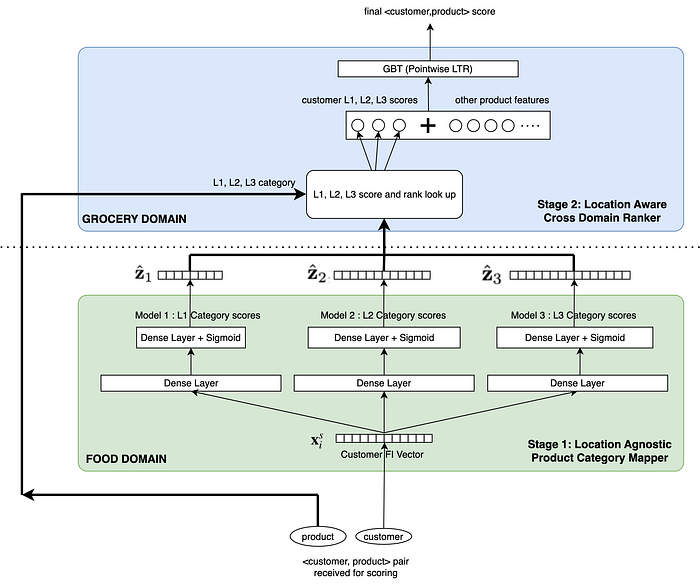
*Figure 7 Solution Architecture*

**3.2.1 Hierarchical cross-domain mapper  
**The first stage of the proposed solution consists of multiple cross-domain mappers which learn the correlation between the customer’s food preferences and the product category preferences in their first order in the grocery domain. This is done using a multi-label classification network trained to predict the probability of a Customer adding an item from a specific category in Instamart.

The training and inference setup is shown in Figure 8,

- **Dataset:** Customers first Instamart order and _X_ months of Food ordering history before that
- **Input (X):** Dish family order % vector where each element specifies % of customer orders from that dish-family
- **Ground Truth (Y): **3 Vectors for 3 models, one for each of the L1/L2/L3 categories, where each element represents whether the specific category was ordered by the customer in their first order
- **Model Outputs:  
- **Score for each category, representing the probability of ordering that category in their first order  
- Rank for each category, generated by sorting the scores

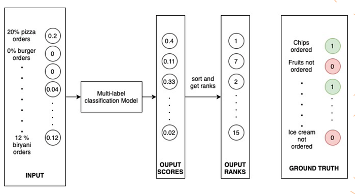
*Figure 8 Hierarchical cross-domain mapper — Training and Inference Setup*

**3.2.2 Cross domain ranker  
**The second stage consists of a location-aware ranker which takes the estimated customer product category affinity vector from the first stage, and product specific attributes from the grocery domain to provide the final ranking score.

This is done by training a Point-wise GBT(Gradient boosted trees)-based LTR(Learning-to-rank) model, which returns a score for each <customer, product> pair.  
This model uses the L1/L2/L3 scores and ranks from the first stage and also uses the product’s RWF-based popularity score. This model is trained as a binary classification model where all products ordered in a users’s first grocery order are treated as positive samples. And, top K popular products which were not ordered by the user in the same session are considered as negative samples.

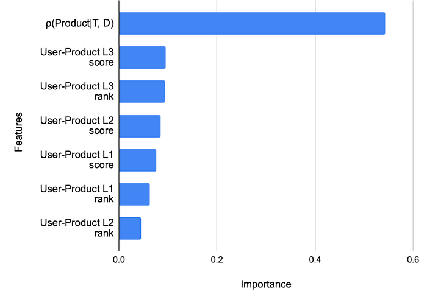
*Figure 9 Feature importance of the ranking model (discussed in results)*

**4 Results  
**We evaluate the proposed HCDR with the following methodologies and compare the performance in terms of Mean Reciprocal Rank (MRR) and Normalized Discounted Cumulative Gain (NDCG) metrics. The candidate set for ranking used in each of these approaches is common.

1. **Recency Weighted Frequency approach (RWF)**: In this case, each of the product in the candidate list is ranked based on 𝜌 which is the recency weighted product popularity score.
2. **MLP based Embedding Mapping approach (MLP-EM)**: We use the MLP-based nonlinear mapping used in [EMCDR](https://www.ijcai.org/proceedings/2017/0343.pdf), which is a network optimised to learn a mapping between user dish embedding and the user product embedding. We use a one-hidden layer MLP and use the root mean square error (RMSE) as the loss function to train the model. Since the output of the network is an n dimensional vector, where n is the dimension of the embeddings, RMSE is calculated individually for each element between the predicted and target embedding and summed.

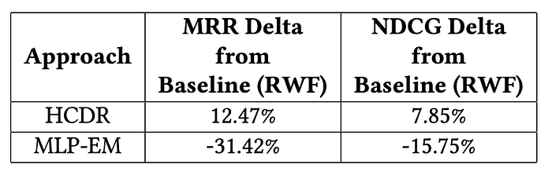
*Table 1 Recommendation performance measure wrt RWF baseline using MRR and NDCG*

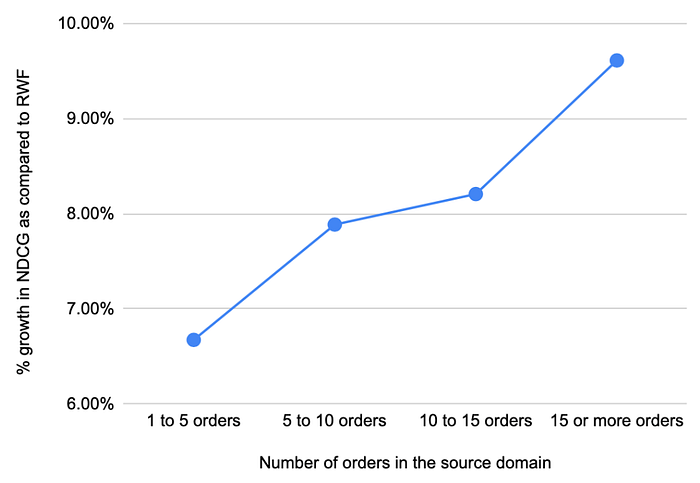
*Figure 10 Increase in NDCG Lift of HCDR wrt RWF with increase in order history in source domain*

Table 1 shows the ranking metrics of the different approaches on the evaluation dataset. HCDR shows an improvement of ~8% in NDCG and ~12.5% in MRR against the RWF method. We also see that HCDR outperforms the MLP-EM based method, which relies only on item level data, as opposed to the aggregated category level data in addition to the item level data in HCDR. We also observe that the amount of the user history available in the source domain impacts the model performance. Figure 10 shows the lift in NDCG compared to the popularity model. We observe that the lift in NDCG increases as the number of orders in the source domain increases, illustrating the fact that the model is capturing the customer product category preference better, when larger amount of data is available in the

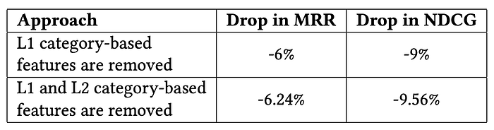
*Table 2. Drop in performance of HCDR when different Hierarchical categories are removed*

Figure 9 shows the feature importance of the GBT classifier. User-Product L3 score represents the product category affinity score of the customer towards the products L3 category. Similarly User-Product L3 rank represents the rank of the category. We see that though 𝜌 is the feature of highest importance, the non-zero significance to the cross-domain features indicates the additional information gain that these features are providing over and above the RWF method, which is also reflected in the improved metrics. We also observe the impact of using multiple hierarchical categories by removing some categories and assessing the offline performance. Table 2 shows that when we remove the L1 category based features (least important based on GBT-based feature importance as shown in Figure 8) we observe a 9% drop in NDCG with respect to the original HCDR algorithm. The performance further drops as we remove L2 category-based features as well.

**5 Conclusion  
**In this work, we discussed the problem of cross-domain recommendation for cold-start users in a q-commerce setting. Following a data analysis, we proposed a two stage hierarchical cross-domain ranking algorithm, where in the first stage we learn multiple crossdomain mappers which capture the customer’s grocery product category affinity based on their food ordering behaviour. In the second stage, we use the outputs from the first stage and location specific attributes for ranking. The offline experiment results showed that this two stage hierarchical approach outperforms direct embedding mapping based approaches apart from the popularity baseline. The effectiveness of this method was also proved through an online experiment. In the future, we plan to evaluate this framework with other datasets, use-cases and other methodologies. We also plan to improve the mapper by including other signals such as time slot, day of the week and other category levels from our food taxonomy, in addition to the dish family used in this work. We also plan to improve the ranker by using listwise LTR instead of the current pointwise LTR.

---
**Tags:** Recommendation System · Machine Learning · Quick Commerce · Cold Start · Swiggy Data Science
