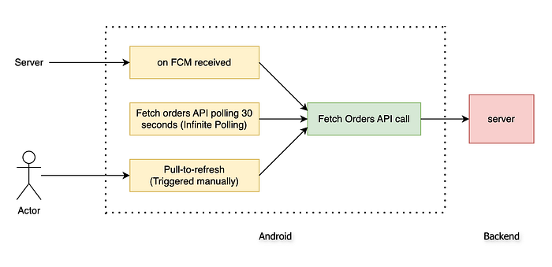

# Optimising the Swiggy Restaurant app


*Photo by Aurélien Dockwiller on Unsplash*

Today, I will walk you through a fascinating story about how we scaled up the [Swiggy Restaurant Android](https://play.google.com/store/apps/details?id=in.swiggy.partnerapp&hl=en_IN) app from a _single-restaurant order flow_ _feature_ to a _multi-restaurant order flow feature_ in the same Android app by optimising the app in all possible ways—network requests, CPU processing, code cleanups, etc.

### Context

Our Restaurant app is built using the [react-native framework](https://reactnative.dev/). The restaurant partner manages the order acceptance, preparation, and the status of being ready for pick up by the Delivery Agent (DE) and other modules on the **Order Screen.**


*Order Flow Architecture*

We have three mechanisms to ensure the [Swiggy Consumer](https://play.google.com/store/apps/details?id=in.swiggy.android&hl=en) orders are shown in real time on the Swiggy Restaurant app.

1. We call the **Fetch Orders API** after receiving the [Firebase FCM](https://firebase.google.com/docs/cloud-messaging) event. Our backend (BE) system sends multiple FCM events to the frontend (FE) during different stages (_New, Confirmed, Prepared, Ready, Delivered_) of the order flow.
2. We call the **Fetch Orders API** after every X seconds (API Polling)
3. Manually triggered pull-to-refresh event by the Rx partner

Although our current order flow works smoothly for day-to-day traffic benchmarks, we have observed some opportunities to improve the performance during controlled local testing with 2x or 3x usual traffic. To scale it to 10x or multi outlets, we need to improve the overall app performance


---

### Story Time….😍

In early January 2024, after New Year’s Eve, one of our engineers improved the order flow codebase of our Android app. Previously, every order polling fetched all orders from Java Native to React Native via the RN bridge. Now, only updated or new orders are passed, reducing data transfer and processing in React Native, resulting in a significant performance boost.

Our app used to support a single-outlet order flow, but we need to scale it to handle multiple outlet orders simultaneously. To achieve this, we must identify and implement improvements that will allow us to accommodate this expanded functionality efficiently.

### 1st attempt 😎🙏

> The goal was to improve the Order flow performance by reducing in-efficiencies across CPU, network, and RAM useage.

To begin with, we started debugging and improving basic tasks. I did some _warm-up pushups _🏃_ _before tackling this task._ _Here’s what we did

1. **Dead Code Removal:** We eliminated many dead codes and deprecated feature flags to control feature visibility.
2. **Async Storage Cleanup:** Removed unnecessary information saved at app startup.
3. **API Polling Optimisation:** Unsubscribed the DE tracking API polling per order level when not on the order flow screen, stopping it from running unnecessarily in other sections.
4. **Polling Interval Adjustment:** Increased DE order tracking polling interval from 15 to 30 seconds.
5. **API Interceptor Removal:** The API interceptor was removed on the Java native side, reducing CPU load after every API call.
6. **Sentry Optimization:** Added character limits to breadcrumb messages sent to Sentry for crash tracking, drastically reducing network data upload.
7. **Event Tracking Cleanup:** Removed unnecessary high-frequency business tracking events on order card scrolling.

And the result is …. as unexpected, no change at all 😏

### 2nd Attempt 🤞

Although all the previous tasks were important and had some impact, they had little to no effect on order flow performance. After a strong black coffee, I went deeper:

1. **API Cleanup:** Reviewed all network APIs from app startup to order flow and removed two unnecessary API calls that were no longer needed due to deprecated features.
2. **API Frequency Reduction:** Reduced the calling frequency of four frequently called APIs on the order flow screen.
3. **Image Optimisation:** We discovered that the original DE image on the homepage order card was a whopping 4.37MB, causing a high network, CPU, and memory load. Using the [ImageKit resizing feature](https://imagekit.io/docs/image-resize-and-crop), we fixed it to a standard size of 150x150 px (~5KB).

This time, I felt proud 😌 These focused tweaks significantly improved the overall app’s hygiene, but the order flow performance remained largely the same 😤.

```
// ImageKit Resize and crop images feature
const getDeThumbnail = (imageUrl: string): string => {
  return imageUrl + "/tr:w-150";
}
```

### Final Attempt 😰

In the final attempt, before throwing in the towel, I tried some yoga 🧘 and then set up a complete observation with console logs, network logs, and CPU logs. The problem was finally apparent:

### Throttling

We called the Fetch Orders API on every Firebase Cloud Messaging (FCM) event for each order stage (New, Confirmed, Preparing, Ready, Delivered). This results in 5 API calls per order. During peak hours, if a restaurant has 30 active orders and 10 orders change state, this generates a surge of 10 FCM events per order stage, totalling up to 150 events (30 orders * 5 stages). Each event triggers an immediate Fetch Orders API call, causing performance issues due to the high frequency of calls.

To address this, we implemented API throttle logic to mitigate the performance issues. This logic ensures we do not consecutively make individual API calls for each FCM event. Instead, we group multiple events and make fewer consolidated API calls, reducing the load on the system and improving overall performance. The throttle logic helps manage the API call rate during peak times, ensuring the system remains responsive and efficient.

> To fix this bug, we added throttling for FCM events. This cut down on the Fetch Orders API calls, saving processing power on Android devices and reducing server load 🚀

```
Context cx = getApplicationContext();
int fcmThrottleIntervalInSec = SharedUtils.getFcmBasedPollingInterval(cx); // 10
Long fcmBasedLastTimestamp = SharedUtils.getFcmBasedApiLastTimestamp(cx);
Long timeDifferenceInSec = (Utils.getCurrentTimeStamp() - fcmBasedLastTimestamp) / 1000;
boolean scheduleFetchOrdersApiCall = timeDifferenceInSec > fcmThrottleIntervalInSec;

if (scheduleFetchOrdersApiCall){
    SharedUtils.putFcmBasedApiLastTimestamp(cx, Utils.getCurrentTimeStamp());
    Log.d(TAG, "about to fetch orders from FCM in: " + fcmThrottleIntervalInSec);

    Handler handler = new Handler(Looper.getMainLooper());
    handler.postDelayed(new Runnable() {
        @Override
        public void run() {
            final OrderPoll.CallSource source = OrderPoll.CallSource.FCM;
            fetchOrdersAPiCall(source);
        }
    }, fcmThrottleIntervalInSec * 1000);
}
```

## Impact Analysis 🕺

1. **Frames Per Second (FPS):** The more the FPS, the faster & smoother the experience. Overall FPS improved by 20_% _gain_ _🙌
2. **Flashlight Score: **This is a great [tool](https://flashlight.dev/) to measure the performance scorecard (out of 100%) by aggregating the different perf metrics like — CPU usage, RAM usage, FPS, etc. During the peak hours of the order flow usage, we have got a _27.13% gain _🥳
3. **Low/Mid device segments gain: **Previously where the app,   
crashes with 100+ orders on the Small-Segment (2GB RAM) devices and   
crashes with 600+ orders on the Mid-Segment (4GB RAM) devices.   
Now work seemingly great on 600+ orders (🍔😋) on all segments
4. **Network performance gain: **We have reduced our get orders API call by 50% gain 😱
5. **Code cleanup**: Not to mention our code cleanups and improved basic hygiene


---

## The moral of the story 😃

Besides drinking coffee and adding yoga to your routine, follow these rules.

1. Think of your app as a whole, not just a collection of features. This will help you better decide what is best for overall app performance.
2. Use debugger tools to observe console logs, network requests, RAM usage, etc.
3. Always do extensive testing before adding new code.

**Thanks for your precious time! **🙏

> **Acknowledgements**This couldn’t have been possible without the help and support of [Mitansh Mehrotra](https://medium.com/@mitansh.flab), [Harpreet Singh](https://www.linkedin.com/in/harpreet-singh-b2005178/?originalSubdomain=in), [Tarique Javaid](https://www.linkedin.com/in/tarique-javaid-7a9150119/?trk=pub-pbmap&originalSubdomain=in) and [Tushar Tayal](https://medium.com/u/400467f4ffab).  
> Huge thanks to the incredible folks at the Vendor team at Swiggy, who tested these changes and made this massive release successful.
