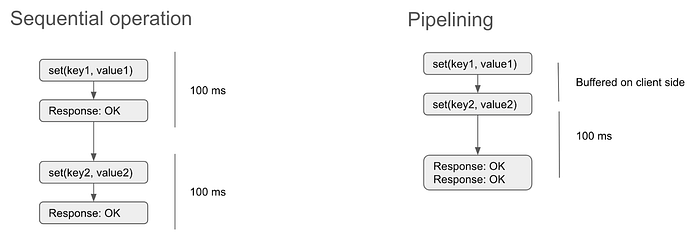
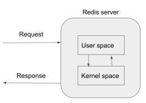
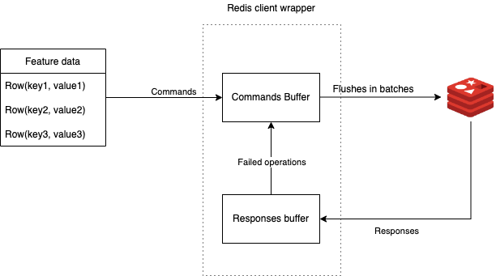
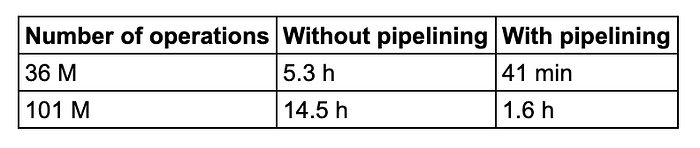
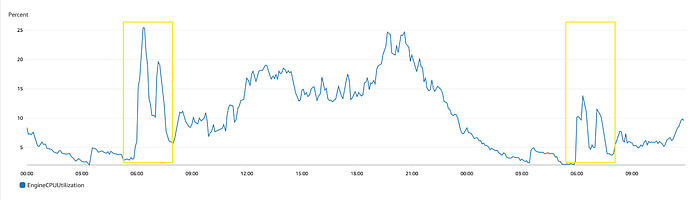

# Optimizing batch writes to Redis using Pipelining

[Earlier](https://bytes.swiggy.com/enabling-data-science-at-scale-at-swiggy-the-dsp-story-208c2d85faf9) we talked about our ML deployment platform called Data Science Platform (DSP) and how that enabled us to scale ML at Swiggy. One of the core components of our platform is the feature store which hosts and manages all the features needed for model inferencing. DSP provides a simple interface to define and schedule the ETL jobs to generate feature data. These feature jobs run on Databricks and periodically update the feature store. For all of our low latency requirements we use AWS ElastiCache backed by redis as our feature store.

There are 1000s of feature jobs which run daily and update the feature store. This contributes to roughly 40% of our platform maintenance cost. As part of an org-wide activity to reduce infrastructure costs, we started analyzing the patterns in job’s execution plan and identified 50% to 70% of the job uptime goes into writing to Redis. Naturally, our first goal was to improve the time taken to write to Redis.

## Working on Redis

Redis follows the client server model. Client sends a request, server processes it and returns the response. Throughput is bound by processing time (typically in the magnitude of μs) and RTT (typically in magnitude of ms). So, the significant factor which decides your redis throughput is RTT. To reduce the avg time spent in network round trip per request, Redis introduced pipelining which is a technique for improving performance by issuing multiple commands at once without waiting for the response to each individual command. Let us analyze the request latency in both the cases.

*RTT Comparison*

In the sequential approach, one request takes around 100 ms, so in a second we could do only 10 requests but in pipelining we would be able to do 20 requests. We have simply doubled it by batching our requests! In a real world case we could achieve higher throughputs by having larger batch sizes. However, this doesn’t give us the freedom to infinitely increase our batch size. Using larger batch sizes in pipelining means on the client end all requests are buffered and on the server end all responses to our requests are buffered until the last request in the batch is processed. **It means the socket buffers (on client and server side) could be saturated dealing with larger batch sizes.** This adds to more pressure on the communication and memory stack. There is a sweet spot for batch size to gain the optimal performance depending on the nature of your operations and infra setup.

One more by-product of using pipelining in redis is reduced CPU utilization of the Redis engine. Understanding the request processing on the server side.

Redis is, mostly, a single-threaded server from the POV of commands execution. It means it can only execute one command at a time. To serve a request, the Redis process needs to switch between user and kernel mode. In user mode it accesses the internal data structures (user data) and in kernel mode interacts with hardware (network). This switch involves process interruption and system calls. More can be read about this [here](https://www.geeksforgeeks.org/user-mode-and-kernel-mode-switching/). Moving to pipelining reduces the number of context switches per command between user and kernel mode which directly reduces the CPU utilization of redis engine which means we can now process a higher number of requests.

## Pipelining adoption in ML feature jobs

We use Jedis as our Redis client library. All our Redis instances are on AWS ElastiCache running in clustered mode. Jedis started supporting pipelining in cluster mode with their release of [4.0 version](https://github.com/redis/jedis/releases/tag/v4.0.0) in late 2021. Due to early adoption there were some features missing which were critical to our implementation.

- Unified interface for both clustered and unclustered redis clients
- Support for auto **synchronization **of pipeline based on configured batch size
- Retrying failed operations with exponential backoff

To achieve this we had built a wrapper on top of the existing client implementation

*A high level flow*

Each row in the dataframe translates to a redis operation. For each partition of the dataframe, the commands are added to the buffer. After reaching the batch size configured, the pipeline synchronization is triggered. In Jedis, the pipeline object cannot be reused post synchronization. We recreate from the connection pool for the next set of commands. Post pipeline sync, the responses are parsed and failed operations are reinserted to the command buffer with a retry flag. Each failed command is retried until the configured threshold. We were able to negotiate any failures (slot unavailable/redirects) due to topology changes in the redis cluster.

## Results

We experimented on a couple of feature jobs which write heavily to the Redis cluster. We captured the stage time across all tasks for comparison.

Clearly we were able to reduce the time spent on Redis writes by 90%. This saved the Databricks cost (DBUs) along with AWS EC2 cost. This translated to roughly 60% reduction in costs just by enabling pipelining on Redis. As discussed the other by-product of pipelining is reduced CPU usage on Redis engine which is evident from cloudwatch metrics.

## References

- [Redis pipelining](https://redis.io/docs/manual/pipelining/)
- [Performance benchmarks on EC redis](https://aws.amazon.com/blogs/database/optimize-redis-client-performance-for-amazon-elasticache/)
- [Lettuce documentation](https://lettuce.io/core/release/reference/)
- [Jedis usage](https://github.com/redis/jedis#readme)

---
**Tags:** Redis · Optimisation · Jedis · Pipelining · Swiggy Engineering
