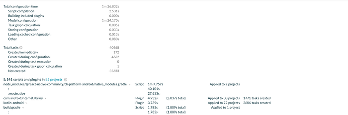
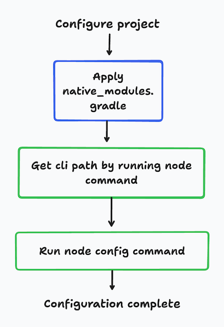
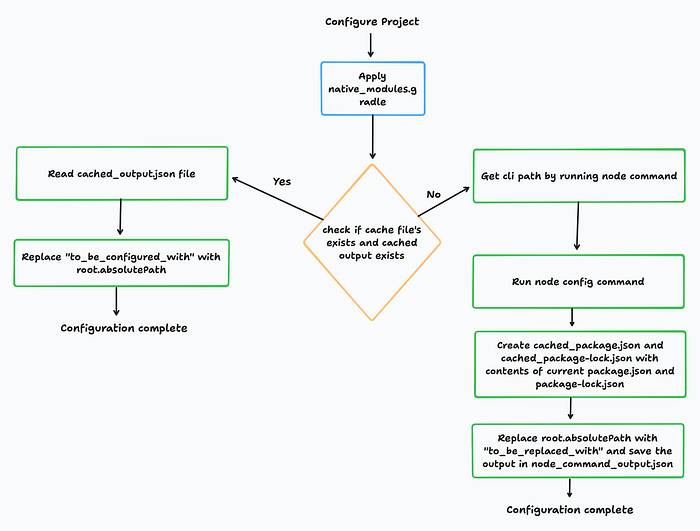
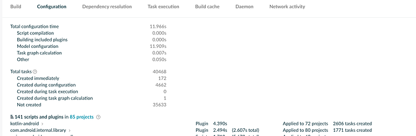
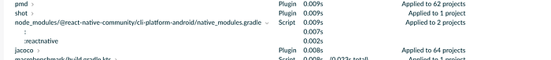

# Optimizing Configuration time for Android apps that use React Native


Swiggy is a super app that hosts a range of business lines, including Food Delivery, Instamart, Dineout, Minis, Insanely Good, Mall, and more. Each of these business lines operates on its own distinct technology stack, with React Native being among the frameworks utilized.

There was a sharp increase in the time taken to complete the configuration phase of the build process on adding react native to our app. For configuring the project, it was taking more than **1 minute**. Imagine waiting at least 1 minute every time you want to see your changes 😔

To debug, let’s first understand how our app is built by the gradle build system.

The build process of gradle goes through various build phases.

The build phases of gradle are

1. Initialization phase — In this phase Gradle tries to identify all the projects involved in the build process.

2. Configuration phase — During this phase, Gradle executes the build script of each project identified in the previous phase

3. Execution Phase — This is the last phase. During this phase, Gradle identifies the tasks that need to be executed created in the previous phase, and executes them according to their dependency order. All the build work and activities are done in this phase. For example: compiling the app, generating build etc.

Now that we know the phases of the gradle build process, let’s debug this.

To debug, let’s run a gradle scan to see what is taking so much time.  
To run a gradle scan, you can execute the below command

```
./gradlew dependencies --scan
```

Running this will generate a link to get the details of the tasks that were executed.

By going to the configuration tab ( you can reach it by clicking on performance from the navigation rail and then pressing on the configuration tab), it was observed that the total configuration time for our app was **1 minute and 26 seconds**, with 1 minute and 7 seconds (**86% of the time**) being spent on executing the native_modules.gradle script.


*Configuration Time Breakup*

If your react native app has a dependency on **react-native-community**, then your app will need to apply the native_modules.gradle script. Applying it 1 time can increase the configuration time by around 30 seconds. This was applied two times (one time in settings.gradle and one time in another module), so the increase in time was doubled for us.

After going through the code written in native_modules.gradle, it was observed that 2 node commands are being executed by the script.

1.`node -e "try {console.log(require('@react-native-community/cli').bin);} catch (e){console.log(require('react-native/cli').bin;}”` — This command resolves the command line path. This command executes very fast.

2. `node $cliPath config` — This command generates a JSON output which the gradle command uses to generate PackageList.java. Sample output for this command can be found here — [gist link](https://gist.github.com/balvinderg/5821aa34812508fdb1499d540420c948)

The majority of the configuration time is spent in running the node config command.   
To reduce the configuration phase time, we decided to modify the native_module’s gradle script and cache the output of the config command as it is same for every project configuration given that the package.json and its dependencies have not changed.

This is how the existing script works


*Flow diagram for existing native_modules.gradle*

and this will how the modified native_modules.gradle will work


*Flow diagram for modified native_modules.gradle*

**Explanation**

1. We are going to cache the output of the node config command and save the output of it in the node_command_output.json file. We will also save the current package.json in cached_package.json and the current package-lock.json in cached_package-lock.json so that we can compare them later while deciding whether to use cached_output or not.
2. We are replacing the output of the node config command by replacing the result of root.absolutePath with “to_be_replaced_with” so that the output remains the same for any developer working on the project. We will replace “to_be_replaced_with” back to the root.absolutePath when we are going to use the cache.

The modified native_module.gradle script can be downloaded from here — [https://gist.github.com/balvinderg/d7b93e329c84ae81eab7936f9c9b8f54](https://gist.github.com/balvinderg/d7b93e329c84ae81eab7936f9c9b8f54)

If you are on the latest version of React Native community , you can use this — [https://gist.github.com/balvinderg/d6fafbb75c06e4388cf51ac3d1bf41a1](https://gist.github.com/balvinderg/d6fafbb75c06e4388cf51ac3d1bf41a1)

To make sure that all the devs use the same native_modules.gradle script, you can use patch-package.

To add patch-package, you can add patch-package as a devDependencies in package.json and a script to run patch-package when node modules are installed.

```
{
  "name": "example",
  "private": true,
  "version": "0.0.0",
  "description": "",
  "scripts": { //Add this in your package.json
    "postinstall": "patch-package" //Add this in your package.json
  },
  "devDependencies": { 
    "patch-package": "6.4.7" //Add this in your package.json
  }
}
```

Now run command

```
npx patch-package @react-native-community/cli-platform-android
```

after modifying the native_modules.gradle script.  
This will ensure all devs are using the same native_modules.gradle script while running the builds.

**Results**

After modifying the native_modules.gradle script, our configuration time decreased from 1m 26s to** 12s** i.e an **86% **decrease in configuration time 🚀🚀


*Configuration time breakup (after)*


*New execution time for native_modules.gradle*

**Savings Per Day**

Average build generation per day in Android team— 55  
Average Savings per build — 74 seconds  
Total Savings — 55 * 74 = 4070 seconds ~= **1 hour per day**

### Resources

1. [https://www.npmjs.com/package/patch-package](https://www.npmjs.com/package/patch-package)
2. [https://proandroiddev.com/understanding-gradle-the-build-lifecycle-5118c1da613f](https://proandroiddev.com/understanding-gradle-the-build-lifecycle-5118c1da613f)

---
**Tags:** Android · Hybrid Apps · Gradle
