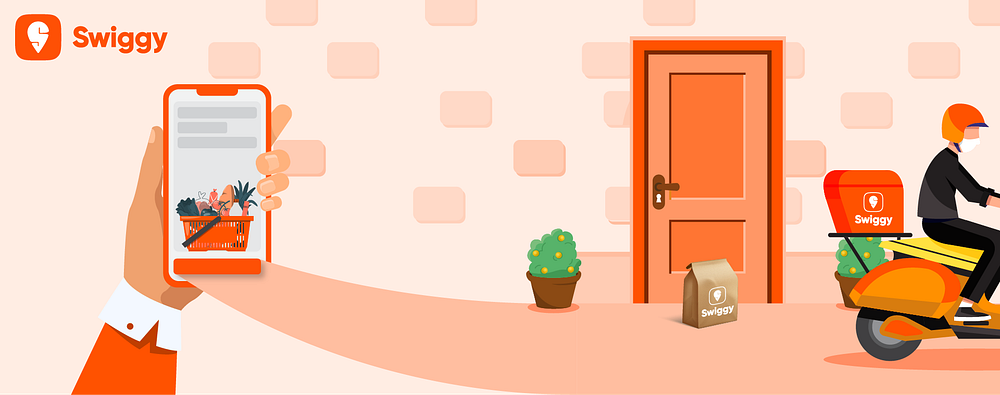
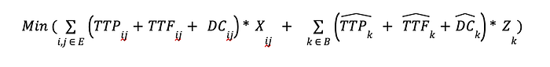
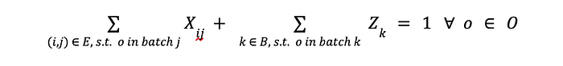

# Optimising the picking process to enable faster deliveries for Instamart

Co-authored with [Sunil Rathee](https://medium.com/u/7eb9236fe3b9?source=post_page---user_mention--93de0fe9d819---------------------------------------)

## Introduction

For 4 years, Instamart, the online instant grocery delivery service has been providing unparalleled convenience to its customers. Orders being delivered 24*7 have indulged the millennial midnight cravings as well. Their enormous catalog makes 1-day delivery feel like a turtle. Even though the delivery executive (DE) reaches your gate in less than 10 minutes, the same order may take 20–25 mins to reach during peak times (e.g. morning or evening). On the backend, the same delay can be attributed to the increased amount of orders coming every minute as compared to the number of available DE and dark store staff during these stressful hours. In a dark store, the pickers play a crucial role. They are responsible for picking items off the shelves and assembling the orders for delivery. The dark stores (aka POD) are like micro-warehouses used to fulfill customer demand online but not accessible offline. The time-consuming process of picking and packing multiple orders can lead to longer delivery times experienced during peak hours.

To address this issue and maintain customer satisfaction, Instamart may consider hiring the optimal number of DEs and Pickers during peak hours and optimizing their backend operations to handle higher order volumes more effectively. Implementing technology-driven solutions like route optimization and intelligent order assignment could also help streamline the delivery process and reduce delivery times during stressful periods. The goal is to ensure Instamart can continue to offer unparalleled convenience while ensuring swift deliveries even during peak hours.

In this blog, we have focused on optimizing the picking process at the dark stores. Specifically, how we can leverage batch picking of multiple items across orders and be more efficient during peak times.

The order journey consists of the following steps (see GIF 1). Once an order has been confirmed, it is relayed to the nearest dark store. Then, the picker assignment system assigns the order to an available picker. The picker collects the items in a given order from the shelves in his cart, packs and bills the order. Finally, a packed and billed order is kept in the pigeonhole for handing over to DEs. Parallel to the picking process, the routing & assignment system starts searching for a suitable DE that targets the arrival of the DE to the dark store before the order is packed and assigns it to the order. The DE reaches the store, picks up the order from the counter, and finally delivers at the customer’s doorstep.

*GIF 1: Order Journey*

## Illustration of the Problem and Proposed Solution

### Base Picker Assignment Algorithm

In an Instamart dark store (aka store), free pickers are selected on a [round-robin](https://en.wikipedia.org/wiki/Round-robin_scheduling#:~:text=Round%2Drobin%20(RR)%20is,also%20known%20as%20cyclic%20executive).) basis and assigned to the incoming orders. Single order assignment to pickers leads to significant delays at few stress slots. This incident leads to a backlog of unpacked orders causing a delay in packing the further orders. Consequently, picker assignment times ​​have high p90 values with a significant impact on the customer experience.

A trivial and costly solution to tackle the above problem would be to simply hire more pickers which is not a sustainable, cost-effective solution. However, a non-trivial solution would be to batch (i.e. bundle) the orders with similar items and assign these batches to pickers instead of individual orders. The intuition of order batching for pickers is that the pickers would pick similar items at once and save time in travelling within the store.

## Proposed Picker Assignment Algorithm

### Inspiration

The model is inspired from nukkad kirana stores. In these stores, we list out the items we need to buy. The manager/owner of the store usually clubs the orders using his own intelligence to serve the orders quickly. The shopkeeper sends his proteges to different sections of the store to pick the items. Once they come back with the items, they serve their customers with the required items, resulting in saving time as compared to one assigned person going all around the whole store for an order.

### Example

Suppose the dark store has two small orders to fulfil for a bottle of juice and only one picker is available.

**Base Algorithm**: The picker gets assigned to the order which was placed first, goes to the juice section, grabs the juice, comes back to the billing counter and packs the first order. Afterwards, the picker gets assigned to the second order, again goes back to the juice section, grabs the juice and again comes back to the billing counter and packs the second order.

*GIF 2: Current Algorithm*

Not very efficient, right?

**Proposed Algorithm**: The picker gets assigned to both the orders and is shown that he/she has to pick two juice bottles, he/she goes to the juice section, grabs both of them, comes back to the billing desk, packs the order, which was placed first and then packs the second placed order.

*GIF 3: Proposed Algorithm*

## Mathematical Model

In the following section, a mathematical model is demonstrated for implementing the proposed solution.

### Input Data

Inputs to the batching algorithm:

- Type of items in the order
- Number of items in the order
- Bill value of the order
- Weight of the order
- Predicted time to mark ready.

All the active orders which have no picker assigned to them are permuted and combined to form batches with up to k orders (we considered k = 2) to be assigned to a single picker. The K-order batches are checked for their validity if their weight, bill, and total number of items are below the respective thresholds.

**Notations**:

**Set**:

B = the set of all batches,  
O = the set of all active orders in the dark store.  
J = is the set of all pickers in the dark store.  
E = set of edges between a given batch i and a picker j

**Parameters**:

TTPᵢⱼ = Time to pack iᵗʰ batch by jᵗʰ picker  
TTFᵢⱼ = Predicted Time to jᵗʰ picker getting free and start working on iᵗʰ batch  
DCᵢⱼ = Delay cost if iᵗʰ batch is assigned now to jᵗʰ picker  
= _func(expected_order_ready_time, predicted_order_ready_time)_

**Decision Variables**:

bᵢₒ = indicates if order **_o_** is in batch **_i  
_**Xᵢⱼ = indicates if jᵗʰ picker is assigned to iᵗʰ batch in the current cron

Zᵢⱼ= indicates if jᵗʰ picker is not assigned to iᵗʰ batch in the current cron

**Objective Function**:

The batches permuted with every picker in the dark store are sent to the optimisation algorithm along with the following objective. The future cost is needed to compare the consequences of delaying one batch over another.

Where hat(^) indicates all these terms in the next cron (i.e. decision cycle)

**Constraints**:

- An order should either be assigned in the current cron or the next cron

- Every picker can be assigned to only one batch.

In the objective function, TTP is used to account for Similarity. The calculation of TTP (the first time) accounts for the similarity as time picking for multiple items in the same category is lesser than travelling to other category aisles, identifying and picking the items. The TTP will be different for different batches, if any batch will have similar items it will have lower TTP compared to addition of individual orders and if the batch has very different items (hot/cold) it will have same TTP time as addition of TTP times of individual orders with higher delay cost, making it an inefficient choice.

The time to free (_TTF_) accounts for picker status, i.e. if he/she is free or the time in which he/she will be free to pick the next order. The delay cost (DC) is to keep the delays beyond their promised order ready time in check.

### Model Settings:

- The limit on the number of orders to be batched is 2. This is done to ensure less confusion for the staff at the dark stores and human errors don’t increase while packing the orders.

In the 2 order batching, if the picker picks the total number of items correctly but packs extra or misses any item in the 1st order, while packing the 2nd order he will have a missing or extra item which will help rectify the mistake if done in a timely manner.  
If we increase the number of orders, the above won’t be possible till we reach the last order of the batch.

- The orders are only batched when the free pickers available are less than the number of unassigned orders.
- Validate the batches of the orders.
- The total number of items and the total weight of items in both orders need to be less than the respective upper bound.
- A similarity score is calculated for a pair of orders based on the categories of items and the closeness of their racks in the dark store such that it reduces the time and is checked if it’s above a certain threshold.

### Simulation:

To validate the above order batching algorithm, a discrete-time simpy-based simulation was run.

- Input data is real-time orders data, picker data and shelving information for a dark store-date combination.
- A cron is run where pickers are checked if free and unassigned batches are assigned till the end time.

### Results

The below results were validated:

- The average ordered to picker assignment time for an order decreased.
- We observed that the total picker assigned to marked order ready time for all the orders decreased as we saved heavily on the travel time of pickers.
- The average time to mark order packed increased. As the time to mark order packed increases for the 1st order that is batched and decreases for the 2nd order but they are not equal and hence don’t offset.

This is counter-intuitive, but let’s take a closer look with an example: if I have 2 orders and 1 picker which can be served in 20 seconds and 300 seconds, respectively. Batching them decreases the order to marked-ready time by 10 seconds as the picker has to travel less to and from the aisles to the billing desk, so the order to be marked as ready time for both orders is 310 seconds. The picker is busy for 320 and 310 seconds, respectively, making them available for the 3rd order assignment 10 seconds earlier, but the o2mor mean will be 160 seconds and 310 seconds, respectively.

---
**Tags:** Swiggy Data Science · Optimisation · Linear Programming · Swiggy · Quick Commerce
