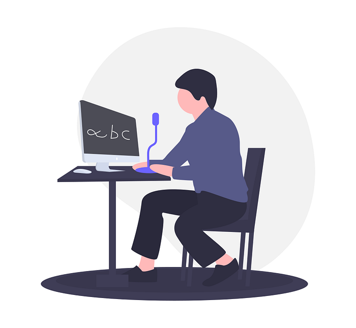

# Our paper on Spoken language Identification systems accepted for INTERSPEECH 2020

Our team comprising of Pradeep Rangan, Sundeep Teki, and Hemant Misra participated in the First Workshop on Speech Technologies for Code-switching in Multilingual Communities 2020, INTERSPEECH, Shanghai, China, 25–29 October, 2020 and submitted their paper on “Exploiting spectral augmentation for code-switched spoken language identification,”. The team’s approach also performed exceedingly well in the shared task that was organised as part of the event and were featured in the leaderboard [here](https://www.microsoft.com/en-us/research/event/workshop-on-speech-technologies-for-code-switching-2020/#!leaderboard).

Here is the abstract of the paper :

Spoken language Identification (LID) systems are needed to identify the language(s) present in a given audio sample, and typically could be the first step in many speech processing related tasks such as automatic speech recognition (ASR). Automatic identification of the languages present in a speech signal is not only scientifically interesting, but also of practical importance in a multilingual country such as India. In many of the Indian cities, when people interact with each other, as many as three languages may get mixed. These may include the official language of that province, Hindi and English (at times the languages of the neighboring provinces may also get mixed during these interactions). This makes the spoken LID task extremely challenging in Indian context. While quite a few LID systems in the context of Indian languages have been implemented, most such systems have used small scale speech data collected internally within an organization. In the current work, we perform spoken LID on three Indian languages (Gujarati, Telugu, and Tamil) code-mixed with English. This task was organized by the Microsoft research team as a spoken LID challenge. In our work, we modify the usual spectral augmentation approach and propose a language mask that discriminates the language ID pairs, which leads to a noise robust spoken LID system. The proposed method gives a relative improvement of approximately 3–5% in the LID accuracy over a baseline system proposed by Microsoft on the three language pairs for two shared tasks suggested in the challenge.

The paper can be accessed here as well : [https://arxiv.org/abs/2010.07130](https://arxiv.org/abs/2010.07130)

---
**Tags:** Interspeech · Speech Recognition · Swiggy Research · Artificial Intelligence · Voice Recognition
