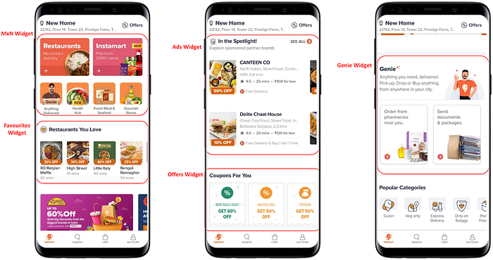
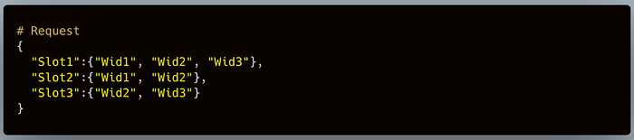
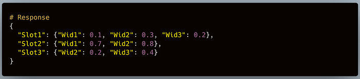
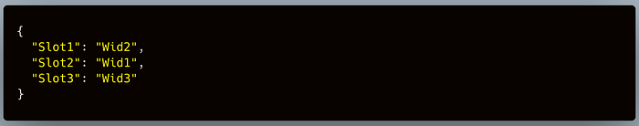
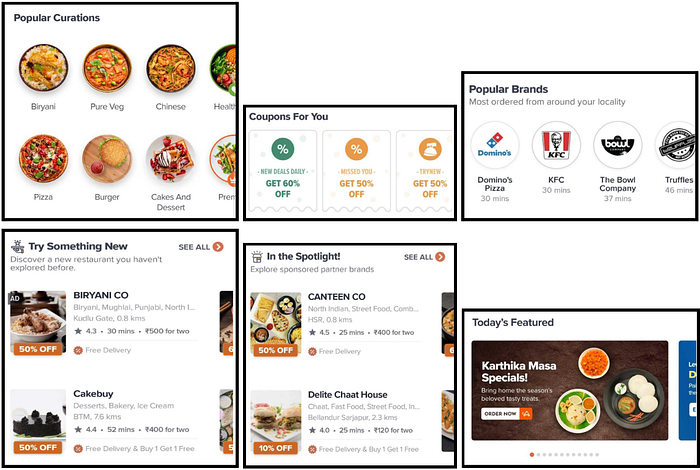
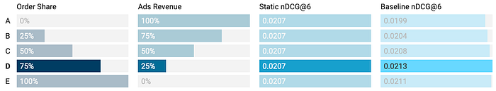

# Personalising the Swiggy Homepage Layout — Part I

Several personalisation models help customers across the Swiggy app. Outlets shown within various widgets are driven by the restaurant recommendation system. The menu page of each restaurant also uses relevance models to recommend dishes to customers. The next frontier is to personalise the homepage layout itself.

In this article, we will discuss our **Wi**dget **Ra**nking framework (WiRa). We first discuss the need for layout personalization and how current layouts work. Then we formulate the problem of personalising any page layout with a collection of widgets under business constraints. We apply this generalised formulation to the homepage. Next, we discuss the four approaches: baseline, linear programming, and two different versions of contextual multi-armed bandits. We also mention the pan-India A/B test and the evaluation results. We conclude with the challenges and future directions.

## The need for WiRa

We saw an opportunity to improve the customer experience by personalising the homepage layout. Along with personalization, we could also automate the time-consuming and manual process of layout optimization.

Imagine this: You are a product manager (PM). You came up with a new widget idea that you think the customers will find valuable. You validate the idea, prove its value, and get everything ready to be rolled out to the customers. But there is a problem. You do not know where to position the widget on the homepage. If you put it on the top, you displace the customer favourites widget. Whereas if you place it lower on the homepage, it will receive less attention and thus will not serve its value. To solve your predicament, you will design multiple A/B experiments. Through a series of experiments, you will try to find the optimal position of the widget.

As you can imagine, it will take you a significant amount of time and resources to conclude all the experiments and arrive at a decision. Each experiment requires help from multiple teams. The operations team creates different layouts with the new widget at different locations. The experimentation team creates and monitors each experiment. The analytics team will analyse the experiment results.

At Swiggy, we have different layouts for different customer cohorts. Conducting experiments at these granularities will further delay and complicate the process.

An automated widget ranking system that personalises the layout for each user eliminates most of the above-discussed manual efforts.

## Home Page Components

To build our WiRa framework, we need to understand various components of the Swiggy homepage.

## Static Layout

Imagine the homepage is divided into small tiles. Each tile has a width the same as your phone screen. These tiles are arranged vertically without any overlap and are called **layout slots**. There is no limit on the number of slots available on the homepage, although it is usually limited to a small number.

Each slot expands to house a **widget**. Since each widget can have varying shapes and sizes, each slot changes its size accordingly.

An ordered collection of slots is called a **layout**. Each layout id will have an associated order of widgets shown to the user. We use different layouts for different user cohorts. Since the widget order is fixed and layouts are immutable, they remain **static**.

Labelled demonstration of the Homepage layout with different widgets arranged vertically.

## Dynamic Layouts

Static layouts do not support ranking widgets at a customer level. Our engineering team made the layouts **dynamic** to solve this problem.

Dynamic layouts have dynamic slots. A dynamic slot contains a set of **candidate widgets**. The presentation layer will use our model to select a widget among the candidates. Having multiple dynamic slots in a layout gives us the flexibility to rank all the widgets in that layout.

*Difference between static and dynamic layouts. All the six widgets are mapped to different slots in the static layout. On the other hand, all the 6 widgets are candidate widgets in the dynamic layout. We have made slots 2, 3, 4, 6, 7, and 8 dynamic. The rest of the slots will remain static. So, our model will only rank the widgets in those slots.*

## Problem Formulation

In this section, we formulate the problem we have to solve. The formulation is generic enough to be extended to the complete homepage. We restrict the model to rank a few specific widgets in the first version.

## Metrics

To measure and guide our models we need to define the relevant business metrics. For the first version, we took the following two primary metrics:

1. **Homepage Order Share (%)**: This metric represents the percentage of the completed orders made through the homepage out of all the orders made through the app. Each widget contributes to the homepage order share. So, it is an additive metric. This metric will help us understand the (direct/indirect) impact of WiRa on the Swiggy homepage.
2. **Dynamic slots’ order share (%)**: This is the total order share of the widgets covered in the dynamic slots. Since it only contains the specific widgets, this metric tells us the direct impact of WiRa on the widgets.

Along with the primary metrics, we also defined a check metric. This metric is to balance customer experience with business revenue. The check metric is **Ads Revenue Per Order (Ads RPO)**.

The model will be successful if it increases the homepage order share and dynamic slots’ order share given that its Ads RPO is either the same or has increased.

## Objective

We have a dynamic layout where there are _n_ dynamic slots. Each of the _n_ dynamic slots has _n_ candidate widgets. We have to rank the _n_ widgets to optimise for the primary metrics constrained by the check metric.

## Engineering Construct

In the engineering flow, our model endpoint will receive the layout information and the model will respond with widget scores. A very simplified version of the contract looks like this:

*Request payload*

*Model endpoint response*

*The final allotment by the presentation layer on the homepage.*

## Widgets in Focus

WiRa is an experimental capability. To limit the impact radius, we only ranked the following six widgets:

1. Popular Curations (PC)
2. Popular Brands (PB)
3. Coupons For You (Coupons)
4. Try Something New (TSN)
5. In The Spotlight (Spot)
6. Banner Carousel (BC)

*Left to right for each row: Popular Curations, Coupons for You, Popular Brands, Try Something New, In the Spotlight, Banner Carousel.*

## Baseline Model

In any Data Science application, a baseline model is crucial. The baseline is usually straightforward but carefully thought heuristic. We set up a baseline performance of our models. We could also test the end-to-end widget ranking framework before we built a complex ML model.

WiRa baseline directly models the metrics we defined above. Widgets are ordered by a linear combination of order share and ad revenue. Mathematically, we can write it as follows:

Through our offline evaluation, the **α** and **β** equalled 0.75 and 0.25, respectively.

*The homepage nDCG scores for the 6 widgets when we varied the contribution of the order share and ads revenue. The best-performing weights are highlighted in line D.*

We calculated the score for each meal slot (breakfast, lunch, snacks, dinner, and midnight) and five customer cohorts. We found this to be a good balance of personalization and data sparsity. We considered the data from the last 30 days to compute this score.

Widget-wise order share data for each session is sparse. To combat this sparsity, we also tried to score using the click-through rate (CTR) in place of the order share. We based it on the assumption that CTR is proportional to order share. However, this method did not beat the former in our offline evaluations.

We conducted an A/B experiment in 4 cities. We saw a statistically significant improvement of 0.16 pp in the dynamic slots’ order share (%). The test variant also improved customer NPS. No other metric had a statistically significant drop. Since the results were positive, we started a pan-India experiment for a single customer cohort.

In the pan-India experiment, just like the previous experiment, we saw a significant gain of 1.08 pp in the dynamic slots’ order share (%). Conversion also improved, but it was not significant. There was no significant drop in any other metric, including Ad RPO, our check metric.

## Linear Programming

Following the baseline, we formulated the widget ranking problem as a linear programming problem. We took inspiration from [Weicong et. al](https://dl.acm.org/doi/10.1145/3292500.3330675).

We consider all the permutations of the candidate widgets. Each permutation corresponds to an ordered list of widgets. We compute the order share of each widget in each of the permutations from historical data. We also get the total ad revenue earned in each of those permutations. Finally, we assign a trainable weight to each permutation. This weight represents the percentage of the population that should see widgets in the order same as in that permutation.

Thus, the objective is to maximise the total order share given that the sum of permutation weights equals 1 and total ads revenue remains the same or increases. Mathematically, we can write it as follows:

There are n total widgets and k available slots. There will be **n!/(n-k)!** permutations of **n** widgets in **k** slots. Each **j**th permutation has an associated weight **w_j** and observed ad revenue **ads_j**. Within each **j**th permutation, every widget **wid_i** has an associated order share, **os_ij**. We need to solve the following:

such that,

The current formulation does not yet address personalization. We can add it in the following two ways:

1. Solve the above equations for each meal slot (breakfast, lunch, snacks, dinner, and midnight) and five customer cohorts. We can extend this to any granularity. But it will explode the number of equations to solve.
2. We define an affinity factor that quantifies a user’s likeliness to a given permutation. One method could be to take an average of similarity score between the user and the widget. Another way is to have a score computed using impressions and clicks. We will add the following equation:

Here is a demonstration of the matrix when **n=4** and **k=3**. Total permutations will be **24**. We have also taken the affinity of a user for each permutation.

*Total widgets, n=4. Total available slots, k=3. There are 24 widget permutations. Each permutation has a weight w_j assigned to it. All the weights will sum up to 1. Each widget wid_i will have an order share os_ij from historical data for each permutation. Since out of 4 widgets, only 3 can be shown, the order share of the 4th widget will be 0 (marked in grey).*

Although this formulation seems promising, scaling it for user-level personalization will be expensive. The baseline model has the same limitation. It is also rigid when adding new features. We added affinity to combat that, but it still did not allow us to add more expressive features like user embeddings or widget embeddings. In addition to that, it added an extra equation to be solved.

Therefore, we decided to proceed with an alternative formulation using MABs. We will discuss it in the 2nd part of this series.

## Conclusion

We started with the goal of personalising the Swiggy homepage layout. The automated layout optimization will also eliminate the manual efforts of experimenting with various permutations. We saw that the layouts are made of slots where each slot holds a widget.

Before formulating it, we defined the Homepage Order Share (%) and Dynamic slots’ order share (%) as primary metrics. We also defined Ad Revenue Per Order (Ad RPO) as our check metric. After setting up the engineering contract and fixing the widgets, we started with the formulation.

We first formulated a baseline model. The A/B experiment with the baseline approach gave a statistically significant gain in AOV and Dynamic slots’ order share (%).

We came up with a Linear Programming based model. But we decided to not go ahead with it because of scalability and extensibility issues.

In the next post, we will discuss MAB formulation and the offline evaluation results. We will also discuss the challenges and future directions.

---
**Tags:** Linear Programming · Personalization · Homepage Design · Swiggy Data Science · Multi Armed Bandit
