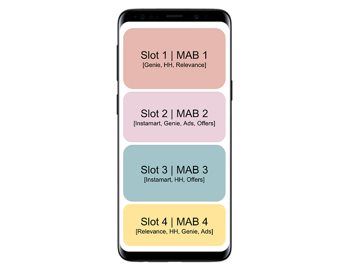
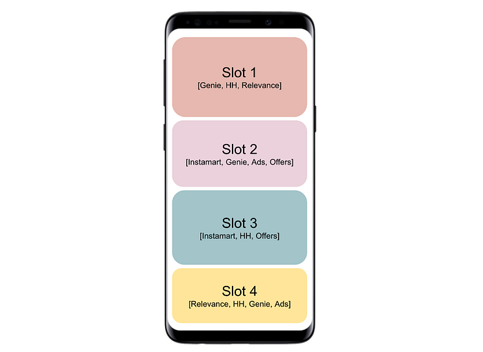
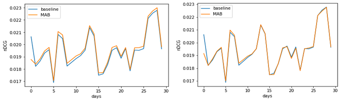
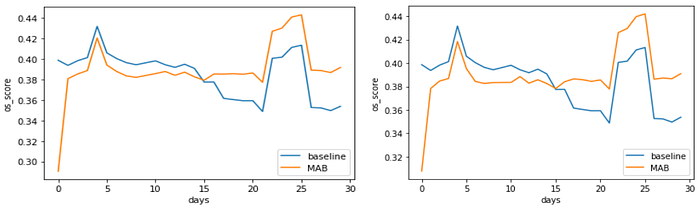
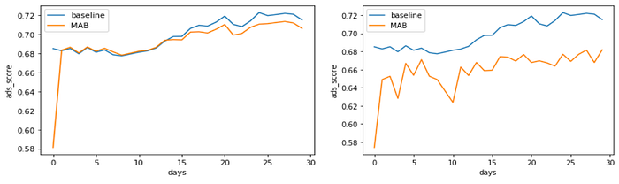
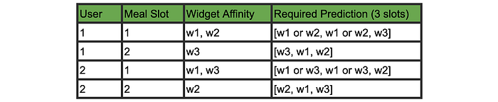
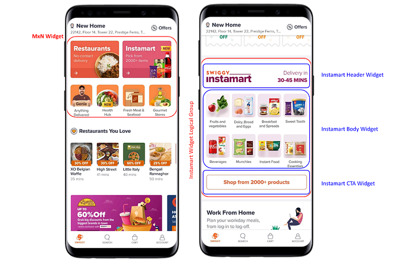

# Personalising the Swiggy Homepage Layout — Part II

In the [first](./personalising-the-swiggy-homepage-layout-part-i-1048dba5e703.md) part, we discussed the problem statement of personalising the Swiggy homepage layout. We defined the primary and check metrics. We started with the baseline and the A/B results. We then proposed to replace it with a linear programming formulation. We discarded the linear programming construct due to a lack of scaling to user-level personalisation. In addition to that, feature engineering was also not that straightforward in that formulation.

In this post, we will discuss two MAB formulations. The one started with and the one we ended up at. We will explain the training, inferencing, and evaluation pipeline followed by the evaluation results. Furthermore, we will discuss the challenges that we faced while working on this project end-to-end. In the section following that, we discuss the next steps from the current version. In the final section, we summarise the learnings and next steps.

## Contextual Multi-Armed Bandits (MAB)

Explaining MABs is out of the scope of this post. You can follow this [blog series](./multi-armed-bandits-at-swiggy-5b1a4b1c2724.md) written by our colleagues where they are going to deep dive into MABs and their applications. We will summarise MABs as follows:

A MAB algorithm is a simplified reinforcement learning (RL) paradigm. The agent observes an environment and takes action. The environment returns a reward or punishment when we play this action. The agent has an underlying policy according to which it learns the _goodness_ of each action. The context comes when the policy is given various data points about the environment to learn the weights.

Here is the same summary in the context of our problem. The agent, WiRa, observes the user and the app (environment) and selects a particular order of widgets for the user. The user sees the new layout and either orders from a widget or bounces off. The agent’s action is good if the user made an order. The action is bad if the user exited without ordering anything. The agent’s policy will reward or punish the agent to learn what works best.

As you will see in the following sections, MAB formulation scales well for user-level personalization. So it solves the big problem that we had in the linear programming formulation.

We went through multiple iterations of the contextual MABs for WiRa.

## Initial Version

We train a MAB for each layout slot. The MAB has k arms and each arm corresponds to each of the k candidate widgets. The context would be a vector of meal slots (breakfast, lunch, snacks, dinner, and midnight) and five customer cohorts. This context will correspond to each observation of the user and app. Since this is a vector, we can add any feature here.

Swiggy population chooses k reward distributions for each of the k candidate widgets in the given slot. The objective is to learn these k reward distributions given the context. The reward is binary: 1 if the order was made through the widget in that slot and 0 otherwise.

*MAB Version 1 formulation: each slot has a MAB. Each MAB’s arms will be the same as the number of candidate widgets in that slot.*

The **multi-arm single-play setting** did not work well for us. First, the data was sparse for all the slots. And sparsity increased further when we picked the lower slots as they received fewer impressions. Second, any widget may show up in any slot. The MABs defined at the slot level lose out on that information. Third, some widgets may not be available in certain regions due to various business and operational constraints. So the response of our model will not be usable. Lastly, training k different MABs for k slots will also increase maintenance costs.

## Current Version

Instead of training k different MABs, we train a single MAB. Each arm corresponds to a candidate widget. To keep things simple, we kept candidates the same across the slots. But this is easy to handle.

The single MAB approach is a **multi-arm and multi-play setting** MAB. So each time we call the model, MAB will respond with the score for each widget. We use this score to rank them for the slots.

*Final MAB formulation: There is a single MAB. The arms of the MAB correspond to 6 widgets. MAB will predict the scores for all the arms. The scores are used to rank the widgets.*

We chose this formulation because it solved most of the flaws of the previous formulation.** The only remaining flaw is that all the slots have the same ranking. As we do not take the position of the slot into account, the widgets may have different performances in those slots. We will discuss this more in detail later.**

## Training Steps

Since training a MAB is not the same as training a classical ML model, here are the steps involved:

1. Agent observes the state **s** of the app and creates the context vector **C**.
2. The agent samples from the distributions of each of the actions **A_i** given the context vector **C** using the policy **P**.
3. The agent takes the action **A_i** that corresponds to the widget **wid_i** with the highest sampled score.
4. Agent observes the reward **R_i ∈ {0, 1}**.
5. Agent updates the distributions of each of the actions **A_i**.

In the above steps, **i ∈ {1, …, k}**.

## Inference Steps

Our model is going to be offline. That means we train it in batches and then use the same model to infer for the next batch before training it on the next data. Following are the steps:

1. Agent gets a context vector **C**.
2. Agent predicts the reward **R’_i ∈ [0, 1]** for each widget **wid_i** using policy **P**.
3. Probabilities (a.k.a. scores) are returned for each widget.

In the above steps, **i ∈ {1, …, k}**.

These steps are similar to the algorithm discussed in [Kohli et. al](https://dl.acm.org/doi/10.5555/2891460.2891618).

## Evaluation Steps

Out of three months of data, we used the data from the first two months to get distribution estimates. The data from the third month was used to evaluate iteratively. The steps would be as follows.

For each day _i_ in 30 days:

1. Infer for the _i_th day using the model trained till (_i_-1)th day.
2. Calculate the eval metrics using the static layout and the model ranks.
3. Online learning on the data from _i_th day.

We calculated the following metrics:

- Regret
- nDCG@6
- Top 1 order share: order share of the 1st widget in our ranking and the historical data
- Top 3 order share: order share of the top 3 widgets in our ranking and the historical data
- Ads RPO

The evaluation should help us judge if the MAB learnt the widget distributions from the static layout.

## Evaluation Results

We conducted multiple experiments to test multiple aspects: training data, reward functions, policies, policy parameters, and feature processing.

### Ordered Rows

In our training data, each row corresponded to a single session and single widget combination. Since impressions and clicks are more than orders, our data was highly imbalanced. We saw that the MAB started preferring ads-related ranking because of more clicks. When we limited the sessions to just the ordered ones, we found it to be working better for our objective.

### Reward

We tested the following two reward functions:

1. Widget order share
2. Combination of widget order share and Ad revenue

Both showed equivalent performances in our offline eval. We finally chose the 2nd because it had ad revenue, our check metric, as part of the objective.

### Policy

We tried two policies:

1. LinUCB
2. Thompson Sampling

We did not observe a significant difference. Here are a few plots to show the comparison between the two.

*(left) LinUCB; (right) Thompson Sampling; Plot of nDCG for baseline and the MAB. MAB LinUCB beats the baseline model in many iterations.*

*(left) MAB LinUCB; (right) MAB Thompson Sampling; Plot of the Order Share of the top-ranked widget in the baseline and MAB models. After 15 days, both the MAB policies were consistently beating the baseline model.*

*(left) MAB LinUCB; (right) MAB Thompson Sampling; Plot of the Order Share of the top 3 ranked widgets in the baseline and MAB models. Both the models were not able to beat the baseline model. We hypothesise that since the baseline model largely resembles the static layouts, it will always remain higher for the top 3 widgets. Thus, we need to rethink our evaluation strategy.*

*(top left) MAB LinUCB; (right column) MAB Thompson Sampling; Plot of the Ad Revenue of the top-ranked widget in the baseline and MAB models. After 15 days, the baseline model consistently beat both the MAB policies. This trend is the inverse of the top 1 order share plot. We hypothesise that this exhibits the tradeoff between the conversions and ads.*

*(top left) LinUCB; (right column) Thompson Sampling; Plot of the Ad Revenue of the top 3 ranked widgets in the baseline and MAB models. The baseline model could not always beat the MAB LinUCB model, but it consistently beat the MAB Thompson Sampling model.*

## Challenges

We faced many hurdles while working on this capability. In this section, we will discuss the ones that consumed most of the time.

## Data Preparation

Early in the project, we found that the instrumentation data was inadequate to solve this problem. The app and its backend design made it hard to define a widget. Multiple constructs were mixed: properties, themes, collections, and carousels. Widget names had no standard nomenclature. We spent a significant effort on identifying the clickstream events corresponding to all the widgets. The analytics team helped in building a hack to identify them.

There are two big data sources used for WiRa. One holds the clickstream data and the other contains the session-wise layout data. For the final data, we had to merge both the sources. Unfortunately, we found out that there was no unique join key. We solved it using a heuristic.

We discussed the nomenclature and instrumentation issues with the respective engineering and app teams. We went ahead with our hacky methods, but we got the fixes prioritised. These changes will make the future WiRa data preparation pipeline robust.

## MAB Implementation

In the interest of having an optimised codebase and flexibility in our experimentations, we decided to use a pre-built library for MABs. We had two options: [Vowpal Wabbit](https://vowpalwabbit.org/) (VW) and [TensorFlow Agents](https://www.tensorflow.org/agents) (TF Agents).

We evaluated both of them, but we found TF Agents more suitable for our use case. Following were the deciding factors:

- The lack of documentation in VW led us to believe that it is a black box. The methods used in the demonstrations did not have detailed explanations. The documentation also lacked details on more advanced policies.
- Though VW was easier to use, it did not give us the flexibility to experiment with policy parameters. For instance, it takes in context information as a comma-separated string and returns an arm to be played for the given context. We did not know how it was pre-processing the context and deciding the final arm to play. We also did not have visibility into the hidden state, distribution, and policy level details.
- VW lacks a simulation environment. We had to generate data and give it to VW. It does some magic inside and provides inference. TF-Agents lets us define a complete environment which generates samples and returns rewards computed using custom reward functions.
- Lack of many policies in VW like Thompson Sampling. And out of all the available ones, only softmax explore was useful for us. TF-Agents offers more agents/policies. Thus, it was easier to experiment with different strategies with a minimal code change.
- We had to write specific data formatting methods to make our data compliant with VW.

Let’s consider a dummy scenario. There are two users and two meal slots. For each of the 4 combinations, we assigned some widget affinity to the user. These affinities represent _true_ widget distribution. The MAB should learn these distributions and infer accordingly. Here is our matrix.

We trained the MAB on 1000 samples. The context vector contained user id and meal slot. Following are the objective/regret plots from both the libraries.

*(left) VW plots the objective function (CTR) value as MAB learns in each iteration. (right) TF-Agents plots the regret. As MAB gets better in each iteration, it reduces the regret. Thus, it’s the inverse of the first plot. The objective was the same for both the MABs.*

## Future Directions

There are multiple enhancements and experiments we are yet to try.

There has been a complete redesign of the Swiggy app. We call it [UX4.0](./swiggy-design-language-system-1ef9cca11186.md). Under the redesign, we are also revisiting our widgets.

The current formulation only considered widgets that were simple. They either had a list of restaurants (eg: Try Something New) or it was a carousel that took a user to a collection of restaurants (eg: banner carousel). There are other widgets on the homepage. We have an MxN matrix of widget cards which point to a separate collection (eg: campaign listing) or a separate category (eg: Swiggy Genie). We also have compound widgets. Compound widgets have item collections and a “see more” button that opens up a bigger listing. An example of a compound widget is the Instamart widget.

*(left) MxN widget with different kinds of collections inside. (right) Anatomy of the Instamart widget as a compound widget.*

We need to identify the clickstream data for widgets of this kind and add them to the formulation. We will also experiment with variations of the reward functions. Some potential variations are discussed in [Gampa et. al](https://link.springer.com/chapter/10.1007/978-3-030-75768-7_21).

We have assumed that our layout is 1D, that is, we only have widgets arranged vertically. The MxN widgets make our layout a 2D grid. This converts the widget ranking problem into a 2D layout optimization problem. A more generic term is combinatorial optimization discussed in [Mazyavkina et. al](https://arxiv.org/search/cs?searchtype=author&query=Mazyavkina%2C+N).

The personalisation in the MAB formulation is yet to be explored further. We have not yet taken it to the user level. Moving to that granularity is a straightforward addition to our formulation through feature vectors. We also have not done extensive feature engineering in the environment context vector. User, restaurant, and widget embeddings are other dimensions that can become a part of the context vector. Some of the directions can be found [here](https://medium.com/ibm-data-ai/recommendation-systems-using-reinforcement-learning-de6379eecfde), [Pfadler et. al](https://ieeexplore.ieee.org/abstract/document/9101889), and [Feiyang et. al](https://dl.acm.org/doi/abs/10.1145/3331184.3331268).

Another direction to explore is the widget objective. The real estate of the Swiggy homepage is expensive. Multiple business categories like Food, Genie, Instamart, Gourmet, and other categories have to compete for it. The higher the widget, the more impressions it will get, and the more users will convert. Conversions will directly contribute to the business. Since each category is at a different stage in their journeys, they optimise for different metrics. And properly balancing it with the right objectives in training and online inference is an important problem we have to solve. We want to explore the methods discussed in [Weicong et. al](https://dl.acm.org/doi/10.1145/3292500.3330675), [Mantha et. al](https://arxiv.org/search/cs?searchtype=author&query=Mantha%2C+A), [Fengjiao et. al](https://arxiv.org/abs/1901.04891) and [Mehrotra et. al](https://dl.acm.org/doi/10.1145/3394486.3403374).

The policy is another factor where we can try more algorithms. We only tried LinUCB and Thompson Sampling. There are many neural approaches. [Agarwal et. al](https://paperswithcode.com/paper/taming-the-monster-a-fast-and-simple) discusses a meta-algorithm to select the best policy from a list of competing ones.

Finally, we also want to unbias the offline evaluation. We evaluated all the formulations using the biased data. Since the homepage is the most important part of the customer journey, we could not collect random data. Hence we defined the current direct matching method. We have to work on setting up the counterfactual evaluation pipeline as discussed in [Lihong et. al](https://dl.acm.org/doi/abs/10.1145/2684822.2697040) and [Jeunen et. al](https://dl.acm.org/doi/abs/10.1145/3394486.3403175).

## Conclusion

To address the shortcomings of the Linear Programming based model, we defined two MAB-based approaches. The initial version was a multi-armed, single-play setting. Because of its flaws, we implemented the second approach. This approach was based on the multi-armed, multi-play setting. In each iteration, the bandit plays all the arms and we use the bandit scores to rank the widgets. We defined the evaluation pipeline and our offline results showed positive results. We are now gearing up for the A/B experiment for this model.

We discussed the challenges we faced and how they led to instrumentation system improvements. We finally discussed all the future directions that we can take to improve the WiRa framework.

## Acknowledgement

A shout-out to Kushal Jain who worked on this while he was at Swiggy DS. Also a big thanks to the Foundations Engineering team for coming up with the implementation of the dynamic slots.

---
**Tags:** Multi Armed Bandit · Personalization · Homepage Design · Swiggy Data Science
