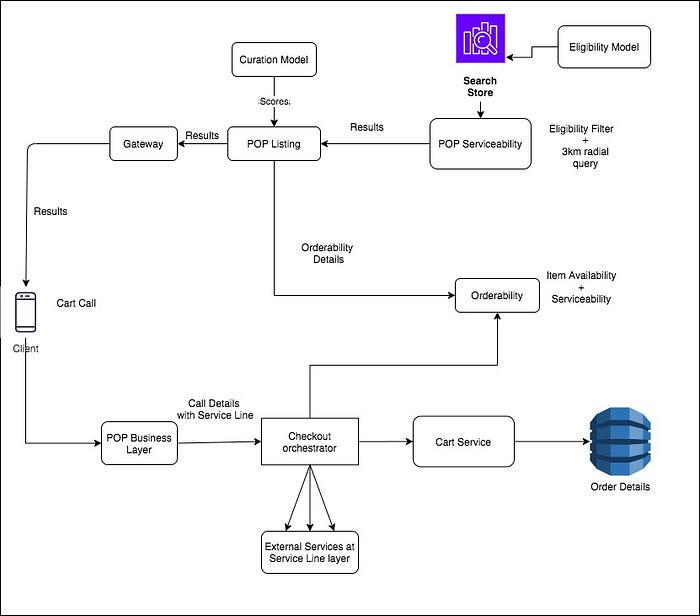

# POP faster: How automated ops improved UX & led to 17% more orders!

*source undraw.co*

With Swiggy’s rapidly expanding selection of food delivery options, finding, finalizing, and ordering meals on the platform has become a time-consuming process.

That’s where POP came in — with single-serve curated meals, packaged and prepared for customers who are pressed for time, available at affordable rates.

Here’s a brief overview of POP v1, which was our first foray into dish-first offerings:

1. **Curated meals**: Dishes & sides for a perfect single person serving meal   
e.g. 3 Rotis with a potful of curry & Coke on the side
2. **Personalized yet diverse**: Meal for your taste profile, but different every day
3. **Instant checkout**: Your preferred payment method autoselected for a fast checkout experience

This, in principle, is a very practical offering because if you were to buy a full bowl curry and roti separately for yourself (as in a la carte), it might get wasted & you may end up paying a higher price (since restaurants generally prepare for 2 or more).

_With POP’s packaging & calibrated quantity, this was a win-win for both restaurant and customer._

**But, there was a problem.**

To achieve this offering as MVP, when it was built a year back, we heavily relied on our operations teams to

- Define & upload the curated menu in advance, every week, for each timeslot
- Map (literally) the dishes on the POP menu to the geographical groups of customers
- …repeat x 1000s of geo-groups of customers in 70 cities (!)

These efforts were so cumbersome and human-intensive that it led to a lot of manual errors.

We knew this meant massive investment across different verticals if we wanted to scale. That’s why POP v2.

To scale POP to its full potential, we needed a technology solution that would automate this entire process, which would bring more value to our customers.

**Defining POP v2**

As with Swiggy’s continuous vision of its investment in AI/ML-based solutions and engineering automation of mundane manual tasks, we started to chalk out the entire architecture plan.

Like we always do in Swiggy, we started from customer-first hard thinking and came up with primarily the following requirement on top of what POP stands for.

1. Give the user the most accurate delivery time possible for each dish they see
2. Help the user get the meal of their choice out of thousands of curated ones
3. Automate curation completely i.e. a) Meals to be auto-selected based on time of day and day of the week b) Each customer cluster to have a variety of cuisines as is possible geographically

4. Learn what works best in the area to help supply improve the curated menu

Fantastic. What do all these translate to technical and data science architectures? That led to us the following.

1. Seamless integration for the supply team to upload POP items once per week (or month).
2. Dynamic search system which defined the **serviceability zone** and dynamically populated as and when Ops adds items.
3. A **Checkout platform** that would handle all types of items irrespective of the business line.
4. Business layer system which can backend all consumer queries related to POP business lime

_P.S. For data science nerds, _[_her_](https://bytes.swiggy.com/personalizing-swiggy-pop-recommendations-d434b6f555f9)_e’s a peek into the Swiggy POP menu curation model._

There are majorly two blocks of tech architecture as explained above. Interactions between this are depicted in the diagram below.

*Tech design by our rockstar engineer vivekananda murari*

**Serviceability Zone**:

These are dish serviceable zones and these zones are drawn as and when the user accesses POP from a specific location.

To make sure minimum serviceable and available dishes are available to the user, dynamic polygons are drawn around every user which expands till the minimum set of dishes shown to the user is met.

To meet the target of sub-100ms targets in API, we had to build multiple sub-layers that can preempt the data and keep it ready when the customer comes in. From the diagram above, “Orderability” is one such block that maintains the non-user specific data for a very small amount of time for a geo-hash.

The data storage layer has to be self-sufficient to keep all data required still following the microservices architecture of separation of concerns.

**Checkout Platform:**

One thing we at Swiggy constantly do is innovate and optimize every opportunity to get better at our technical architecture.

When we had to rebuild POP, we decided we will invest part of our efforts in building a generic cart platform, given that the current system was designed for regular order-specific use-cases only. This could eventually power Swiggy’s different service lines as well.

So, we built a generic cart platform that any business line can use to leverage for their cart.

The components of the Checkout platform are.

**Checkout orchestrator** that interacts with any downstream services from delivery to availability irrespective of the business layer.

We also built a capability to dynamically program the steps for any business layer and ask this block to execute those API steps.

**Cart platform** that interacts with the storage layer & holds a generic view of the cart, irrespective of how the cart is represented in any business.

**POP business layer** which acts as the bridge between a single-click checkout presentation layer to checkout platform. This is the only non-platform block in the Checkout platform.

After we launched this, we’ve been able to onboard our other service lines i.e. Swiggy Stores & Swiggy Go on this too. From a technical purist view, this was a very big win which helped us with the maintenance of code and on infrastructure cost saving.

**Rolling out a brand new POP**

When we roll out a new technical architecture to a customer, we have to make sure these adoptions are well tested. And in this version, a lot of the changes were actually under the hood which would affect the UX, not UI.

To capture the UX changes, we did a lot of A/B experiments on each leg of the adoption — on eligibility, curation, and even the different curation models itself! To do this, we used an in-house Experimentation Platform on which we tested each hypothesis and validated our learning before rollout.

To ensure that we could roll it out to 100% of the users, we did a city-based rollout and built a fallback system on the failure of each & every module from delivery serviceability to cart.

**After all this effort, we saw the magic — 17% more orders on POP!**

What’s more — the Ops team went from spending a couple of hours every day in setting up the show to spending their time learning what works best for our customers!

---
**Tags:** Swiggy · Swiggy Engineering
