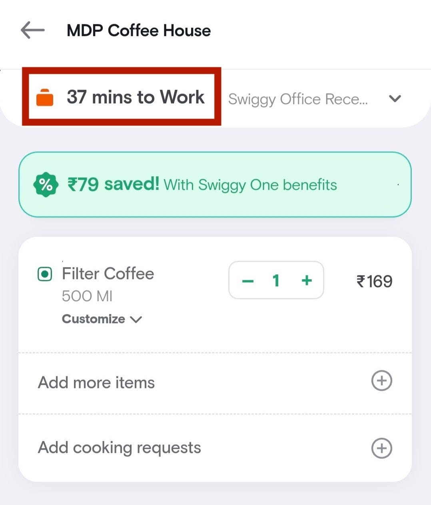
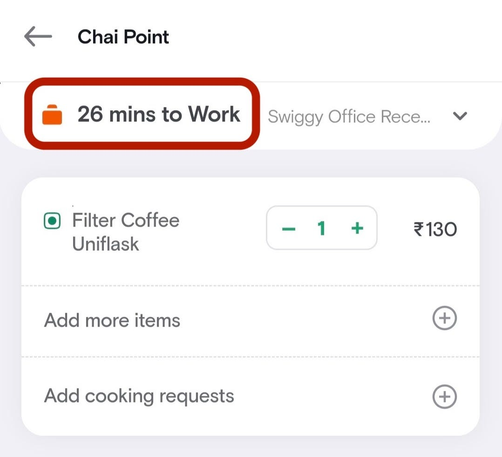
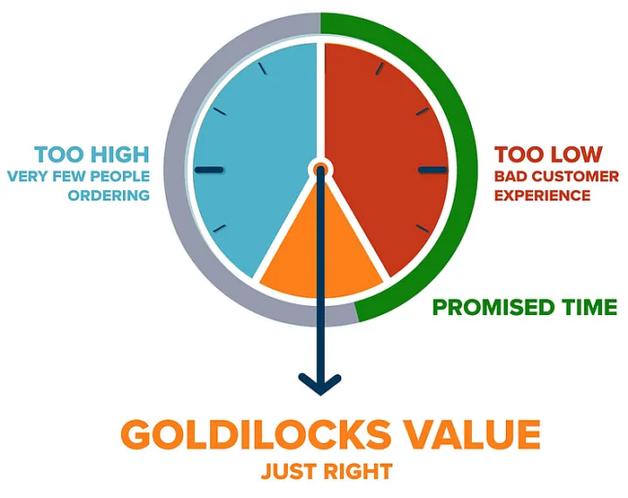
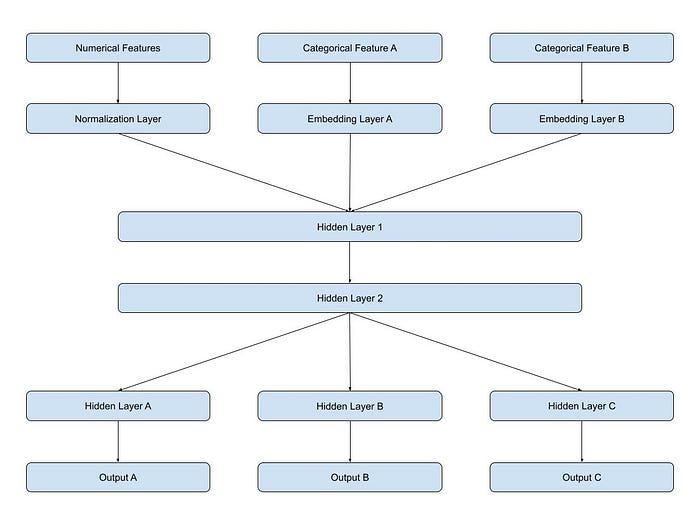
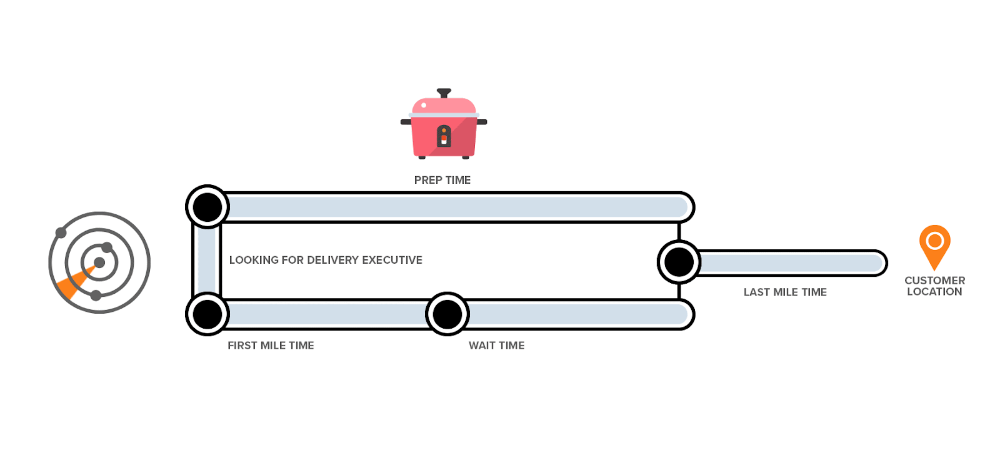
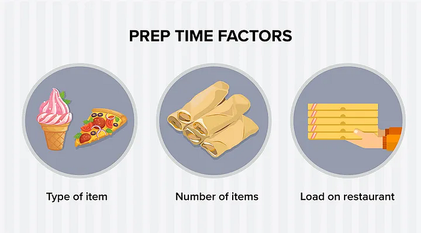

# Predicting Food Delivery Time at Cart

## Introduction

It’s 9 AM on Monday. You had to run to the office in a hurry without having your morning coffee at home. No worries. You open the Swiggy app on the way to work, navigate to your favourite coffee shop’s menu, and add your favourite coffee to the cart. Before you make the payment and confirm your order, you are greeted with a familiar sight at the cart page — the estimated time of delivery is right at the top to let you know how long it will take for your order to arrive. This is a core decision making variable for most customers. Take the example of two restaurants below serving filter coffee near Swiggy’s Bangalore office. Which one are you likely to order from?

Every day millions of people use the Swiggy app for their food delivery. One of the most important touch-points in a customer’s journey while placing their order is the promised delivery time (aka Promised Service Level Agreement or pSLA) of an order. This can be a make or break factor for placing an order. Food delivery business is particularly time sensitive. No one likes to wait hungry for their food to arrive, or cold food to arrive for that matter. It is imperative for us to communicate the most accurate possible estimate of delivery time to the customer at the time of placing an order.

The promised delivery time is a crucial data point for the customer’s decision making process while placing an order. It’s also a double edged sword. If the order is delayed, the customers end up unhappy. But if the delivery time promise is conservative, it reduces the propensity of the customer to place an order. This makes setting up the right customer expectations an act of balance. You have to operate within the [Goldilocks zone](https://bytes.swiggy.com/the-swiggy-delivery-challenge-part-one-6a2abb4f82f6).

In addition, there are downstream systems within Swiggy that get impacted by the promised delivery time of an order. Our assignment system takes this time as an input and assigns the right delivery executive to fulfil what was promised to the customer. The customer care ecosystem also uses this promise to decide relevant actions for customer tickets. Our exception management system kicks in if an order is getting delayed beyond the promised time either by triggering an action or communicating the delay to the customer. The efficiency of these systems is directly dependent on the accuracy of our delivery time promise.

There is yet another layer to this. Based on the performance of our estimates, customers tend to form a perception of the accuracy of these promises. So accurate delivery time predictions are also important for inspiring customer trust in Swiggy.

Given how important accurately predicting food delivery times is, it is a natural question to ask how one achieves that goal. Delivery times are impacted by a number of different factors

- Type of restaurant — cloud kitchen will invariable prepare food faster than traditional dine-in restaurants
- Number of items in the order — more number of items will take more time to prepare the order
- Kind of dishes in the order — preparing a pizza will take more time than packing an ice-cream
- Availability of Delivery Executives (DEs) — lower DE availability will lead to the DE getting assigned later and most likely traveling a larger first mile (to the restaurant) distance
- Distance from restaurant to the customer — an order coming from a faraway restaurant will take more time to be delivered

All of these factors interact with each other as well as the geography in which the order is placed. For example travel times during evening rush hours in Bangalore are very different from Gurgaon. To accurately predict delivery times, one needs to take all these factors and their interactions into account. The complexity of the problem makes machine learning (ML) models an obvious choice to solve this problem. In the proceeding sections, we’ll explore the modelling in detail.

## Defining Accuracy

Before diving into the modelling aspects of the problem, let’s define what accuracy means in the context of food delivery time predictions. Estimation of delivery times is essentially a regression problem. While there are a number of metrics used to study the accuracy of regression models in theory — MAE (mean absolute error), MAPE (mean absolute percentage error), MSE (mean squared error), etc, these are not always relevant to the business or the customer. To measure the real world efficacy of our predictions, we use the following metrics

1. **MAE (mean absolute error)**  
MAE measures the average absolute deviation of the predictions from the target
2. BDC (bi-directional compliance)  
BDC measures the percentage of target values lying within +/- X of the predictions. This is an important metric for us to understand the reliability of our predictions from a customer standpoint
3. ED (egregious delay)  
ED measures the percentage of target values lying beyond +Y of the predictions. Extreme delays are a major pain point as well as detractors for the customers and ED help us keep track of prevalence of such cases

## Target Variable(s)

While the primary use case for our delivery time prediction model is to estimate the delivery time to support customer communications, there are other downstream use cases which benefit from a more granular estimate of the different legs of an order’s journey. To support such use cases the model has to predict the following target variables

1. O2A time — order to assignment time (time taken to assign a DE for the order)
2. FM time — first mile time (time taken by the DE to travel to the restaurant location)
3. WT time — wait time (time taken by the DE to pick up the order after reaching the restaurant)
4. LM time — last mile time (time taken by the DE to travel from the restaurant to customer location)
5. O2R time — order to reached time (time estimate for the DE to reach the customer location)

## Model Architecture

For modelling these target variables, we are using a [MIMO](https://machinelearningmastery.com/deep-learning-models-for-multi-output-regression/) (multi input, multi output) deep learning model supplemented with entity embeddings. Deep learning has been established as the state of the art modelling approach in a number of contexts. Even though the debate on [tree based models vs neural networks](https://arxiv.org/abs/2207.08815) for tabular data is still ongoing, in our particular context it didn’t require much debate. Over the last few years of experimentation with both tree based and neural network based approaches, we’ve realised a lot of gains in performance via entity embeddings and flexible architectures. The next couple of sections talk more about these design choices and how they’ve helped us design better models.

## Entity Embeddings

Entity embeddings are a neat way to encode categorical variables with high cardinality without running into the curse of dimensionality. One-hot encoding and similar techniques for encoding categorical variables don’t work well with categorical inputs having hundreds of thousands of unique values. Entity embeddings help with containing the dimensionality of inputs in such cases. In addition to the dimensionality reduction, entity embeddings can also capture semantics of the categorical variables quite well. This helps the model “understand” what different categorical variables mean. We use embeddings for encoding information specific to restaurants, customer geo-hashes, cities, etc.

## MIMO

A multi-input, multi-output network (as illustrated in the image above) takes in multiple types of inputs (numerical and categorical) and has multiple output nodes. All the outputs share the common set of inputs and a number of hidden layers before branching out into their own sub-networks. The choice of a MIMO model architecture was driven by the overlapping feature subsets required for the predictors of various legs. We found that with the overlapping feature subsets, having separate networks for each of the outputs was not only inefficient to train and deploy but also left unrealised performance benefits on the table.

For example, let’s look at O2R prediction: it would require the features of the underlying legs (O2A, FM, WT, LM). Having a combined network lets the model learn the relationships between these outputs i.e. O2A + FM + WT + LM = O2R, etc. In addition, training a MIMO network along with embeddings helps embeddings capture the semantics of interaction between different inputs much better. For example, the delivery times for a restaurant are heavily influenced by other factors — dinner and lunch timings tend to be very stressful for restaurant kitchens — a combined network lets the embeddings matrix capture these interactions better then pre-trained embeddings.

Another interesting overlap is between O2A and FM features. DE assignment time is a function of FM time and food preparation time. Consider two orders with similar food preparation time, let’s say 15 mins

1. Order A is from Restaurant (aka Rx) A. The nearest DE to Rx A is 10 mins away
2. Order B is from Rx B. There are 5 DEs standing outside Rx B

The assignment system tries to ensure DEs arrive at the restaurant just before food is prepared to minimise the wait time of the DE to minimise the Cost Per Delivery (CPD) and increase system efficiency. For order A, the assignment system will try to assign a DE within the first 5 mins to ensure the DE 10 mins away arrives before food is prepared (15 mins). However for Order B, since the FM time for the DEs is effectively 0, the assignment algorithm will try to assign as close to the 15th minute as possible. Due to the very nature of the system whose behaviour we’re trying to predict, these two outputs are intricately linked to one another so it makes sense to let the model learn these two together.

## Features

The most important aspect of modelling complex regression problems is the choice of inputs. Without information rich features, even the most advanced model architectures fall short on performance. As alluded to earlier, there are multiple aspects to predicting food delivery times — food preparation time at restaurants, time taken by the assignment system to assign DEs, the FM travel time of the DEs, and LM time to travel from restaurant to the customer location. The interdependence between these aspects has a very large impact on the outcomes. In the following sections we’ll look at the important features required for each factor.

In general, the target variables exhibit a mix of regression and [time-series](https://en.wikipedia.org/wiki/Time_series) like behaviour. For example, let’s consider the DE’s travel time from restaurant to customer location. In general, this time will show hourly and weekly seasonality where the travel time for let’s say Saturday 9 pm for a given customer and restaurant location will be similar to previous week’s travel time. There is also a recency factor that’s important in such scenarios. So as a general strategy for constructing features we use historical as well as near real time moving averages for different legs of an order with different time windows and pivots in addition to other inputs.

## Food Preparation Features

At the time order placement, our food preparation (aka prep) time prediction model outputs the estimated food prep time. This output is consumed by the Assignment engine to make sure the DE arrives before food is ready at the restaurant. To account for the Assignment engine’s behaviour we consume the same prediction as an input to the food delivery time prediction model. This model itself takes into account several factors

1. Stress at the restaurant as derived from orders placed and orders prepared by the restaurant in the recent past
2. Size of the order — number of unique items, total number of items in the order
3. Past prep time behaviour of the restaurant with respect to the items in the order

## Assignment and First Mile features

As described earlier, DE assignment time and first mile time are intricately linked by the virtue of our Assignment engine. Some of the important features with respect to these two are

1. Stress in the system (active DEs vs active orders)
2. Historical assignment time and first mile time behaviour for the restaurant and the operations zone as a measure of general behaviour
3. Near real time behaviour for the restaurant and the operations zone as measure of the deviation from the general behaviour

## Last Mile Features

Last mile time is a function of two important factors — distance and travel speed. The features for last mile are in similar vein

1. Last mile distance (from restaurant location to customer location)
2. Historical speed patterns around the customer and restaurant locations at a manageable granularity
3. Near real time speed patterns around the customer and restaurant locations at a manageable granularity

## Results

We had a fairly in-depth look at the importance of predicting food delivery times and how Swiggy goes about solving this problem. Let’s have a look at how some of the design choices have improved our customer experience.

1. Moving to a MIMO network design with shared inputs and hidden layers helped us reduce our training memory footprint by around 50%. This allowed us to train our models in-memory reducing our training times to nearly a fifth.
2. Due to the shared optimisation of interdependent outcomes, we also saw a nearly 30% improvement in the MAE for O2A predictions. This helped our exception management systems to become more efficient at recovering from delays in DE assignment.
3. Introduction of in-model embeddings helped reduce our overall MAE (O2R time) by 5%.

## Next Steps

While this model performed fairly well when it was deployed to production a few months back, we have since then figured out a few areas of improvement and have been working on them. The most important aspect of creating a good ML model is the huge amounts of data required. While Swiggy has a ton of data by the virtue of the sheer scale of its business, that data isn’t spread uniformly across various cohorts. The cohorts lacking in data also tend to lag in accuracy of predictions. In addition to these sparsity issues, there’s also the issue of standard loss functions being one-size-fits-all approaches to modelling. In our upcoming blog, we’ll be looking at

1. Using a custom loss function to better optimise the business metrics
2. Strategies to work around cohorts with data sparsity and missing feature values

**Acknowledgements**

_Credits to _[Goda Ramkumar](https://www.linkedin.com/in/godaramkumar/) _for providing inputs on various aspects of the modelling process, to _[_Abhinav Litkar_](https://www.linkedin.com/in/abhinavlitkar/)_ for his work on the initial versions of the model, and to _[_Siddhartha Paul_](https://www.linkedin.com/in/drsiddharthapaul/)_ for extensively reviewing the the blog._

**Authors:** [Shubham Grover](https://www.linkedin.com/in/sgrover924/), [Soumyajyoti Bannerjee](https://www.linkedin.com/in/soumyajyoti-banerjee-034aa153/), [Vaibhav Agarwal](https://www.linkedin.com/in/vaibhav-agarwal-492114108/), [Sunil Rathee](https://www.linkedin.com/in/sunil-rathee-1bb5a058/), [Akshita Sood](https://www.linkedin.com/in/akshita-sood/)

---
**Tags:** Swiggy Data Science · Predictions · Hyperlocal Delivery · Machine Learning · Indian Startups
